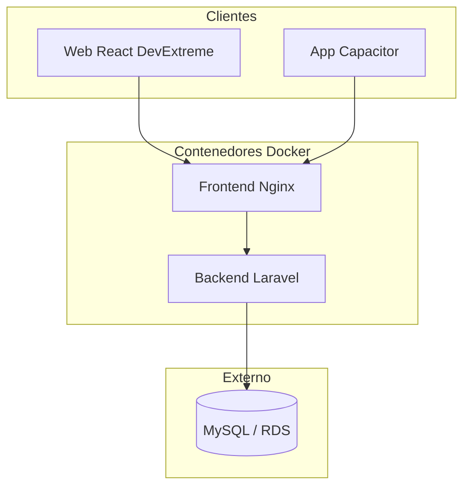

# Plan de Migración PAQSuite IA

## Resumen ejecutivo

Migración del proyecto Lidr-AI4Devs2025-ProyectoFinal al repositorio **PaqSuite-ERP-IA**. Se aprovecha la metodología, documentación y estructura existentes, incorporando DevExpress/DevExtreme, frontend mobile (Capacitor), multilingualidad, GitHub Actions CI/CD y Docker.

**Stack base:** Backend Laravel + Sanctum, Frontend React + Vite, MySQL.

**Deploy objetivo:** Backend y Frontend en contenedores Docker; Base de datos administrada por separado (RDS, PlanetScale, o similar).

---

## Primera Etapa – Desarrollo

### 1. Generar nuevo repositorio

**Acciones:**
- Crear repositorio remoto `paqsystems/PaqSuite-ERP-IA` en GitHub.
- Clonar el repo actual como origen.
- Configurar rama inicial `main` sin historial de commits del proyecto anterior (opción: `git clone --depth 1` + nuevo commit inicial), o conservar historial si se prefiere.
- Actualizar referencias: `README`, `AGENTS.md`, nombre del proyecto, enlaces, y `.env.example`.
- Eliminar artefactos específicos del MVP actual (`.cursor/Test/lighthouse`, configuraciones de entrega, etc.) si no aplican al nuevo proyecto.

**Archivos clave a actualizar:** README.md, AGENTS.md, package.json (frontend), composer.json (backend).

---

### 2. DevExpress/DevExtreme en frontend web

**Acciones:**
- Instalar `devextreme` y `devextreme-react` en frontend.
- Configurar tema (Material, Fluent, etc.) y estilos globales.
- Sustituir componentes propios por equivalentes DevExtreme:
  - DataTable → DataGrid
  - TextField → TextBox / DateBox
  - Button → Button
  - Modal → Popup / Dialog
- Ajustar `.cursor/rules` y docs/frontend con normas de uso de DevExtreme.
- Actualizar tests unitarios y E2E para los nuevos componentes.

**Dependencias:** devextreme, devextreme-react (React 18 compatible).

---

### 3. Frontend mobile (Capacitor)

**Enfoque:** Capacitor para empaquetar el mismo frontend React (con DevExtreme responsivo) como app nativa iOS/Android. Un solo código base.

**Acciones:**
- Instalar @capacitor/core, @capacitor/cli, @capacitor/android, @capacitor/ios en el frontend.
- Integrar Capacitor dentro de frontend/ (config capacitor.config.ts).
- Configurar rutas y layouts responsivos para móvil.
- Ajustar manejo de API (base URL según entorno: web vs app).
- Documentar en docs/mobile/ el flujo de build y despliegue.

---

### 4. Multilingualidad (web y mobile)

**Acciones:**
- Instalar react-i18next e i18next en el frontend.
- Implementar t() usando useTranslation manteniendo firma actual: t(key, fallback, params).
- Crear estructura de locales: frontend/src/locales/{es,en,...}/*.json.
- Configurar i18next con detección de idioma (navegador, localStorage).
- Añadir selector de idioma en la UI.
- Localizar textos de DevExtreme.
- Aplicar el mismo esquema en el bundle mobile (Capacitor usa el mismo código).

---

## Segunda Etapa – Deployment

### 5. GitHub Actions CI

**Acciones:**
- Habilitar disparo automático en push y pull_request a main.
- Añadir job para frontend-mobile (build Capacitor) si existe.
- Añadir job de lint (ESLint, PHP CS Fixer) si se requiere.
- Documentar en docs/deploy-ci-cd.md.

---

### 6. GitHub Actions CD

**Acciones:**
- Crear workflow .github/workflows/cd.yml.
- Disparo: push a main (o tag).
- Build de imágenes Docker backend y frontend.
- Push a GitHub Container Registry (ghcr.io) o Docker Hub.
- Usar secretos: REGISTRY_TOKEN, credenciales de deploy.

---

### 7. Docker

**Estructura:**
- docker/docker-compose.yml – Orquestación local
- docker/docker-compose.prod.yml – Overrides para prod
- backend/Dockerfile – PHP 8.2, Laravel
- frontend/Dockerfile – Node build + nginx para estáticos

**Backend Dockerfile:** php:8.2-fpm, extensiones pdo_mysql, mbstring, dom, fileinfo. DB_HOST apuntando a host externo.

**Frontend Dockerfile:** Etapa build (Node 20, npm run build) + etapa serve (nginx dist/).

**docker-compose.yml:** Servicios backend, frontend. Sin db (BD externa). Variables DB_HOST, API_URL.

---

## Diagrama de arquitectura objetivo

---

## Orden de implementación recomendado

1. Etapa 1.1 – Nuevo repositorio y limpieza
2. Etapa 1.2 – DevExtreme en frontend web
3. Etapa 1.3 – Multilingualidad (react-i18next)
4. Etapa 1.4 – Frontend mobile (Capacitor)
5. Etapa 2.1 – Dockerfiles y docker-compose
6. Etapa 2.2 – GitHub Actions CI (refactor)
7. Etapa 2.3 – GitHub Actions CD

---

## Estado de implementación

| Etapa | Tarea | Estado |
|-------|-------|--------|
| 1.1 | MIGRACION-PAQSUITE-IA.md creado | Completado |
| 1.2 | DevExtreme instalado, tema, DataGridDX, docs | Completado |
| 1.3 | react-i18next, locales es/en, selector idioma | Completado |
| 1.4 | Capacitor, capacitor.config, docs/mobile | Completado |
| 2.1 | Dockerfiles backend/frontend, docker-compose | Completado |
| 2.2 | CI habilitado en push/PR | Completado |
| 2.3 | CD workflow (build + push a ghcr.io) | Completado |

## Checklist de validación

- [x] Nuevo repo creado y referencias actualizadas (PaqSuite-ERP-IA)
- [x] DevExtreme integrado (DataGridDX wrapper disponible)
- [x] react-i18next funcionando (es, en)
- [x] Capacitor configurado (cap:sync, cap:android)
- [x] Docker compose en docker/ (backend + frontend)
- [x] CI/CD preparados (desactivados; ver docs/futuro/DOCKER-CICD.md)
- [x] Documentación actualizada
