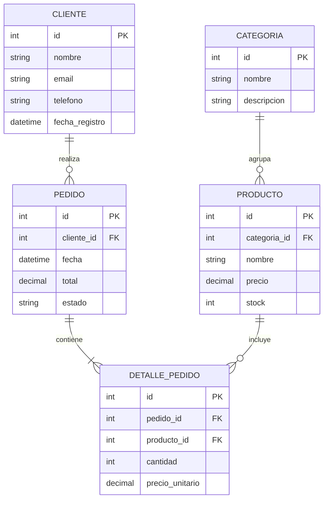

# Diagrama de Base de Datos

## Modelo ER - Sistema de Ventas

```mermaid
erDiagram
    CLIENTE ||--o{ PEDIDO : realiza
    PEDIDO ||--|{ DETALLE_PEDIDO : contiene
    PRODUCTO ||--o{ DETALLE_PEDIDO : incluye
    CATEGORIA ||--o{ PRODUCTO : agrupa
    
    CLIENTE {
        int id PK
        string nombre
        string email
        string telefono
        datetime fecha_registro
    }
    
    PEDIDO {
        int id PK
        int cliente_id FK
        datetime fecha
        decimal total
        string estado
    }
    
    PRODUCTO {
        int id PK
        int categoria_id FK
        string nombre
        decimal precio
        int stock
    }
    
    DETALLE_PEDIDO {
        int id PK
        int pedido_id FK
        int producto_id FK
        int cantidad
        decimal precio_unitario
    }
    
    CATEGORIA {
        int id PK
        string nombre
        string descripcion
    }
```