# Modelo de Datos - Acopios

Diagrama Entidad-Relación del modelo de datos de acopios generado a partir del script SQL.

## Diagrama ER

```mermaid
erDiagram
    GVA03 ||--o{ GVA21 : "pertenece a"
    GVA03 }o--|| GVA10 : "usa lista de precios"
    GVA03 }o--|| GVA23 : "tiene articulo"
    GVA03 }o--|| GVA81 : "tiene deposito"
    GVA03 }o--|| STA11 : "tiene estado stock"
    GVA03 }o--|| STA22 : "tiene estado"
    GVA03 }o--|| MEDIDA : "medida stock"
    GVA03 }o--|| MEDIDA : "medida stock 2"
    GVA03 }o--|| MEDIDA : "medida ventas"
    
    GVA10 ||--o{ GVA03 : "aplica a"
    GVA10 ||--o{ GVA14 : "asignada a cliente"
    GVA10 ||--o{ GVA21 : "usada en pedido"
    
    GVA12 ||--o{ GVA53 : "contiene"
    GVA12 }o--|| GVA14 : "emitido a cliente"
    GVA12 }o--|| ASIENTO_MODELO_GV : "genera asiento"
    GVA12 }o--|| MOTIVO_NOTA_CREDITO : "tiene motivo"
    GVA12 }o--|| NEXO_COBRANZAS_PAGO : "vinculado a pago"
    
    GVA14 ||--o{ GVA12 : "recibe comprobantes"
    GVA14 ||--o{ GVA21 : "realiza pedidos"
    GVA14 }o--|| GVA10 : "tiene lista de precios"
    GVA14 }o--|| GVA01 : "tiene tipo documento"
    GVA14 }o--|| GVA05 : "tiene condicion venta"
    GVA14 }o--|| GVA05 : "condicion envio"
    GVA14 }o--|| GVA18 : "tiene zona"
    GVA14 }o--|| GVA18 : "zona envio"
    GVA14 }o--|| GVA23 : "tiene vendedor"
    GVA14 }o--|| GVA24 : "tiene transporte"
    GVA14 }o--|| GVA41 : "tiene categoria"
    GVA14 }o--|| GVA44 : "formulario FEX"
    GVA14 }o--|| GVA44 : "formulario NCEX"
    GVA14 }o--|| GVA44 : "formulario NDEX"
    GVA14 }o--|| GVA62 : "tiene rubro"
    GVA14 }o--|| GVA150 : "tiene tipo operacion"
    GVA14 }o--|| GVA151 : "tiene clasificacion"
    GVA14 }o--|| CATEGORIA_IVA : "tiene categoria IVA"
    GVA14 }o--|| TIPO_DOCUMENTO_EXTERIOR : "tipo doc exterior"
    GVA14 }o--|| OPERACION_AFIP : "operacion AFIP"
    GVA14 }o--|| RG_3572_TIPO_OPERACION_HABITUAL : "tipo operacion habitual"
    GVA14 }o--|| SUCURSAL : "pertenece a sucursal"
    GVA14 }o--|| SUCURSAL : "destino factura"
    GVA14 }o--|| SUCURSAL : "destino factura remito"
    GVA14 }o--|| TIPO_DOCUMENTO_GV : "tipo documento"
    GVA14 }o--|| INTERES_POR_MORA : "interes por mora"
    
    GVA21 ||--o{ GVA03 : "contiene detalles"
    GVA21 }o--|| GVA14 : "realizado por cliente"
    GVA21 }o--|| GVA10 : "usa lista de precios"
    GVA21 }o--|| GVA01 : "tiene tipo documento"
    GVA21 }o--|| GVA23 : "tiene vendedor"
    GVA21 }o--|| GVA24 : "tiene transporte"
    GVA21 }o--|| GVA43 : "talonario pedido"
    GVA21 }o--|| GVA43 : "talonario factura"
    GVA21 }o--|| GVA81 : "tiene deposito"
    GVA21 }o--|| MODELO_PEDIDO : "tiene modelo"
    GVA21 }o--|| STA22 : "tiene estado"
    GVA21 }o--|| MONEDA : "tiene moneda"
    GVA21 }o--|| SUCURSAL : "pertenece a sucursal"
    GVA21 }o--|| SUCURSAL : "destino"
    GVA21 }o--|| TIPO_DOCUMENTO_GV : "tipo documento"
    GVA21 }o--|| ACTIVIDAD_EMPRESA_AFIP : "actividad AFIP"
    GVA21 }o--|| ASIENTO_MODELO_GV : "genera asiento"
    
    GVA53 }o--|| GVA12 : "pertenece a comprobante"
    GVA53 }o--|| MEDIDA : "medida stock"
    GVA53 }o--|| MEDIDA : "medida stock 2"
    GVA53 }o--|| MEDIDA : "medida ventas"
    
    GVA12 ||--o| PQ_ACOPIOS_FACTURAS : "tiene datos acopio"
    PQ_ACOPIOS_FACTURAS }o--|| GVA14 : "pertenece a cliente"
    PQ_ACOPIOS_FACTURAS }o--|| GVA10 : "usa lista de precios"
    PQ_ACOPIOS_FACTURAS ||--o{ PQ_ACOPIOS_PEDIDOS : "asocia pedidos"
    PQ_ACOPIOS_PEDIDOS }o--|| GVA21 : "referencia pedido"
    PQ_ACOPIOS_PEDIDOS }o--|| GVA14 : "pertenece a cliente"
    
    GVA03 {
        D_ID ID_GVA03 PK
        varchar NRO_PEDIDO
        ENTERO_TG TALON_PED
        DECIMAL_TG CANT_PEDID
        DECIMAL_TG PRECIO
        DECIMAL_TG DESCUENTO
        D_ID ID_GVA21 FK
        D_ID ID_GVA10 FK
        D_ID ID_GVA23 FK
        D_ID ID_GVA81 FK
        D_ID ID_STA11 FK
        D_ID ID_STA22 FK
        D_ID ID_MEDIDA_STOCK FK
        D_ID ID_MEDIDA_STOCK_2 FK
        D_ID ID_MEDIDA_VENTAS FK
    }
    
    GVA10 {
        D_ID ID_GVA10 PK
        ENTERO_TG NRO_DE_LIS
        varchar NOMBRE_LIS
        datetime FEC_DESDE
        datetime FEC_HASTA
        bit HABILITADA
        bit INCLUY_IMP
        bit INCLUY_IVA
    }
    
    GVA12 {
        int ID_GVA12 PK
        varchar COD_CLIENT FK
        varchar T_COMP
        varchar N_COMP
        datetime FECHA_EMIS
        DECIMAL_TG IMPORTE
        DECIMAL_TG IMPORTE_GR
        DECIMAL_TG IMPORTE_EX
        DECIMAL_TG IMPORTE_IV
        varchar ESTADO
        D_ID ID_ASIENTO_MODELO_GV FK
        D_ID ID_MOTIVO_NOTA_CREDITO FK
        D_ID ID_NEXO_COBRANZAS_PAGO FK
    }
    
    GVA14 {
        D_ID ID_GVA14 PK
        varchar COD_CLIENT
        varchar RAZON_SOCI
        varchar CUIT
        varchar E_MAIL
        varchar TELEFONO_1
        varchar DOMICILIO
        varchar LOCALIDAD
        varchar COD_PROVIN
        datetime FECHA_ALTA
        datetime FECHA_INHA
        D_ID ID_GVA10 FK
        D_ID ID_GVA01 FK
        D_ID ID_GVA05 FK
        D_ID ID_GVA05_ENV FK
        D_ID ID_GVA18 FK
        D_ID ID_GVA18_ENV FK
        D_ID ID_GVA23 FK
        D_ID ID_GVA24 FK
        D_ID ID_GVA41_NO_CAT FK
        D_ID ID_GVA44_FEX FK
        D_ID ID_GVA44_NCEX FK
        D_ID ID_GVA44_NDEX FK
        D_ID ID_GVA62 FK
        D_ID ID_GVA150 FK
        D_ID ID_GVA151 FK
        D_ID ID_CATEGORIA_IVA FK
        D_ID ID_TIPO_DOCUMENTO_EXTERIOR FK
        D_ID ID_RG_3685_TIPO_OPERACION_VENTAS FK
        D_ID ID_RG_3572_TIPO_OPERACION_HABITUAL FK
        D_ID ID_SUCURSAL FK
        D_ID ID_SUCURSAL_DESTINO_FACTURA FK
        D_ID ID_SUCURSAL_DESTINO_FACTURA_REMITO FK
        D_ID ID_TIPO_DOCUMENTO_GV FK
        D_ID ID_INTERES_POR_MORA FK
    }
    
    GVA21 {
        D_ID ID_GVA21 PK
        varchar COD_CLIENT FK
        varchar NRO_PEDIDO
        ENTERO_TG TALON_PED
        datetime FECHA_PEDI
        datetime FECHA_ENTR
        ENTERO_TG ESTADO
        DECIMAL_TG TOTAL_PEDI
        D_ID ID_GVA14 FK
        D_ID ID_GVA10 FK
        D_ID ID_GVA01 FK
        D_ID ID_GVA23 FK
        D_ID ID_GVA24 FK
        D_ID ID_GVA43_TALON_PED FK
        D_ID ID_GVA43_TALONARIO_FACTURA FK
        D_ID ID_GVA81 FK
        D_ID ID_MODELO_PEDIDO FK
        D_ID ID_STA22 FK
        D_ID ID_MONEDA FK
        D_ID ID_SUCURSAL FK
        D_ID ID_SUCURSAL_DESTINO FK
        D_ID ID_TIPO_DOCUMENTO_GV FK
        D_ID ID_ACTIVIDAD_EMPRESA_AFIP FK
        D_ID ID_ASIENTO_MODELO_GV FK
    }
    
    GVA53 {
        int ID_GVA53 PK
        varchar T_COMP FK
        varchar N_COMP FK
        varchar COD_ARTICU
        DECIMAL_TG CANTIDAD
        DECIMAL_TG PRECIO_NET
        DECIMAL_TG PORC_DTO
        DECIMAL_TG PORC_IVA
        DECIMAL_TG IMP_NETO_P
        D_ID ID_MEDIDA_STOCK FK
        D_ID ID_MEDIDA_STOCK_2 FK
        D_ID ID_MEDIDA_VENTAS FK
    }
    
    GVA23 {
        D_ID ID_GVA23 PK
        varchar COD_VENDED
    }
    
    GVA81 {
        D_ID ID_GVA81 PK
        varchar COD_DEPOSI
    }
    
    STA11 {
        D_ID ID_STA11 PK
    }
    
    STA22 {
        D_ID ID_STA22 PK
    }
    
    MEDIDA {
        D_ID ID_MEDIDA PK
    }
    
    GVA01 {
        D_ID ID_GVA01 PK
    }
    
    GVA05 {
        D_ID ID_GVA05 PK
    }
    
    GVA18 {
        D_ID ID_GVA18 PK
    }
    
    GVA24 {
        D_ID ID_GVA24 PK
    }
    
    GVA41 {
        D_ID ID_GVA41 PK
    }
    
    GVA44 {
        D_ID ID_GVA44 PK
    }
    
    GVA62 {
        D_ID ID_GVA62 PK
    }
    
    GVA150 {
        D_ID ID_GVA150 PK
    }
    
    GVA151 {
        D_ID ID_GVA151 PK
    }
    
    CATEGORIA_IVA {
        D_ID ID_CATEGORIA_IVA PK
    }
    
    TIPO_DOCUMENTO_EXTERIOR {
        D_ID ID_TIPO_DOCUMENTO_EXTERIOR PK
    }
    
    OPERACION_AFIP {
        D_ID ID_OPERACION_AFIP PK
    }
    
    RG_3572_TIPO_OPERACION_HABITUAL {
        D_ID ID_RG_3572_TIPO_OPERACION_HABITUAL PK
    }
    
    SUCURSAL {
        D_ID ID_SUCURSAL PK
    }
    
    TIPO_DOCUMENTO_GV {
        D_ID ID_TIPO_DOCUMENTO_GV PK
    }
    
    INTERES_POR_MORA {
        D_ID ID_INTERES_POR_MORA PK
    }
    
    ASIENTO_MODELO_GV {
        D_ID ID_ASIENTO_MODELO_GV PK
    }
    
    MOTIVO_NOTA_CREDITO {
        D_ID ID_MOTIVO_NOTA_CREDITO PK
    }
    
    NEXO_COBRANZAS_PAGO {
        D_ID ID_NEXO_COBRANZAS_PAGO PK
    }
    
    MODELO_PEDIDO {
        D_ID ID_MODELO_PEDIDO PK
    }
    
    MONEDA {
        D_ID ID_MONEDA PK
    }
    
    ACTIVIDAD_EMPRESA_AFIP {
        D_ID ID_ACTIVIDAD_EMPRESA_AFIP PK
    }
    
    PQ_ACOPIOS_FACTURAS {
        int id PK
        varchar t_comp FK
        varchar n_comp FK
        varchar cod_client FK
        datetime Fecha_vigencia
        int Lista_Precios FK
        numeric Descuento
        numeric Importe_Neto
        numeric Importe_Impuestos
        numeric Importe_Total
        datetime Fecha_Umo_Acopio
        numeric Saldo_Anterior
        int Estado
    }
    
    PQ_ACOPIOS_PEDIDOS {
        int id PK
        varchar t_comp FK
        varchar n_comp FK
        int Talon_ped FK
        varchar Nro_Pedido FK
        varchar cod_client FK
        int Estado
    }
```

## Descripción de Tablas Principales

### GVA03 - Detalle de Pedidos
Tabla que almacena los detalles (líneas) de cada pedido. Cada registro representa un artículo solicitado en un pedido específico.

**Campos principales:**
- `ID_GVA03`: Clave primaria
- `NRO_PEDIDO`: Número de pedido
- `TALON_PED`: Código de talonario del pedido
- `CANT_PEDID`: Cantidad pedida
- `PRECIO`: Precio unitario
- `DESCUENTO`: Descuento aplicado
- `ID_GVA21`: Referencia a la cabecera del pedido (GVA21)
- `ID_GVA10`: Referencia a la lista de precios utilizada
- `ID_GVA23`: Referencia al artículo/vendedor
- `ID_GVA81`: Referencia al depósito

### GVA10 - Lista de Precios
Tabla maestra que contiene las listas de precios disponibles en el sistema.

**Campos principales:**
- `ID_GVA10`: Clave primaria
- `NRO_DE_LIS`: Número de lista de precios
- `NOMBRE_LIS`: Nombre/descripción de la lista
- `FEC_DESDE`: Fecha desde la cual es válida
- `FEC_HASTA`: Fecha hasta la cual es válida
- `HABILITADA`: Indica si está habilitada
- `INCLUY_IMP`: Incluye impuestos
- `INCLUY_IVA`: Incluye IVA

### GVA12 - Cabecera de Comprobantes
Tabla que almacena la información de cabecera de los comprobantes (facturas, remitos, notas de crédito, etc.).

**Campos principales:**
- `ID_GVA12`: Clave primaria
- `COD_CLIENT`: Código del cliente
- `T_COMP`: Tipo de comprobante
- `N_COMP`: Número de comprobante
- `FECHA_EMIS`: Fecha de emisión
- `IMPORTE`: Importe total
- `IMPORTE_GR`: Importe gravado
- `IMPORTE_EX`: Importe exento
- `IMPORTE_IV`: Importe de IVA
- `ESTADO`: Estado del comprobante

### GVA14 - Clientes
Tabla maestra de clientes del sistema.

**Campos principales:**
- `ID_GVA14`: Clave primaria
- `COD_CLIENT`: Código del cliente
- `RAZON_SOCI`: Razón social
- `CUIT`: CUIT del cliente
- `E_MAIL`: Email
- `TELEFONO_1`: Teléfono principal
- `DOMICILIO`: Domicilio legal
- `LOCALIDAD`: Localidad
- `COD_PROVIN`: Código de provincia
- `FECHA_ALTA`: Fecha de alta
- `FECHA_INHA`: Fecha de inhabilitación
- `ID_GVA10`: Lista de precios asignada

### GVA21 - Cabecera de Pedidos
Tabla que almacena la información de cabecera de los pedidos.

**Campos principales:**
- `ID_GVA21`: Clave primaria
- `COD_CLIENT`: Código del cliente
- `NRO_PEDIDO`: Número de pedido
- `TALON_PED`: Código de talonario del pedido
- `FECHA_PEDI`: Fecha del pedido
- `FECHA_ENTR`: Fecha de entrega prevista
- `ESTADO`: Estado del pedido (5 = anulado)
- `TOTAL_PEDI`: Total del pedido
- `ID_GVA14`: Referencia al cliente
- `ID_GVA10`: Lista de precios utilizada

### GVA53 - Detalle de Comprobantes
Tabla que almacena los detalles (líneas) de cada comprobante.

**Campos principales:**
- `ID_GVA53`: Clave primaria
- `T_COMP`: Tipo de comprobante
- `N_COMP`: Número de comprobante
- `COD_ARTICU`: Código del artículo
- `CANTIDAD`: Cantidad
- `PRECIO_NET`: Precio neto unitario
- `PORC_DTO`: Porcentaje de descuento
- `PORC_IVA`: Porcentaje de IVA
- `IMP_NETO_P`: Importe neto del renglón

### PQ_ACOPIOS_FACTURAS - Facturas de Acopio
Tabla que almacena los datos adicionales de las facturas de acopio. Almacena la información necesaria para gestionar el proceso de acopios: lista de precios, fecha de vigencia, descuento y control de saldos.

**Campos principales:**
- `id`: Clave primaria (IDENTITY)
- `t_comp`: Tipo de comprobante (FK a GVA12.T_COMP)
- `n_comp`: Número de comprobante (FK a GVA12.N_COMP)
- `cod_client`: Código del cliente (FK a GVA14.COD_CLIENT)
- `Fecha_vigencia`: Fecha hasta la cual es válida la factura de acopio
- `Lista_Precios`: ID de la lista de precios a utilizar (FK a GVA10.ID_GVA10)
- `Descuento`: Porcentaje de descuento a aplicar (numeric 6,2)
- `Importe_Neto`: Importe neto de la factura sin impuestos
- `Importe_Impuestos`: Importe de impuestos de la factura
- `Importe_Total`: Importe total de la factura
- `Fecha_Umo_Acopio`: Fecha de última modificación del acopio
- `Saldo_Anterior`: Saldo anterior disponible para acopiar
- `Estado`: Estado del acopio (0 = Abierto, 1 = Cerrado)

**Relaciones:**
- Relación 1:1 con GVA12 (factura) mediante `t_comp` y `n_comp`
- Relación N:1 con GVA14 (cliente) mediante `cod_client`
- Relación N:1 con GVA10 (lista de precios) mediante `Lista_Precios`
- Relación 1:N con PQ_ACOPIOS_PEDIDOS (pedidos asociados)

### PQ_ACOPIOS_PEDIDOS - Asociación de Pedidos a Acopios
Tabla que archiva la asociación entre pedidos y facturas de acopio. Permite vincular pedidos a facturas de acopio del mismo cliente, controlando que no se supere el saldo disponible.

**Campos principales:**
- `id`: Clave primaria (IDENTITY)
- `t_comp`: Tipo de comprobante de la factura de acopio (FK a PQ_ACOPIOS_FACTURAS.t_comp)
- `n_comp`: Número de comprobante de la factura de acopio (FK a PQ_ACOPIOS_FACTURAS.n_comp)
- `Talon_ped`: Código de talonario del pedido (FK a GVA21.TALON_PED)
- `Nro_Pedido`: Número de pedido (FK a GVA21.NRO_PEDIDO)
- `cod_client`: Código del cliente (FK a GVA14.COD_CLIENT)
- `Estado`: Estado de la asociación

**Relaciones:**
- Relación N:1 con PQ_ACOPIOS_FACTURAS mediante `t_comp` y `n_comp`
- Relación N:1 con GVA21 (pedido) mediante `Talon_ped` y `Nro_Pedido`
- Relación N:1 con GVA14 (cliente) mediante `cod_client`

**Nota:** La asociación se realiza mediante la combinación de `Talon_ped` y `Nro_Pedido` para identificar de manera única el pedido, y mediante `t_comp` y `n_comp` para identificar la factura de acopio.

## Relaciones Principales

1. **GVA21 → GVA03**: Un pedido (GVA21) tiene múltiples detalles (GVA03)
2. **GVA12 → GVA53**: Un comprobante (GVA12) tiene múltiples detalles (GVA53)
3. **GVA14 → GVA21**: Un cliente (GVA14) realiza múltiples pedidos (GVA21)
4. **GVA14 → GVA12**: Un cliente (GVA14) recibe múltiples comprobantes (GVA12)
5. **GVA10 → GVA14**: Una lista de precios (GVA10) puede estar asignada a múltiples clientes (GVA14)
6. **GVA10 → GVA21**: Una lista de precios (GVA10) puede ser usada en múltiples pedidos (GVA21)
7. **GVA10 → GVA03**: Una lista de precios (GVA10) puede ser usada en múltiples detalles de pedido (GVA03)
8. **GVA12 → PQ_ACOPIOS_FACTURAS**: Una factura (GVA12) puede tener datos de acopio (PQ_ACOPIOS_FACTURAS)
9. **PQ_ACOPIOS_FACTURAS → PQ_ACOPIOS_PEDIDOS**: Una factura de acopio puede asociar múltiples pedidos
10. **PQ_ACOPIOS_PEDIDOS → GVA21**: Un registro de acopio referencia un pedido específico
11. **PQ_ACOPIOS_FACTURAS → GVA10**: Una factura de acopio usa una lista de precios específica
12. **PQ_ACOPIOS_FACTURAS → GVA14**: Una factura de acopio pertenece a un cliente
13. **PQ_ACOPIOS_PEDIDOS → GVA14**: Un pedido asociado a acopio pertenece a un cliente

## Notas

- Los tipos de datos utilizados (`D_ID`, `DECIMAL_TG`, `ENTERO_TG`, etc.) son tipos personalizados definidos en el esquema de la base de datos.
- Las relaciones marcadas con `||--o{` indican uno a muchos (uno a muchos opcionales).
- Las relaciones marcadas con `}o--||` indican muchos a uno (muchos a uno opcional).
- Este diagrama muestra las relaciones principales entre las tablas del modelo de acopios.
