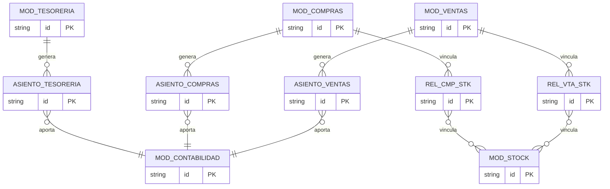
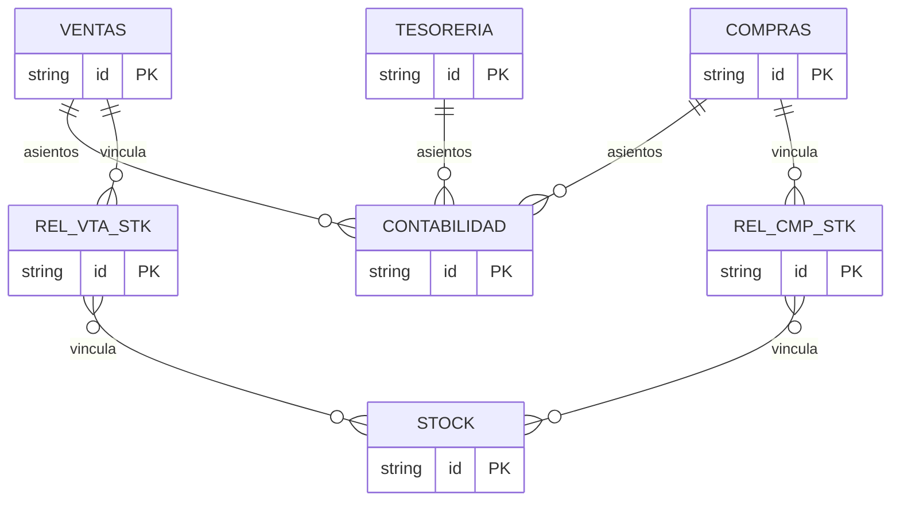

# Diseño Global – Módulos Contables

Vista de alto nivel de los módulos del sistema y sus relaciones. Sin detalle de tablas.

---

## Diagrama ER (Mermaid)

---

## Diagrama simplificado (solo módulos)

---

## Leyenda

| Entidad | Descripción |
|---------|-------------|
| **VENTAS** | Módulo de ventas |
| **COMPRAS** | Módulo de compras |
| **TESORERIA** | Módulo de tesorería |
| **CONTABILIDAD** | Módulo contable (asientos GV, CP, SB) |
| **STOCK** | Módulo de inventarios |
| **ASIENTO_VENTAS** | Comprobantes contables de ventas |
| **ASIENTO_COMPRAS** | Comprobantes contables de compras |
| **ASIENTO_TESORERIA** | Comprobantes contables de tesorería |
| **REL_VTA_STK** | Relación Ventas–Stock (se intercala entre MOD_VENTAS y MOD_STOCK) |
| **REL_CMP_STK** | Relación Compras–Stock (se intercala entre MOD_COMPRAS y MOD_STOCK) |

