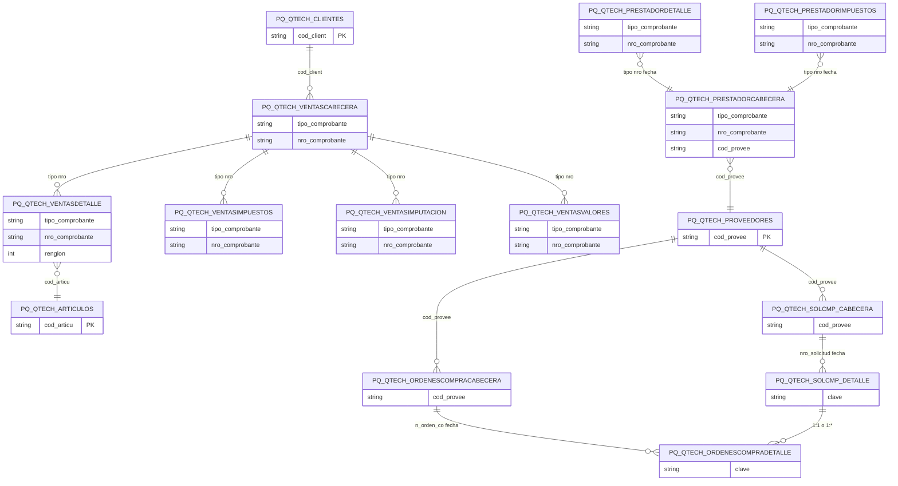

# Diseño de Tablas – Módulo PQ QTECH (Integración)

Documentación del diseño y tablas del módulo de integración QTECH: clientes, proveedores, artículos, ventas, compras, pedidos, remitos, órdenes de compra, prestadores, alícuotas IVA, tarjetas y parámetros.

**Tablas:** PQ_QTECH_ALICUOTASCLIENTES, PQ_QTECH_ALICUOTASPROVEEDORES, PQ_QTECH_ARTICULOS, PQ_QTECH_BASESADICIONALES, PQ_QTECH_CLIENTES, PQ_QTECH_CMPTVENTAS, PQ_QTECH_DETERMINARCOMPRADOR, PQ_QTECH_ERRORES, PQ_QTECH_IVACLIENTES, PQ_QTECH_IVAPROVEEDORES, PQ_QTECH_OCOMPRASOLICITUD, PQ_QTECH_ORDENESCOMPRACABECERA, PQ_QTECH_ORDENESCOMPRADETALLE, PQ_QTECH_PEDIDOSCABECERA, PQ_QTECH_PEDIDOSDETALLE, PQ_QTECH_PEDIDOSFACTURA, PQ_QTECH_PRESTADORCABECERA, PQ_QTECH_PRESTADORDETALLE, PQ_QTECH_PRESTADORIMPUESTOS, PQ_QTECH_PROVEEDORES, PQ_QTECH_PROVEEDORESRETENCIONES, PQ_QTECH_PROVINCIAS, PQ_QTECH_REMITOSCABECERA, PQ_QTECH_REMITOSDETALLE, PQ_QTECH_SOLCMP_CABECERA, PQ_QTECH_SOLCMP_DETALLE, PQ_QTECH_SUCURSALESCUENTASCONTABLES, PQ_QTECH_SUCURSALESDEPOSITOS, PQ_QTECH_TARJETAS, PQ_QTECH_TIPOCLIENTES, PQ_QTECH_VENTASCABECERA, PQ_QTECH_VENTASDETALLE, PQ_QTECH_VENTASIMPUESTOS, PQ_QTECH_VENTASIMPUTACION, PQ_QTECH_VENTASVALORES (+ tablas historial y particionadas)

---

## Dependencias previas

- Tablas Tango: clientes, proveedores, artículos, comprobantes venta/compras.
- Usa tipos estándar SQL.

---

## 1. Resumen de tablas (por grupo)

| Grupo | Tablas | Descripción |
|-------|--------|-------------|
| Maestros mapeo | ALICUOTASCLIENTES, ALICUOTASPROVEEDORES, IVACLIENTES, IVAPROVEEDORES, CMPTVENTAS, TIPOCLIENTES | Mapeo códigos QTECH ↔ Tango |
| Clientes/Proveedores | CLIENTES, PROVEEDORES, PROVEEDORESRETENCIONES, DETERMINARCOMPRADOR | Datos de terceros |
| Artículos | ARTICULOS, BASESADICIONALES | Catálogo artículos |
| Ventas | VENTASCABECERA, VENTASDETALLE, VENTASIMPUESTOS, VENTASIMPUTACION, VENTASVALORES | Comprobantes de venta. Ver diagramas para dependencias |
| Compras | PROVEEDORES (1:*), ORDENESCOMPRACABECERA→ORDENESCOMPRADETALLE, SOLCMP_CABECERA→SOLCMP_DETALLE; SOLCMP_DETALLE↔ORDENESCOMPRADETALLE (1:1 o 1:*) | Órdenes y solicitudes compra |
| Pedidos/Remitos | PEDIDOSCABECERA, PEDIDOSDETALLE, PEDIDOSFACTURA, REMITOSCABECERA, REMITOSDETALLE | Pedidos y remitos |
| Prestadores | PRESTADORDETALLE, PRESTADORIMPUESTOS → PRESTADORCABECERA → PROVEEDORES | Prestadores de servicios |
| Parámetros | PROVINCIAS, SUCURSALESCUENTASCONTABLES, SUCURSALESDEPOSITOS, TARJETAS, ERRORES | Configuración y errores |

---

## 2. Diagrama ER (Mermaid) – Vista simplificada



---

## 3. Diagrama de relaciones (ASCII)

```
  ┌── VENTAS ──────────────────────────────────────────────────────────────┐
  │   CLIENTES ──► VENTASCABECERA (cabecera depende de clientes)             │
  │                      │                                                  │
  │   ┌──────────────────┼──────────────────┬──────────────────┐            │
  │   ▼                  ▼                  ▼                  ▼            │
  │   VENTASDETALLE   VENTASIMPUESTOS  VENTASIMPUTACION   VENTASVALORES       │
  │   │                                                                      │
  │   ▼                                                                      │
  │   ARTICULOS (articulos depende de ventasdetalle)                         │
  └─────────────────────────────────────────────────────────────────────────┘

  ┌── PRESTADORES / PROVEEDORES ───────────────────────────────────────────┐
  │   PRESTADORDETALLE ──┬                                                   │
  │                     ├──► PRESTADORCABECERA (cabecera depende de detalle  │
  │   PRESTADORIMPUESTOS ─┘   e impuestos)                                   │
  │                           │                                              │
  │                           ▼                                              │
  │                     PROVEEDORES (proveedores depende de prestadorcabecera)│
  └─────────────────────────────────────────────────────────────────────────┘

  ┌── COMPRAS (PROVEEDORES 1──* cabeceras) ─────────────────────────────────┐
  │   PROVEEDORES ──┬──► ORDENESCOMPRACABECERA ──► ORDENESCOMPRADETALLE      │
  │                 └──► SOLCMP_CABECERA ──► SOLCMP_DETALLE                  │
  │                                              │                           │
  │   SOLCMP_DETALLE ──► ORDENESCOMPRADETALLE (1:1 o 1:*)                   │
  └─────────────────────────────────────────────────────────────────────────┘

  PEDIDOSCABECERA ──► PEDIDOSDETALLE, PEDIDOSFACTURA
  REMITOSCABECERA ──► REMITOSDETALLE
```

---

## 4. Scripts CREATE (documentados)

Los siguientes scripts se obtuvieron desde SQL Server. **No modificar.**

---

/****** Object:  Table [dbo].[PQ_QTECH_ALICUOTASCLIENTES]    Script Date: 17/02/2026 19:55:42 ******/
SET ANSI_NULLS ON
GO

SET QUOTED_IDENTIFIER ON
GO

CREATE TABLE [dbo].[PQ_QTECH_ALICUOTASCLIENTES](
	[cod_qtech] [numeric](2, 0) NOT NULL,
	[porcentaje] [numeric](5, 2) NOT NULL,
	[cod_alicuo] [numeric](2, 0) NOT NULL,
 CONSTRAINT [PK_PQ_QTECH_ALICUOTASCLIENTES] PRIMARY KEY CLUSTERED 
(
	[cod_qtech] ASC
)WITH (PAD_INDEX = OFF, STATISTICS_NORECOMPUTE = OFF, IGNORE_DUP_KEY = OFF, ALLOW_ROW_LOCKS = ON, ALLOW_PAGE_LOCKS = ON) ON [PRIMARY]
) ON [PRIMARY]

GO

/****** Object:  Table [dbo].[PQ_QTECH_ALICUOTASPROVEEDORES]    Script Date: 17/02/2026 19:55:42 ******/
SET ANSI_NULLS ON
GO

SET QUOTED_IDENTIFIER ON
GO

CREATE TABLE [dbo].[PQ_QTECH_ALICUOTASPROVEEDORES](
	[cod_qtech] [numeric](1, 0) NOT NULL,
	[porcentaje] [numeric](5, 2) NOT NULL,
	[cod_alicuo] [numeric](2, 0) NOT NULL,
 CONSTRAINT [PK_PQ_QTECH_ALICUOTASPROVEEDORES] PRIMARY KEY CLUSTERED 
(
	[cod_qtech] ASC
)WITH (PAD_INDEX = OFF, STATISTICS_NORECOMPUTE = OFF, IGNORE_DUP_KEY = OFF, ALLOW_ROW_LOCKS = ON, ALLOW_PAGE_LOCKS = ON) ON [PRIMARY]
) ON [PRIMARY]

GO

/****** Object:  Table [dbo].[PQ_QTECH_ARTICULOS]    Script Date: 17/02/2026 19:55:42 ******/
SET ANSI_NULLS ON
GO

SET QUOTED_IDENTIFIER ON
GO

SET ANSI_PADDING ON
GO

CREATE TABLE [dbo].[PQ_QTECH_ARTICULOS](
	[cod_articu] [varchar](15) NOT NULL,
	[codigo_barra] [varchar](20) NULL,
	[fecha_gene] [datetime] NOT NULL,
	[descripcion] [varchar](50) NOT NULL,
	[tipo] [varchar](20) NOT NULL,
	[generico] [varchar](1) NOT NULL,
	[cod_articu_gen] [varchar](15) NOT NULL CONSTRAINT [DF_PQ_QTECH_ARTICULOS_cod_articu_gen]  DEFAULT (''),
	[estado_baja] [varchar](1) NOT NULL,
	[estado] [numeric](8, 0) NULL,
	[fecha_proc] [datetime] NULL,
	[porc_iva] [numeric](6, 2) NULL,
	[imputacion] [numeric](15, 0) NULL,
 CONSTRAINT [PK_PQ_QTECH_ARTICULOS] PRIMARY KEY CLUSTERED 
(
	[cod_articu] ASC,
	[cod_articu_gen] ASC,
	[fecha_gene] ASC
)WITH (PAD_INDEX = OFF, STATISTICS_NORECOMPUTE = OFF, IGNORE_DUP_KEY = OFF, ALLOW_ROW_LOCKS = ON, ALLOW_PAGE_LOCKS = ON) ON [PRIMARY]
) ON [PRIMARY]

GO

SET ANSI_PADDING OFF
GO

/****** Object:  Table [dbo].[PQ_QTECH_BASESADICIONALES]    Script Date: 17/02/2026 19:55:42 ******/
SET ANSI_NULLS ON
GO

SET QUOTED_IDENTIFIER ON
GO

SET ANSI_PADDING ON
GO

CREATE TABLE [dbo].[PQ_QTECH_BASESADICIONALES](
	[bases] [varchar](100) NOT NULL,
 CONSTRAINT [PK_PQ_QTECH_BASESADICIONALES] PRIMARY KEY CLUSTERED 
(
	[bases] ASC
)WITH (PAD_INDEX = OFF, STATISTICS_NORECOMPUTE = OFF, IGNORE_DUP_KEY = OFF, ALLOW_ROW_LOCKS = ON, ALLOW_PAGE_LOCKS = ON) ON [PRIMARY]
) ON [PRIMARY]

GO

SET ANSI_PADDING OFF
GO

/****** Object:  Table [dbo].[PQ_QTECH_CLIENTES]    Script Date: 17/02/2026 19:55:42 ******/
SET ANSI_NULLS ON
GO

SET QUOTED_IDENTIFIER ON
GO

SET ANSI_PADDING ON
GO

CREATE TABLE [dbo].[PQ_QTECH_CLIENTES](
	[cod_client] [varchar](6) NOT NULL,
	[fecha_gene] [datetime] NOT NULL,
	[tipo_cliente] [varchar](1) NOT NULL,
	[razon_social] [varchar](60) NOT NULL,
	[domicilio] [varchar](30) NOT NULL,
	[localidad] [varchar](30) NOT NULL,
	[c_postal] [varchar](8) NOT NULL,
	[provincia] [varchar](2) NOT NULL,
	[tipo_documento] [numeric](2, 0) NOT NULL,
	[nro_documento] [varchar](15) NOT NULL,
	[condicion_iva] [numeric](1, 0) NOT NULL,
	[estado] [numeric](8, 0) NULL,
	[fecha_proc] [datetime] NULL,
 CONSTRAINT [PK_PQ_QTECH_CLIENTES] PRIMARY KEY CLUSTERED 
(
	[cod_client] ASC,
	[fecha_gene] ASC
)WITH (PAD_INDEX = OFF, STATISTICS_NORECOMPUTE = OFF, IGNORE_DUP_KEY = OFF, ALLOW_ROW_LOCKS = ON, ALLOW_PAGE_LOCKS = ON) ON [PRIMARY]
) ON [PRIMARY]

GO

SET ANSI_PADDING OFF
GO

/****** Object:  Table [dbo].[PQ_QTECH_CMPTVENTAS]    Script Date: 17/02/2026 19:55:42 ******/
SET ANSI_NULLS ON
GO

SET QUOTED_IDENTIFIER ON
GO

SET ANSI_PADDING ON
GO

CREATE TABLE [dbo].[PQ_QTECH_CMPTVENTAS](
	[cod_qtech] [varchar](3) NOT NULL,
	[t_comp] [varchar](3) NOT NULL,
	[tipo_comp] [varchar](1) NOT NULL,
	[tcomp_in_v] [varchar](2) NOT NULL,
	[talonario] [numeric](8, 0) NOT NULL,
 CONSTRAINT [PK_PQ_QTECH_CMPTVENTAS] PRIMARY KEY CLUSTERED 
(
	[cod_qtech] ASC
)WITH (PAD_INDEX = OFF, STATISTICS_NORECOMPUTE = OFF, IGNORE_DUP_KEY = OFF, ALLOW_ROW_LOCKS = ON, ALLOW_PAGE_LOCKS = ON) ON [PRIMARY]
) ON [PRIMARY]

GO

SET ANSI_PADDING OFF
GO

/****** Object:  Table [dbo].[PQ_QTECH_DETERMINARCOMPRADOR]    Script Date: 17/02/2026 19:55:42 ******/
SET ANSI_NULLS ON
GO

SET QUOTED_IDENTIFIER ON
GO

SET ANSI_PADDING ON
GO

CREATE TABLE [dbo].[PQ_QTECH_DETERMINARCOMPRADOR](
	[cod_provee] [varchar](6) NOT NULL,
	[sucursal] [numeric](3, 0) NOT NULL,
	[cod_compr] [varchar](6) NOT NULL,
 CONSTRAINT [PK_PQ_QTECH_DETERMINARCOMPRADOR] PRIMARY KEY CLUSTERED 
(
	[cod_provee] ASC,
	[sucursal] ASC
)WITH (PAD_INDEX = OFF, STATISTICS_NORECOMPUTE = OFF, IGNORE_DUP_KEY = OFF, ALLOW_ROW_LOCKS = ON, ALLOW_PAGE_LOCKS = ON) ON [PRIMARY]
) ON [PRIMARY]

GO

SET ANSI_PADDING OFF
GO

/****** Object:  Table [dbo].[PQ_QTECH_ERRORES]    Script Date: 17/02/2026 19:55:42 ******/
SET ANSI_NULLS ON
GO

SET QUOTED_IDENTIFIER ON
GO

SET ANSI_PADDING ON
GO

CREATE TABLE [dbo].[PQ_QTECH_ERRORES](
	[nombre_bd] [varchar](100) NOT NULL,
	[estado] [numeric](8, 0) NOT NULL,
	[descripcion] [varchar](100) NOT NULL,
 CONSTRAINT [PK_PQ_QTECH_ERRORES] PRIMARY KEY CLUSTERED 
(
	[nombre_bd] ASC,
	[estado] ASC
)WITH (PAD_INDEX = OFF, STATISTICS_NORECOMPUTE = OFF, IGNORE_DUP_KEY = OFF, ALLOW_ROW_LOCKS = ON, ALLOW_PAGE_LOCKS = ON) ON [PRIMARY]
) ON [PRIMARY]

GO

SET ANSI_PADDING OFF
GO

/****** Object:  Table [dbo].[PQ_QTECH_IVACLIENTES]    Script Date: 17/02/2026 19:55:42 ******/
SET ANSI_NULLS ON
GO

SET QUOTED_IDENTIFIER ON
GO

SET ANSI_PADDING ON
GO

CREATE TABLE [dbo].[PQ_QTECH_IVACLIENTES](
	[cod_qtech] [numeric](1, 0) NOT NULL,
	[iva_l] [varchar](1) NOT NULL,
	[iva_d] [varchar](1) NOT NULL,
 CONSTRAINT [PK_PQ_QTECH_IVACLIENTES] PRIMARY KEY CLUSTERED 
(
	[cod_qtech] ASC
)WITH (PAD_INDEX = OFF, STATISTICS_NORECOMPUTE = OFF, IGNORE_DUP_KEY = OFF, ALLOW_ROW_LOCKS = ON, ALLOW_PAGE_LOCKS = ON) ON [PRIMARY]
) ON [PRIMARY]

GO

SET ANSI_PADDING OFF
GO

/****** Object:  Table [dbo].[PQ_QTECH_IVAPROVEEDORES]    Script Date: 17/02/2026 19:55:42 ******/
SET ANSI_NULLS ON
GO

SET QUOTED_IDENTIFIER ON
GO

SET ANSI_PADDING ON
GO

CREATE TABLE [dbo].[PQ_QTECH_IVAPROVEEDORES](
	[cod_qtech] [numeric](1, 0) NOT NULL,
	[cond_iva] [varchar](3) NOT NULL,
	[iva_l] [varchar](1) NULL,
 CONSTRAINT [PK_PQ_QTECH_IVAPROVEEDORES] PRIMARY KEY CLUSTERED 
(
	[cod_qtech] ASC
)WITH (PAD_INDEX = OFF, STATISTICS_NORECOMPUTE = OFF, IGNORE_DUP_KEY = OFF, ALLOW_ROW_LOCKS = ON, ALLOW_PAGE_LOCKS = ON) ON [PRIMARY]
) ON [PRIMARY]

GO

SET ANSI_PADDING OFF
GO

/****** Object:  Table [dbo].[PQ_QTECH_OCOMPRASOLICITUD]    Script Date: 17/02/2026 19:55:42 ******/
SET ANSI_NULLS ON
GO

SET QUOTED_IDENTIFIER ON
GO

SET ANSI_PADDING ON
GO

CREATE TABLE [dbo].[PQ_QTECH_OCOMPRASOLICITUD](
	[fecha_gene] [datetime] NOT NULL,
	[n_orden_co] [varchar](14) NOT NULL,
	[renglon] [int] NOT NULL,
	[cantidad] [numeric](15, 4) NOT NULL,
	[id_solic] [int] NOT NULL,
	[tal_solic] [int] NOT NULL,
	[nro_solic] [varchar](14) NOT NULL,
	[rengl_solic] [int] NOT NULL,
	[estado] [numeric](8, 0) NULL,
	[fecha_proc] [datetime] NULL,
 CONSTRAINT [PK_PQ_QTECH_OCOMPRASOLICITUD] PRIMARY KEY CLUSTERED 
(
	[n_orden_co] ASC,
	[renglon] ASC,
	[id_solic] ASC,
	[fecha_gene] ASC
)WITH (PAD_INDEX = OFF, STATISTICS_NORECOMPUTE = OFF, IGNORE_DUP_KEY = OFF, ALLOW_ROW_LOCKS = ON, ALLOW_PAGE_LOCKS = ON) ON [PRIMARY]
) ON [PRIMARY]

GO

SET ANSI_PADDING OFF
GO

/****** Object:  Table [dbo].[PQ_QTECH_OCOMPRASOLICITUD_historial]    Script Date: 17/02/2026 19:55:42 ******/
SET ANSI_NULLS ON
GO

SET QUOTED_IDENTIFIER ON
GO

SET ANSI_PADDING ON
GO

CREATE TABLE [dbo].[PQ_QTECH_OCOMPRASOLICITUD_historial](
	[fecha_gene] [datetime] NOT NULL,
	[n_orden_co] [varchar](14) NOT NULL,
	[renglon] [int] NOT NULL,
	[cantidad] [numeric](15, 4) NOT NULL,
	[id_solic] [int] NOT NULL,
	[tal_solic] [int] NOT NULL,
	[nro_solic] [varchar](14) NOT NULL,
	[rengl_solic] [int] NOT NULL,
	[estado] [numeric](8, 0) NULL,
	[fecha_proc] [datetime] NULL
) ON [PRIMARY]

GO

SET ANSI_PADDING OFF
GO

/****** Object:  Table [dbo].[PQ_QTECH_ORDENESCOMPRACABECERA]    Script Date: 17/02/2026 19:55:42 ******/
SET ANSI_NULLS ON
GO

SET QUOTED_IDENTIFIER ON
GO

SET ANSI_PADDING ON
GO

CREATE TABLE [dbo].[PQ_QTECH_ORDENESCOMPRACABECERA](
	[qtech_empsuc] [numeric](3, 0) NOT NULL CONSTRAINT [DF__PQ_QTECH___qtech__119C3DC4]  DEFAULT ((0)),
	[fecha_gene] [datetime] NOT NULL,
	[n_orden_co] [varchar](15) NOT NULL,
	[cod_provee] [varchar](6) NOT NULL,
	[fecha_oc] [datetime] NULL,
	[estado_baja] [varchar](1) NULL,
	[bonificacion] [numeric](6, 2) NOT NULL,
	[total] [numeric](15, 2) NOT NULL,
	[empsuc] [int] NULL,
	[observaciones] [varchar](2000) NULL,
	[estado] [numeric](8, 0) NULL,
	[fecha_proc] [datetime] NULL,
	[n_orden_co_qtech] [varchar](15) NULL,
 CONSTRAINT [PK_PQ_QTECH_ORDENESCOMPRACABECERA] PRIMARY KEY CLUSTERED 
(
	[n_orden_co] ASC,
	[fecha_gene] ASC,
	[qtech_empsuc] ASC
)WITH (PAD_INDEX = OFF, STATISTICS_NORECOMPUTE = OFF, IGNORE_DUP_KEY = OFF, ALLOW_ROW_LOCKS = ON, ALLOW_PAGE_LOCKS = ON) ON [PRIMARY]
) ON [PRIMARY]

GO

SET ANSI_PADDING OFF
GO

/****** Object:  Table [dbo].[PQ_QTECH_ORDENESCOMPRADETALLE]    Script Date: 17/02/2026 19:55:42 ******/
SET ANSI_NULLS ON
GO

SET QUOTED_IDENTIFIER ON
GO

SET ANSI_PADDING ON
GO

CREATE TABLE [dbo].[PQ_QTECH_ORDENESCOMPRADETALLE](
	[fecha_gene] [datetime] NOT NULL,
	[n_orden_co] [varchar](15) NOT NULL,
	[renglon] [int] NOT NULL,
	[cod_articu] [varchar](15) NOT NULL,
	[cantidad] [numeric](15, 4) NOT NULL,
	[precio] [numeric](15, 4) NOT NULL,
	[precio_iva] [numeric](15, 4) NULL,
	[alicuota] [numeric](6, 2) NULL,
	[bonificacion] [numeric](6, 2) NOT NULL,
	[fecha_entrega] [datetime] NULL,
	[qtech_empsuc] [numeric](3, 0) NOT NULL CONSTRAINT [DF__PQ_QTECH___qtech__1478AA6F]  DEFAULT ((0)),
	[estado] [numeric](8, 0) NULL,
	[fecha_proc] [datetime] NULL,
 CONSTRAINT [PK_PQ_QTECH_ORDENESCOMPRADETALLE] PRIMARY KEY CLUSTERED 
(
	[n_orden_co] ASC,
	[renglon] ASC,
	[fecha_gene] ASC,
	[qtech_empsuc] ASC
)WITH (PAD_INDEX = OFF, STATISTICS_NORECOMPUTE = OFF, IGNORE_DUP_KEY = OFF, ALLOW_ROW_LOCKS = ON, ALLOW_PAGE_LOCKS = ON) ON [PRIMARY]
) ON [PRIMARY]

GO

SET ANSI_PADDING OFF
GO

/****** Object:  Table [dbo].[PQ_QTECH_PEDIDOSCABECERA]    Script Date: 17/02/2026 19:55:42 ******/
SET ANSI_NULLS ON
GO

SET QUOTED_IDENTIFIER ON
GO

SET ANSI_PADDING ON
GO

CREATE TABLE [dbo].[PQ_QTECH_PEDIDOSCABECERA](
	[fecha_gene] [datetime] NOT NULL,
	[nro_comprobante] [varchar](14) NOT NULL,
	[cod_client] [varchar](6) NOT NULL,
	[fecha] [datetime] NOT NULL,
	[bonificacion] [numeric](5, 2) NOT NULL,
	[cotizacion] [numeric](15, 2) NOT NULL,
	[subtotal] [numeric](15, 2) NOT NULL,
	[estado] [numeric](8, 0) NULL,
	[fecha_proc] [datetime] NULL,
	[nro_comprobante_qtech] [varchar](13) NULL,
 CONSTRAINT [PK_PQ_QTECH_PEDIDOSCABECERA] PRIMARY KEY CLUSTERED 
(
	[nro_comprobante] ASC,
	[fecha_gene] ASC
)WITH (PAD_INDEX = OFF, STATISTICS_NORECOMPUTE = OFF, IGNORE_DUP_KEY = OFF, ALLOW_ROW_LOCKS = ON, ALLOW_PAGE_LOCKS = ON) ON [PRIMARY]
) ON [PRIMARY]

GO

SET ANSI_PADDING OFF
GO

/****** Object:  Table [dbo].[PQ_QTECH_PEDIDOSDETALLE]    Script Date: 17/02/2026 19:55:42 ******/
SET ANSI_NULLS ON
GO

SET QUOTED_IDENTIFIER ON
GO

SET ANSI_PADDING ON
GO

CREATE TABLE [dbo].[PQ_QTECH_PEDIDOSDETALLE](
	[fecha_gene] [datetime] NOT NULL,
	[nro_comprobante] [varchar](14) NOT NULL,
	[renglon] [numeric](3, 0) NOT NULL,
	[cod_articu] [varchar](15) NOT NULL,
	[importe] [numeric](15, 2) NOT NULL,
	[porc_boni] [numeric](5, 2) NOT NULL,
	[estado] [numeric](8, 0) NULL,
	[fecha_proc] [datetime] NULL,
 CONSTRAINT [PK_PQ_QTECH_PEDIDOSDETALLE] PRIMARY KEY CLUSTERED 
(
	[nro_comprobante] ASC,
	[renglon] ASC,
	[fecha_gene] ASC
)WITH (PAD_INDEX = OFF, STATISTICS_NORECOMPUTE = OFF, IGNORE_DUP_KEY = OFF, ALLOW_ROW_LOCKS = ON, ALLOW_PAGE_LOCKS = ON) ON [PRIMARY]
) ON [PRIMARY]

GO

SET ANSI_PADDING OFF
GO

/****** Object:  Table [dbo].[PQ_QTECH_PEDIDOSFACTURA]    Script Date: 17/02/2026 19:55:42 ******/
SET ANSI_NULLS ON
GO

SET QUOTED_IDENTIFIER ON
GO

SET ANSI_PADDING ON
GO

CREATE TABLE [dbo].[PQ_QTECH_PEDIDOSFACTURA](
	[fecha_gene] [datetime] NOT NULL,
	[nro_pedido] [varchar](14) NOT NULL,
	[nro_factura] [varchar](14) NOT NULL,
	[estado] [numeric](8, 0) NULL,
	[fecha_proc] [datetime] NULL,
	[nro_comprobante] [varchar](14) NOT NULL,
 CONSTRAINT [PK_PQ_QTECH_PEDIDOSFACTURA] PRIMARY KEY CLUSTERED 
(
	[fecha_gene] ASC,
	[nro_pedido] ASC,
	[nro_factura] ASC
)WITH (PAD_INDEX = OFF, STATISTICS_NORECOMPUTE = OFF, IGNORE_DUP_KEY = OFF, ALLOW_ROW_LOCKS = ON, ALLOW_PAGE_LOCKS = ON) ON [PRIMARY]
) ON [PRIMARY]

GO

SET ANSI_PADDING OFF
GO

/****** Object:  Table [dbo].[PQ_QTECH_PRESTADORCABECERA]    Script Date: 17/02/2026 19:55:42 ******/
SET ANSI_NULLS ON
GO

SET QUOTED_IDENTIFIER ON
GO

SET ANSI_PADDING ON
GO

CREATE TABLE [dbo].[PQ_QTECH_PRESTADORCABECERA](
	[tipo_comprobante] [varchar](3) NOT NULL,
	[nro_comprobante] [varchar](14) NOT NULL,
	[fecha_gene] [datetime] NOT NULL,
	[cod_provee] [varchar](6) NOT NULL,
	[fecha] [datetime] NOT NULL,
	[fecha_contable] [datetime] NOT NULL,
	[fecha_vencimiento] [datetime] NOT NULL,
	[subtotal_gravado] [decimal](15, 2) NOT NULL,
	[subtotal_exento] [numeric](15, 2) NOT NULL,
	[total_iva] [numeric](15, 2) NOT NULL,
	[otros_impuestos] [numeric](15, 2) NOT NULL,
	[total] [numeric](15, 2) NOT NULL,
	[alquiler_a_compensar] [numeric](15, 2) NOT NULL,
	[estado] [numeric](8, 0) NULL,
	[fecha_proc] [datetime] NULL,
	[nro_comprobante_qtech] [varchar](13) NULL,
 CONSTRAINT [PK_PQ_QTECH_PRESTADORCABECERA_1] PRIMARY KEY CLUSTERED 
(
	[tipo_comprobante] ASC,
	[nro_comprobante] ASC,
	[fecha_gene] ASC
)WITH (PAD_INDEX = OFF, STATISTICS_NORECOMPUTE = OFF, IGNORE_DUP_KEY = OFF, ALLOW_ROW_LOCKS = ON, ALLOW_PAGE_LOCKS = ON) ON [PRIMARY]
) ON [PRIMARY]

GO

SET ANSI_PADDING OFF
GO

/****** Object:  Table [dbo].[PQ_QTECH_PRESTADORDETALLE]    Script Date: 17/02/2026 19:55:42 ******/
SET ANSI_NULLS ON
GO

SET QUOTED_IDENTIFIER ON
GO

SET ANSI_PADDING ON
GO

CREATE TABLE [dbo].[PQ_QTECH_PRESTADORDETALLE](
	[tipo_comprobante] [varchar](3) NOT NULL,
	[nro_comprobante] [varchar](14) NOT NULL,
	[fecha_gene] [datetime] NOT NULL,
	[cod_concep] [varchar](3) NOT NULL,
	[importe] [numeric](15, 2) NOT NULL,
	[estado] [numeric](8, 0) NULL,
	[fecha_proc] [datetime] NULL,
 CONSTRAINT [PK_PQ_QTECH_PRESTADORDETALLE] PRIMARY KEY CLUSTERED 
(
	[tipo_comprobante] ASC,
	[nro_comprobante] ASC,
	[fecha_gene] ASC,
	[cod_concep] ASC
)WITH (PAD_INDEX = OFF, STATISTICS_NORECOMPUTE = OFF, IGNORE_DUP_KEY = OFF, ALLOW_ROW_LOCKS = ON, ALLOW_PAGE_LOCKS = ON) ON [PRIMARY]
) ON [PRIMARY]

GO

SET ANSI_PADDING OFF
GO

/****** Object:  Table [dbo].[PQ_QTECH_PRESTADORIMPUESTOS]    Script Date: 17/02/2026 19:55:42 ******/
SET ANSI_NULLS ON
GO

SET QUOTED_IDENTIFIER ON
GO

SET ANSI_PADDING ON
GO

CREATE TABLE [dbo].[PQ_QTECH_PRESTADORIMPUESTOS](
	[tipo_comprobante] [varchar](3) NOT NULL,
	[nro_comprobante] [varchar](14) NOT NULL,
	[fecha_gene] [datetime] NOT NULL,
	[alicuota] [numeric](2, 0) NOT NULL,
	[porc_impuesto] [numeric](5, 2) NOT NULL,
	[importe] [numeric](15, 2) NOT NULL,
	[estado] [numeric](8, 0) NULL,
	[fecha_proc] [datetime] NULL,
 CONSTRAINT [PK_PQ_QTECH_PRESTADORIMPUESTOS_1] PRIMARY KEY CLUSTERED 
(
	[tipo_comprobante] ASC,
	[nro_comprobante] ASC,
	[fecha_gene] ASC,
	[alicuota] ASC
)WITH (PAD_INDEX = OFF, STATISTICS_NORECOMPUTE = OFF, IGNORE_DUP_KEY = OFF, ALLOW_ROW_LOCKS = ON, ALLOW_PAGE_LOCKS = ON) ON [PRIMARY]
) ON [PRIMARY]

GO

SET ANSI_PADDING OFF
GO

/****** Object:  Table [dbo].[PQ_QTECH_PROVEEDORES]    Script Date: 17/02/2026 19:55:42 ******/
SET ANSI_NULLS ON
GO

SET QUOTED_IDENTIFIER ON
GO

SET ANSI_PADDING ON
GO

CREATE TABLE [dbo].[PQ_QTECH_PROVEEDORES](
	[cod_provee] [varchar](6) NOT NULL,
	[fecha_gene] [datetime] NOT NULL,
	[razon_social] [varchar](60) NOT NULL,
	[domicilio] [varchar](30) NOT NULL,
	[localidad] [varchar](30) NOT NULL,
	[c_postal] [varchar](8) NOT NULL,
	[provincia] [varchar](1) NOT NULL,
	[tipo_documento] [numeric](2, 0) NOT NULL,
	[nro_documento] [varchar](15) NOT NULL,
	[condicion_iva] [numeric](1, 0) NOT NULL,
	[estado] [numeric](8, 0) NULL,
	[fecha_proc] [datetime] NULL,
 CONSTRAINT [PK_PQ_QTECH_PROVEEDORES] PRIMARY KEY CLUSTERED 
(
	[cod_provee] ASC,
	[fecha_gene] ASC
)WITH (PAD_INDEX = OFF, STATISTICS_NORECOMPUTE = OFF, IGNORE_DUP_KEY = OFF, ALLOW_ROW_LOCKS = ON, ALLOW_PAGE_LOCKS = ON) ON [PRIMARY]
) ON [PRIMARY]

GO

SET ANSI_PADDING OFF
GO

/****** Object:  Table [dbo].[PQ_QTECH_PROVEEDORESRETENCIONES]    Script Date: 17/02/2026 19:55:42 ******/
SET ANSI_NULLS ON
GO

SET QUOTED_IDENTIFIER ON
GO

SET ANSI_PADDING ON
GO

CREATE TABLE [dbo].[PQ_QTECH_PROVEEDORESRETENCIONES](
	[cod_provee] [varchar](6) NOT NULL,
	[fecha_gene] [datetime] NOT NULL,
	[tipo_reten] [varchar](1) NOT NULL,
	[cod_reten] [varchar](2) NOT NULL,
	[estado] [numeric](2, 0) NULL,
	[fecha_proc] [datetime] NULL,
 CONSTRAINT [PK_PQ_QTECH_PROVEEDORESRETENCIONES] PRIMARY KEY CLUSTERED 
(
	[cod_provee] ASC,
	[fecha_gene] ASC
)WITH (PAD_INDEX = OFF, STATISTICS_NORECOMPUTE = OFF, IGNORE_DUP_KEY = OFF, ALLOW_ROW_LOCKS = ON, ALLOW_PAGE_LOCKS = ON) ON [PRIMARY]
) ON [PRIMARY]

GO

SET ANSI_PADDING OFF
GO

/****** Object:  Table [dbo].[PQ_QTECH_PROVINCIAS]    Script Date: 17/02/2026 19:55:42 ******/
SET ANSI_NULLS ON
GO

SET QUOTED_IDENTIFIER ON
GO

SET ANSI_PADDING ON
GO

CREATE TABLE [dbo].[PQ_QTECH_PROVINCIAS](
	[provin_qtech] [varchar](2) NOT NULL,
	[cod_provin] [varchar](2) NOT NULL,
 CONSTRAINT [PK_PQ_QTECH_PROVINCIAS] PRIMARY KEY CLUSTERED 
(
	[provin_qtech] ASC
)WITH (PAD_INDEX = OFF, STATISTICS_NORECOMPUTE = OFF, IGNORE_DUP_KEY = OFF, ALLOW_ROW_LOCKS = ON, ALLOW_PAGE_LOCKS = ON) ON [PRIMARY]
) ON [PRIMARY]

GO

SET ANSI_PADDING OFF
GO

/****** Object:  Table [dbo].[PQ_QTECH_REMITOSCABECERA]    Script Date: 17/02/2026 19:55:42 ******/
SET ANSI_NULLS ON
GO

SET QUOTED_IDENTIFIER ON
GO

SET ANSI_PADDING ON
GO

CREATE TABLE [dbo].[PQ_QTECH_REMITOSCABECERA](
	[tipo_comprobante] [varchar](3) NOT NULL,
	[nro_comprobante] [varchar](14) NOT NULL,
	[fecha_gene] [datetime] NOT NULL,
	[cod_provee] [varchar](6) NOT NULL,
	[razon_social] [varchar](100) NOT NULL,
	[fecha_remito] [datetime] NOT NULL,
	[fecha_recepcion] [datetime] NOT NULL,
	[cod_deposi] [varchar](3) NOT NULL,
	[observaciones] [varchar](200) NOT NULL,
	[estado] [numeric](8, 0) NULL,
	[fecha_proc] [datetime] NULL,
	[cuit] [varchar](13) NULL,
	[gln] [varchar](13) NULL,
	[nro_comprobante_qtech] [varchar](13) NULL,
 CONSTRAINT [PK_PQ_QTECH_REMITOSCABECERA] PRIMARY KEY CLUSTERED 
(
	[tipo_comprobante] ASC,
	[nro_comprobante] ASC,
	[fecha_gene] ASC,
	[cod_provee] ASC
)WITH (PAD_INDEX = OFF, STATISTICS_NORECOMPUTE = OFF, IGNORE_DUP_KEY = OFF, ALLOW_ROW_LOCKS = ON, ALLOW_PAGE_LOCKS = ON) ON [PRIMARY]
) ON [PRIMARY]

GO

SET ANSI_PADDING OFF
GO

/****** Object:  Table [dbo].[PQ_QTECH_REMITOSDETALLE]    Script Date: 17/02/2026 19:55:42 ******/
SET ANSI_NULLS ON
GO

SET QUOTED_IDENTIFIER ON
GO

SET ANSI_PADDING ON
GO

CREATE TABLE [dbo].[PQ_QTECH_REMITOSDETALLE](
	[tipo_comprobante] [varchar](3) NOT NULL,
	[nro_comprobante] [varchar](14) NOT NULL,
	[cod_provee] [varchar](6) NOT NULL,
	[renglon] [varchar](3) NOT NULL,
	[fecha_gene] [datetime] NOT NULL,
	[talon_solic] [int] NOT NULL,
	[nro_solic] [varchar](14) NOT NULL,
	[nro_rengl] [int] NOT NULL,
	[n_orden_co] [varchar](14) NOT NULL,
	[renglon_oc] [varchar](13) NOT NULL,
	[cod_articu] [varchar](15) NOT NULL,
	[cantidad] [numeric](8, 2) NOT NULL,
	[costo_unitario] [numeric](15, 2) NOT NULL,
	[costo_unitario_iva] [numeric](15, 2) NOT NULL,
	[lote_despacho] [varchar](20) NULL,
	[vencimiento] [datetime] NULL,
	[estado] [numeric](8, 0) NULL,
	[fecha_proc] [datetime] NULL,
	[cod_deposi] [varchar](2) NULL,
 CONSTRAINT [PK_PQ_QTECH_REMITOSDETALLE] PRIMARY KEY CLUSTERED 
(
	[tipo_comprobante] ASC,
	[nro_comprobante] ASC,
	[cod_provee] ASC,
	[renglon] ASC,
	[fecha_gene] ASC,
	[talon_solic] ASC,
	[nro_solic] ASC,
	[nro_rengl] ASC,
	[n_orden_co] ASC,
	[renglon_oc] ASC
)WITH (PAD_INDEX = OFF, STATISTICS_NORECOMPUTE = OFF, IGNORE_DUP_KEY = OFF, ALLOW_ROW_LOCKS = ON, ALLOW_PAGE_LOCKS = ON) ON [PRIMARY]
) ON [PRIMARY]

GO

SET ANSI_PADDING OFF
GO

/****** Object:  Table [dbo].[PQ_QTECH_SOLCMP_CABECERA]    Script Date: 17/02/2026 19:55:42 ******/
SET ANSI_NULLS ON
GO

SET QUOTED_IDENTIFIER ON
GO

SET ANSI_PADDING ON
GO

CREATE TABLE [dbo].[PQ_QTECH_SOLCMP_CABECERA](
	[nro_solicitud] [varchar](14) NOT NULL,
	[fecha_gene] [datetime] NOT NULL,
	[observaciones] [text] NOT NULL,
	[clasificador_1] [varchar](2) NOT NULL,
	[estado] [numeric](8, 0) NULL,
	[fecha_proc] [datetime] NULL,
	[nro_solicitud_qtech] [varchar](13) NULL,
 CONSTRAINT [PK_PQ_QTECH_SOLCMP_CABECERA] PRIMARY KEY CLUSTERED 
(
	[nro_solicitud] ASC,
	[fecha_gene] ASC
)WITH (PAD_INDEX = OFF, STATISTICS_NORECOMPUTE = OFF, IGNORE_DUP_KEY = OFF, ALLOW_ROW_LOCKS = ON, ALLOW_PAGE_LOCKS = ON) ON [PRIMARY]
) ON [PRIMARY] TEXTIMAGE_ON [PRIMARY]

GO

SET ANSI_PADDING OFF
GO

/****** Object:  Table [dbo].[PQ_QTECH_SOLCMP_DETALLE]    Script Date: 17/02/2026 19:55:42 ******/
SET ANSI_NULLS ON
GO

SET QUOTED_IDENTIFIER ON
GO

SET ANSI_PADDING ON
GO

CREATE TABLE [dbo].[PQ_QTECH_SOLCMP_DETALLE](
	[nro_solicitud] [varchar](14) NOT NULL,
	[cod_articu] [varchar](15) NOT NULL,
	[fecha_gene] [datetime] NOT NULL,
	[tipo] [varchar](1) NOT NULL,
	[cantidad] [numeric](15, 2) NOT NULL,
	[observaciones] [text] NOT NULL,
	[plan_entrega] [datetime] NOT NULL,
	[estado] [numeric](8, 0) NULL,
	[fecha_proc] [datetime] NULL,
 CONSTRAINT [PK_PQ_QTECH_SOLCMP_DETALLE] PRIMARY KEY CLUSTERED 
(
	[nro_solicitud] ASC,
	[cod_articu] ASC,
	[fecha_gene] ASC
)WITH (PAD_INDEX = OFF, STATISTICS_NORECOMPUTE = OFF, IGNORE_DUP_KEY = OFF, ALLOW_ROW_LOCKS = ON, ALLOW_PAGE_LOCKS = ON) ON [PRIMARY]
) ON [PRIMARY] TEXTIMAGE_ON [PRIMARY]

GO

SET ANSI_PADDING OFF
GO

/****** Object:  Table [dbo].[PQ_QTECH_SUCURSALESCUENTASCONTABLES]    Script Date: 17/02/2026 19:55:42 ******/
SET ANSI_NULLS ON
GO

SET QUOTED_IDENTIFIER ON
GO

CREATE TABLE [dbo].[PQ_QTECH_SUCURSALESCUENTASCONTABLES](
	[qtech_empsuc] [numeric](3, 0) NOT NULL,
	[id_cuenta_orig] [numeric](10, 0) NOT NULL,
	[id_cuenta_sucu] [numeric](10, 0) NOT NULL,
 CONSTRAINT [PK_PQ_QTECH_SUCURSALESCUENTASCONTABLES] PRIMARY KEY CLUSTERED 
(
	[qtech_empsuc] ASC,
	[id_cuenta_orig] ASC
)WITH (PAD_INDEX = OFF, STATISTICS_NORECOMPUTE = OFF, IGNORE_DUP_KEY = OFF, ALLOW_ROW_LOCKS = ON, ALLOW_PAGE_LOCKS = ON) ON [PRIMARY]
) ON [PRIMARY]

GO

/****** Object:  Table [dbo].[PQ_QTECH_SUCURSALESDEPOSITOS]    Script Date: 17/02/2026 19:55:42 ******/
SET ANSI_NULLS ON
GO

SET QUOTED_IDENTIFIER ON
GO

SET ANSI_PADDING ON
GO

CREATE TABLE [dbo].[PQ_QTECH_SUCURSALESDEPOSITOS](
	[qtech_empsuc] [numeric](3, 0) NOT NULL,
	[cod_deposi] [varchar](2) NOT NULL,
	[talonario_oc] [int] NULL,
 CONSTRAINT [PK_PQ_QTECH_SUCURSALESDEPOSITOS] PRIMARY KEY CLUSTERED 
(
	[qtech_empsuc] ASC
)WITH (PAD_INDEX = OFF, STATISTICS_NORECOMPUTE = OFF, IGNORE_DUP_KEY = OFF, ALLOW_ROW_LOCKS = ON, ALLOW_PAGE_LOCKS = ON) ON [PRIMARY]
) ON [PRIMARY]

GO

SET ANSI_PADDING OFF
GO

/****** Object:  Table [dbo].[PQ_QTECH_TARJETAS]    Script Date: 17/02/2026 19:55:42 ******/
SET ANSI_NULLS ON
GO

SET QUOTED_IDENTIFIER ON
GO

SET ANSI_PADDING ON
GO

CREATE TABLE [dbo].[PQ_QTECH_TARJETAS](
	[cod_cta] [numeric](11, 0) NOT NULL,
	[cod_qtech] [varchar](3) NOT NULL,
	[cod_tarjeta] [varchar](3) NOT NULL,
 CONSTRAINT [PK_PQ_QTECH_TARJETAS] PRIMARY KEY CLUSTERED 
(
	[cod_cta] ASC
)WITH (PAD_INDEX = OFF, STATISTICS_NORECOMPUTE = OFF, IGNORE_DUP_KEY = OFF, ALLOW_ROW_LOCKS = ON, ALLOW_PAGE_LOCKS = ON) ON [PRIMARY]
) ON [PRIMARY]

GO

SET ANSI_PADDING OFF
GO

/****** Object:  Table [dbo].[PQ_QTECH_TIPOCLIENTES]    Script Date: 17/02/2026 19:55:42 ******/
SET ANSI_NULLS ON
GO

SET QUOTED_IDENTIFIER ON
GO

SET ANSI_PADDING ON
GO

CREATE TABLE [dbo].[PQ_QTECH_TIPOCLIENTES](
	[tipo_cliente] [varchar](1) NOT NULL,
	[cn_fc] [varchar](2) NULL,
	[cn_db] [varchar](2) NULL,
	[cn_cr] [varchar](2) NULL,
	[cn_astor_fc] [int] NULL,
	[cn_astor_db] [int] NULL,
	[cn_astor_cr] [int] NULL,
	[cuenta_deudores] [float] NOT NULL,
 CONSTRAINT [PK_PQ_QTECH_TIPOCLIENTES] PRIMARY KEY CLUSTERED 
(
	[tipo_cliente] ASC
)WITH (PAD_INDEX = OFF, STATISTICS_NORECOMPUTE = OFF, IGNORE_DUP_KEY = OFF, ALLOW_ROW_LOCKS = ON, ALLOW_PAGE_LOCKS = ON) ON [PRIMARY]
) ON [PRIMARY]

GO

SET ANSI_PADDING OFF
GO

/****** Object:  Table [dbo].[PQ_QTECH_VENTASCABECERA]    Script Date: 17/02/2026 19:55:42 ******/
SET ANSI_NULLS ON
GO

SET QUOTED_IDENTIFIER ON
GO

SET ANSI_PADDING ON
GO

CREATE TABLE [dbo].[PQ_QTECH_VENTASCABECERA](
	[tipo_comprobante] [varchar](3) NOT NULL,
	[nro_comprobante] [varchar](14) NOT NULL,
	[fecha_gene] [datetime] NOT NULL,
	[cod_client] [varchar](6) NOT NULL,
	[tipo_cliente] [varchar](1) NOT NULL,
	[tipo_prestacion] [varchar](1) NULL,
	[tipo_cobertura] [varchar](1) NULL,
	[talonario] [numeric](4, 0) NOT NULL,
	[fecha] [datetime] NOT NULL,
	[cta_cte] [bit] NOT NULL,
	[bonificacion] [numeric](5, 2) NOT NULL,
	[cotizacion] [numeric](15, 2) NOT NULL,
	[subtotal_gravado] [numeric](15, 2) NOT NULL,
	[subtotal_exento] [numeric](15, 2) NOT NULL,
	[total_iva] [numeric](15, 2) NOT NULL,
	[total_impuestos] [numeric](15, 2) NOT NULL,
	[total] [numeric](15, 2) NOT NULL,
	[anulado] [bit] NOT NULL,
	[estado] [numeric](8, 0) NULL,
	[fecha_proc] [datetime] NULL,
	[caicae] [varchar](14) NULL,
	[caicae_vto] [datetime] NULL,
	[nro_comprobante_qtech] [varchar](13) NULL,
	[cod_client2] [varchar](6) NULL,
	[qtech_empsuc] [int] NOT NULL,
 CONSTRAINT [PK_PQ_QTECH_VENTASCABECERA_1] PRIMARY KEY CLUSTERED 
(
	[tipo_comprobante] ASC,
	[nro_comprobante] ASC,
	[fecha_gene] ASC,
	[qtech_empsuc] ASC
)WITH (PAD_INDEX = OFF, STATISTICS_NORECOMPUTE = OFF, IGNORE_DUP_KEY = OFF, ALLOW_ROW_LOCKS = ON, ALLOW_PAGE_LOCKS = ON) ON [PRIMARY]
) ON [PRIMARY]

GO

SET ANSI_PADDING OFF
GO

/****** Object:  Table [dbo].[PQ_QTECH_VENTASDETALLE]    Script Date: 17/02/2026 19:55:42 ******/
SET ANSI_NULLS ON
GO

SET QUOTED_IDENTIFIER ON
GO

SET ANSI_PADDING ON
GO

CREATE TABLE [dbo].[PQ_QTECH_VENTASDETALLE](
	[tipo_comprobante] [varchar](3) NOT NULL,
	[nro_comprobante] [varchar](14) NOT NULL,
	[renglon] [numeric](3, 0) NOT NULL,
	[fecha_gene] [datetime] NOT NULL,
	[cod_articu] [varchar](15) NOT NULL,
	[importe] [numeric](15, 2) NOT NULL,
	[porc_boni] [numeric](15, 2) NOT NULL,
	[estado] [numeric](8, 0) NULL,
	[fecha_proc] [datetime] NULL,
	[qtech_empsuc] [int] NOT NULL,
 CONSTRAINT [PK_PQ_QTECH_VENTASDETALLE_1] PRIMARY KEY CLUSTERED 
(
	[tipo_comprobante] ASC,
	[nro_comprobante] ASC,
	[renglon] ASC,
	[fecha_gene] ASC,
	[qtech_empsuc] ASC
)WITH (PAD_INDEX = OFF, STATISTICS_NORECOMPUTE = OFF, IGNORE_DUP_KEY = OFF, ALLOW_ROW_LOCKS = ON, ALLOW_PAGE_LOCKS = ON) ON [PRIMARY]
) ON [PRIMARY]

GO

SET ANSI_PADDING OFF
GO

/****** Object:  Table [dbo].[PQ_QTECH_VENTASDETALLE_202304]    Script Date: 17/02/2026 19:55:42 ******/
SET ANSI_NULLS ON
GO

SET QUOTED_IDENTIFIER ON
GO

SET ANSI_PADDING ON
GO

CREATE TABLE [dbo].[PQ_QTECH_VENTASDETALLE_202304](
	[tipo_comprobante] [varchar](3) NOT NULL,
	[nro_comprobante] [varchar](14) NOT NULL,
	[renglon] [numeric](3, 0) NOT NULL,
	[fecha_gene] [datetime] NOT NULL,
	[cod_articu] [varchar](15) NOT NULL,
	[importe] [numeric](15, 2) NOT NULL,
	[porc_boni] [numeric](15, 2) NOT NULL,
	[estado] [numeric](8, 0) NULL,
	[fecha_proc] [datetime] NULL,
	[qtech_empsuc] [int] NOT NULL
) ON [PRIMARY]

GO

SET ANSI_PADDING OFF
GO

/****** Object:  Table [dbo].[PQ_QTECH_VENTASIMPUESTOS]    Script Date: 17/02/2026 19:55:42 ******/
SET ANSI_NULLS ON
GO

SET QUOTED_IDENTIFIER ON
GO

SET ANSI_PADDING ON
GO

CREATE TABLE [dbo].[PQ_QTECH_VENTASIMPUESTOS](
	[tipo_comprobante] [varchar](3) NOT NULL,
	[nro_comprobante] [varchar](14) NOT NULL,
	[fecha_gene] [datetime] NOT NULL,
	[alicuota] [numeric](2, 0) NOT NULL,
	[subtotal] [numeric](15, 2) NOT NULL,
	[porc_impuesto] [numeric](15, 2) NOT NULL,
	[impuesto] [numeric](15, 2) NOT NULL,
	[estado] [numeric](8, 0) NULL,
	[fecha_proc] [datetime] NULL,
	[qtech_empsuc] [int] NOT NULL,
 CONSTRAINT [PK_PQ_QTECH_VENTASIMPUESTOS] PRIMARY KEY CLUSTERED 
(
	[tipo_comprobante] ASC,
	[nro_comprobante] ASC,
	[fecha_gene] ASC,
	[alicuota] ASC,
	[qtech_empsuc] ASC
)WITH (PAD_INDEX = OFF, STATISTICS_NORECOMPUTE = OFF, IGNORE_DUP_KEY = OFF, ALLOW_ROW_LOCKS = ON, ALLOW_PAGE_LOCKS = ON) ON [PRIMARY]
) ON [PRIMARY]

GO

SET ANSI_PADDING OFF
GO

/****** Object:  Table [dbo].[PQ_QTECH_VENTASIMPUESTOS_202304]    Script Date: 17/02/2026 19:55:42 ******/
SET ANSI_NULLS ON
GO

SET QUOTED_IDENTIFIER ON
GO

SET ANSI_PADDING ON
GO

CREATE TABLE [dbo].[PQ_QTECH_VENTASIMPUESTOS_202304](
	[tipo_comprobante] [varchar](3) NOT NULL,
	[nro_comprobante] [varchar](14) NOT NULL,
	[fecha_gene] [datetime] NOT NULL,
	[alicuota] [numeric](2, 0) NOT NULL,
	[subtotal] [numeric](15, 2) NOT NULL,
	[porc_impuesto] [numeric](15, 2) NOT NULL,
	[impuesto] [numeric](15, 2) NOT NULL,
	[estado] [numeric](8, 0) NULL,
	[fecha_proc] [datetime] NULL,
	[qtech_empsuc] [int] NOT NULL
) ON [PRIMARY]

GO

SET ANSI_PADDING OFF
GO

/****** Object:  Table [dbo].[PQ_QTECH_VENTASIMPUTACION]    Script Date: 17/02/2026 19:55:42 ******/
SET ANSI_NULLS ON
GO

SET QUOTED_IDENTIFIER ON
GO

SET ANSI_PADDING ON
GO

CREATE TABLE [dbo].[PQ_QTECH_VENTASIMPUTACION](
	[tipo_comprobante] [varchar](3) NOT NULL,
	[nro_comprobante] [varchar](14) NOT NULL,
	[tipo_comp_impu] [varchar](3) NOT NULL,
	[nro_comp_impu] [varchar](14) NOT NULL,
	[fecha_gene] [datetime] NOT NULL,
	[importe] [numeric](15, 2) NOT NULL,
	[estado] [numeric](8, 0) NULL,
	[fecha_proc] [datetime] NULL,
	[qtech_empsuc] [int] NOT NULL,
	[qtech_empsuc_impu] [int] NULL CONSTRAINT [DF_PQ_QTECH_VENTASIMPUTACION_qtech_empsuc_impu]  DEFAULT ((1)),
	[generado] [char](1) NOT NULL CONSTRAINT [DF__PQ_QTECH___gener__036E19FE]  DEFAULT ('S'),
 CONSTRAINT [PK_PQ_QTECH_VENTASIMPUTACION_1] PRIMARY KEY CLUSTERED 
(
	[qtech_empsuc] ASC,
	[tipo_comprobante] ASC,
	[nro_comprobante] ASC,
	[tipo_comp_impu] ASC,
	[nro_comp_impu] ASC,
	[fecha_gene] ASC
)WITH (PAD_INDEX = OFF, STATISTICS_NORECOMPUTE = OFF, IGNORE_DUP_KEY = OFF, ALLOW_ROW_LOCKS = ON, ALLOW_PAGE_LOCKS = ON) ON [PRIMARY]
) ON [PRIMARY]

GO

SET ANSI_PADDING OFF
GO

/****** Object:  Table [dbo].[PQ_QTECH_VENTASIMPUTACION_202304]    Script Date: 17/02/2026 19:55:42 ******/
SET ANSI_NULLS ON
GO

SET QUOTED_IDENTIFIER ON
GO

SET ANSI_PADDING ON
GO

CREATE TABLE [dbo].[PQ_QTECH_VENTASIMPUTACION_202304](
	[tipo_comprobante] [varchar](3) NOT NULL,
	[nro_comprobante] [varchar](14) NOT NULL,
	[tipo_comp_impu] [varchar](3) NOT NULL,
	[nro_comp_impu] [varchar](14) NOT NULL,
	[fecha_gene] [datetime] NOT NULL,
	[importe] [numeric](15, 2) NOT NULL,
	[estado] [numeric](8, 0) NULL,
	[fecha_proc] [datetime] NULL,
	[qtech_empsuc] [int] NOT NULL,
	[qtech_empsuc_impu] [int] NULL,
	[generado] [char](1) NOT NULL
) ON [PRIMARY]

GO

SET ANSI_PADDING OFF
GO

/****** Object:  Table [dbo].[PQ_QTECH_VENTASVALORES]    Script Date: 17/02/2026 19:55:42 ******/
SET ANSI_NULLS ON
GO

SET QUOTED_IDENTIFIER ON
GO

SET ANSI_PADDING ON
GO

CREATE TABLE [dbo].[PQ_QTECH_VENTASVALORES](
	[tipo_comprobante] [varchar](3) NOT NULL,
	[nro_comprobante] [varchar](14) NOT NULL,
	[renglon] [numeric](3, 0) NOT NULL,
	[fecha_gene] [datetime] NOT NULL,
	[cuenta_tesoreria] [numeric](11, 0) NOT NULL,
	[importe] [numeric](15, 2) NOT NULL,
	[cheque_nro] [numeric](15, 0) NOT NULL,
	[cheque_sucursal] [numeric](3, 0) NULL,
	[cheque_fecha] [datetime] NULL,
	[cheque_banco] [numeric](3, 0) NOT NULL,
	[cheque_c_postal] [varchar](8) NULL,
	[cheque_fecha_emision] [datetime] NULL,
	[cheque_cta_bancaria] [varchar](15) NULL,
	[cheque_cuit_cheque] [varchar](20) NULL,
	[tarjeta_cod_tarjeta] [varchar](3) NOT NULL,
	[tarjeta_pos] [numeric](8, 0) NULL,
	[tarjeta_lote] [numeric](4, 0) NULL,
	[tarjeta_importe] [numeric](15, 2) NULL,
	[tarjeta_cuotas] [numeric](2, 0) NULL,
	[tarjeta_nro_cupon] [numeric](15, 0) NOT NULL,
	[tarjeta_fecha] [datetime] NULL,
	[tarjeta_nro_socio] [varchar](20) NULL,
	[tarjeta_fecha_vto] [datetime] NULL,
	[tarjeta_tipo_documento] [varchar](3) NULL,
	[tarjeta_nro_documento] [varchar](9) NULL,
	[tarjeta_telefono] [varchar](20) NULL,
	[tarjeta_autorizado] [varchar](8) NULL,
	[estado] [numeric](8, 0) NULL,
	[fecha_proc] [datetime] NULL,
	[qtech_empsuc] [int] NOT NULL,
 CONSTRAINT [PK_PQ_QTECH_VENTASVALORES_1] PRIMARY KEY CLUSTERED 
(
	[qtech_empsuc] ASC,
	[tipo_comprobante] ASC,
	[nro_comprobante] ASC,
	[renglon] ASC,
	[fecha_gene] ASC,
	[cheque_nro] ASC,
	[cheque_banco] ASC,
	[tarjeta_nro_cupon] ASC
)WITH (PAD_INDEX = OFF, STATISTICS_NORECOMPUTE = OFF, IGNORE_DUP_KEY = OFF, ALLOW_ROW_LOCKS = ON, ALLOW_PAGE_LOCKS = ON) ON [PRIMARY]
) ON [PRIMARY]

GO

SET ANSI_PADDING OFF
GO

/****** Object:  Table [dbo].[PQ_QTECH_VENTASVALORES_202304]    Script Date: 17/02/2026 19:55:42 ******/
SET ANSI_NULLS ON
GO

SET QUOTED_IDENTIFIER ON
GO

SET ANSI_PADDING ON
GO

CREATE TABLE [dbo].[PQ_QTECH_VENTASVALORES_202304](
	[tipo_comprobante] [varchar](3) NOT NULL,
	[nro_comprobante] [varchar](14) NOT NULL,
	[renglon] [numeric](3, 0) NOT NULL,
	[fecha_gene] [datetime] NOT NULL,
	[cuenta_tesoreria] [numeric](11, 0) NOT NULL,
	[importe] [numeric](15, 2) NOT NULL,
	[cheque_nro] [numeric](15, 0) NOT NULL,
	[cheque_sucursal] [numeric](3, 0) NULL,
	[cheque_fecha] [datetime] NULL,
	[cheque_banco] [numeric](3, 0) NOT NULL,
	[cheque_c_postal] [varchar](8) NULL,
	[cheque_fecha_emision] [datetime] NULL,
	[cheque_cta_bancaria] [varchar](15) NULL,
	[cheque_cuit_cheque] [varchar](20) NULL,
	[tarjeta_cod_tarjeta] [varchar](3) NOT NULL,
	[tarjeta_pos] [numeric](8, 0) NULL,
	[tarjeta_lote] [numeric](4, 0) NULL,
	[tarjeta_importe] [numeric](15, 2) NULL,
	[tarjeta_cuotas] [numeric](2, 0) NULL,
	[tarjeta_nro_cupon] [numeric](15, 0) NOT NULL,
	[tarjeta_fecha] [datetime] NULL,
	[tarjeta_nro_socio] [varchar](20) NULL,
	[tarjeta_fecha_vto] [datetime] NULL,
	[tarjeta_tipo_documento] [varchar](3) NULL,
	[tarjeta_nro_documento] [varchar](9) NULL,
	[tarjeta_telefono] [varchar](20) NULL,
	[tarjeta_autorizado] [varchar](8) NULL,
	[estado] [numeric](8, 0) NULL,
	[fecha_proc] [datetime] NULL,
	[qtech_empsuc] [int] NOT NULL
) ON [PRIMARY]

GO

SET ANSI_PADDING OFF
GO


