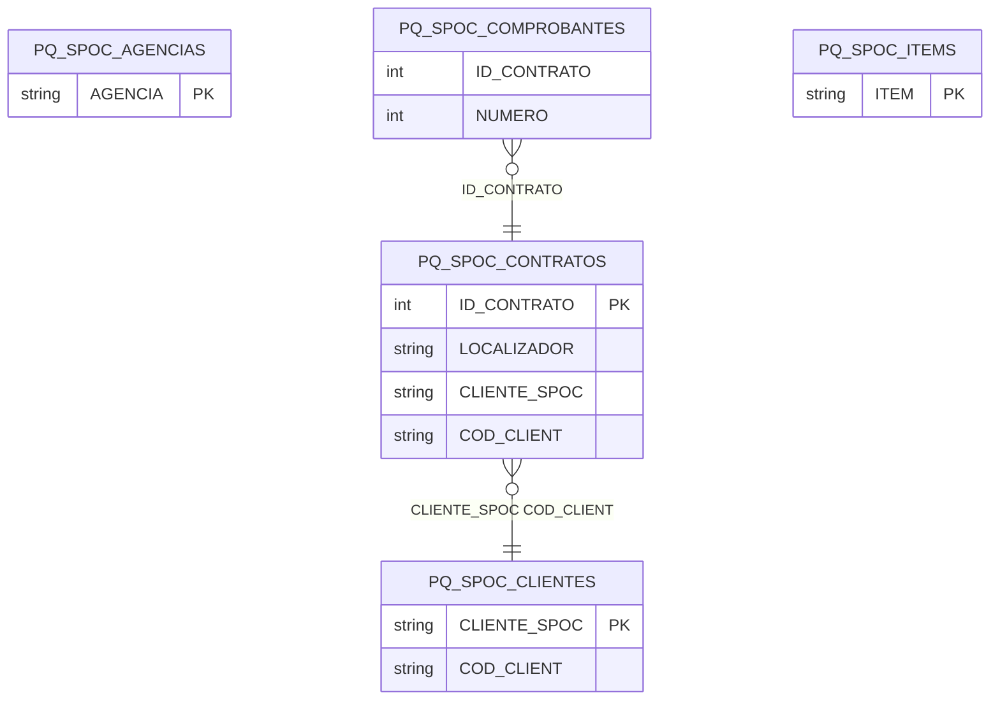

# Diseño de Tablas – Módulo PQ SPOC (Sistema de Parking Operativo)

Documentación del diseño y tablas del módulo SPOC: contratos, clientes, agencias, comprobantes, items, multas, telepeaje, recupero de gastos, recurrentes y vehículos.

**Tablas:** PQ_SPOC_AGENCIAS, PQ_SPOC_CLIENTERESERVA, PQ_SPOC_CLIENTES, PQ_SPOC_COMPROBANTES, PQ_SPOC_CONTRATOFACTURADO, PQ_SPOC_CONTRATOS, PQ_SPOC_ITEMS, PQ_SPOC_MODELOSCLIENTES, PQ_SPOC_MULTAS, PQ_SPOC_RECUPEROGASTOS, PQ_SPOC_RECURRENTES, PQ_SPOC_TELEPASE, PQ_SPOC_TIPO_CONTRATO, PQ_SPOC_VEHICULOSHISTORIAL

---

## Dependencias previas

- Tablas Tango: GVA14 (clientes, COD_CLIENT).
- Usa tipos estándar SQL (varchar, int, numeric, bit, datetime).

---

## 1. Resumen de tablas

| Tabla | PK / Clave | Descripción |
|-------|------------|-------------|
| PQ_SPOC_AGENCIAS | AGENCIA | Agencias / sucursales |
| PQ_SPOC_CLIENTERESERVA | — | Cliente por reserva (localizador) |
| PQ_SPOC_CLIENTES | CLIENTE_SPOC, COD_CLIENT | Vinculación cliente SPOC ↔ Tango |
| PQ_SPOC_COMPROBANTES | ID_CONTRATO, NUMERO | Comprobantes facturados por contrato |
| PQ_SPOC_CONTRATOFACTURADO | — | Contratos ya facturados |
| PQ_SPOC_CONTRATOS | ID_CONTRATO | Contratos de estacionamiento |
| PQ_SPOC_ITEMS | ITEM | Ítems / servicios facturables |
| PQ_SPOC_MODELOSCLIENTES | CODIGOSEGMENTO | Modelo cliente por segmento |
| PQ_SPOC_MULTAS | ID | Multas e infraciones |
| PQ_SPOC_RECUPEROGASTOS | DOMINIO, IDINFRACCION | Recupero de gastos por infracción |
| PQ_SPOC_RECURRENTES | — | Contratos recurrentes facturados |
| PQ_SPOC_TELEPASE | ID | Datos telepeaje |
| PQ_SPOC_TIPO_CONTRATO | tipo_contrato | Tipos de contrato |
| PQ_SPOC_VEHICULOSHISTORIAL | CONTRATO, PATENTE | Historial de vehículos por contrato |

---

## 2. Diagrama ER (Mermaid)



---

## 3. Diagrama de relaciones (ASCII)

```
    PQ_SPOC_CONTRATOS (núcleo)
            │
    ┌───────┼───────┬───────────┬────────────┐
    ▼       ▼       ▼           ▼            ▼
CLIENTES  AGENCIAS COMPROBANTES RECURRENTES  VEHI-
(vincul)                          MULTAS    CULOS
                                    │
                         RECUPEROGASTOS  TELEPASE
```

---

## 4. Scripts CREATE (documentados)

Los siguientes scripts se obtuvieron desde SQL Server. **No modificar.**

---

/****** Object:  Table [dbo].[PQ_SPOC_AGENCIAS]    Script Date: 17/2/2026 19:54:19 ******/
SET ANSI_NULLS ON
GO

SET QUOTED_IDENTIFIER ON
GO

CREATE TABLE [dbo].[PQ_SPOC_AGENCIAS](
	[AGENCIA] [varchar](5) NOT NULL,
	[COD_TANGO] [varchar](3) NOT NULL,
	[TALFACA] [int] NOT NULL,
	[TALFACB] [int] NOT NULL,
	[TALRECA] [int] NULL,
	[TALRECB] [int] NULL,
	[COD_PROVIN] [varchar](2) NULL,
	[COD_ZONA] [varchar](2) NULL
) ON [PRIMARY]
GO

/****** Object:  Table [dbo].[PQ_SPOC_CLIENTERESERVA]    Script Date: 17/2/2026 19:54:19 ******/
SET ANSI_NULLS ON
GO

SET QUOTED_IDENTIFIER ON
GO

CREATE TABLE [dbo].[PQ_SPOC_CLIENTERESERVA](
	[LOCALIZADOR] [varchar](20) NULL,
	[COD_CLIENT] [varchar](6) NULL
) ON [PRIMARY]
GO

/****** Object:  Table [dbo].[PQ_SPOC_CLIENTES]    Script Date: 17/2/2026 19:54:19 ******/
SET ANSI_NULLS ON
GO

SET QUOTED_IDENTIFIER ON
GO

CREATE TABLE [dbo].[PQ_SPOC_CLIENTES](
	[CLIENTE_SPOC] [varchar](10) NOT NULL,
	[COD_CLIENT] [varchar](6) NOT NULL,
	[AUTOMATICO] [bit] NULL,
	[MON_CTE] [bit] NULL
) ON [PRIMARY]
GO

/****** Object:  Table [dbo].[PQ_SPOC_COMPROBANTES]    Script Date: 17/2/2026 19:54:19 ******/
SET ANSI_NULLS ON
GO

SET QUOTED_IDENTIFIER ON
GO

CREATE TABLE [dbo].[PQ_SPOC_COMPROBANTES](
	[ID_CONTRATO] [int] NOT NULL,
	[NUMERO] [int] NOT NULL,
	[T_COMP] [varchar](3) NOT NULL,
	[N_COMP] [varchar](14) NOT NULL,
	[CUMPLIDO] [bit] NULL
) ON [PRIMARY]
GO

/****** Object:  Table [dbo].[PQ_SPOC_CONTRATOFACTURADO]    Script Date: 17/2/2026 19:54:19 ******/
SET ANSI_NULLS ON
GO

SET QUOTED_IDENTIFIER ON
GO

CREATE TABLE [dbo].[PQ_SPOC_CONTRATOFACTURADO](
	[CONTRATO] [varchar](15) NULL,
	[FECHA] [date] NULL,
	[USUARIO_INGRESO] [varchar](50) NULL,
	[TERMINAL_INGRESO] [varchar](50) NULL,
	[FECHA_INGRESO] [datetime] NULL,
	[HORA_INGRESO] [varchar](6) NULL
) ON [PRIMARY]
GO

/****** Object:  Table [dbo].[PQ_SPOC_CONTRATOS]    Script Date: 17/2/2026 19:54:19 ******/
SET ANSI_NULLS ON
GO

SET QUOTED_IDENTIFIER ON
GO

CREATE TABLE [dbo].[PQ_SPOC_CONTRATOS](
	[ID_CONTRATO] [int] IDENTITY(1,1) NOT NULL,
	[LOCALIZADOR] [varchar](20) NULL,
	[CONTRATO] [varchar](11) NULL,
	[CLIENTE_SPOC] [varchar](11) NULL,
	[COD_CLIENT] [varchar](6) NULL,
	[TIPO_CONTRATO] [varchar](3) NULL,
	[FECHA_DESDE] [datetime] NULL,
	[FECHA_HASTA] [datetime] NULL,
	[FIDELIDAD] [numeric](15, 2) NULL,
	[VOUCHER] [numeric](15, 2) NULL,
	[VOUCHER_MONEDA] [bit] NULL,
	[RECURRENTE] [bit] NULL,
	[RECURRENTE_CERRADO] [bit] NULL,
	[RECURRENTE_REFERENCIA] [varchar](30) NULL,
	[RECURRENTE_PERIODO] [bit] NULL,
	[RECURRENTE_NUMERO_MAXIMO] [int] NULL
) ON [PRIMARY]
GO

/****** Object:  Table [dbo].[PQ_SPOC_ITEMS]    Script Date: 17/2/2026 19:54:19 ******/
SET ANSI_NULLS ON
GO

SET QUOTED_IDENTIFIER ON
GO

CREATE TABLE [dbo].[PQ_SPOC_ITEMS](
	[ITEM] [varchar](10) NOT NULL,
	[BASE] [varchar](5) NOT NULL,
	[DESCRIPCIO] [varchar](30) NOT NULL,
	[COD_CUENTA] [numeric](15, 0) NOT NULL,
	[ADICIONAL] [bit] NULL,
	[RECURRENTE] [bit] NULL,
	[TIPO_ITEM] [int] NOT NULL,
	[TIPO_ITEM_STR] [varchar](50) NOT NULL,
	[DDJJ_AA2000] [bit] NOT NULL
) ON [PRIMARY]
GO

/****** Object:  Table [dbo].[PQ_SPOC_MODELOSCLIENTES]    Script Date: 17/2/2026 19:54:19 ******/
SET ANSI_NULLS ON
GO

SET QUOTED_IDENTIFIER ON
GO

CREATE TABLE [dbo].[PQ_SPOC_MODELOSCLIENTES](
	[CODIGOSEGMENTO] [varchar](2) NOT NULL,
	[COD_GVA14_DEFECTO] [varchar](10) NOT NULL
) ON [PRIMARY]
GO

/****** Object:  Table [dbo].[PQ_SPOC_MULTAS]    Script Date: 17/2/2026 19:54:19 ******/
SET ANSI_NULLS ON
GO

SET QUOTED_IDENTIFIER ON
GO

CREATE TABLE [dbo].[PQ_SPOC_MULTAS](
	[ID] [int] IDENTITY(1,1) NOT NULL,
	[CLIENTE] [varchar](255) NULL,
	[CUIT] [numeric](15, 0) NULL,
	[USUARIOCONTRATO_DNI] [varchar](20) NULL,
	[CLIENTECONTRATO_DNI] [varchar](20) NULL,
	[USUARIOCONTRATO_CODIGO] [varchar](10) NULL,
	[CLIENTECONTRATO_CODIGO] [varchar](10) NULL,
	[MULTAS] [numeric](15, 2) NOT NULL,
	[CARGOS] [numeric](15, 2) NOT NULL,
	[IVA] [numeric](15, 2) NOT NULL,
	[TOTAL] [numeric](15, 2) NOT NULL,
	[ACTA_ID] [varchar](255) NULL,
	[OPERACION] [varchar](255) NULL,
	[DOMINIO] [varchar](10) NULL,
	[JURISDICCION] [varchar](255) NULL,
	[FECHA_INFRACCION] [datetime] NULL,
	[HORA_INFRACCION] [varchar](8) NULL,
	[TIPOLOGIA] [varchar](255) NULL,
	[CONTRATO] [varchar](15) NULL,
	[NOMBRE] [varchar](255) NULL,
	[SEGMENTO] [varchar](255) NULL,
	[PAIS] [varchar](50) NULL,
	[AUXILIAR] [varchar](10) NULL,
	[SUBAUXILIAR] [varchar](10) NULL,
	[N_COMP_FAC] [varchar](15) NULL,
	[N_COMP_REC] [varchar](15) NULL
) ON [PRIMARY]
GO

/****** Object:  Table [dbo].[PQ_SPOC_RECUPEROGASTOS]    Script Date: 17/2/2026 19:54:19 ******/
SET ANSI_NULLS ON
GO

SET QUOTED_IDENTIFIER ON
GO

CREATE TABLE [dbo].[PQ_SPOC_RECUPEROGASTOS](
	[DOMINIO] [varchar](10) NOT NULL,
	[IDINFRACCION] [varchar](30) NOT NULL,
	[FECHAINFRACCION] [datetime] NULL,
	[FECHARECEPCION] [datetime] NULL,
	[FECHAVENCIMIENTO] [datetime] NOT NULL,
	[URLARCHIVO] [varchar](255) NULL,
	[HORA] [varchar](8) NULL,
	[DESCRIPCION] [varchar](100) NULL,
	[MONTO] [numeric](15, 2) NULL,
	[ESTADO] [int] NOT NULL,
	[MENSAJE_ESTADO] [varchar](100) NOT NULL,
	[TILDE] [bit] NULL,
	[ANULADO] [bit] NULL,
	[FECHA_PROC] [datetime] NOT NULL,
	[CONTRATO] [varchar](15) NULL,
	[USUARIO] [varchar](100) NULL,
	[POSICION] [int] NULL,
	[ClIENTE_NUEVO] [bit] NULL
) ON [PRIMARY]
GO

/****** Object:  Table [dbo].[PQ_SPOC_RECURRENTES]    Script Date: 17/2/2026 19:54:19 ******/
SET ANSI_NULLS ON
GO

SET QUOTED_IDENTIFIER ON
GO

CREATE TABLE [dbo].[PQ_SPOC_RECURRENTES](
	[ID_CONTRATO] [int] NULL,
	[NUMERO] [int] NULL,
	[ANIO] [int] NULL,
	[MES] [int] NULL,
	[T_COMP] [varchar](3) NULL,
	[N_COMP] [varchar](14) NULL
) ON [PRIMARY]
GO

/****** Object:  Table [dbo].[PQ_SPOC_TELEPASE]    Script Date: 17/2/2026 19:54:19 ******/
SET ANSI_NULLS ON
GO

SET QUOTED_IDENTIFIER ON
GO

CREATE TABLE [dbo].[PQ_SPOC_TELEPASE](
	[ID] [int] IDENTITY(1,1) NOT NULL,
	[CLIENTE] [varchar](255) NOT NULL,
	[CUIT] [numeric](15, 0) NOT NULL,
	[PASADAS] [numeric](15, 2) NOT NULL,
	[CARGOS] [numeric](15, 2) NOT NULL,
	[TOTAL] [numeric](15, 2) NOT NULL,
	[EMAIL_1] [varchar](255) NULL,
	[EMAIL_2] [varchar](255) NULL,
	[EMAIL_3] [varchar](255) NULL,
	[EMAIL_4] [varchar](255) NULL,
	[N_COMP] [varchar](15) NULL,
	[AUXILIAR] [varchar](20) NULL,
	[SUBAUXILIAR] [varchar](20) NULL,
	[RESUMEN] [varchar](100) NULL
) ON [PRIMARY]
GO

/****** Object:  Table [dbo].[PQ_SPOC_TIPO_CONTRATO]    Script Date: 17/2/2026 19:54:19 ******/
SET ANSI_NULLS ON
GO

SET QUOTED_IDENTIFIER ON
GO

CREATE TABLE [dbo].[PQ_SPOC_TIPO_CONTRATO](
	[tipo_contrato] [char](2) NOT NULL,
	[codigo] [int] NULL,
 CONSTRAINT [PK_PQ_SPOC_TIPO_CONTRATO] PRIMARY KEY CLUSTERED 
(
	[tipo_contrato] ASC
)WITH (PAD_INDEX = OFF, STATISTICS_NORECOMPUTE = OFF, IGNORE_DUP_KEY = OFF, ALLOW_ROW_LOCKS = ON, ALLOW_PAGE_LOCKS = ON) ON [PRIMARY]
) ON [PRIMARY]
GO

/****** Object:  Table [dbo].[PQ_SPOC_VEHICULOSHISTORIAL]    Script Date: 17/2/2026 19:54:19 ******/
SET ANSI_NULLS ON
GO

SET QUOTED_IDENTIFIER ON
GO

CREATE TABLE [dbo].[PQ_SPOC_VEHICULOSHISTORIAL](
	[CONTRATO] [varchar](15) NOT NULL,
	[PATENTE] [varchar](7) NOT NULL,
	[FECHA_DESDE] [datetime] NULL,
	[FECHA_HASTA] [datetime] NULL,
	[FECHA_INGRESO] [datetime] NOT NULL,
	[INACTIVO] [bit] NOT NULL
) ON [PRIMARY]
GO