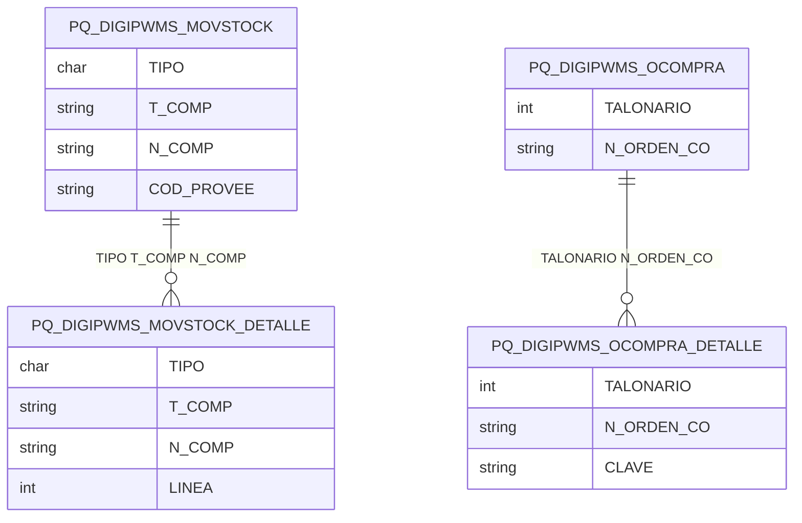

# Diseño de Tablas – Módulo PQ DIGIPWMS

Documentación del diseño y tablas del módulo de integración con DigiP-WMS: ajustes de stock, movimientos, órdenes de compra, pedidos, clientes entrega, despachos y motivos.

**Tablas:** PQ_DIGIPWMS_AJUSTESTOCK, PQ_DIGIPWMS_CLIENTES_ENTREGA, PQ_DIGIPWMS_DESPACHOS, PQ_DIGIPWMS_MOTIVOS, PQ_DIGIPWMS_MOVSTOCK, PQ_DIGIPWMS_MOVSTOCK_DETALLE, PQ_DIGIPWMS_OCOMPRA, PQ_DIGIPWMS_OCOMPRA_DETALLE, PQ_DIGIPWMS_PEDIDOS, PQ_DIGIPWMS_TIPOCOMPTES, PQ_PARAMETROS_GRAL

---

## Dependencias previas

- Tablas Tango: comprobantes stock (T_COMP, N_COMP), artículos, proveedores, clientes.
- Usa tipos estándar SQL.

---

## 1. Resumen de tablas

| Tabla | PK / Clave | Descripción |
|-------|------------|-------------|
| PQ_DIGIPWMS_AJUSTESTOCK | ID, T_COMP, N_COMP | Ajustes de stock ingresados |
| PQ_DIGIPWMS_CLIENTES_ENTREGA | COD_CLIENT, ID_DIRECCION_ENTREGA | Direcciones de entrega por cliente |
| PQ_DIGIPWMS_DESPACHOS | ID | Definición de despachos |
| PQ_DIGIPWMS_MOTIVOS | CODIGO | Motivos de movimiento |
| PQ_DIGIPWMS_MOVSTOCK | TIPO, T_COMP, N_COMP, COD_PROVEE | Cabecera movimientos stock |
| PQ_DIGIPWMS_MOVSTOCK_DETALLE | TIPO, T_COMP, N_COMP, LINEA | Detalle movimientos stock |
| PQ_DIGIPWMS_OCOMPRA | TALONARIO, N_ORDEN_CO | Órdenes de compra |
| PQ_DIGIPWMS_OCOMPRA_DETALLE | TALONARIO, N_ORDEN_CO, CLAVE | Detalle órdenes compra |
| PQ_DIGIPWMS_PEDIDOS | TALON_PED, NRO_PEDIDO | Pedidos de venta |
| PQ_DIGIPWMS_TIPOCOMPTES | TIPO, T_COMP | Tipos de comprobante WMS |
| PQ_PARAMETROS_GRAL | Programa, Clave | Parámetros generales |

---

## 2. Diagrama ER (Mermaid)



---

## 3. Diagrama de relaciones (ASCII)

```
    MOVSTOCK ◄──► MOVSTOCK_DETALLE
    OCOMPRA  ◄──► OCOMPRA_DETALLE
    PEDIDOS
    AJUSTESTOCK
    CLIENTES_ENTREGA  DESPACHOS  MOTIVOS  TIPOCOMPTES
    PQ_PARAMETROS_GRAL (transversal)
```

---

## 4. Scripts CREATE (documentados)

Los siguientes scripts se obtuvieron desde SQL Server. **No modificar.**

---

/****** Object:  Table [dbo].[PQ_DIGIPWMS_AJUSTESTOCK]    Script Date: 17/2/2026 19:46:02 ******/
SET ANSI_NULLS ON
GO

SET QUOTED_IDENTIFIER ON
GO

CREATE TABLE [dbo].[PQ_DIGIPWMS_AJUSTESTOCK](
	[ID] [bigint] NOT NULL,
	[T_COMP] [varchar](3) NOT NULL,
	[N_COMP] [varchar](15) NOT NULL,
	[FECHA_INGRESO] [datetime] NULL,
	[USUARIO_INGRESO] [varchar](60) NULL,
	[TERMINAL_INGRESO] [varchar](60) NULL
) ON [PRIMARY]
GO

/****** Object:  Table [dbo].[PQ_DIGIPWMS_CLIENTES_ENTREGA]    Script Date: 17/2/2026 19:46:02 ******/
SET ANSI_NULLS ON
GO

SET QUOTED_IDENTIFIER ON
GO

CREATE TABLE [dbo].[PQ_DIGIPWMS_CLIENTES_ENTREGA](
	[COD_CLIENT] [varchar](6) NOT NULL,
	[ID_DIRECCION_ENTREGA] [int] NOT NULL,
	[NOMBRE] [varchar](50) NULL,
	[DIRECCION] [varchar](60) NULL,
	[LOCALIDAD] [varchar](60) NULL,
	[COD_PROVIN] [varchar](20) NULL,
	[COD_ZONA] [varchar](2) NULL
) ON [PRIMARY]
GO

/****** Object:  Table [dbo].[PQ_DIGIPWMS_DESPACHOS]    Script Date: 17/2/2026 19:46:02 ******/
SET ANSI_NULLS ON
GO

SET QUOTED_IDENTIFIER ON
GO

CREATE TABLE [dbo].[PQ_DIGIPWMS_DESPACHOS](
	[ID] [int] IDENTITY(1,1) NOT NULL,
	[DESCRIPCION] [varchar](100) NOT NULL,
	[CAMPO] [varchar](max) NULL
) ON [PRIMARY] TEXTIMAGE_ON [PRIMARY]
GO

/****** Object:  Table [dbo].[PQ_DIGIPWMS_MOTIVOS]    Script Date: 17/2/2026 19:46:02 ******/
SET ANSI_NULLS ON
GO

SET QUOTED_IDENTIFIER ON
GO

CREATE TABLE [dbo].[PQ_DIGIPWMS_MOTIVOS](
	[CODIGO] [char](3) NOT NULL,
	[DESCRIPCION] [varchar](100) NOT NULL,
	[T_COMP] [varchar](3) NULL
) ON [PRIMARY]
GO

/****** Object:  Table [dbo].[PQ_DIGIPWMS_MOVSTOCK]    Script Date: 17/2/2026 19:46:02 ******/
SET ANSI_NULLS ON
GO

SET QUOTED_IDENTIFIER ON
GO

CREATE TABLE [dbo].[PQ_DIGIPWMS_MOVSTOCK](
	[TIPO] [char](1) NOT NULL,
	[T_COMP] [varchar](3) NOT NULL,
	[N_COMP] [varchar](15) NOT NULL,
	[COD_PROVEE] [varchar](6) NOT NULL,
	[ESTADO] [int] NOT NULL,
	[ULTIMA_FECHA] [datetime] NULL,
	[ULTIMA_TERMINAL] [varchar](100) NULL,
	[ULTIMO_USUARIO] [varchar](100) NULL
) ON [PRIMARY]
GO

/****** Object:  Table [dbo].[PQ_DIGIPWMS_MOVSTOCK_DETALLE]    Script Date: 17/2/2026 19:46:02 ******/
SET ANSI_NULLS ON
GO

SET QUOTED_IDENTIFIER ON
GO

CREATE TABLE [dbo].[PQ_DIGIPWMS_MOVSTOCK_DETALLE](
	[TIPO] [char](1) NOT NULL,
	[T_COMP] [varchar](3) NOT NULL,
	[N_COMP] [varchar](15) NOT NULL,
	[COD_PROVEE] [varchar](6) NOT NULL,
	[LINEA] [int] NOT NULL,
	[COD_ARTICU] [varchar](15) NOT NULL,
	[LOTE] [varchar](20) NULL,
	[STOCKTANGO] [numeric](15, 2) NULL,
	[STOCKDIGIP] [numeric](15, 2) NULL
) ON [PRIMARY]
GO

/****** Object:  Table [dbo].[PQ_DIGIPWMS_OCOMPRA]    Script Date: 17/2/2026 19:46:02 ******/
SET ANSI_NULLS ON
GO

SET QUOTED_IDENTIFIER ON
GO

CREATE TABLE [dbo].[PQ_DIGIPWMS_OCOMPRA](
	[TALONARIO] [int] NOT NULL,
	[N_ORDEN_CO] [varchar](15) NOT NULL,
	[ESTADO] [int] NOT NULL,
	[ULTIMA_FECHA] [datetime] NULL,
	[ULTIMA_TERMINAL] [varchar](100) NULL,
	[ULTIMO_USUARIO] [varchar](100) NULL
) ON [PRIMARY]
GO

/****** Object:  Table [dbo].[PQ_DIGIPWMS_OCOMPRA_DETALLE]    Script Date: 17/2/2026 19:46:02 ******/
SET ANSI_NULLS ON
GO

SET QUOTED_IDENTIFIER ON
GO

CREATE TABLE [dbo].[PQ_DIGIPWMS_OCOMPRA_DETALLE](
	[TALONARIO] [int] NOT NULL,
	[N_ORDEN_CO] [varchar](15) NOT NULL,
	[CLAVE] [varchar](30) NOT NULL,
	[RENGLON] [int] NOT NULL,
	[LINEA] [int] NULL,
	[COD_ARTICU] [varchar](15) NULL,
	[COD_DEPOSI] [varchar](2) NULL,
	[CANTIDAD] [numeric](15, 2) NULL,
	[LOTE] [varchar](100) NULL,
	[VENCIMIENTO] [datetime] NULL
) ON [PRIMARY]
GO

/****** Object:  Table [dbo].[PQ_DIGIPWMS_PEDIDOS]    Script Date: 17/2/2026 19:46:02 ******/
SET ANSI_NULLS ON
GO

SET QUOTED_IDENTIFIER ON
GO

CREATE TABLE [dbo].[PQ_DIGIPWMS_PEDIDOS](
	[TALON_PED] [int] NOT NULL,
	[NRO_PEDIDO] [varchar](15) NOT NULL,
	[ESTADO] [int] NOT NULL,
	[ULTIMA_FECHA] [datetime] NULL,
	[ULTIMA_TERMINAL] [varchar](100) NULL,
	[ULTIMO_USUARIO] [varchar](100) NULL
) ON [PRIMARY]
GO

/****** Object:  Table [dbo].[PQ_DIGIPWMS_TIPOCOMPTES]    Script Date: 17/2/2026 19:46:02 ******/
SET ANSI_NULLS ON
GO

SET QUOTED_IDENTIFIER ON
GO

CREATE TABLE [dbo].[PQ_DIGIPWMS_TIPOCOMPTES](
	[TIPO] [char](1) NOT NULL,
	[T_COMP] [varchar](3) NOT NULL,
	[ACTIVO] [bit] NULL
) ON [PRIMARY]
GO

/****** Object:  Table [dbo].[PQ_PARAMETROS_GRAL]    Script Date: 17/2/2026 19:46:02 ******/
SET ANSI_NULLS ON
GO

SET QUOTED_IDENTIFIER ON
GO

CREATE TABLE [dbo].[PQ_PARAMETROS_GRAL](
	[Programa] [varchar](50) NOT NULL,
	[Clave] [varchar](50) NOT NULL,
	[Valor_String] [varchar](255) NULL,
	[Valor_Text] [text] NULL,
	[Valor_Int] [int] NULL,
	[Valor_DateTime] [datetime] NULL,
	[Valor_Bool] [bit] NULL,
	[Valor_Decimal] [numeric](24, 6) NULL,
 CONSTRAINT [PK_PQ_PARAMETROS_GRAL] PRIMARY KEY CLUSTERED 
(
	[Programa] ASC,
	[Clave] ASC
)WITH (PAD_INDEX = OFF, STATISTICS_NORECOMPUTE = OFF, IGNORE_DUP_KEY = OFF, ALLOW_ROW_LOCKS = ON, ALLOW_PAGE_LOCKS = ON, OPTIMIZE_FOR_SEQUENTIAL_KEY = OFF) ON [PRIMARY]
) ON [PRIMARY] TEXTIMAGE_ON [PRIMARY]
GO
