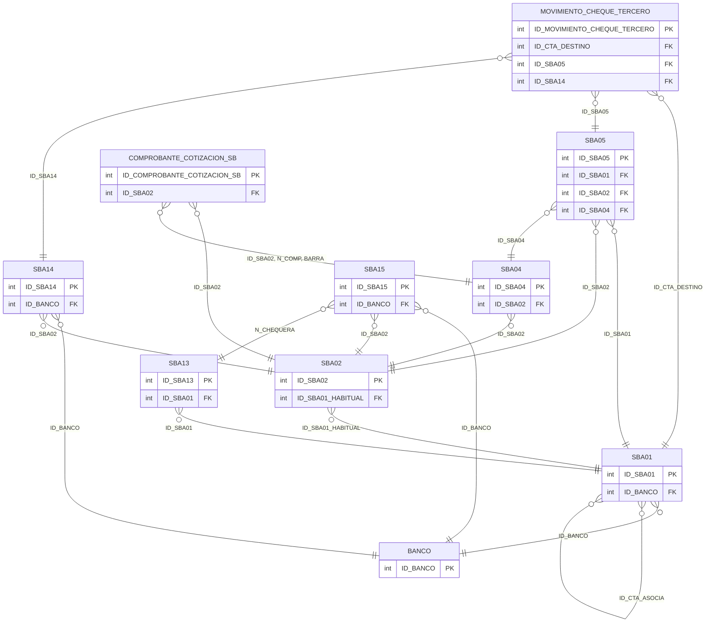

# Diseño de Tablas – Módulo Tesorería

Documentación del diseño y relaciones de las tablas del módulo de tesorería. **Solo se incluyen estas tablas** (sin referencias a tablas externas).

**Tablas:** SBA04, SBA05, SBA14, MOVIMIENTO_CHEQUE_TERCERO, SBA15, COMPROBANTE_COTIZACION_SB, SBA01, SBA13, SBA02, BANCO

---

## Diagrama ER (Mermaid)



---

## Dependencias previas

Para ejecutar los scripts CREATE, deben existir:

- Tipos de usuario (UDT): D_ID, DECIMAL_TG, ENTEROXL_TG, ENTERO_TG, T_D_FECHA y demás UDTs del ERP.

---

## 1. Crear tipos de usuario (si no existen)

```sql
-- Tipos base usados en módulo tesorería
CREATE TYPE dbo.D_ID FROM int;
CREATE TYPE dbo.DECIMAL_TG FROM decimal(22,7);
CREATE TYPE dbo.ENTEROXL_TG FROM float;
CREATE TYPE dbo.ENTERO_TG FROM int;
CREATE TYPE dbo.T_D_FECHA FROM datetime;
```

---

## 2. Secuencias

```sql
CREATE SEQUENCE dbo.SEQUENCE_SBA04
    AS int START WITH 1 INCREMENT BY 1
    MINVALUE -9223372036854775808 MAXVALUE 9223372036854775807 NO CYCLE;

CREATE SEQUENCE dbo.SEQUENCE_SBA05
    AS int START WITH 1 INCREMENT BY 1
    MINVALUE -9223372036854775808 MAXVALUE 9223372036854775807 NO CYCLE;

CREATE SEQUENCE dbo.SEQUENCE_SBA01
    AS int START WITH 1 INCREMENT BY 1
    MINVALUE -9223372036854775808 MAXVALUE 9223372036854775807 NO CYCLE;

CREATE SEQUENCE dbo.SEQUENCE_SBA02
    AS int START WITH 1 INCREMENT BY 1
    MINVALUE -9223372036854775808 MAXVALUE 9223372036854775807 NO CYCLE;

-- (Otras secuencias según definición en base de datos)
```

---

## 3. Comando CREATE de cada tabla

> **Nota:** Las tablas operativas tienen muchas columnas. Los siguientes scripts muestran la estructura esencial (PK, FKs). El script completo puede generarse vía MCP o herramienta de scripting de SQL Server.

### BANCO

CREATE TABLE [dbo].[BANCO](
	[ID_BANCO] [dbo].[D_ID] NOT NULL,
	[ID_PROVINCIA] [dbo].[D_ID] NULL,
	[COD_BANCO] [dbo].[D_CODIGO] NOT NULL,
	[NRO_BANCO] [char](3) NULL,
	[DESC_BANCO] [dbo].[D_DESCRIPCION] NULL,
	[COD_EMPRESA] [dbo].[D_CODIGO] NULL,
	[OBSERVACIONES] [varchar](1000) NULL,
	[CALLE] [varchar](30) NULL,
	[NRO_DOMIC] [varchar](10) NULL,
	[PISO] [varchar](10) NULL,
	[DEPARTAMENTO_DOMIC] [varchar](10) NULL,
	[BLOQUE] [varchar](5) NULL,
	[TORRE] [varchar](5) NULL,
	[LOCALIDAD] [varchar](40) NULL,
	[CODIGO_POSTAL] [varchar](8) NULL,
	[TIPO_TELEFONO1] [dbo].[D_TIPO_TELEFONO] NULL,
	[TELEFONO] [dbo].[D_TELEFONO] NULL,
	[TIPO_TELEFONO2] [dbo].[D_TIPO_TELEFONO] NULL,
	[TELEFONO2] [dbo].[D_TELEFONO] NULL,
	[WEB_SITE] [dbo].[D_INTERNET] NULL,
	[EMAIL] [dbo].[D_INTERNET] NULL,
	[CONTACTO] [dbo].[D_CONTACTO] NULL,
	[CUIT] [varchar](13) NULL,
	[COD_PREVIRED] [dbo].[D_COD_PREVIRED] NULL,
	[ID_COMUNA] [dbo].[D_ID] NULL,
	[ROW_VERSION] [timestamp] NOT NULL,
	[CAMPOS_ADICIONALES] [xml](CONTENT [dbo].[CAMPOS_ADICIONALES_BANCO]) NULL,
	[HABILITADO] [varchar](1) NOT NULL,
 CONSTRAINT [PK_BANCO] PRIMARY KEY CLUSTERED 
(
	[ID_BANCO] ASC
)WITH (PAD_INDEX = OFF, STATISTICS_NORECOMPUTE = OFF, IGNORE_DUP_KEY = OFF, ALLOW_ROW_LOCKS = ON, ALLOW_PAGE_LOCKS = ON, FILLFACTOR = 90, OPTIMIZE_FOR_SEQUENTIAL_KEY = OFF) ON [PRIMARY]
) ON [PRIMARY] TEXTIMAGE_ON [PRIMARY]
GO

### COMPROBANTE_COTIZACION_SB

CREATE TABLE [dbo].[COMPROBANTE_COTIZACION_SB](
	[ID_COMPROBANTE_COTIZACION_SB] [dbo].[D_ID] NOT NULL,
	[ID_MONEDA] [dbo].[D_ID] NULL,
	[ID_TIPO_COTIZACION] [dbo].[D_ID] NULL,
	[COTIZACION] [dbo].[D_COTIZACION] NULL,
	[ID_SBA02] [dbo].[D_ID] NULL,
	[N_COMP] [varchar](14) NULL,
	[BARRA] [dbo].[ENTERO_TG] NULL,
 CONSTRAINT [PK_COMPROBANTE_COTIZACION_SB] PRIMARY KEY CLUSTERED 
(
	[ID_COMPROBANTE_COTIZACION_SB] ASC
)WITH (PAD_INDEX = OFF, STATISTICS_NORECOMPUTE = OFF, IGNORE_DUP_KEY = OFF, ALLOW_ROW_LOCKS = ON, ALLOW_PAGE_LOCKS = ON, OPTIMIZE_FOR_SEQUENTIAL_KEY = OFF) ON [PRIMARY]
) ON [PRIMARY]
GO

### MOVIMIENTO_CHEQUE_TERCERO

CREATE TABLE [dbo].[MOVIMIENTO_CHEQUE_TERCERO](
	[ID_MOVIMIENTO_CHEQUE_TERCERO] [int] IDENTITY(1,1) NOT NULL,
	[ID_SBA14] [dbo].[D_ID] NOT NULL,
	[ID_SBA05] [dbo].[D_ID] NULL,
	[ID_CTA_DESTINO] [dbo].[D_ID] NULL,
	[TIPO_MOVIMIENTO] [dbo].[T_D_TIPO_MOVIMIENTO] NOT NULL,
	[LEYENDA_HISTORICO] [varchar](40) NULL,
 CONSTRAINT [PK_MOVIMIENTO_CHEQUE_TERCERO] PRIMARY KEY CLUSTERED 
(
	[ID_MOVIMIENTO_CHEQUE_TERCERO] ASC
)WITH (PAD_INDEX = OFF, STATISTICS_NORECOMPUTE = OFF, IGNORE_DUP_KEY = OFF, ALLOW_ROW_LOCKS = ON, ALLOW_PAGE_LOCKS = ON, OPTIMIZE_FOR_SEQUENTIAL_KEY = OFF) ON [PRIMARY]
) ON [PRIMARY]
GO

### SBA01

CREATE TABLE [dbo].[SBA01](
	[FILLER] [varchar](20) NULL,
	[AGRUP] [dbo].[ENTERO_TG] NULL,
	[ASIGNA_CEN] [bit] NULL,
	[CBU] [varchar](22) NULL,
	[CC_CA] [dbo].[T_D_TIPO_CUENTA_BANCARIA] NULL,
	[COD_CTA] [dbo].[ENTEROXL_TG] NOT NULL,
	[CTA_ASOCIA] [dbo].[ENTEROXL_TG] NULL,
	[CUPO_CREDI] [dbo].[DECIMAL_TG] NULL,
	[DESC_CONT] [varchar](40) NULL,
	[DESCRIPCIO] [varchar](40) NULL,
	[FECHA_SALD] [datetime] NULL,
	[FONDO] [bit] NULL,
	[HABIL_COMP] [bit] NULL,
	[HABIL_FOND] [bit] NULL,
	[HABIL_VENT] [bit] NULL,
	[IMPUTACION] [dbo].[ENTEROXL_TG] NULL,
	[MED_PAGO] [dbo].[ENTERO_TG] NULL,
	[MONEDA_EX] [bit] NULL,
	[PAGO_CF] [dbo].[ENTERO_TG] NULL,
	[REGISTRA_F] [bit] NULL,
	[SALDO] [dbo].[DECIMAL_TG] NULL,
	[SALDO_A_MO] [dbo].[DECIMAL_TG] NULL,
	[SALDO_A_UN] [dbo].[DECIMAL_TG] NULL,
	[SALDO_ACT] [dbo].[DECIMAL_TG] NULL,
	[SALDO_MONE] [dbo].[DECIMAL_TG] NULL,
	[SALDO_UNI] [dbo].[DECIMAL_TG] NULL,
	[TIPO] [dbo].[T_D_TIPO_CUENTA_TESORERIA] NULL,
	[LOTE] [dbo].[ENTEROXL_TG] NULL,
	[EXP_SALDO] [bit] NULL,
	[PORC_REC] [dbo].[DECIMAL_TG] NULL,
	[PORC_BON] [dbo].[DECIMAL_TG] NULL,
	[EXPORTA] [bit] NULL,
	[INC_CIERRE] [bit] NULL,
	[ID_SBA01] [dbo].[D_ID] NOT NULL,
	[ID_MONEDA] [dbo].[D_ID] NULL,
	[ID_BANCO] [dbo].[D_ID] NULL,
	[OBSERVACIONES] [varchar](max) NULL,
	[ID_SBA22] [dbo].[D_ID] NULL,
	[NRO_CTA_BANCARIA] [varchar](15) NULL,
	[CONCILIABLE] [bit] NULL,
	[ID_SBA11] [dbo].[D_ID] NULL,
	[SUCURSAL_CUENTA] [varchar](4) NULL,
	[DIGITO_CUENTA] [dbo].[ENTERO_TG] NULL,
	[ID_SBA01_CTA_TRANSFERENCIA] [dbo].[D_ID] NULL,
	[FORMA_COBRO] [varchar](3) NULL,
	[ROW_VERSION] [timestamp] NOT NULL,
	[CAMPOS_ADICIONALES] [xml](CONTENT [dbo].[CAMPOS_ADICIONALES_SBA01]) NULL,
	[ID_CTA_ASOCIA] [dbo].[D_ID] NULL,
	[ID_SBA03] [dbo].[D_ID] NULL,
	[ID_SBA42] [dbo].[D_ID] NULL,
	[ID_FORMA_COBRO] [dbo].[D_ID] NULL,
	[VINCULADA_BANKING] [bit] NOT NULL,
	[TIPO_BANCO] [varchar](1) NULL,
	[ID_CUENTA_BANKING] [dbo].[D_ID] NULL,
	[ID_BILLETERA_VIRTUAL] [dbo].[D_ID] NULL,
 CONSTRAINT [PK_SBA01] PRIMARY KEY CLUSTERED 
(
	[ID_SBA01] ASC
)WITH (PAD_INDEX = OFF, STATISTICS_NORECOMPUTE = OFF, IGNORE_DUP_KEY = OFF, ALLOW_ROW_LOCKS = ON, ALLOW_PAGE_LOCKS = ON, OPTIMIZE_FOR_SEQUENTIAL_KEY = OFF) ON [PRIMARY]
) ON [PRIMARY] TEXTIMAGE_ON [PRIMARY]
GO

### SBA02

CREATE TABLE [dbo].[SBA02](
	[FILLER] [varchar](20) NULL,
	[AFECTA_CON] [bit] NULL,
	[CLASE] [dbo].[ENTERO_TG] NULL,
	[COD_COMP] [varchar](3) NOT NULL,
	[CONCEP_ASI] [varchar](40) NULL,
	[CTA_HABITU] [dbo].[ENTEROXL_TG] NULL,
	[DESC_COMP] [varchar](40) NULL,
	[DESDE_VAL] [varchar](14) NULL,
	[D_H] [varchar](1) NULL,
	[EDITA] [bit] NULL,
	[HASTA_VAL] [varchar](14) NULL,
	[ORDEN] [dbo].[ENTERO_TG] NULL,
	[TIPO_NUMER] [varchar](1) NULL,
	[COD_SBA02] [varchar](10) NOT NULL,
	[OBSERVACIONES] [varchar](max) NULL,
	[HABIL_VTAS] [varchar](1) NULL,
	[HABIL_CPAS] [varchar](1) NULL,
	[HABIL_FONDOS] [varchar](1) NULL,
	[ID_TYPS] [dbo].[D_ID] NULL,
	[CONTROLA_CLASIF] [dbo].[T_D_CONTROLA_CLASIF] NULL,
	[ID_GVA81] [dbo].[D_ID] NULL,
	[ID_CODIGO_RELACION] [dbo].[D_ID] NULL,
	[IMPRIME_ALTA] [dbo].[D_SINO_NO] NULL,
	[EDITA_CLASE] [dbo].[D_SINO_SI] NULL,
	[EDITA_CUENTA_PRINCIPAL] [dbo].[D_SINO_SI] NULL,
	[ID_SBA02] [dbo].[D_ID] NOT NULL,
	[CLASIF_RENGLON] [varchar](1) NULL,
	[ROW_VERSION] [timestamp] NOT NULL,
	[CAMPOS_ADICIONALES] [xml](CONTENT [dbo].[CAMPOS_ADICIONALES_SBA02]) NULL,
	[ID_SBA01_HABITUAL] [dbo].[D_ID] NULL,
	[ID_SBA12] [dbo].[D_ID] NULL,
 CONSTRAINT [PK_SBA02] PRIMARY KEY CLUSTERED 
(
	[ID_SBA02] ASC
)WITH (PAD_INDEX = OFF, STATISTICS_NORECOMPUTE = OFF, IGNORE_DUP_KEY = OFF, ALLOW_ROW_LOCKS = ON, ALLOW_PAGE_LOCKS = ON, OPTIMIZE_FOR_SEQUENTIAL_KEY = OFF) ON [PRIMARY]
) ON [PRIMARY] TEXTIMAGE_ON [PRIMARY]
GO

### SBA04

CREATE TABLE [dbo].[SBA04](
	[ID_SBA04] [int] IDENTITY(1,1) NOT NULL,
	[FILLER] [varchar](20) NULL,
	[BARRA] [dbo].[ENTERO_TG] NULL,
	[CERRADO] [bit] NULL,
	[CLASE] [dbo].[ENTERO_TG] NULL,
	[COD_COMP] [varchar](3) NOT NULL,
	[CONCEPTO] [varchar](40) NULL,
	[COTIZACION] [dbo].[DECIMAL_TG] NULL,
	[EXPORTADO] [bit] NULL,
	[EXTERNO] [bit] NULL,
	[FECHA] [datetime] NOT NULL,
	[FECHA_ING] [datetime] NULL,
	[HORA_ING] [varchar](6) NULL,
	[N_COMP] [varchar](14) NOT NULL,
	[N_INTERNO] [dbo].[ENTEROXL_TG] NOT NULL,
	[PASE] [bit] NULL,
	[SITUACION] [varchar](1) NULL,
	[TERMINAL] [varchar](255) NULL,
	[USUARIO] [varchar](120) NULL,
	[LOTE] [dbo].[ENTEROXL_TG] NULL,
	[LOTE_ANU] [dbo].[ENTEROXL_TG] NULL,
	[SUCUR_ORI] [dbo].[ENTERO_TG] NULL,
	[FECHA_ORI] [datetime] NULL,
	[C_COMP_ORI] [varchar](3) NULL,
	[N_COMP_ORI] [varchar](14) NULL,
	[BARRA_ORI] [dbo].[ENTERO_TG] NULL,
	[FECHA_EMIS] [datetime] NULL,
	[GENERA_ASIENTO] [char](1) NULL,
	[FECHA_ULTIMA_MODIFICACION] [dbo].[T_D_FECHA] NULL,
	[HORA_ULTIMA_MODIFICACION] [varchar](6) NULL,
	[USUA_ULTIMA_MODIFICACION] [varchar](120) NULL,
	[TERM_ULTIMA_MODIFICACION] [varchar](255) NULL,
	[ID_PUESTO_CAJA] [dbo].[D_ID] NULL,
	[ID_GVA81] [dbo].[D_ID] NULL,
	[ID_SBA02] [dbo].[D_ID] NOT NULL,
	[ID_SBA02_C_COMP_ORI] [dbo].[D_ID] NULL,
	[COD_GVA14] [varchar](10) NULL,
	[COD_CPA01] [varchar](10) NULL,
	[ID_CODIGO_RELACION] [dbo].[D_ID] NULL,
	[ID_LEGAJO] [dbo].[D_ID] NULL,
	[OBSERVACIONES] [varchar](max) NULL,
	[TIPO_COD_RELACIONADO] [dbo].[T_D_TIPO_COD_RELACIONADO] NULL,
	[CN_ASTOR] [char](1) NULL,
	[ID_MODELO_INGRESO_SB] [dbo].[D_ID] NULL,
	[TOTAL_IMPORTE_CTE] [dbo].[DECIMAL_TG] NULL,
	[TOTAL_IMPORTE_EXT] [dbo].[DECIMAL_TG] NULL,
	[TRANSFERENCIA_DEVOLUCION_CUPONES] [varchar](1) NULL,
 CONSTRAINT [PK_SBA04] PRIMARY KEY CLUSTERED 
(
	[ID_SBA04] ASC
)WITH (PAD_INDEX = OFF, STATISTICS_NORECOMPUTE = OFF, IGNORE_DUP_KEY = OFF, ALLOW_ROW_LOCKS = ON, ALLOW_PAGE_LOCKS = ON, FILLFACTOR = 90, OPTIMIZE_FOR_SEQUENTIAL_KEY = OFF) ON [PRIMARY]
) ON [PRIMARY] TEXTIMAGE_ON [PRIMARY]
GO

### SBA05

CREATE TABLE [dbo].[SBA05](
	[ID_SBA05] [int] IDENTITY(1,1) NOT NULL,
	[FILLER] [varchar](20) NULL,
	[BARRA] [dbo].[ENTERO_TG] NOT NULL,
	[CANT_MONE] [dbo].[DECIMAL_TG] NULL,
	[CHEQUES] [dbo].[DECIMAL_TG] NULL,
	[CLASE] [dbo].[ENTERO_TG] NULL,
	[COD_COMP] [varchar](3) NOT NULL,
	[COD_CTA] [dbo].[ENTEROXL_TG] NOT NULL,
	[COD_OPERAC] [varchar](2) NULL,
	[CONCILIADO] [bit] NULL,
	[COTIZ_MONE] [dbo].[DECIMAL_TG] NULL,
	[D_H] [varchar](1) NULL,
	[EFECTIVO] [dbo].[DECIMAL_TG] NULL,
	[FECHA] [datetime] NOT NULL,
	[FECHA_CONC] [datetime] NULL,
	[LEYENDA] [varchar](40) NULL,
	[MONTO] [dbo].[DECIMAL_TG] NULL,
	[N_COMP] [varchar](14) NOT NULL,
	[RENGLON] [dbo].[T_D_RENGLON] NOT NULL,
	[UNIDADES] [dbo].[DECIMAL_TG] NULL,
	[VA_DIRECTO] [varchar](1) NULL,
	[ID_SBA02] [dbo].[D_ID] NOT NULL,
	[ID_GVA81] [dbo].[D_ID] NULL,
	[CONC_EFTV] [bit] NULL,
	[F_CONC_EFT] [datetime] NULL,
	[COMENTARIO] [varchar](255) NULL,
	[COMENTARIO_EFT] [varchar](255) NULL,
	[COD_GVA14] [varchar](10) NULL,
	[COD_CPA01] [varchar](10) NULL,
	[ID_CODIGO_RELACION] [dbo].[D_ID] NULL,
	[ID_LEGAJO] [dbo].[D_ID] NULL,
	[TIPO_COD_RELACIONADO] [dbo].[T_D_TIPO_COD_RELACIONADO] NULL,
	[ID_TIPO_COTIZACION] [dbo].[D_ID] NULL,
	[ID_SBA11] [dbo].[D_ID] NULL,
	[ID_SBA04] [dbo].[D_ID] NULL,
	[ID_SBA01] [dbo].[D_ID] NULL,
 CONSTRAINT [PK_SBA05] PRIMARY KEY CLUSTERED 
(
	[ID_SBA05] ASC
)WITH (PAD_INDEX = OFF, STATISTICS_NORECOMPUTE = OFF, IGNORE_DUP_KEY = OFF, ALLOW_ROW_LOCKS = ON, ALLOW_PAGE_LOCKS = ON, FILLFACTOR = 90, OPTIMIZE_FOR_SEQUENTIAL_KEY = OFF) ON [PRIMARY]
) ON [PRIMARY]
GO

### SBA13

CREATE TABLE [dbo].[SBA13](
	[FILLER] [varchar](20) NULL,
	[COD_CUENTA] [dbo].[ENTEROXL_TG] NOT NULL,
	[DESDE_HAB] [dbo].[ENTEROXL_TG] NULL,
	[HASTA_HAB] [dbo].[ENTEROXL_TG] NULL,
	[N_CHEQUERA] [dbo].[ENTERO_TG] NOT NULL,
	[N_CUIT] [varchar](13) NULL,
	[PROXIMO_NR] [dbo].[ENTEROXL_TG] NULL,
	[ID_TYPS] [dbo].[D_ID] NULL,
	[ID_SBA13] [dbo].[D_ID] NOT NULL,
	[ID_SBA01] [dbo].[D_ID] NOT NULL,
	[OBSERVACIONES] [varchar](max) NULL,
	[CAMPOS_ADICIONALES] [xml](CONTENT [dbo].[CAMPOS_ADICIONALES_SBA13]) NULL,
	[ROW_VERSION] [timestamp] NOT NULL,
 CONSTRAINT [PK_SBA13] PRIMARY KEY CLUSTERED 
(
	[ID_SBA13] ASC
)WITH (PAD_INDEX = OFF, STATISTICS_NORECOMPUTE = OFF, IGNORE_DUP_KEY = OFF, ALLOW_ROW_LOCKS = ON, ALLOW_PAGE_LOCKS = ON, OPTIMIZE_FOR_SEQUENTIAL_KEY = OFF) ON [PRIMARY]
) ON [PRIMARY] TEXTIMAGE_ON [PRIMARY]
GO

### SBA14

CREATE TABLE [dbo].[SBA14](
	[ID_SBA14] [int] IDENTITY(1,1) NOT NULL,
	[FILLER] [varchar](20) NULL,
	[BARRA_REC] [dbo].[ENTERO_TG] NULL,
	[BARRA_RECH] [dbo].[ENTERO_TG] NULL,
	[BARRA_SAL] [dbo].[ENTERO_TG] NULL,
	[C_POSTAL] [varchar](8) NULL,
	[CLEARING] [dbo].[ENTERO_TG] NULL,
	[CLIENTE] [varchar](6) NULL,
	[CTA_CARTER] [dbo].[ENTEROXL_TG] NOT NULL,
	[CTA_DESTIN] [dbo].[ENTEROXL_TG] NOT NULL,
	[CTA_RECEP] [dbo].[ENTEROXL_TG] NULL,
	[CUENTA_NUM] [varchar](20) NULL,
	[CUENTA_TIP] [varchar](1) NULL,
	[DIAS] [dbo].[ENTERO_TG] NULL,
	[ESTADO] [varchar](1) NOT NULL,
	[F_EMISION] [datetime] NULL,
	[F_REGISTRO] [datetime] NULL,
	[FECHA_CHEQ] [datetime] NULL,
	[FECHA_REC] [datetime] NULL,
	[FECHA_RECH] [datetime] NULL,
	[FECHA_SAL] [datetime] NULL,
	[IMPORTE_CH] [dbo].[DECIMAL_TG] NULL,
	[N_CHEQUE] [dbo].[ENTEROXL_TG] NULL,
	[N_COMP_REC] [varchar](14) NULL,
	[N_COMP_RCH] [varchar](14) NULL,
	[N_COMP_SAL] [varchar](14) NULL,
	[N_CUIT] [varchar](20) NULL,
	[N_INTERNO] [dbo].[ENTEROXL_TG] NOT NULL,
	[PROVEEDOR] [varchar](6) NULL,
	[REGISTRADO] [varchar](1) NULL,
	[T_COMP_REC] [varchar](3) NULL,
	[T_COMP_RCH] [varchar](3) NULL,
	[T_COMP_SAL] [varchar](3) NULL,
	[TIPO_CHEQU] [varchar](1) NULL,
	[TIPO_SAL] [varchar](1) NULL,
	[ULT_BARRA] [dbo].[ENTERO_TG] NULL,
	[ULT_N_COMP] [varchar](14) NULL,
	[ULT_T_COMP] [varchar](3) NULL,
	[EXPORTADO] [bit] NULL,
	[NRO_SUCURS] [dbo].[ENTERO_TG] NOT NULL,
	[N_INT_ORI] [dbo].[ENTEROXL_TG] NULL,
	[ID_BANCO] [dbo].[D_ID] NULL,
	[ID_SBA02_REC] [dbo].[D_ID] NULL,
	[ID_SBA02_RCH] [dbo].[D_ID] NULL,
	[ID_SBA02_SAL] [dbo].[D_ID] NULL,
	[ID_SBA02_ULT] [dbo].[D_ID] NULL,
	[CONCILIADO_SAL] [bit] NULL,
	[FECHA_EXTRACTO_SAL] [datetime] NULL,
	[COMENTARIO_SAL] [varchar](255) NULL,
	[CONCILIADO_RECH] [bit] NULL,
	[FECHA_EXTRACTO_RECH] [datetime] NULL,
	[COMENTARIO_RECH] [varchar](255) NULL,
	[COD_GVA14] [varchar](10) NULL,
	[COD_CPA01] [varchar](10) NULL,
	[SUC_BANCO] [dbo].[ENTERO_TG] NULL,
	[RAZON_EMIS] [varchar](60) NULL,
	[OBSERVACIONES] [text] NULL,
	[ID_GVA14] [dbo].[D_ID] NULL,
	[ID_CPA01] [dbo].[D_ID] NULL,
 CONSTRAINT [PK_SBA14] PRIMARY KEY CLUSTERED 
(
	[ID_SBA14] ASC
)WITH (PAD_INDEX = OFF, STATISTICS_NORECOMPUTE = OFF, IGNORE_DUP_KEY = OFF, ALLOW_ROW_LOCKS = ON, ALLOW_PAGE_LOCKS = ON, FILLFACTOR = 90, OPTIMIZE_FOR_SEQUENTIAL_KEY = OFF) ON [PRIMARY]
) ON [PRIMARY] TEXTIMAGE_ON [PRIMARY]
GO

### SBA15

CREATE TABLE [dbo].[SBA15](
	[ID_SBA15] [int] IDENTITY(1,1) NOT NULL,
	[FILLER] [varchar](20) NULL,
	[BARRA_EMI] [dbo].[ENTERO_TG] NULL,
	[BARRA_PASA] [dbo].[ENTERO_TG] NULL,
	[BARRA_RECH] [dbo].[ENTERO_TG] NULL,
	[CLEARING] [dbo].[ENTERO_TG] NULL,
	[CTA_BANCO] [dbo].[ENTEROXL_TG] NOT NULL,
	[CTA_EMISIO] [dbo].[ENTEROXL_TG] NULL,
	[DIAS] [dbo].[ENTERO_TG] NULL,
	[ESTADO] [varchar](1) NOT NULL,
	[F_REGISTRO] [datetime] NULL,
	[FECHA_CHEQ] [datetime] NULL,
	[FECHA_CONC] [datetime] NULL,
	[FECHA_EMI] [datetime] NULL,
	[FECHA_PASA] [datetime] NULL,
	[FECHA_RECH] [datetime] NULL,
	[HIST_EMI] [bit] NULL,
	[HIST_PASAJ] [bit] NULL,
	[HIST_RECH] [bit] NULL,
	[IMPORTE_CH] [dbo].[DECIMAL_TG] NULL,
	[M_CONC_EMI] [bit] NULL,
	[M_CONC_RCH] [bit] NULL,
	[N_CHEQUE] [dbo].[ENTEROXL_TG] NULL,
	[N_CHEQUERA] [dbo].[ENTERO_TG] NOT NULL,
	[N_COMP_EMI] [varchar](14) NULL,
	[N_COMP_PAS] [varchar](14) NULL,
	[N_COMP_RCH] [varchar](14) NULL,
	[ORDEN] [varchar](60) NULL,
	[PROVEEDOR] [varchar](6) NULL,
	[T_COMP_EMI] [varchar](3) NULL,
	[T_COMP_PAS] [varchar](3) NULL,
	[T_COMP_RCH] [varchar](3) NULL,
	[TIPO_CHEQU] [varchar](1) NULL,
	[ULT_BARRA] [dbo].[ENTERO_TG] NULL,
	[ULT_N_COMP] [varchar](14) NULL,
	[ULT_T_COMP] [varchar](3) NULL,
	[ID_BANCO] [dbo].[D_ID] NULL,
	[COD_CPA01] [varchar](10) NULL,
	[ID_SBA02_EMI] [dbo].[D_ID] NULL,
	[ID_SBA02_PAS] [dbo].[D_ID] NULL,
	[ID_SBA02_RCH] [dbo].[D_ID] NULL,
	[ID_SBA02_ULT] [dbo].[D_ID] NULL,
	[CONCILIADO] [bit] NULL,
	[COMENTARIO] [varchar](255) NULL,
	[RENGLON_EMI] [dbo].[T_D_RENGLON] NULL,
	[CONCILIADO_RECH] [bit] NULL,
	[FECHA_EXTRACTO_RECH] [datetime] NULL,
	[COMENTARIO_RECH] [varchar](255) NULL,
	[OBSERVACIONES] [varchar](max) NULL,
	[RENGLON_PASA] [dbo].[T_D_RENGLON] NULL,
	[ULT_RENGLON] [dbo].[T_D_RENGLON] NULL,
	[RENGLON_RECH] [dbo].[T_D_RENGLON] NULL,
	[ID_CPA01] [dbo].[D_ID] NULL,
 CONSTRAINT [PK_SBA15] PRIMARY KEY CLUSTERED 
(
	[ID_SBA15] ASC
)WITH (PAD_INDEX = OFF, STATISTICS_NORECOMPUTE = OFF, IGNORE_DUP_KEY = OFF, ALLOW_ROW_LOCKS = ON, ALLOW_PAGE_LOCKS = ON, FILLFACTOR = 90, OPTIMIZE_FOR_SEQUENTIAL_KEY = OFF) ON [PRIMARY]
) ON [PRIMARY] TEXTIMAGE_ON [PRIMARY]
GO

### SBA20

CREATE TABLE [dbo].[SBA20](
	[ID_SBA20] [int] IDENTITY(1,1) NOT NULL,
	[FILLER] [varchar](20) NULL,
	[BARRA_REC] [dbo].[ENTERO_TG] NULL,
	[CANT_CUOTA] [dbo].[ENTERO_TG] NULL,
	[COD_CTA] [dbo].[ENTEROXL_TG] NOT NULL,
	[COTIZ] [dbo].[DECIMAL_TG] NULL,
	[CUOTA] [dbo].[ENTERO_TG] NOT NULL,
	[ESTADO] [varchar](1) NULL,
	[EXPORTADO] [bit] NULL,
	[F_VTO_TARJ] [varchar](6) NULL,
	[FECHA_CUPO] [datetime] NOT NULL,
	[FECHA_DEP] [datetime] NOT NULL,
	[FECHA_REC] [datetime] NULL,
	[IMPORTE_TO] [dbo].[DECIMAL_TG] NULL,
	[MONEDA_EX] [bit] NULL,
	[N_AUTORIZA] [varchar](8) NULL,
	[N_COMP_DEP] [varchar](14) NULL,
	[N_COMP_REC] [varchar](14) NULL,
	[N_CUPON] [dbo].[ENTEROXL_TG] NOT NULL,
	[N_DOC] [varchar](9) NULL,
	[N_SOCIO] [varchar](20) NULL,
	[NOMBRE_SOC] [varchar](30) NULL,
	[T_COMP_DEP] [varchar](3) NULL,
	[T_COMP_REC] [varchar](3) NULL,
	[T_DOC] [varchar](3) NULL,
	[TELEFONO] [varchar](20) NULL,
	[FECHA_SAL] [datetime] NULL,
	[T_COMP_SAL] [varchar](3) NULL,
	[N_COMP_SAL] [varchar](14) NULL,
	[BARRA_SAL] [dbo].[ENTERO_TG] NULL,
	[NRO_SUCURS] [dbo].[ENTERO_TG] NULL,
	[TERM_ID] [varchar](8) NULL,
	[LOTE] [varchar](4) NOT NULL,
	[HORA_REC] [varchar](8) NULL,
	[TERM_ID_2] [varchar](8) NULL,
	[ID_HOST] [dbo].[D_ID] NULL,
	[ID_SBA22] [dbo].[D_ID] NOT NULL,
	[ID_PLAN_TARJETA] [dbo].[D_ID] NOT NULL,
	[COEF_VENTA] [dbo].[DECIMAL_TG] NULL,
	[COEF_ACRED] [dbo].[DECIMAL_TG] NULL,
	[PORC_DESC] [dbo].[DECIMAL_TG] NULL,
	[COMISION] [dbo].[DECIMAL_TG] NULL,
	[ID_PROMOCION_TARJETA] [dbo].[D_ID] NULL,
	[RENGLON_REC] [dbo].[T_D_RENGLON] NULL,
	[NETO_TOT] [dbo].[DECIMAL_TG] NULL,
	[ORIGEN] [dbo].[T_D_ORIGEN] NOT NULL,
	[TIPO_CUPON] [dbo].[T_D_TIPO_CUPON] NOT NULL,
	[ID_SUCURSAL] [dbo].[D_ID] NULL,
	[ID_TERMINAL_POS] [dbo].[D_ID] NULL,
	[BARRA_DEP] [dbo].[ENTERO_TG] NULL,
	[OBSERVACIONES] [varchar](max) NULL,
	[RENGLON_DEP] [dbo].[T_D_RENGLON] NULL,
	[RENGLON_SAL] [dbo].[T_D_RENGLON] NULL,
	[VERSION_ANT] [bit] NULL,
	[ID_SBA02_REC] [dbo].[D_ID] NULL,
	[ID_SBA02_DEP] [dbo].[D_ID] NULL,
	[ID_SBA02_SAL] [dbo].[D_ID] NULL,
	[PRIMEROS_6_DIGITOS] [varchar](6) NULL,
	[TIPO_TARJETA] [varchar](1) NULL,
	[FORMA_PAGO] [varchar](1) NULL,
	[BILLETERA_VIRTUAL] [varchar](90) NULL,
	[ID_PAGO_ELECTRONICO] [varchar](60) NULL,
	[ID_SBA01] [dbo].[D_ID] NULL,
 CONSTRAINT [PK_SBA20] PRIMARY KEY CLUSTERED 
(
	[ID_SBA20] ASC
)WITH (PAD_INDEX = OFF, STATISTICS_NORECOMPUTE = OFF, IGNORE_DUP_KEY = OFF, ALLOW_ROW_LOCKS = ON, ALLOW_PAGE_LOCKS = ON, FILLFACTOR = 90, OPTIMIZE_FOR_SEQUENTIAL_KEY = OFF) ON [PRIMARY]
) ON [PRIMARY] TEXTIMAGE_ON [PRIMARY]
GO

```

---

## Mapeo de tipos UDT a tipos base

| UDT          | Tipo base     | Notas            |
|--------------|---------------|------------------|
| D_ID         | int           | Identificadores  |
| DECIMAL_TG   | decimal(22,7) | Importes, %      |
| ENTEROXL_TG  | float         | Números internos |
| ENTERO_TG    | int           | Enteros          |
| T_D_FECHA    | datetime      | Fechas           |


---

## Resumen de tablas

| Tabla | PK | Columnas |
|-------|-----|----------|
| SBA04 | ID_SBA04 | 47 |
| SBA05 | ID_SBA05 | 36 |
| SBA14 | ID_SBA14 | 59 |
| MOVIMIENTO_CHEQUE_TERCERO | ID_MOVIMIENTO_CHEQUE_TERCERO | 6 |
| SBA15 | ID_SBA15 | 53 |
| COMPROBANTE_COTIZACION_SB | ID_COMPROBANTE_COTIZACION_SB | 7 |
| SBA01 | ID_SBA01 | 55 |
| SBA13 | ID_SBA13 | 13 |
| SBA02 | ID_SBA02 | 31 |
| BANCO | ID_BANCO | 28 |

---

## Relaciones (solo entre estas tablas)

| Tabla origen | Tabla destino | Columna(s) enlace |
|--------------|--------------|-------------------|
| SBA04 | SBA02 | ID_SBA02, ID_SBA02_C_COMP_ORI |
| SBA05 | SBA01 | ID_SBA01 |
| SBA05 | SBA02 | ID_SBA02 |
| SBA05 | SBA04 | ID_SBA04 |
| SBA01 | BANCO | ID_BANCO |
| SBA01 | SBA01 | ID_SBA01_CTA_TRANSFERENCIA, ID_CTA_ASOCIA (auto-ref) |
| SBA02 | SBA01 | ID_SBA01_HABITUAL |
| SBA13 | SBA01 | ID_SBA01 |
| SBA14 | BANCO | ID_BANCO |
| SBA14 | SBA02 | ID_SBA02_RCH, ID_SBA02_REC, ID_SBA02_SAL, ID_SBA02_ULT |
| SBA15 | BANCO | ID_BANCO |
| SBA15 | SBA02 | ID_SBA02_EMI, ID_SBA02_PAS, ID_SBA02_RCH, ID_SBA02_ULT |
| COMPROBANTE_COTIZACION_SB | SBA02 | ID_SBA02 |
| MOVIMIENTO_CHEQUE_TERCERO | SBA01 | ID_CTA_DESTINO → ID_SBA01 |
| MOVIMIENTO_CHEQUE_TERCERO | SBA05 | ID_SBA05 |
| MOVIMIENTO_CHEQUE_TERCERO | SBA14 | ID_SBA14 |


---

## Diagrama de relaciones (ASCII)

```
                         BANCO
                    ┌─────┼─────┐
                    ▼     ▼     ▼
                  SBA01 SBA14 SBA15
                    │     │     │
                    │     └──┬──┘
                    │        ▼
                    └────► SBA02 ◄── COMPROBANTE_COTIZACION_SB
                           │
                    ┌──────┼──────┬────────────┐
                    ▼      ▼      ▼            ▼
                  SBA04  SBA05  SBA14        SBA15
                    │      │      │
                    └──┬───┴──┬───┘
                       ▼      ▼
              MOVIMIENTO_CHEQUE_TERCERO
              (ref: SBA01, SBA05, SBA14)

    SBA01 ◄── SBA02, SBA05, SBA13, MOVIMIENTO_CHEQUE_TERCERO
```

---

## Notas

- **BANCO:** La tabla en la base de datos se llama `BANCO` (singular). Referenciada por SBA01, SBA14, SBA15.
- **SBA01** tiene relaciones de auto-referencia (ID_CTA_ASOCIA, ID_SBA01_CTA_TRANSFERENCIA).
- **SBA02** es tabla central de cuentas/tipos de comprobante; SBA04, SBA05, SBA14, SBA15 y COMPROBANTE_COTIZACION_SB la referencian.
- El diseño completo (columnas, tipos, restricciones) puede obtenerse vía MCP o scripting de SQL Server.
