# Diseño de Tablas – Módulo Ventas

Documentación del diseño y relaciones de las tablas del módulo de ventas. Incluye las entidades genéricas **CLIENTES** (GVA21, GVA12) y **ARTICULOS** (GVA03, GVA53).

**Tablas:** GVA21, GVA03, GVA12, GVA12DE, GVA12_JSON, GVA12TY, GVA53, GVA38, GVA42, GVA45, GVA46, GVA63, GVA15, GVA67, GVA07, POS_IMPUESTO_POR_RENGLON

---

## Diagrama ER (Mermaid)

```mermaid
erDiagram
    CLIENTES {
        string COD_CLIENT PK
    }
    ARTICULOS {
        string COD_ARTICU PK
    }
    GVA21 {
        int ID_GVA21 PK
        string COD_CLIENT FK
    }
    GVA03 {
        int ID_GVA03 PK
        int ID_GVA21 FK
        string COD_ARTICU FK
    }
    GVA12 {
        int ID_GVA12 PK
        string COD_CLIENT FK
    }
    GVA12DE {
        int ID_GVA12DE PK
    }
    GVA12_JSON {
        int ID_GVA12_JSON PK
    }
    GVA12TY {
        int ID_GVA12TY PK
    }
    GVA53 {
        int ID_GVA53 PK
        string COD_ARTICU FK
    }
    GVA38 {
        int ID_GVA38 PK
        int ID_GVA21 FK
    }
    GVA42 {
        int ID_GVA42 PK
    }
    GVA45 {
        int ID_GVA45 PK
        int ID_GVA03 FK
    }
    GVA46 {
        int ID_GVA46 PK
    }
    GVA63 {
        int ID_GVA63 PK
    }
    GVA15 {
        int ID_GVA15 PK
    }
    GVA67 {
        int ID_GVA67 PK
    }
    GVA07 {
        int ID_GVA07 PK
        int ID_GVA12_CAN FK
    }
    POS_IMPUESTO_POR_RENGLON {
        int ID_POS_IMPUESTO_POR_RENGLON PK
    }
    GVA03 }o--|| GVA21 : "ID_GVA21"
    GVA07 }o--|| GVA12 : "ID_GVA12_CAN"
    GVA38 }o--|| GVA21 : "ID_GVA21"
    GVA45 }o--|| GVA03 : "ID_GVA03"
    GVA45 }o--|| GVA12 : "T_COMP N_COMP"
    GVA12DE }o--|| GVA12 : "T_COMP N_COMP"
    GVA12_JSON }o--|| GVA12 : "T_COMP N_COMP"
    GVA12TY }o--|| GVA12 : "T_COMP N_COMP"
    GVA38 }o--|| GVA12 : "T_COMP N_COMP"
    GVA53 }o--|| GVA12 : "T_COMP N_COMP"
    GVA42 }o--|| GVA12 : "T_COMP N_COMP"
    GVA46 }o--|| GVA12 : "T_COMP N_COMP"
    GVA63 }o--|| GVA12 : "T_COMP N_COMP"
    GVA15 }o--|| GVA12 : "IDENT_COMP T_COMP"
    GVA67 }o--|| GVA12 : "T_COMP N_COMP"
    POS_IMPUESTO_POR_RENGLON }o--|| GVA53 : "T_COMP N_COMP N_RENGL"
    GVA21 }o--|| CLIENTES : "COD_CLIENT"
    GVA12 }o--|| CLIENTES : "COD_CLIENT"
    GVA03 }o--|| ARTICULOS : "COD_ARTICU"
    GVA53 }o--|| ARTICULOS : "COD_ARTICU"
```



---

## Dependencias previas

Para ejecutar los scripts CREATE, deben existir:

- Tablas externas: GVA14 (clientes), tabla de artículos, etc.
- Tipos de usuario (UDT): D_ID, DECIMAL_TG, ENTEROXL_TG, ENTERO_TG, T_D_RENGLON, T_D_FECHA y demás UDTs del ERP.

---

## 1. Crear tipos de usuario (si no existen)

```sql
-- Tipos base usados en módulo ventas
CREATE TYPE dbo.D_ID FROM int;
CREATE TYPE dbo.DECIMAL_TG FROM decimal(22,7);
CREATE TYPE dbo.ENTEROXL_TG FROM float;
CREATE TYPE dbo.ENTERO_TG FROM int;
CREATE TYPE dbo.T_D_RENGLON FROM int;
CREATE TYPE dbo.T_D_FECHA FROM datetime;
```

---

## 2. Secuencias

```sql
-- Secuencias típicas para IDs en módulo ventas
CREATE SEQUENCE dbo.SEQUENCE_GVA21
    AS int START WITH 1 INCREMENT BY 1
    MINVALUE -9223372036854775808 MAXVALUE 9223372036854775807 NO CYCLE;

CREATE SEQUENCE dbo.SEQUENCE_GVA12
    AS int START WITH 1 INCREMENT BY 1
    MINVALUE -9223372036854775808 MAXVALUE 9223372036854775807 NO CYCLE;

CREATE SEQUENCE dbo.SEQUENCE_GVA03
    AS int START WITH 1 INCREMENT BY 1
    MINVALUE -9223372036854775808 MAXVALUE 9223372036854775807 NO CYCLE;

-- (Otras secuencias según definición en base de datos)
```

---

## 3. Comando CREATE de cada tabla

> **Nota:** Las tablas operativas tienen muchas columnas. Los siguientes scripts muestran la estructura esencial (PK, FKs). El script completo puede generarse vía MCP o herramienta de scripting de SQL Server.

### GVA03

CREATE TABLE [dbo].[GVA03](
	[FILLER] [varchar](20) NULL,
	[CAN_EQUI_V] [dbo].[DECIMAL_TG] NULL,
	[CANT_A_DES] [dbo].[DECIMAL_TG] NULL,
	[CANT_A_FAC] [dbo].[DECIMAL_TG] NULL,
	[CANT_PEDID] [dbo].[DECIMAL_TG] NULL,
	[CANT_PEN_D] [dbo].[DECIMAL_TG] NULL,
	[CANT_PEN_F] [dbo].[DECIMAL_TG] NULL,
	[COD_ARTICU] [varchar](15) NULL,
	[DESCUENTO] [dbo].[DECIMAL_TG] NULL,
	[N_RENGLON] [dbo].[T_D_RENGLON] NULL,
	[NRO_PEDIDO] [varchar](14) NOT NULL,
	[PEN_REM_FC] [dbo].[DECIMAL_TG] NULL,
	[PEN_FAC_RE] [dbo].[DECIMAL_TG] NULL,
	[PRECIO] [dbo].[DECIMAL_TG] NULL,
	[TALON_PED] [dbo].[ENTERO_TG] NOT NULL,
	[COD_CLASIF] [varchar](6) NULL,
	[CANT_A_DES_2] [dbo].[DECIMAL_TG] NULL,
	[CANT_A_FAC_2] [dbo].[DECIMAL_TG] NULL,
	[CANT_PEDID_2] [dbo].[DECIMAL_TG] NULL,
	[CANT_PEN_D_2] [dbo].[DECIMAL_TG] NULL,
	[CANT_PEN_F_2] [dbo].[DECIMAL_TG] NULL,
	[PEN_REM_FC_2] [dbo].[DECIMAL_TG] NULL,
	[PEN_FAC_RE_2] [dbo].[DECIMAL_TG] NULL,
	[ID_MEDIDA_VENTAS] [dbo].[D_ID] NULL,
	[ID_MEDIDA_STOCK_2] [dbo].[D_ID] NULL,
	[ID_MEDIDA_STOCK] [dbo].[D_ID] NULL,
	[UNIDAD_MEDIDA_SELECCIONADA] [char](1) NULL,
	[COD_ARTICU_KIT] [varchar](15) NULL,
	[RENGL_PADR] [dbo].[T_D_RENGLON] NULL,
	[PROMOCION] [bit] NULL,
	[PRECIO_ADICIONAL_KIT] [dbo].[DECIMAL_TG] NULL,
	[KIT_COMPLETO] [bit] NULL,
	[INSUMO_KIT_SEPARADO] [bit] NULL,
	[PRECIO_LISTA] [dbo].[DECIMAL_TG] NULL,
	[PRECIO_BONIF] [dbo].[DECIMAL_TG] NULL,
	[DESCUENTO_PARAM] [dbo].[DECIMAL_TG] NULL,
	[PRECIO_FECHA] [datetime] NULL,
	[FECHA_MODIFICACION_PRECIO] [datetime] NULL,
	[USUARIO_MODIFICACION_PRECIO] [varchar](120) NULL,
	[TERMINAL_MODIFICACION_PRECIO] [varchar](255) NULL,
	[ID_NEXO_PEDIDOS_RENGLON_ORDEN] [int] NULL,
	[ROW_VERSION] [timestamp] NOT NULL,
	[CANT_A_DES_EXPORTADA] [dbo].[DECIMAL_TG] NULL,
	[CANT_A_FAC_EXPORTADA] [dbo].[DECIMAL_TG] NULL,
	[CANT_A_DES_2_EXPORTADA] [dbo].[DECIMAL_TG] NULL,
	[CANT_A_FAC_2_EXPORTADA] [dbo].[DECIMAL_TG] NULL,
	[COD_DEPOSI] [varchar](2) NULL,
	[ID_GVA21] [dbo].[D_ID] NOT NULL,
	[ID_STA11] [dbo].[D_ID] NULL,
	[ID_STA22] [dbo].[D_ID] NULL,
	[ID_GVA23] [dbo].[D_ID] NULL,
	[ID_GVA10] [dbo].[D_ID] NULL,
	[ID_GVA81] [dbo].[D_ID] NULL,
	[OBSERVACIONES] [varchar](8000) NULL,
	[ID_GVA03] [dbo].[D_ID] NOT NULL,
	[NRO_ORDEN] [int] NOT NULL,
	[IMPORTE_SIN_IMPUESTOS] [dbo].[DECIMAL_TG] NOT NULL,
	[IMPORTE_CON_IMPUESTOS] [dbo].[DECIMAL_TG] NOT NULL,
	[IMPORTE_PROPORCIONADO] [dbo].[DECIMAL_TG] NOT NULL,
	[PRECIO_NETO] [dbo].[DECIMAL_TG] NULL,
 CONSTRAINT [PK_GVA03] PRIMARY KEY CLUSTERED 
(
	[ID_GVA03] ASC
)WITH (PAD_INDEX = OFF, STATISTICS_NORECOMPUTE = OFF, IGNORE_DUP_KEY = OFF, ALLOW_ROW_LOCKS = ON, ALLOW_PAGE_LOCKS = ON, OPTIMIZE_FOR_SEQUENTIAL_KEY = OFF) ON [PRIMARY]
) ON [PRIMARY] TEXTIMAGE_ON [PRIMARY]
GO

### GVA07

CREATE TABLE [dbo].[GVA07](
	[ID_GVA07] [int] IDENTITY(1,1) NOT NULL,
	[FILLER] [varchar](20) NULL,
	[FECHA_VTO] [datetime] NULL,
	[F_COMP_CAN] [datetime] NULL,
	[IMPORTE_VT] [dbo].[DECIMAL_TG] NULL,
	[IMPORT_CAN] [dbo].[DECIMAL_TG] NULL,
	[MISMO_CLIE] [bit] NULL,
	[N_COMP] [varchar](14) NULL,
	[N_COMP_CAN] [varchar](14) NULL,
	[T_COMP] [varchar](3) NULL,
	[T_COMP_CAN] [varchar](3) NULL,
	[IMP_CAN_UN] [dbo].[DECIMAL_TG] NULL,
	[IMP_VT_UNI] [dbo].[DECIMAL_TG] NULL,
	[IMP_VT_EXT] [dbo].[DECIMAL_TG] NULL,
	[IM_CAN_EXT] [dbo].[DECIMAL_TG] NULL,
	[IM_CA_UN_E] [dbo].[DECIMAL_TG] NULL,
	[IM_VT_UN_E] [dbo].[DECIMAL_TG] NULL,
	[ID_GVA12_CAN] [dbo].[D_ID] NULL,
	[MOTIVO] [varchar](max) NULL,
 CONSTRAINT [PK_GVA07] PRIMARY KEY CLUSTERED 
(
	[ID_GVA07] ASC
)WITH (PAD_INDEX = OFF, STATISTICS_NORECOMPUTE = OFF, IGNORE_DUP_KEY = OFF, ALLOW_ROW_LOCKS = ON, ALLOW_PAGE_LOCKS = ON, FILLFACTOR = 90, OPTIMIZE_FOR_SEQUENTIAL_KEY = OFF) ON [PRIMARY]
) ON [PRIMARY] TEXTIMAGE_ON [PRIMARY]
GO

### GVA12

CREATE TABLE [dbo].[GVA12](
	[ID_GVA12] [int] IDENTITY(1,1) NOT NULL,
	[FILLER] [varchar](20) NULL,
	[AFEC_STK] [bit] NULL,
	[CANC_COMP] [varchar](3) NULL,
	[CANT_HOJAS] [dbo].[ENTERO_TG] NULL,
	[CAT_IVA] [varchar](3) NULL,
	[CENT_STK] [varchar](1) NULL,
	[CENT_COB] [varchar](1) NULL,
	[CITI_OPERA] [varchar](1) NULL,
	[CITI_TIPO] [varchar](1) NULL,
	[COD_CAJA] [dbo].[ENTERO_TG] NULL,
	[COD_CLIENT] [varchar](6) NOT NULL,
	[COD_SUCURS] [varchar](2) NULL,
	[COD_TRANSP] [varchar](10) NULL,
	[COD_VENDED] [varchar](10) NULL,
	[COND_VTA] [dbo].[ENTERO_TG] NULL,
	[CONTABILIZ] [bit] NULL,
	[CONTFISCAL] [bit] NULL,
	[COTIZ] [dbo].[DECIMAL_TG] NULL,
	[DESC_PANT] [dbo].[DECIMAL_TG] NULL,
	[ESTADO] [varchar](3) NULL,
	[ESTADO_STK] [varchar](1) NULL,
	[EXPORTADO] [bit] NULL,
	[FECHA_ANU] [datetime] NULL,
	[FECHA_EMIS] [datetime] NULL,
	[ID_CIERRE] [dbo].[ENTEROXL_TG] NULL,
	[IMPORTE] [dbo].[DECIMAL_TG] NULL,
	[IMPORTE_BO] [dbo].[DECIMAL_TG] NULL,
	[IMPORTE_EX] [dbo].[DECIMAL_TG] NULL,
	[IMPORTE_FL] [dbo].[DECIMAL_TG] NULL,
	[IMPORTE_GR] [dbo].[DECIMAL_TG] NULL,
	[IMPORTE_IN] [dbo].[DECIMAL_TG] NULL,
	[IMPORTE_IV] [dbo].[DECIMAL_TG] NULL,
	[IMP_TICK_N] [dbo].[DECIMAL_TG] NULL,
	[IMP_TICK_P] [dbo].[DECIMAL_TG] NULL,
	[LEYENDA] [varchar](30) NULL,
	[LOTE] [dbo].[ENTEROXL_TG] NULL,
	[MON_CTE] [bit] NULL,
	[MOTI_ANU] [varchar](30) NULL,
	[NRO_DE_LIS] [dbo].[ENTERO_TG] NULL,
	[NRO_SUCURS] [dbo].[ENTERO_TG] NULL,
	[N_COMP] [varchar](14) NULL,
	[ORIGEN] [varchar](1) NULL,
	[PORC_BONIF] [dbo].[DECIMAL_TG] NULL,
	[PORC_PRO] [dbo].[DECIMAL_TG] NULL,
	[PORC_REC] [dbo].[DECIMAL_TG] NULL,
	[PORC_TICK] [dbo].[DECIMAL_TG] NULL,
	[PROPINA] [dbo].[DECIMAL_TG] NULL,
	[PROPINA_EX] [dbo].[DECIMAL_TG] NULL,
	[PTO_VTA] [bit] NULL,
	[REC_PANT] [dbo].[DECIMAL_TG] NULL,
	[TALONARIO] [dbo].[ENTERO_TG] NULL,
	[TCOMP_IN_V] [varchar](2) NULL,
	[TICKET] [varchar](1) NULL,
	[TIPO_ASIEN] [varchar](2) NULL,
	[TIPO_EXPOR] [varchar](1) NULL,
	[TIPO_VEND] [varchar](1) NULL,
	[T_COMP] [varchar](3) NOT NULL,
	[T_FORM] [varchar](1) NULL,
	[UNIDADES] [dbo].[DECIMAL_TG] NULL,
	[LOTE_ANU] [dbo].[ENTEROXL_TG] NULL,
	[PORC_INT] [dbo].[DECIMAL_TG] NULL,
	[PORC_FLE] [dbo].[DECIMAL_TG] NULL,
	[ESTADO_UNI] [varchar](3) NULL,
	[ID_CFISCAL] [varchar](20) NULL,
	[NUMERO_Z] [dbo].[ENTEROXL_TG] NULL,
	[HORA_COMP] [varchar](6) NULL,
	[SENIA] [bit] NULL,
	[ID_TURNO] [dbo].[ENTEROXL_TG] NULL,
	[ID_TURNOX] [dbo].[ENTEROXL_TG] NULL,
	[HORA_ANU] [varchar](6) NULL,
	[CCONTROL] [varchar](14) NULL,
	[ID_A_RENTA] [dbo].[ENTEROXL_TG] NULL,
	[COD_CLASIF] [varchar](6) NULL,
	[AFEC_CIERR] [varchar](1) NULL,
	[CAICAE] [varchar](14) NULL,
	[CAICAE_VTO] [datetime] NULL,
	[DOC_ELECTR] [bit] NULL,
	[SERV_DESDE] [datetime] NULL,
	[SERV_HASTA] [datetime] NULL,
	[CANT_IMP] [dbo].[ENTERO_TG] NULL,
	[CANT_MAIL] [dbo].[ENTERO_TG] NULL,
	[ULT_IMP] [datetime] NULL,
	[ULT_MAIL] [datetime] NULL,
	[MORA_SOBRE] [varchar](1) NULL,
	[ESTADO_ANT] [varchar](3) NULL,
	[T_DOC_DTE] [varchar](3) NULL,
	[DTE_ANU] [varchar](3) NULL,
	[FOLIO_ANU] [varchar](14) NULL,
	[REBAJA_DEB] [bit] NULL,
	[SUCURS_SII] [dbo].[ENTEROXL_TG] NULL,
	[EXENTA] [bit] NULL,
	[MOTIVO_DTE] [dbo].[ENTERO_TG] NULL,
	[IMPOR_EXT] [dbo].[DECIMAL_TG] NULL,
	[CERRADO] [bit] NULL,
	[IMP_BO_EXT] [dbo].[DECIMAL_TG] NULL,
	[IMP_EX_EXT] [dbo].[DECIMAL_TG] NULL,
	[IMP_FL_EXT] [dbo].[DECIMAL_TG] NULL,
	[IMP_GR_EXT] [dbo].[DECIMAL_TG] NULL,
	[IMP_IN_EXT] [dbo].[DECIMAL_TG] NULL,
	[IMP_IV_EXT] [dbo].[DECIMAL_TG] NULL,
	[IM_TIC_N_E] [dbo].[DECIMAL_TG] NULL,
	[IM_TIC_P_E] [dbo].[DECIMAL_TG] NULL,
	[UNIDAD_EXT] [dbo].[DECIMAL_TG] NULL,
	[PROPIN_EXT] [dbo].[DECIMAL_TG] NULL,
	[PRO_EX_EXT] [dbo].[DECIMAL_TG] NULL,
	[REC_PAN_EX] [dbo].[DECIMAL_TG] NULL,
	[DES_PAN_EX] [dbo].[DECIMAL_TG] NULL,
	[T_DTO_COMP] [varchar](1) NULL,
	[RECARGO_PV] [dbo].[DECIMAL_TG] NULL,
	[NCOMP_IN_V] [dbo].[ENTEROXL_TG] NOT NULL,
	[ID_ASIENTO_MODELO_GV] [dbo].[D_ID] NULL,
	[GENERA_ASIENTO] [char](1) NULL,
	[FECHA_INGRESO] [datetime] NULL,
	[HORA_INGRESO] [varchar](6) NULL,
	[USUARIO_INGRESO] [varchar](120) NULL,
	[TERMINAL_INGRESO] [varchar](255) NULL,
	[FECHA_ULTIMA_MODIFICACION] [datetime] NULL,
	[HORA_ULTIMA_MODIFICACION] [varchar](6) NULL,
	[USUA_ULTIMA_MODIFICACION] [varchar](120) NULL,
	[TERM_ULTIMA_MODIFICACION] [varchar](255) NULL,
	[ID_PUESTO_CAJA] [dbo].[D_ID] NULL,
	[NCOMP_IN_ORIGEN] [dbo].[ENTEROXL_TG] NULL,
	[OBS_COMERC] [text] NULL,
	[OBSERVAC] [text] NULL,
	[LEYENDA_1] [varchar](60) NULL,
	[LEYENDA_2] [varchar](60) NULL,
	[LEYENDA_3] [varchar](60) NULL,
	[LEYENDA_4] [varchar](60) NULL,
	[LEYENDA_5] [varchar](60) NULL,
	[IMP_CIGARRILLOS] [dbo].[DECIMAL_TG] NULL,
	[POR_CIGARRILLOS] [dbo].[DECIMAL_TG] NULL,
	[ID_MOTIVO_NOTA_CREDITO] [dbo].[D_ID] NULL,
	[FECHA_DESCARGA_PDF] [datetime] NULL,
	[HORA_DESCARGA_PDF] [datetime] NULL,
	[USUARIO_DESCARGA_PDF] [varchar](100) NULL,
	[ID_DIRECCION_ENTREGA] [dbo].[D_ID] NULL,
	[ID_HISTORIAL_RENDICION] [dbo].[D_ID] NULL,
	[IMPUTACION_MODIFICADA] [varchar](1) NULL,
	[PUBLICADO_WEB_CLIENTES] [varchar](1) NULL,
	[RG_3572_TIPO_OPERACION_HABITUAL_VENTAS] [varchar](2) NULL,
	[RG_3685_TIPO_OPERACION_VENTAS] [varchar](1) NULL,
	[DESCRIPCION_FACTURA] [varchar](250) NULL,
	[ID_NEXO_COBRANZAS_PAGO] [dbo].[D_ID] NULL,
	[TIPO_TRANSACCION_VENTA] [int] NULL,
	[TIPO_TRANSACCION_COMPRA] [int] NULL,
	[COMPROBANTE_CREDITO] [dbo].[D_SINO_NO] NOT NULL,
	[EXPORTADO_LID_CT] [bit] NOT NULL,
	[ES_PAGO_MIXTO] [bit] NULL,
	[NRO_SUCURSAL_DESTINO] [dbo].[ENTERO_TG] NULL,
	[PAGO_MISMA_MONEDA_EXTRANJERA] [bit] NOT NULL,
	[CANT_WA] [dbo].[ENTERO_TG] NOT NULL,
	[ULTIMO_ENVIO_WA] [datetime] NULL,
 CONSTRAINT [PK_GVA12] PRIMARY KEY CLUSTERED 
(
	[ID_GVA12] ASC
)WITH (PAD_INDEX = OFF, STATISTICS_NORECOMPUTE = OFF, IGNORE_DUP_KEY = OFF, ALLOW_ROW_LOCKS = ON, ALLOW_PAGE_LOCKS = ON, FILLFACTOR = 90, OPTIMIZE_FOR_SEQUENTIAL_KEY = OFF) ON [PRIMARY]
) ON [PRIMARY] TEXTIMAGE_ON [PRIMARY]
GO

### GVA12_FCE

CREATE TABLE [dbo].[GVA12_FCE](
	[ID_GVA12_FCE] [dbo].[D_ID] NOT NULL,
	[T_COMP] [varchar](3) NOT NULL,
	[N_COMP] [varchar](14) NOT NULL,
	[ID_ESTADO_COMPROBANTE_FCE] [dbo].[D_ID] NULL,
	[FECHA_ACEPTACION_RECHAZO] [datetime] NULL,
	[TIPO_ACEPTACION] [varchar](1) NULL,
	[COD_TIPO_COMPROBANTE_AFIP] [varchar](3) NULL,
	[COD_CTA_CTE] [dbo].[ENTEROXL_TG] NULL,
	[ID_ESTADO_CTACTE_FCE] [dbo].[D_ID] NULL,
	[COD_MONEDA] [varchar](3) NULL,
	[COTIZACION_MONEDA] [dbo].[DECIMAL_TG] NULL,
	[ES_ANULACION] [varchar](1) NOT NULL,
	[ES_POSTACEPTACION] [varchar](1) NOT NULL,
	[IDCOMPROBANTE_ASOCIADO] [varchar](27) NULL,
	[IMPORTE_INICAL] [dbo].[DECIMAL_TG] NOT NULL,
	[IMPORTE_TOTAL_NC_ND] [dbo].[DECIMAL_TG] NOT NULL,
	[IMPORTE_CANCELADO] [dbo].[DECIMAL_TG] NOT NULL,
	[IMPORTE_TOTAL_RETENCION] [dbo].[DECIMAL_TG] NOT NULL,
	[IMPORTE_EMBARGO] [dbo].[DECIMAL_TG] NOT NULL,
	[SALDO_ACEPTADO] [dbo].[DECIMAL_TG] NOT NULL,
	[SALDO] [dbo].[DECIMAL_TG] NOT NULL,
	[INFOAGDTPOCLTV] [varchar](1) NOT NULL,
	[FECHA_INFORMA_AGENTE] [datetime] NULL,
	[CBU_PAGO] [varchar](22) NULL,
	[FECHA_INGRESO] [datetime] NULL,
	[FECHA_ULTIMA_MODIFICACION_COMPROBANTE] [datetime] NULL,
	[FECHA_ULTIMA_MODIFICACION_CTACTE] [datetime] NULL,
	[DESTINATARIO_FCE] [varchar](3) NULL,
 CONSTRAINT [PK_GVA12_FCE] PRIMARY KEY CLUSTERED 
(
	[ID_GVA12_FCE] ASC
)WITH (PAD_INDEX = OFF, STATISTICS_NORECOMPUTE = OFF, IGNORE_DUP_KEY = OFF, ALLOW_ROW_LOCKS = ON, ALLOW_PAGE_LOCKS = ON, OPTIMIZE_FOR_SEQUENTIAL_KEY = OFF) ON [PRIMARY]
) ON [PRIMARY]
GO

### GVA12_JSON

CREATE TABLE [dbo].[GVA12_JSON](
	[ID_GVA12_JSON] [dbo].[D_ID] NOT NULL,
	[T_COMP] [varchar](3) NOT NULL,
	[N_COMP] [varchar](14) NOT NULL,
	[JSON] [varchar](max) NULL,
 CONSTRAINT [PK_GVA12_JSON] PRIMARY KEY CLUSTERED 
(
	[ID_GVA12_JSON] ASC
)WITH (PAD_INDEX = OFF, STATISTICS_NORECOMPUTE = OFF, IGNORE_DUP_KEY = OFF, ALLOW_ROW_LOCKS = ON, ALLOW_PAGE_LOCKS = ON, OPTIMIZE_FOR_SEQUENTIAL_KEY = OFF) ON [PRIMARY]
) ON [PRIMARY] TEXTIMAGE_ON [PRIMARY]
GO

### GVA12_TIPGRAFICO_JSON

CREATE TABLE [dbo].[GVA12_TYPGRAFICO_JSON](
	[ID_GVA12_TYPGRAFICO_JSON] [dbo].[D_ID] NOT NULL,
	[GVA12JSON] [nvarchar](max) NOT NULL,
	[ID_GVA12] [int] NOT NULL,
	[ID_FORMULARIO_GRAFICO] [int] NOT NULL,
	[FORMULARIO] [nvarchar](max) NULL,
	[T_COMP] [varchar](3) NOT NULL,
	[N_COMP] [varchar](14) NOT NULL,
 CONSTRAINT [PK_GVA12_TYPGRAFICO_JSON] PRIMARY KEY CLUSTERED 
(
	[ID_GVA12_TYPGRAFICO_JSON] ASC
)WITH (PAD_INDEX = OFF, STATISTICS_NORECOMPUTE = OFF, IGNORE_DUP_KEY = OFF, ALLOW_ROW_LOCKS = ON, ALLOW_PAGE_LOCKS = ON, OPTIMIZE_FOR_SEQUENTIAL_KEY = OFF) ON [PRIMARY]
) ON [PRIMARY] TEXTIMAGE_ON [PRIMARY]
GO

### GVA15

CREATE TABLE [dbo].[GVA15](
	[FILLER] [varchar](20) NULL,
	[AFECTA_STO] [varchar](1) NULL,
	[COMISION_V] [varchar](1) NULL,
	[DESCRIPCIO] [varchar](20) NULL,
	[DIF_CAMBIO] [bit] NULL,
	[IDENT_COMP] [varchar](3) NOT NULL,
	[ING_BTOS] [varchar](1) NULL,
	[IVA_VTAS] [varchar](1) NULL,
	[RANK_VTAS] [varchar](1) NULL,
	[RET_IVA] [varchar](1) NULL,
	[TIPO_ASIEN] [varchar](2) NULL,
	[TIPO_COMP] [varchar](1) NULL,
	[VENT_ART] [varchar](1) NULL,
	[VENT_ART_C] [bit] NULL,
	[VENT_PROV] [varchar](1) NULL,
	[VENT_SUC] [varchar](1) NULL,
	[VENT_VENDE] [varchar](1) NULL,
	[VENT_ZONA] [varchar](1) NULL,
	[VENT_SECT] [bit] NULL,
	[RESU_ART] [bit] NULL,
	[DEB_MORA] [bit] NULL,
	[COD_GVA15] [varchar](10) NOT NULL,
	[CLASE_OPERACION] [char](3) NULL,
	[IMPRIME_ETIQUETA_INGRESO] [varchar](1) NOT NULL,
	[REGISTRA_INTERES_POR_MORA] [varchar](1) NULL,
	[OBSERVACIONES] [varchar](max) NULL,
	[AJUSTE_FECHA_ALTERNATIVA] [varchar](1) NULL,
	[ID_ACTIVIDAD_DGI] [dbo].[D_ID] NULL,
	[ID_GVA15] [dbo].[D_ID] NOT NULL,
	[ROW_VERSION] [timestamp] NOT NULL,
	[CAMPOS_ADICIONALES] [xml](CONTENT [dbo].[CAMPOS_ADICIONALES_GVA15]) NULL,
	[CONCEPTO] [varchar](1) NOT NULL,
 CONSTRAINT [PK_GVA15] PRIMARY KEY CLUSTERED 
(
	[ID_GVA15] ASC
)WITH (PAD_INDEX = OFF, STATISTICS_NORECOMPUTE = OFF, IGNORE_DUP_KEY = OFF, ALLOW_ROW_LOCKS = ON, ALLOW_PAGE_LOCKS = ON, OPTIMIZE_FOR_SEQUENTIAL_KEY = OFF) ON [PRIMARY]
) ON [PRIMARY] TEXTIMAGE_ON [PRIMARY]
GO

### GVA21

CREATE TABLE [dbo].[GVA21](
	[FILLER] [varchar](20) NULL,
	[APRUEBA] [varchar](30) NULL,
	[CIRCUITO] [dbo].[ENTERO_TG] NULL,
	[COD_CLIENT] [varchar](6) NULL,
	[COD_SUCURS] [varchar](2) NULL,
	[COD_TRANSP] [varchar](10) NULL,
	[COD_VENDED] [varchar](10) NULL,
	[COMENTARIO] [varchar](30) NULL,
	[COMP_STK] [bit] NULL,
	[COND_VTA] [dbo].[ENTERO_TG] NULL,
	[COTIZ] [dbo].[DECIMAL_TG] NULL,
	[ESTADO] [dbo].[ENTERO_TG] NOT NULL,
	[EXPORTADO] [bit] NULL,
	[FECHA_APRU] [datetime] NULL,
	[FECHA_ENTR] [datetime] NULL,
	[FECHA_PEDI] [datetime] NULL,
	[HORA_APRUE] [varchar](4) NULL,
	[ID_EXTERNO] [varchar](20) NULL,
	[LEYENDA_1] [varchar](60) NULL,
	[LEYENDA_2] [varchar](60) NULL,
	[LEYENDA_3] [varchar](60) NULL,
	[LEYENDA_4] [varchar](60) NULL,
	[LEYENDA_5] [varchar](60) NULL,
	[MON_CTE] [bit] NULL,
	[N_LISTA] [dbo].[ENTERO_TG] NULL,
	[N_REMITO] [varchar](14) NULL,
	[NRO_PEDIDO] [varchar](14) NULL,
	[NRO_SUCURS] [dbo].[ENTERO_TG] NULL,
	[ORIGEN] [varchar](1) NULL,
	[PORC_DESC] [dbo].[DECIMAL_TG] NULL,
	[REVISO_FAC] [varchar](1) NULL,
	[REVISO_PRE] [varchar](1) NULL,
	[REVISO_STK] [varchar](1) NULL,
	[TALONARIO] [dbo].[ENTERO_TG] NULL,
	[TALON_PED] [dbo].[ENTERO_TG] NOT NULL,
	[TOTAL_PEDI] [dbo].[DECIMAL_TG] NULL,
	[TIPO_ASIEN] [varchar](2) NULL,
	[MOTIVO] [varchar](3) NULL,
	[HORA] [varchar](6) NULL,
	[COD_CLASIF] [varchar](6) NULL,
	[ID_ASIENTO_MODELO_GV] [dbo].[D_ID] NULL,
	[TAL_PE_ORI] [dbo].[ENTERO_TG] NULL,
	[NRO_PE_ORI] [varchar](14) NULL,
	[FECHA_INGRESO] [datetime] NULL,
	[HORA_INGRESO] [varchar](6) NULL,
	[USUARIO_INGRESO] [varchar](120) NULL,
	[TERMINAL_INGRESO] [varchar](255) NULL,
	[FECHA_ULTIMA_MODIFICACION] [datetime] NULL,
	[HORA_ULTIMA_MODIFICACION] [varchar](6) NULL,
	[USUA_ULTIMA_MODIFICACION] [varchar](120) NULL,
	[TERM_ULTIMA_MODIFICACION] [varchar](255) NULL,
	[ID_DIRECCION_ENTREGA] [dbo].[D_ID] NULL,
	[ES_PEDIDO_WEB] [bit] NULL,
	[WEB_ORDER_ID] [int] NULL,
	[FECHA_O_COMP] [datetime] NULL,
	[ACTIVIDAD_COMPROBANTE_AFIP] [varchar](1) NULL,
	[ID_ACTIVIDAD_EMPRESA_AFIP] [dbo].[D_ID] NULL,
	[TIPO_DOCUMENTO_PAGADOR] [dbo].[ENTERO_TG] NULL,
	[NUMERO_DOCUMENTO_PAGADOR] [varchar](20) NULL,
	[USUARIO_TIENDA] [varchar](200) NULL,
	[TIENDA] [varchar](60) NULL,
	[ORDER_ID_TIENDA] [varchar](200) NULL,
	[NRO_OC_COMP] [varchar](20) NULL,
	[TIENDA_QUE_VENDE] [varchar](200) NULL,
	[TOTAL_DESC_TIENDA] [dbo].[DECIMAL_TG] NULL,
	[PORCEN_DESC_TIENDA] [dbo].[DECIMAL_TG] NULL,
	[USUARIO_TIENDA_VENDEDOR] [varchar](100) NULL,
	[ID_NEXO_PEDIDOS_ORDEN] [int] NULL,
	[ID_GVA01] [dbo].[D_ID] NULL,
	[ID_GVA10] [dbo].[D_ID] NULL,
	[ID_GVA14] [dbo].[D_ID] NULL,
	[ID_GVA23] [dbo].[D_ID] NULL,
	[ID_GVA24] [dbo].[D_ID] NULL,
	[ID_GVA43_TALON_PED] [dbo].[D_ID] NULL,
	[ID_GVA81] [dbo].[D_ID] NULL,
	[ID_SUCURSAL] [dbo].[D_ID] NULL,
	[METODO_EXPORTACION] [varchar](30) NULL,
	[NRO_SUCURSAL_DESTINO_PEDIDO] [dbo].[ENTERO_TG] NULL,
	[ROW_VERSION] [timestamp] NOT NULL,
	[ID_MODELO_PEDIDO] [dbo].[D_ID] NULL,
	[ID_STA22] [dbo].[D_ID] NULL,
	[ID_GVA43_TALONARIO_FACTURA] [dbo].[D_ID] NULL,
	[ID_TIPO_DOCUMENTO_GV] [dbo].[D_ID] NULL,
	[ID_MONEDA] [dbo].[D_ID] NOT NULL,
	[IMPORTE_DESCUENTO_GENERAL] [dbo].[DECIMAL_TG] NOT NULL,
	[PORCENTAJE_RECARGO_GENERAL] [dbo].[DECIMAL_TG] NOT NULL,
	[IMPORTE_RECARGO_GENERAL] [dbo].[DECIMAL_TG] NOT NULL,
	[PORCENTAJE_FLETE] [dbo].[DECIMAL_TG] NOT NULL,
	[IMPORTE_FLETE] [dbo].[DECIMAL_TG] NOT NULL,
	[PORCENTAJE_INTERES] [dbo].[DECIMAL_TG] NOT NULL,
	[IMPORTE_INTERES] [dbo].[DECIMAL_TG] NOT NULL,
	[MODALIDAD_DESCUENTO_GENERAL] [varchar](1) NULL,
	[MODALIDAD_RECARGO_GENERAL] [varchar](1) NULL,
	[MODALIDAD_FLETE_GENERAL] [varchar](1) NULL,
	[MODALIDAD_INTERES_GENERAL] [varchar](1) NULL,
	[OBSERVACIONES] [varchar](8000) NULL,
	[PRECIO_A_FECHA] [datetime] NULL,
	[CAMPOS_ADICIONALES] [xml](CONTENT [dbo].[CAMPOS_ADICIONALES_GVA21]) NULL,
	[TOTAL_PEDI_EXTRANJERA] [dbo].[DECIMAL_TG] NULL,
	[ID_SUCURSAL_DESTINO] [dbo].[D_ID] NULL,
	[ES_CLOUD] [bit] NOT NULL,
	[APLICA_DESCUENTO_CLIENTE] [bit] NOT NULL,
	[IMPORTE_DESCUENTO_CLIENTE] [dbo].[DECIMAL_TG] NOT NULL,
	[PORCENTAJE_DESCUENTO_CLIENTE] [dbo].[DECIMAL_TG] NOT NULL,
	[TOTAL_PEDI_CON_IMPUESTOS] [dbo].[DECIMAL_TG] NULL,
	[TOTAL_PEDI_EXTRANJERA_CON_IMPUESTOS] [dbo].[DECIMAL_TG] NULL,
	[ID_GVA21] [dbo].[D_ID] NOT NULL,
	[TOTAL_EXENTO] [dbo].[DECIMAL_TG] NOT NULL,
	[IMPORTE_DESCUENTO_GENERAL_SIN_IMPUESTOS] [dbo].[DECIMAL_TG] NOT NULL,
	[IMPORTE_RECARGO_GENERAL_SIN_IMPUESTOS] [dbo].[DECIMAL_TG] NOT NULL,
	[IMPORTE_FLETE_SIN_IMPUESTOS] [dbo].[DECIMAL_TG] NOT NULL,
	[IMPORTE_INTERES_SIN_IMPUESTOS] [dbo].[DECIMAL_TG] NOT NULL,
 CONSTRAINT [PK_GVA21] PRIMARY KEY CLUSTERED 
(
	[ID_GVA21] ASC
)WITH (PAD_INDEX = OFF, STATISTICS_NORECOMPUTE = OFF, IGNORE_DUP_KEY = OFF, ALLOW_ROW_LOCKS = ON, ALLOW_PAGE_LOCKS = ON, OPTIMIZE_FOR_SEQUENTIAL_KEY = OFF) ON [PRIMARY]
) ON [PRIMARY] TEXTIMAGE_ON [PRIMARY]
GO

### GVA38

CREATE TABLE [dbo].[GVA38](
	[FILLER] [varchar](20) NULL,
	[ALI_ADI_IB] [dbo].[ENTERO_TG] NULL,
	[ALI_FIJ_IB] [dbo].[ENTERO_TG] NULL,
	[ALI_NOCATE] [dbo].[ENTERO_TG] NULL,
	[AL_FIJ_IB3] [dbo].[ENTERO_TG] NULL,
	[COD_PROVIN] [varchar](2) NULL,
	[C_POSTAL] [varchar](8) NULL,
	[DOMICILIO] [varchar](30) NULL,
	[E_MAIL] [varchar](60) NULL,
	[IB_L] [varchar](1) NULL,
	[IB_L3] [bit] NULL,
	[II_D] [varchar](1) NULL,
	[II_IB3] [bit] NULL,
	[II_L] [varchar](1) NULL,
	[IVA_D] [varchar](1) NULL,
	[IVA_L] [varchar](1) NULL,
	[LOCALIDAD] [varchar](20) NULL,
	[N_COMP] [varchar](14) NULL,
	[N_CUIT] [varchar](20) NULL,
	[N_ING_BRUT] [varchar](20) NULL,
	[N_IVA] [varchar](160) NULL,
	[PORC_EXCL] [dbo].[DECIMAL_TG] NULL,
	[RAZON_SOCI] [varchar](60) NULL,
	[SOBRE_II] [varchar](1) NULL,
	[SOBRE_IVA] [varchar](1) NULL,
	[TALONARIO] [dbo].[ENTERO_TG] NOT NULL,
	[TELEFONO_1] [varchar](30) NULL,
	[TELEFONO_2] [varchar](30) NULL,
	[TIPO] [varchar](1) NULL,
	[TIPO_DOC] [dbo].[ENTERO_TG] NULL,
	[T_COMP] [varchar](3) NOT NULL,
	[DESTINO_DE] [varchar](1) NULL,
	[CLA_IMP_CL] [varchar](6) NULL,
	[RECIBE_DE] [bit] NULL,
	[AUT_DE] [bit] NULL,
	[WEB] [varchar](60) NULL,
	[COD_RUBRO] [varchar](4) NULL,
	[CTA_CLI] [dbo].[ENTEROXL_TG] NULL,
	[CTO_CLI] [varchar](10) NULL,
	[IDENTIF_AFIP] [varchar](50) NULL,
	[DIRECCION_ENTREGA] [varchar](200) NULL,
	[CIUDAD_ENTREGA] [varchar](100) NULL,
	[COD_PROVINCIA_ENTREGA] [varchar](2) NULL,
	[LOCALIDAD_ENTREGA] [varchar](100) NULL,
	[CODIGO_POSTAL_ENTREGA] [varchar](10) NULL,
	[TELEFONO1_ENTREGA] [varchar](100) NULL,
	[TELEFONO2_ENTREGA] [varchar](100) NULL,
	[ID_CATEGORIA_IVA] [dbo].[D_ID] NULL,
	[CONSIDERA_IVA_BASE_CALCULO_IIBB] [varchar](1) NULL,
	[CONSIDERA_IVA_BASE_CALCULO_IIBB_ADIC] [varchar](1) NULL,
	[MAIL_DE] [varchar](255) NULL,
	[FECHA_NACIMIENTO] [datetime] NULL,
	[SEXO] [dbo].[D_SEXO] NULL,
	[ID_GVA21] [dbo].[D_ID] NULL,
	[ID_TIPO_DOCUMENTO_GV] [dbo].[D_ID] NULL,
	[ID_GVA18_COD_PROVIN] [dbo].[D_ID] NULL,
	[ID_GVA18_PROVINCIA_ENTREGA] [dbo].[D_ID] NULL,
	[ID_GVA151] [dbo].[D_ID] NULL,
	[ID_GVA150] [dbo].[D_ID] NULL,
	[ID_GVA41_ALI_NOCATE] [dbo].[D_ID] NULL,
	[ID_GVA41_ALI_FIJ_IB] [dbo].[D_ID] NULL,
	[ID_GVA41_ALI_ADI_IB] [dbo].[D_ID] NULL,
	[ID_GVA41_AL_FIJ_IB3] [dbo].[D_ID] NULL,
	[NUMERO_INSCRIPCION_RG1817] [varchar](15) NULL,
	[FECHA_VENCIMIENTO_INSCRIPCION_RG1817] [datetime] NULL,
	[ROW_VERSION] [timestamp] NOT NULL,
	[ID_GVA38] [dbo].[D_ID] NOT NULL,
	[TELEFONO_MOVIL_WA] [varchar](255) NULL,
 CONSTRAINT [PK_GVA38] PRIMARY KEY CLUSTERED 
(
	[ID_GVA38] ASC
)WITH (PAD_INDEX = OFF, STATISTICS_NORECOMPUTE = OFF, IGNORE_DUP_KEY = OFF, ALLOW_ROW_LOCKS = ON, ALLOW_PAGE_LOCKS = ON, OPTIMIZE_FOR_SEQUENTIAL_KEY = OFF) ON [PRIMARY]
) ON [PRIMARY]
GO

### GVA42

CREATE TABLE [dbo].[GVA42](
	[ID_GVA42] [int] IDENTITY(1,1) NOT NULL,
	[FILLER] [varchar](20) NULL,
	[COD_ALICUO] [dbo].[ENTERO_TG] NOT NULL,
	[IMPORTE] [dbo].[DECIMAL_TG] NULL,
	[N_COMP] [varchar](14) NULL,
	[NETO_GRAV] [dbo].[DECIMAL_TG] NULL,
	[PERCEP] [dbo].[DECIMAL_TG] NULL,
	[PORCENTAJE] [dbo].[DECIMAL_TG] NULL,
	[T_COMP] [varchar](3) NULL,
	[COD_IMPUES] [varchar](2) NULL,
	[COD_SII] [varchar](3) NULL,
	[IMP_EXT] [dbo].[DECIMAL_TG] NULL,
	[NE_GRAV_EX] [dbo].[DECIMAL_TG] NULL,
	[PERCEP_EXT] [dbo].[DECIMAL_TG] NULL,
	[ID_PERCEPCION_VENTAS] [dbo].[D_ID] NULL,
	[ID_PERCEPCION_VENTAS_ALICUOTA] [dbo].[D_ID] NULL,
	[PORCENTAJE_AJUSTE] [dbo].[DECIMAL_TG] NULL,
	[PORC_EXEN] [dbo].[DECIMAL_TG] NULL,
 CONSTRAINT [PK_GVA42] PRIMARY KEY CLUSTERED 
(
	[ID_GVA42] ASC
)WITH (PAD_INDEX = OFF, STATISTICS_NORECOMPUTE = OFF, IGNORE_DUP_KEY = OFF, ALLOW_ROW_LOCKS = ON, ALLOW_PAGE_LOCKS = ON, FILLFACTOR = 90, OPTIMIZE_FOR_SEQUENTIAL_KEY = OFF) ON [PRIMARY]
) ON [PRIMARY]
GO

### GVA45

CREATE TABLE [dbo].[GVA45](
	[ID_GVA45] [int] IDENTITY(1,1) NOT NULL,
	[FILLER] [varchar](20) NULL,
	[COD_MODELO] [varchar](6) NULL,
	[DESC] [varchar](50) NULL,
	[DESC_ADIC] [varchar](20) NULL,
	[N_COMP] [varchar](14) NULL,
	[N_RENGLON] [dbo].[T_D_RENGLON] NULL,
	[TALONARIO] [dbo].[ENTERO_TG] NULL,
	[T_COMP] [varchar](3) NULL,
	[ROW_VERSION] [timestamp] NOT NULL,
	[ID_GVA03] [dbo].[D_ID] NULL,
 CONSTRAINT [PK_GVA45] PRIMARY KEY CLUSTERED 
(
	[ID_GVA45] ASC
)WITH (PAD_INDEX = OFF, STATISTICS_NORECOMPUTE = OFF, IGNORE_DUP_KEY = OFF, ALLOW_ROW_LOCKS = ON, ALLOW_PAGE_LOCKS = ON, FILLFACTOR = 90, OPTIMIZE_FOR_SEQUENTIAL_KEY = OFF) ON [PRIMARY]
) ON [PRIMARY]
GO

### GVA46

CREATE TABLE [dbo].[GVA46](
	[ID_GVA46] [int] IDENTITY(1,1) NOT NULL,
	[FILLER] [varchar](20) NULL,
	[ESTADO_VTO] [varchar](3) NULL,
	[FECHA_VTO] [datetime] NULL,
	[IMPORTE_VT] [dbo].[DECIMAL_TG] NULL,
	[N_COMP] [varchar](14) NOT NULL,
	[T_COMP] [varchar](3) NOT NULL,
	[ESTADO_UNI] [varchar](3) NULL,
	[IMP_VT_UNI] [dbo].[DECIMAL_TG] NULL,
	[IMP_VT_EXT] [dbo].[DECIMAL_TG] NULL,
	[IM_VT_UN_E] [dbo].[DECIMAL_TG] NULL,
	[ALTERNATIVA_1] [datetime] NULL,
	[IMPORTE_TOTAL_1] [dbo].[DECIMAL_TG] NULL,
	[ALTERNATIVA_2] [datetime] NULL,
	[IMPORTE_TOTAL_2] [dbo].[DECIMAL_TG] NULL,
	[AJUSTA_COBRO_FECHA_ALTERNATIVA] [varchar](1) NULL,
	[UNIDADES_TOTAL_1] [dbo].[DECIMAL_TG] NULL,
	[UNIDADES_TOTAL_2] [dbo].[DECIMAL_TG] NULL,
 CONSTRAINT [PK_GVA46] PRIMARY KEY CLUSTERED 
(
	[ID_GVA46] ASC
)WITH (PAD_INDEX = OFF, STATISTICS_NORECOMPUTE = OFF, IGNORE_DUP_KEY = OFF, ALLOW_ROW_LOCKS = ON, ALLOW_PAGE_LOCKS = ON, FILLFACTOR = 90, OPTIMIZE_FOR_SEQUENTIAL_KEY = OFF) ON [PRIMARY]
) ON [PRIMARY]
GO

### GVA53

CREATE TABLE [dbo].[GVA53](
	[ID_GVA53] [int] IDENTITY(1,1) NOT NULL,
	[FILLER] [varchar](20) NULL,
	[CANC_CRE] [dbo].[DECIMAL_TG] NULL,
	[CANTIDAD] [dbo].[DECIMAL_TG] NULL,
	[CAN_EQUI_V] [dbo].[DECIMAL_TG] NULL,
	[CENT_STK] [varchar](1) NULL,
	[COD_ARTICU] [varchar](15) NULL,
	[COD_DEPOSI] [varchar](2) NULL,
	[FALTAN_REM] [dbo].[DECIMAL_TG] NULL,
	[FECHA_MOV] [datetime] NULL,
	[IMP_NETO_P] [dbo].[DECIMAL_TG] NULL,
	[IMP_RE_PAN] [dbo].[DECIMAL_TG] NULL,
	[N_COMP] [varchar](14) NOT NULL,
	[N_PARTIDA] [varchar](25) NULL,
	[N_RENGL_V] [dbo].[T_D_RENGLON] NULL,
	[PORC_DTO] [dbo].[DECIMAL_TG] NULL,
	[PORC_IVA] [dbo].[DECIMAL_TG] NULL,
	[PPP_EX] [dbo].[DECIMAL_TG] NULL,
	[PPP_LO] [dbo].[DECIMAL_TG] NULL,
	[PRECIO_NET] [dbo].[DECIMAL_TG] NULL,
	[PRECIO_PAN] [dbo].[DECIMAL_TG] NULL,
	[PREC_ULC_E] [dbo].[DECIMAL_TG] NULL,
	[PREC_ULC_L] [dbo].[DECIMAL_TG] NULL,
	[PROMOCION] [bit] NULL,
	[T_COMP] [varchar](3) NOT NULL,
	[TCOMP_IN_V] [varchar](2) NULL,
	[COD_CLASIF] [varchar](6) NULL,
	[IM_NET_P_E] [dbo].[DECIMAL_TG] NULL,
	[IM_RE_PA_E] [dbo].[DECIMAL_TG] NULL,
	[PREC_NET_E] [dbo].[DECIMAL_TG] NULL,
	[PREC_PAN_E] [dbo].[DECIMAL_TG] NULL,
	[PR_ULC_E_E] [dbo].[DECIMAL_TG] NULL,
	[PR_ULC_L_E] [dbo].[DECIMAL_TG] NULL,
	[PRECSINDTO] [dbo].[DECIMAL_TG] NULL,
	[IMPORTE_EXENTO] [dbo].[DECIMAL_TG] NULL,
	[IMPORTE_GRAVADO] [dbo].[DECIMAL_TG] NULL,
	[CANTIDAD_2] [dbo].[DECIMAL_TG] NULL,
	[FALTAN_REM_2] [dbo].[DECIMAL_TG] NULL,
	[ID_MEDIDA_VENTAS] [dbo].[D_ID] NULL,
	[ID_MEDIDA_STOCK_2] [dbo].[D_ID] NULL,
	[ID_MEDIDA_STOCK] [dbo].[D_ID] NULL,
	[UNIDAD_MEDIDA_SELECCIONADA] [char](1) NULL,
	[RENGL_PADR] [dbo].[T_D_RENGLON] NULL,
	[COD_ARTICU_KIT] [varchar](15) NULL,
	[INSUMO_KIT_SEPARADO] [bit] NULL,
	[PRECIO_FECHA] [datetime] NULL,
	[PRECIO_LISTA] [dbo].[DECIMAL_TG] NULL,
	[PRECIO_BONIF] [dbo].[DECIMAL_TG] NULL,
	[PORC_DTO_PARAM] [dbo].[DECIMAL_TG] NULL,
	[FECHA_MODIFICACION_PRECIO] [datetime] NULL,
	[USUARIO_MODIFICACION_PRECIO] [varchar](120) NULL,
	[TERMINAL_MODIFICACION_PRECIO] [varchar](255) NULL,
	[ITEM_ESPECTACULO] [varchar](2) NULL,
	[ROW_VERSION] [timestamp] NOT NULL,
	[OBSERVACIONES] [varchar](8000) NULL,
 CONSTRAINT [PK_GVA53] PRIMARY KEY CLUSTERED 
(
	[ID_GVA53] ASC
)WITH (PAD_INDEX = OFF, STATISTICS_NORECOMPUTE = OFF, IGNORE_DUP_KEY = OFF, ALLOW_ROW_LOCKS = ON, ALLOW_PAGE_LOCKS = ON, FILLFACTOR = 90, OPTIMIZE_FOR_SEQUENTIAL_KEY = OFF) ON [PRIMARY]
) ON [PRIMARY]
GO

### GVA63

CREATE TABLE [dbo].[GVA63](
	[ID_GVA63] [int] IDENTITY(1,1) NOT NULL,
	[FILLER] [varchar](20) NULL,
	[CLASIF_SIA] [varchar](3) NULL,
	[IMPORT_RNI] [dbo].[DECIMAL_TG] NULL,
	[IMPORTE] [dbo].[DECIMAL_TG] NULL,
	[N_COMP] [varchar](14) NOT NULL,
	[POR_ALI_NG] [dbo].[DECIMAL_TG] NOT NULL,
	[T_COMP] [varchar](3) NOT NULL,
	[IMP_RNI_EXT] [dbo].[DECIMAL_TG] NULL,
	[IMPORT_EXT] [dbo].[DECIMAL_TG] NULL,
	[PO_AL_NG_E] [dbo].[DECIMAL_TG] NULL,
 CONSTRAINT [PK_GVA63] PRIMARY KEY CLUSTERED 
(
	[ID_GVA63] ASC
)WITH (PAD_INDEX = OFF, STATISTICS_NORECOMPUTE = OFF, IGNORE_DUP_KEY = OFF, ALLOW_ROW_LOCKS = ON, ALLOW_PAGE_LOCKS = ON, FILLFACTOR = 90, OPTIMIZE_FOR_SEQUENTIAL_KEY = OFF) ON [PRIMARY]
) ON [PRIMARY]
GO

### GVA67

CREATE TABLE [dbo].[GVA67](
	[ID_GVA67] [int] IDENTITY(1,1) NOT NULL,
	[FILLER] [varchar](20) NULL,
	[COD_PROV] [varchar](2) NULL,
	[COD_RET] [varchar](2) NULL,
	[FECHA_CONT] [datetime] NULL,
	[FECHA_RET] [datetime] NULL,
	[IMPORTE_RE] [dbo].[DECIMAL_TG] NULL,
	[N_COMP] [varchar](14) NOT NULL,
	[N_RENGLON] [dbo].[ENTERO_TG] NULL,
	[NRO_CERTIF] [varchar](25) NULL,
	[T_COMP] [varchar](3) NOT NULL,
	[T_RET_CPR] [varchar](3) NULL,
	[N_CERT_REL] [varchar](25) NULL,
 CONSTRAINT [PK_GVA67] PRIMARY KEY CLUSTERED 
(
	[ID_GVA67] ASC
)WITH (PAD_INDEX = OFF, STATISTICS_NORECOMPUTE = OFF, IGNORE_DUP_KEY = OFF, ALLOW_ROW_LOCKS = ON, ALLOW_PAGE_LOCKS = ON, FILLFACTOR = 90, OPTIMIZE_FOR_SEQUENTIAL_KEY = OFF) ON [PRIMARY]
) ON [PRIMARY]
GO

### POS_IMPUESTO_POR_RENGLON

CREATE TABLE [dbo].[POS_IMPUESTO_POR_RENGLON](
	[ID_POS_IMPUESTO_POR_RENGLON] [int] IDENTITY(1,1) NOT NULL,
	[FILLER] [varchar](20) NULL,
	[T_COMP] [varchar](3) NOT NULL,
	[N_COMP] [varchar](14) NOT NULL,
	[N_RENGL] [dbo].[T_D_RENGLON] NULL,
	[COD_ARTICU] [varchar](15) NULL,
	[COD_ALICUO] [dbo].[ENTERO_TG] NOT NULL,
	[PORC_IVA] [dbo].[DECIMAL_TG] NULL,
	[IMPORTE_GRAVADO] [dbo].[DECIMAL_TG] NULL,
	[IMPORTE_IMPUESTO] [dbo].[DECIMAL_TG] NULL,
	[IMPORTE_EXENTO] [dbo].[DECIMAL_TG] NULL,
	[COD_IMPUES] [varchar](2) NULL,
	[COD_SII] [varchar](3) NULL,
	[IMP_EXT] [dbo].[DECIMAL_TG] NULL,
	[NE_GRAV_EX] [dbo].[DECIMAL_TG] NULL,
	[PERCEP_EXT] [dbo].[DECIMAL_TG] NULL,
	[PORCENTAJE_AJUSTE] [dbo].[DECIMAL_TG] NULL,
	[PORC_EXEN] [dbo].[DECIMAL_TG] NULL,
 CONSTRAINT [PK_POS_IMPUESTO_POR_RENGLON] PRIMARY KEY CLUSTERED 
(
	[ID_POS_IMPUESTO_POR_RENGLON] ASC
)WITH (PAD_INDEX = OFF, STATISTICS_NORECOMPUTE = OFF, IGNORE_DUP_KEY = OFF, ALLOW_ROW_LOCKS = ON, ALLOW_PAGE_LOCKS = ON, OPTIMIZE_FOR_SEQUENTIAL_KEY = OFF) ON [PRIMARY]
) ON [PRIMARY]
GO
```

---

## Mapeo de tipos UDT a tipos base

| UDT          | Tipo base     | Notas            |
|--------------|---------------|------------------|
| D_ID         | int           | Identificadores  |
| DECIMAL_TG   | decimal(22,7) | Importes, %      |
| ENTEROXL_TG  | float         | Números internos |
| ENTERO_TG    | int           | Enteros          |
| T_D_RENGLON  | int           | Número renglón   |
| T_D_FECHA    | datetime      | Fechas           |


---

## Resumen de tablas

| Tabla | PK | Columnas |
|-------|-----|----------|
| GVA21 | ID_GVA21 | 112 |
| GVA03 | ID_GVA03 | 60 |
| GVA12 | ID_GVA12 | 153 |
| GVA12DE | ID_GVA12DE | 70 |
| GVA12_JSON | ID_GVA12_JSON | 4 |
| GVA12TY | ID_GVA12TY | 7 |
| GVA53 | ID_GVA53 | 55 |
| GVA38 | ID_GVA38 | 68 |
| GVA42 | ID_GVA42 | 18 |
| GVA45 | ID_GVA45 | 11 |
| GVA46 | ID_GVA46 | 18 |
| GVA63 | ID_GVA63 | 11 |
| GVA15 | ID_GVA15 | 32 |
| GVA67 | ID_GVA67 | 13 |
| GVA07 | ID_GVA07 | 19 |
| POS_IMPUESTO_POR_RENGLON | ID_POS_IMPUESTO_POR_RENGLON | 18 |

---

## Relaciones

| Tabla origen | Tabla destino | Columna(s) enlace |
|--------------|--------------|-------------------|
| GVA03 | GVA21 | ID_GVA21 |
| GVA07 | GVA12 | ID_GVA12_CAN → ID_GVA12 |
| GVA38 | GVA21 | ID_GVA21 |
| GVA38 | GVA12 | T_COMP, N_COMP |
| GVA45 | GVA03 | ID_GVA03 |
| GVA45 | GVA12 | T_COMP, N_COMP |
| GVA12DE | GVA12 | T_COMP, N_COMP |
| GVA12TY | GVA12 | T_COMP, N_COMP |
| GVA12_JSON | GVA12 | T_COMP, N_COMP |
| GVA53 | GVA12 | T_COMP, N_COMP |
| GVA42 | GVA12 | T_COMP, N_COMP |
| GVA46 | GVA12 | T_COMP, N_COMP |
| GVA63 | GVA12 | T_COMP, N_COMP |
| GVA15 | GVA12 | IDENT_COMP ↔ T_COMP |
| GVA67 | GVA12 | T_COMP, N_COMP |
| POS_IMPUESTO_POR_RENGLON | GVA53 | T_COMP, N_COMP, N_RENGL |
| GVA21 | CLIENTES | COD_CLIENT |
| GVA12 | CLIENTES | COD_CLIENT |
| GVA03 | ARTICULOS | COD_ARTICU |
| GVA53 | ARTICULOS | COD_ARTICU |

---


## Diagrama de relaciones (ASCII)

```
    CLIENTES (COD_CLIENT)              ARTICULOS (COD_ARTICU)
    ┌───────┴───────┐                  ┌───────┴───────┐
    ▼               ▼                  ▼               ▼
  GVA21           GVA12              GVA03           GVA53

                         GVA21
                      ┌───┴───┐
                    GVA03   GVA38
                      │
                    GVA45
                                         │
    GVA12 ◄──┬──── GVA07 ────────────────┘
             │
             ├── GVA12DE, GVA12_JSON, GVA12TY  (T_COMP, N_COMP)
             ├── GVA38, GVA45, GVA53, GVA42, GVA46, GVA63, GVA67  (T_COMP, N_COMP)
             ├── GVA15  (IDENT_COMP ↔ T_COMP)
             │
    GVA53 ◄──┴── POS_IMPUESTO_POR_RENGLON  (T_COMP, N_COMP, N_RENGL)
```

---

## Notas

- **CLIENTES** es una entidad genérica que agrupa la información de clientes; GVA21 y GVA12 la referencian por COD_CLIENT.
- **ARTICULOS** es una entidad genérica que agrupa la información de artículos/productos; GVA03 y GVA53 la referencian por COD_ARTICU.
- Las relaciones por T_COMP, N_COMP (y N_RENGL cuando aplica) son lógicas/virtuales; pueden no estar definidas como FK en la base de datos.
- El diseño completo (columnas, tipos, restricciones) puede obtenerse vía MCP o scripting de SQL Server.
