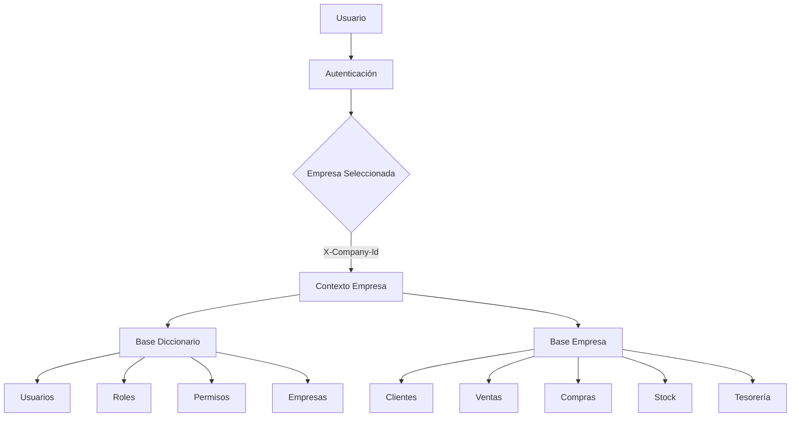
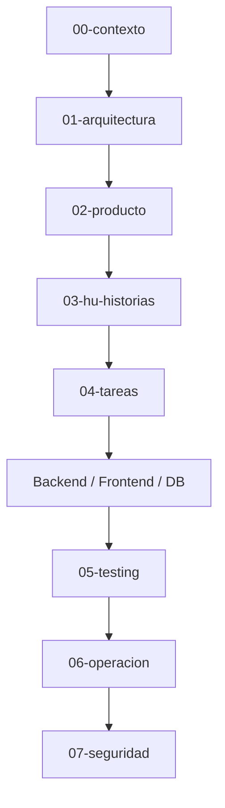
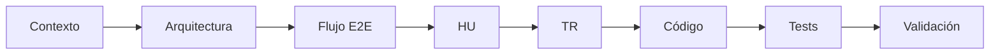
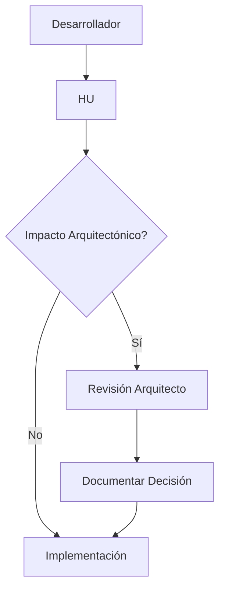

# Mapa Visual del ERP

## Propósito

Este documento permite comprender la estructura global del ERP en menos de 5 minutos.

No describe implementación.
No describe código.
Describe cómo se organiza el sistema.

---

# 1️⃣ Vista Conceptual General

# 2️⃣ Estructura Documental

# 3️⃣ Flujo de Desarrollo

Nunca se comienza en "Código".

# 4️⃣ Modelo de Gobernanza

