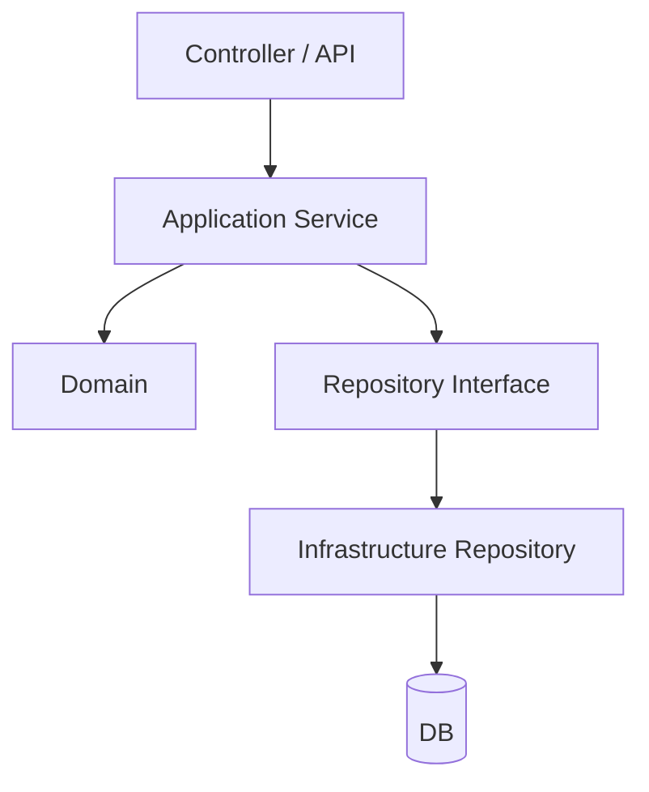
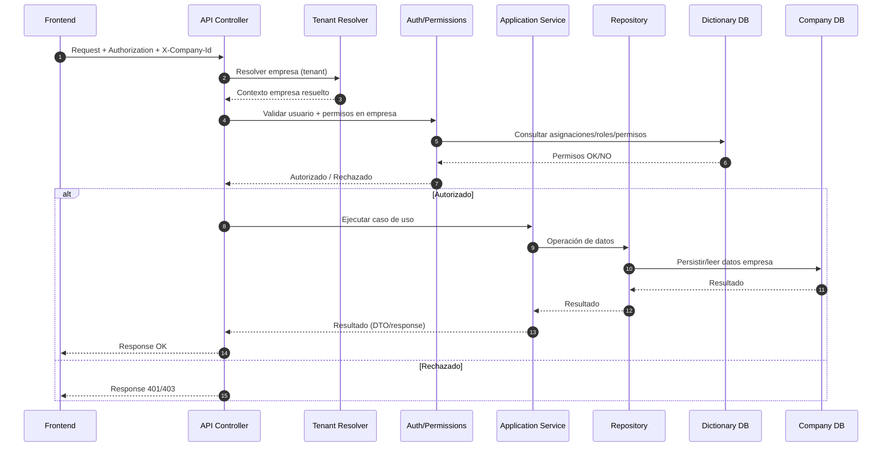
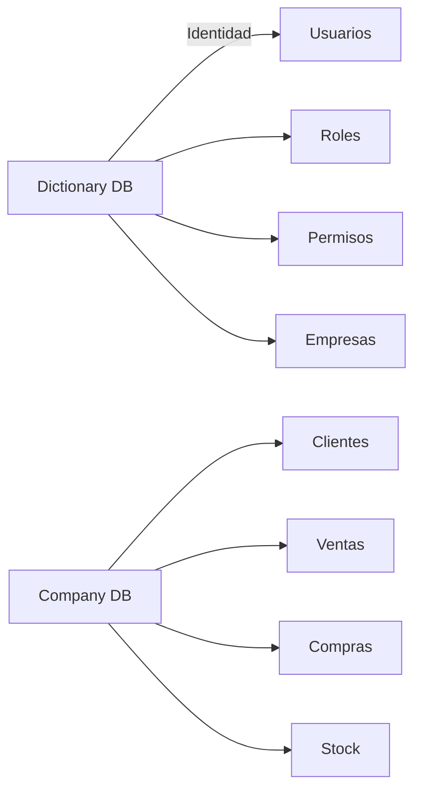
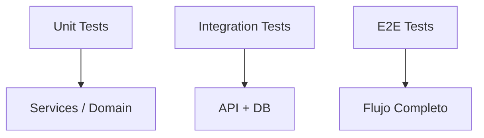

# Mapa Visual – Arquitectura Backend (ERP)

## Propósito

Permitir comprender la arquitectura backend del ERP en menos de 5 minutos.

Este documento es visual y sintético.
Para explicación detallada, ver `01-arquitectura-proyecto.md`.

---

# 1️⃣ Arquitectura por Capas

---

## 2️⃣ Flujo de Request (E2E backend)

## 3️⃣ Separación de Bases

## 4️⃣ Testing por Nivel

