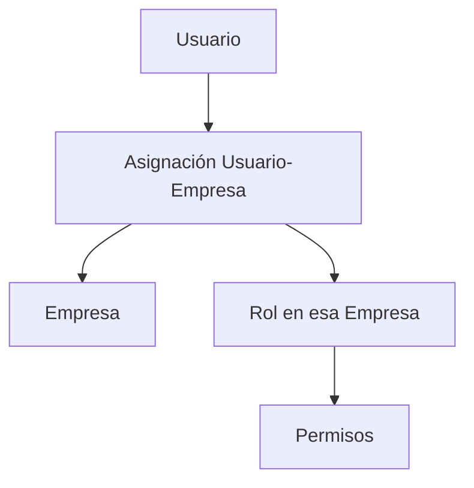
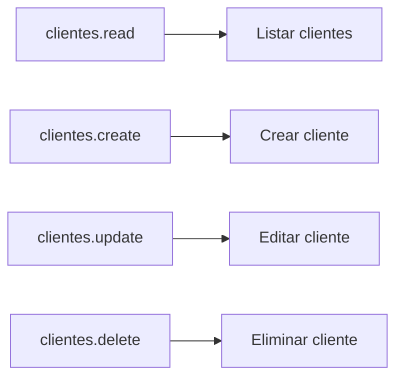
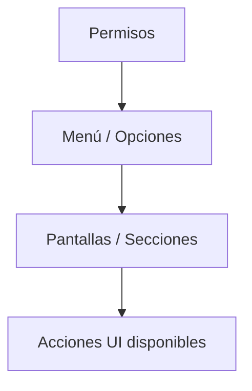
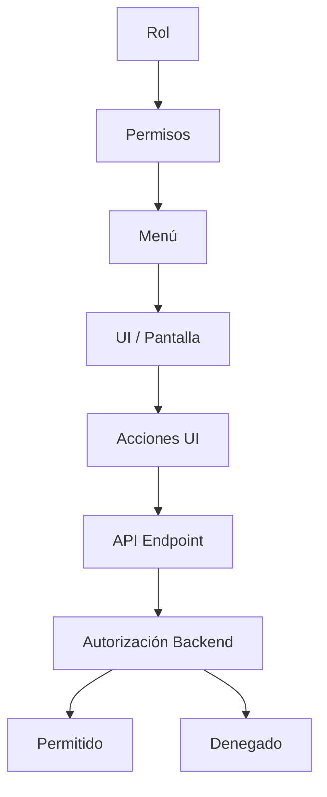

# Mapa Visual – Modelo de Seguridad (Roles → Permisos → Menú → Acciones)

## Propósito

Este documento muestra de forma visual cómo se modela y aplica la seguridad del ERP:

- Roles
- Permisos
- Menú
- Acciones (operaciones permitidas en API/UI)

Es un mapa rápido de arquitectura de seguridad.
No reemplaza especificaciones funcionales ni historias de usuario.

---

## 1) Concepto Central

La seguridad del ERP se basa en el principio:

> **Un usuario no “tiene acceso al sistema”: tiene permisos específicos sobre una empresa específica.**

La autorización se evalúa por operación.

---

## 2) Relación Visual: Usuario → Empresa → Rol → Permisos



## 3) Permisos como “Llaves de Acción”



## 4) Menú como “Vista del Sistema”, no como Seguridad

El menú es una representación navegable del sistema.
Principio:
El menú no concede permisos, solo refleja lo que el usuario podría ver según sus permisos.

Si el usuario no tiene permisos, una opción de menú no se muestra.
Pero la seguridad real siempre se valida en backend.



## 5) Cadena Completa: Roles → Permisos → Menú → Acciones → API



## 6) Validación en cada Request (Regla Innegociable)

En cada operación backend relevante:
Autenticación (token válido)
Selección de empresa (tenant X-Company-Id)
Validación de pertenencia usuario→empresa
Validación de permiso específico

```mermaid
sequenceDiagram
  autonumber
  participant FE as Frontend
  participant API as API
  participant AUTH as AuthZ
  participant DBD as Dictionary DB

  FE->>API: Request + Token + X-Company-Id
  API->>AUTH: Validar permiso requerido
  AUTH->>DBD: ¿Usuario tiene permiso en esa empresa?
  DBD-->>AUTH: Sí / No
  AUTH-->>API: Permitido / Denegado
  API-->>FE: 200 OK o 403 Forbidden
  ```  

## 7) Patrones de Permisos Recomendados

### 7.1 Permisos por Recurso + Acción (estándar)

* Formato: {recurso}.{accion}
* Ejemplos:
clientes.read
clientes.create
* Ventaja:
Escala bien
Es predecible
Se documenta fácil

### 7.2 Permisos especiales (cuando aplique)

* Ejemplos:
clientes.export
clientes.manage-credit
admin.security.manage
* Regla:
Solo cuando la acción no es un CRUD estándar.


## 8) Resumen en 60 segundos

El usuario se asigna a empresas.
En cada empresa tiene roles.
Los roles otorgan permisos.
Los permisos habilitan acciones.
El menú refleja permisos, pero no es seguridad real.
La API valida permisos en cada request.
Todo se interpreta en contexto de empresa (tenant) usando X-Company-Id.


## Regla Fundamental

El rol organiza permisos.
El permiso autoriza acciones.
La empresa es visible solo si existen permisos.
El menú refleja permisos.
La API valida permisos en cada request.

