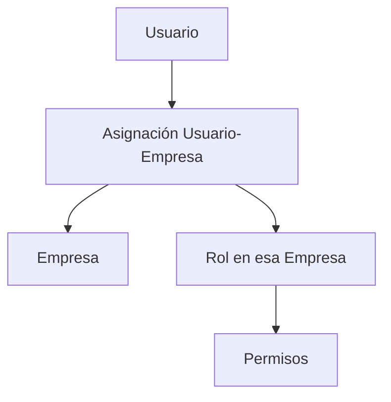
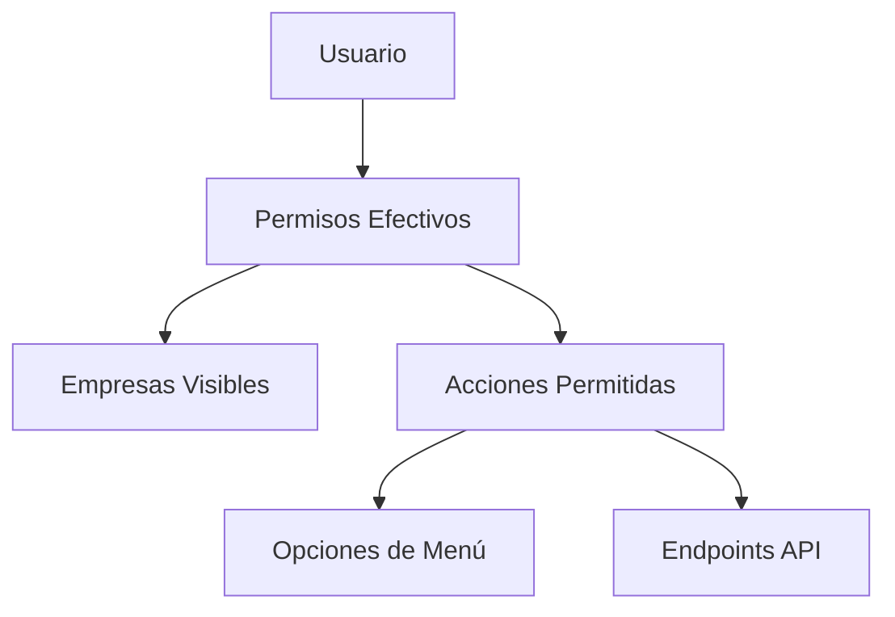
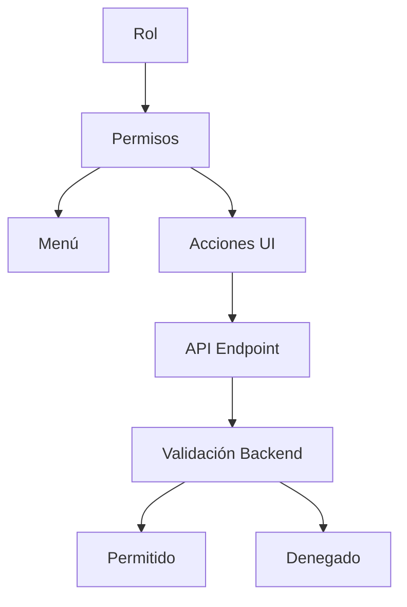
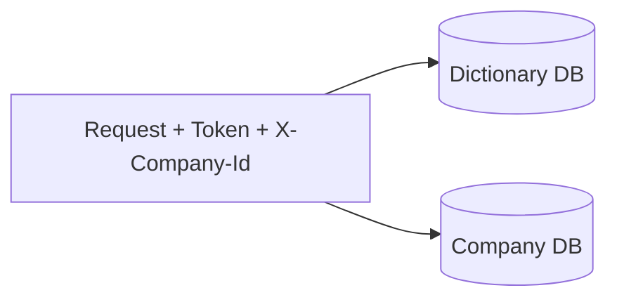
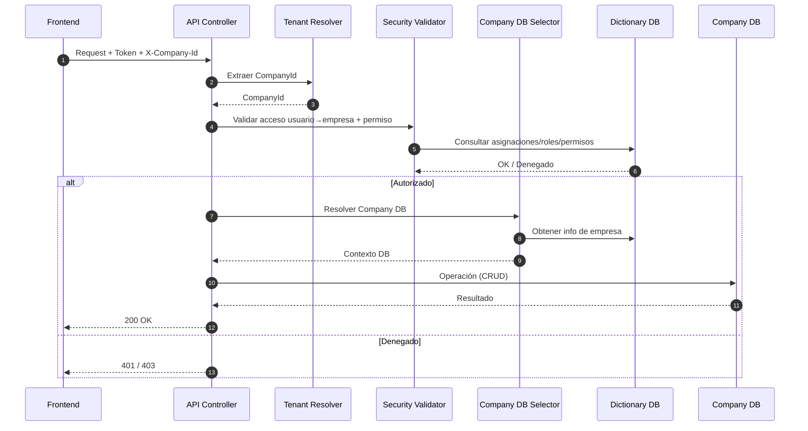
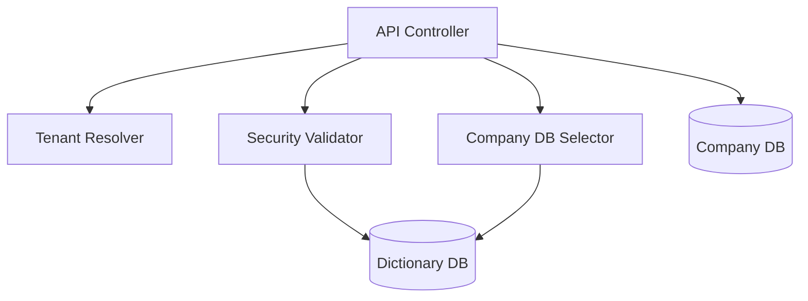
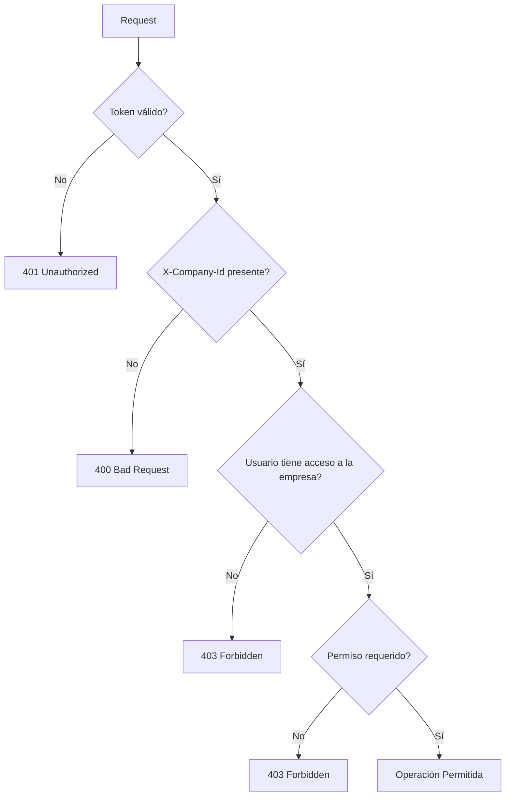
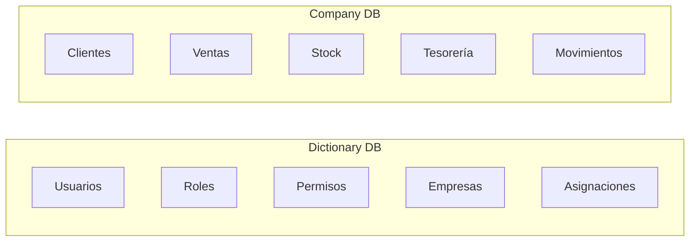

# Mapa Visual – Tenancy y Resolución de Base por Empresa
## Dictionary DB vs Company DB + Modelo de Seguridad

## Propósito

Este documento visualiza de forma integral:

- Modelo de seguridad (Roles → Permisos → Menú → Acciones)
- Tenancy multiempresa
- Separación Dictionary DB / Company DB
- Flujo completo de request
- Validaciones obligatorias
- Selección conceptual de base por empresa

Es un documento visual.
La explicación detallada se encuentra en `01-arquitectura-proyecto.md`.

---

# 1️⃣ Modelo Estructural de Seguridad

# 2️⃣ Modelo Operativo (Permisos como Nodo Central)

# 3️⃣ Roles → Permisos → Menú → API

# 4️⃣ Vista General Tenancy – Dos Contextos de Datos

* Dictionary DB → identidad, roles, permisos, empresas.
* Company DB → datos operativos de una empresa específica.

# 5️⃣ Flujo Completo de Resolución Tenancy

# 6️⃣ Componentes Conceptuales del Backend

# 7️⃣ Validación Obligatoria en Cada Request

# 8️⃣ Separación Dictionary DB vs Company DB

# 9️⃣ Principios Arquitectónicos Clave

* El tenant siempre es explícito (X-Company-Id).
* El tenant nunca es confiable sin validación.
* La autorización se valida en Dictionary DB.
* Los datos operativos viven solo en Company DB.
* Nunca se accede a Company DB sin validación previa.
* El menú refleja permisos, pero no concede seguridad.
* La API valida permisos en cada request.
* Una empresa es visible solo si el usuario tiene permisos en ella.

# 🔟 Resumen Integral en 60 Segundos

* Usuario se autentica.
* Request incluye X-Company-Id.
* Se valida usuario + empresa + permisos en Dictionary DB.
* Si autorizado:
    Se selecciona Company DB correspondiente.
    Se ejecuta operación.
* Si no:
    Se rechaza antes de tocar datos operativos.  
