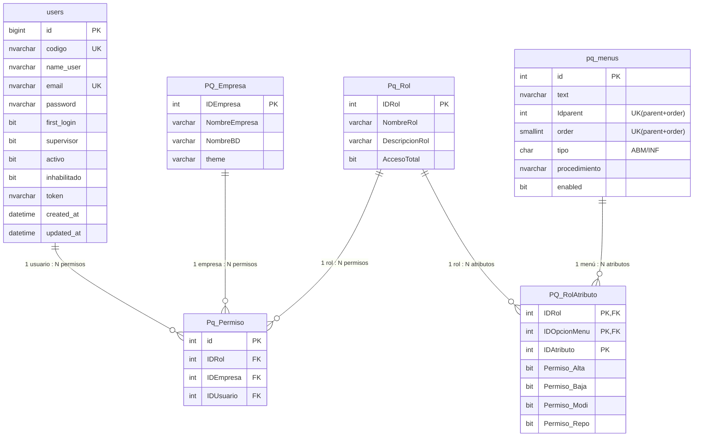
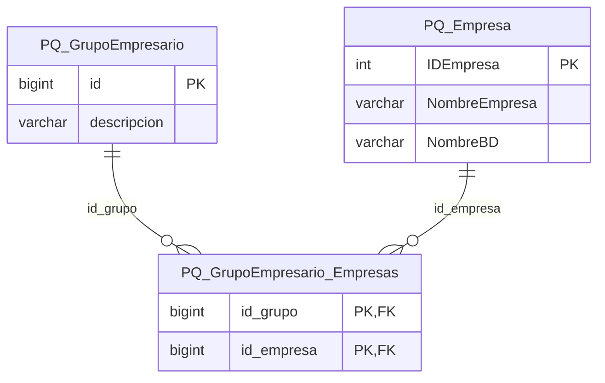
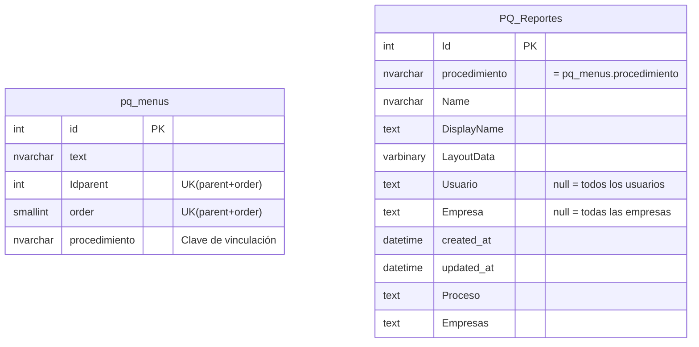
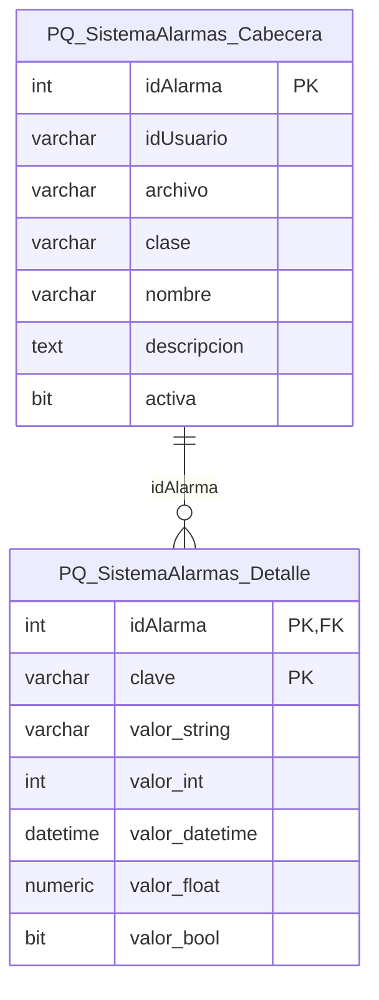
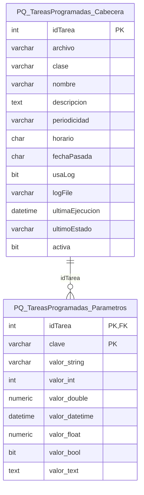

# Diagramas Mermaid – Base de Datos PQ_DICCIONARIO

Este archivo contiene los diagramas de entidad-relación en formato Mermaid para la base de datos **PQ_DICCIONARIO** (Dictionary DB).

**Origen:** Los diagramas se derivan de los comandos CREATE TABLE y las definiciones de módulos en `md-diccionario.md`.

**Archivos generados:**
- `md-diccionario.md` – Comandos SQL CREATE (sin cambios) + definiciones de módulos
- `md-diccionario-diagramas.md` – Este archivo: diagramas Mermaid

---

## 1. Diagrama general (todas las tablas)

Vista consolidada de todas las entidades del diccionario y sus relaciones.

```mermaid
erDiagram
    users {
        bigint id PK
        nvarchar codigo UK "Código único usuario"
        nvarchar name_user "Nombre y apellido"
        nvarchar email UK
        nvarchar password "Contraseña encriptada"
        bit first_login "Debe cambiar en 1er login"
        bit supervisor
        bit activo
        bit inhabilitado
        nvarchar token "Validación APIs"
        datetime created_at
        datetime updated_at
    }
    
    pq_menus {
        int id PK
        nvarchar text "Descripción en pantalla"
        bit expanded
        int Idparent "0 = rama principal, UK(parent+order)"
        smallint order "UK(parent+order)"
        char tipo "ABM / INF / ..."
        nvarchar procedimiento "Vincula APIs, reportes"
        bit enabled
        varchar routeName
        int estructura
    }
    
    PQ_Empresa {
        int IDEmpresa PK
        varchar NombreEmpresa "Nombre visual"
        varchar NombreBD "Nombre técnico BD"
        int Habilita
        varchar imagen
        varchar theme "Tema DevExtreme"
    }
    
    Pq_Rol {
        int IDRol PK
        varchar NombreRol "Código rol"
        varchar DescripcionRol
        bit AccesoTotal "Supervisor"
    }
    
    PQ_RolAtributo {
        int IDRol PK,FK
        int IDOpcionMenu PK,FK
        int IDAtributo PK
        bit Permiso_Alta
        bit Permiso_Baja
        bit Permiso_Modi
        bit Permiso_Repo
    }
    
    Pq_Permiso {
        int id PK
        int IDRol FK
        int IDEmpresa FK
        int IDUsuario FK
    }
    
    PQ_GrupoEmpresario {
        bigint id PK
        varchar descripcion
    }
    
    PQ_GrupoEmpresario_Empresas {
        bigint id_grupo PK,FK
        bigint id_empresa PK,FK
    }
    
    PQ_Reportes {
        int Id PK
        nvarchar procedimiento "Vincula pq_menus.procedimiento"
        nvarchar Name
        text DisplayName
        varbinary LayoutData
        text Usuario "null = todos"
        text Empresa "null = todas"
        datetime created_at
        datetime updated_at
        text Proceso
        text Empresas
    }
    
    PQ_SistemaAlarmas_Cabecera {
        int idAlarma PK
        varchar idUsuario
        varchar archivo
        varchar clase
        varchar nombre
        text descripcion
        bit activa
    }
    
    PQ_SistemaAlarmas_Detalle {
        int idAlarma PK,FK
        varchar clave PK
        varchar valor_string
        int valor_int
        datetime valor_datetime
        numeric valor_float
        bit valor_bool
    }
    
    PQ_TareasProgramadas_Cabecera {
        int idTarea PK
        varchar archivo
        varchar clase
        varchar nombre
        text descripcion
        varchar periodicidad
        char horario
        char fechaPasada
        bit usaLog
        varchar logFile
        datetime ultimaEjecucion
        varchar ultimoEstado
        bit activa
    }
    
    PQ_TareasProgramadas_Parametros {
        int idTarea PK,FK
        varchar clave PK
        varchar valor_string
        int valor_int
        numeric valor_double
        datetime valor_datetime
        numeric valor_float
        bit valor_bool
        text valor_text
    }
    
    users ||--o{ Pq_Permiso : "IDUsuario"
    PQ_Empresa ||--o{ Pq_Permiso : "IDEmpresa"
    Pq_Rol ||--o{ Pq_Permiso : "IDRol"
    Pq_Rol ||--o{ PQ_RolAtributo : "IDRol"
    pq_menus ||--o{ PQ_RolAtributo : "IDOpcionMenu"
    PQ_GrupoEmpresario ||--o{ PQ_GrupoEmpresario_Empresas : "id_grupo"
    PQ_Empresa ||--o{ PQ_GrupoEmpresario_Empresas : "id_empresa"
    PQ_SistemaAlarmas_Cabecera ||--o{ PQ_SistemaAlarmas_Detalle : "idAlarma"
    PQ_TareasProgramadas_Cabecera ||--o{ PQ_TareasProgramadas_Parametros : "idTarea"
```

> **Nota:** `PQ_Reportes` se vincula lógicamente a `pq_menus` mediante el campo `procedimiento` (no hay FK física).

---

## 2. Módulo SEGURIDAD

**Objetivo:** Definir autenticación, acceso a empresas y limitación de accesos por usuario en cada empresa.

**Relaciones:**
- 1 permiso → 1 usuario + 1 empresa + 1 rol
- 1 rol → varios rol atributos (1 por opción de menú)
- 1 rol atributo → 1 opción de menú

---

## 3. Módulo GRUPOS EMPRESARIOS

**Objetivo:** Definir agrupaciones de empresas para informes y procesos que integran información de diferentes bases de datos.

**Relaciones:**
- 1 grupo empresario → varios grupos empresarios empresas
- 1 grupo empresario empresa → 1 empresa

> **Nota:** En el CREATE, `id_empresa` es `bigint` mientras `PQ_Empresa.IDEmpresa` es `int`. Revisar consistencia de tipos si se implementan FKs.

---

## 4. Módulo REPORTES

**Objetivo:** Almacenar formatos, grillas, reportes y gráficos definidos por usuarios en informes o procesos con información masiva.

**Relaciones:**
- 1 opción menu.procedimiento → varios reportes (vinculación lógica por nombre, no FK)

> **Nota:** La vinculación entre `pq_menus` y `PQ_Reportes` es **lógica** mediante el campo `procedimiento` (mismo valor en ambos). No existe FK física.

---

## 5. Módulo SISTEMA ALARMAS

**Objetivo:** Almacenar procesos que se disparan al activarse determinados eventos.

**Relaciones:** Cabecera → Detalle (parámetros de la alarma).

---

## 6. Módulo TAREAS PROGRAMADAS

**Objetivo:** Almacenar procesos a ejecutar en frecuencias definidas por usuarios, con valores predefinidos y opción de proceso manual análogo.

**Relaciones:** Cabecera → Parámetros.

---

## Resumen de módulos

| Módulo | Tablas | Estado relaciones |
|--------|--------|-------------------|
| **SEGURIDAD** | users, pq_menus, PQ_Empresa, Pq_Rol, PQ_RolAtributo, Pq_Permiso | Definidas |
| **GRUPOS EMPRESARIOS** | PQ_GrupoEmpresario, PQ_GrupoEmpresario_Empresas, PQ_Empresa | Definidas |
| **REPORTES** | pq_menus, PQ_Reportes | Lógica por procedimiento |
| **SISTEMA ALARMAS** | PQ_SistemaAlarmas_Cabecera, PQ_SistemaAlarmas_Detalle | Cabecera-Detalle |
| **TAREAS PROGRAMADAS** | PQ_TareasProgramadas_Cabecera, PQ_TareasProgramadas_Parametros | Cabecera-Parámetros |
