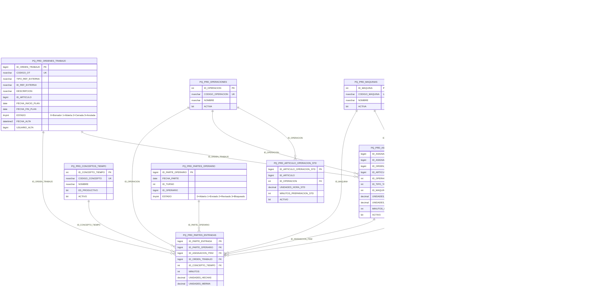

# Diagramas Mermaid – Base de Datos PQ_PRD (Partes Producción)

Este archivo contiene los diagramas de entidad-relación en formato Mermaid para la base de datos **PQ_PRD** (Company DB – Gestión de Tareas + Eficiencia Operaria).

**Origen:** Los diagramas se derivan del modelo propuesto en `docs/_projects/PartesProduccion/modelo-datos-propuesto.md`.

**Archivos relacionados:**
- `md-partes-produccion.md` – Comandos SQL CREATE + definiciones de módulos
- `md-partes-produccion-diagramas.md` – Este archivo: diagramas Mermaid

---

## 1. Diagrama general (todas las tablas)

Vista consolidada de todas las entidades del módulo PQ_PRD.

---

## 2. Módulo CATÁLOGOS / MAESTROS

**Objetivo:** Órdenes de trabajo, operaciones, estándares artículo-operación, máquinas, tipos de tarea, conceptos de tiempo y turnos.

---

## 3. Módulo PLANIFICACIÓN (ASIGNACIÓN)

**Objetivo:** Planificar asignaciones por fecha/turno con items y operarios asignados.

**Relaciones:**
- 1 asignación → varios items
- 1 item → varios operarios asignados

---

## 4. Módulo EJECUCIÓN (PARTE REAL)

**Objetivo:** Registrar parte por operario y entradas de trabajo (tiempo, concepto, unidades).

**Relaciones:**
- 1 parte operario → varias entradas
- Entrada puede vincularse a item de asignación o ser libre

---

## Resumen de módulos

| Módulo | Tablas | Estado relaciones |
|--------|--------|-------------------|
| **CATÁLOGOS** | PQ_PRD_ORDENES_TRABAJO, PQ_PRD_OPERACIONES, PQ_PRD_ARTICULO_OPERACION_STD, PQ_PRD_MAQUINAS, PQ_PRD_TIPOS_TAREA, PQ_PRD_CONCEPTOS_TIEMPO, PQ_PRD_TURNOS | Definidas |
| **PLANIFICACIÓN** | PQ_PRD_ASIGNACIONES, PQ_PRD_ASIGNACIONES_ITEMS, PQ_PRD_ASIGNACIONES_ITEMS_OPERARIOS | Cabecera-Detalle |
| **EJECUCIÓN** | PQ_PRD_PARTES_OPERARIO, PQ_PRD_PARTES_ENTRADAS | Cabecera-Detalle |
| **VISTAS** | PQ_PRD_VW_EFICIENCIA_POR_ENTRADA, PQ_PRD_VW_EFICIENCIA_DIARIA_OPERARIO | Analíticas (no persistidas) |
