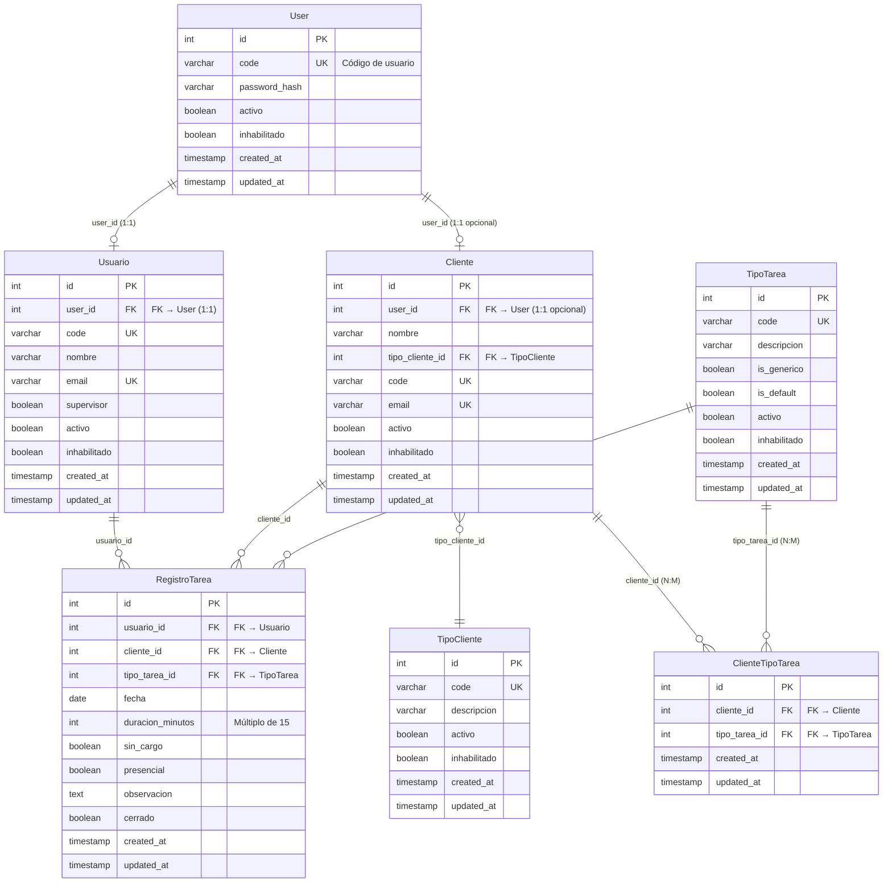

# Modelo de Datos – MVP

## Diagrama de Relaciones



> **Leyenda del diagrama:**
> - `||--o|` = Relación 1:1 opcional (uno a cero o uno)
> - `||--o{` = Relación 1:N (uno a muchos)
> - `}o--||` = Relación N:1 (muchos a uno)
> - `}o--o{` = Relación N:M (muchos a muchos, a través de tabla intermedia)
> 
> **Nota:** La tabla `User` es la única tabla sin prefijo `PQ_PARTES_` (tabla de autenticación centralizada).

---

## Entidades principales

### User (Tabla de Autenticación)
**Tabla física:** `USERS` (sin prefijo PQ_PARTES_)

- id (PK)
- code (único, obligatorio) - Código de usuario para autenticación
- password_hash (obligatorio) - Hash de contraseña
- activo (boolean, default: true)
- inhabilitado (boolean, default: false) - Indica si el usuario está inhabilitado
- created_at
- updated_at

**Nota:** Esta es la única tabla que NO utiliza el prefijo `PQ_PARTES_`. Es la tabla central de autenticación del sistema. Después de un login exitoso, se determina si el `User` corresponde a un Cliente (tabla `PQ_PARTES_CLIENTES`) o a un Usuario (tabla `PQ_PARTES_USUARIOS`).

**Flujo de autenticación:**
1. Login se valida contra la tabla `USERS` usando `code` y `password_hash`
2. Si el login es exitoso, se busca el `User.code` en:
   - Tabla `PQ_PARTES_CLIENTES` (campo `code`)
   - Tabla `PQ_PARTES_USUARIOS` (campo `code`) - para empleados
3. Se determina el tipo de usuario (cliente o empleado)
4. Si es empleado, se verifica si es supervisor (campo `supervisor` en `PQ_PARTES_USUARIOS`)
5. Los siguientes valores se conservan durante todo el ciclo del proceso:
   - **Tipo de usuario:** `"cliente"` o `"empleado"`
   - **User.Code:** Código del usuario autenticado
   - **ID del cliente/empleado:** ID del registro en `PQ_PARTES_CLIENTES` o `PQ_PARTES_USUARIOS`
   - **Es supervisor:** `false` para clientes, valor de `supervisor` para empleados

---

### Empleado
**Tabla física:** `PQ_PARTES_USUARIOS`

- id (PK)
- user_id (FK → User, obligatorio, único) - Referencia a la tabla USERS
- code (único, obligatorio) - Código de empleado (debe coincidir con User.code)
- nombre (obligatorio)
- email (único, opcional)
- supervisor (boolean, default: false) - Indica si el empleado es supervisor
- activo (boolean, default: true)
- inhabilitado (boolean, default: false) - Indica si el empleado está inhabilitado
- created_at
- updated_at

**Nota:** Representa a los empleados que cargan las tareas al sistema. Cada registro debe tener una relación 1:1 con la tabla `USERS` a través del campo `code`.

**Permisos según tipo de empleado:**
- **Empleado normal (`supervisor = false`):** Puede crear, editar y eliminar solo sus propias tareas. Solo ve sus propias tareas.
- **Supervisor (`supervisor = true`):** Puede ver todas las tareas de todos los empleados. Puede crear, editar y eliminar tareas de cualquier empleado. Al crear una tarea, puede seleccionar el empleado (por defecto aparece él mismo).

---

### Cliente
**Tabla física:** `PQ_PARTES_CLIENTES`

- id (PK)
- user_id (FK → User, opcional, único) - Referencia a la tabla USERS (si el cliente tiene acceso al sistema)
- nombre (obligatorio) - Descripción/nombre del cliente
- tipo_cliente_id (FK → TipoCliente, obligatorio)
- code (único, obligatorio) - Código del cliente (debe coincidir con User.code si tiene user_id)
- email (único, opcional) - Email del cliente
- activo (boolean, default: true)
- inhabilitado (boolean, default: false) - Indica si el cliente está inhabilitado
- created_at
- updated_at

**Nota:** Representa a los clientes para los cuales se registran tareas. Si un cliente tiene `user_id` (relación con `USERS`), puede autenticarse y consultar las tareas relacionadas con ellos (solo lectura). El campo `code` del cliente debe coincidir con el `code` del `User` asociado.

---

### TipoTarea
- id (PK)
- code (único, obligatorio) - Código del tipo de tarea
- descripcion (obligatorio)
- is_generico (boolean) - Indica si el tipo de tarea es genérico (disponible para todos los clientes)
- is_default (boolean) - Indica si este tipo de tarea es el predeterminado del sistema
- activo
- inhabilitado (boolean, default: false) - Indica si el tipo de tarea está inhabilitado

---

### RegistroTarea
- id (PK)
- usuario_id (FK → Usuario)
- cliente_id (FK → Cliente)
- tipo_tarea_id (FK → TipoTarea)
- fecha
- duracion_minutos
- sin_cargo (boolean, default: false) - Indica si la tarea es sin cargo para el cliente
- presencial (boolean, default: false) - Indica si la tarea es presencial (en el cliente)
- observacion (obligatorio) - Descripción de la tarea
- cerrado (boolean, default: false) - Indica si la tarea está cerrada (no se puede modificar ni eliminar)
- created_at
- updated_at

---

### TipoCliente
- id (PK)
- code (único, obligatorio) - Código del tipo de cliente
- descripcion (obligatorio)
- activo
- inhabilitado (boolean, default: false) - Indica si el tipo de cliente está inhabilitado
- created_at
- updated_at

**Nota:** Catálogo de tipos de cliente (ej: "Corporativo", "PyME", "Startup", "Gobierno", etc.)

---

### ClienteTipoTarea (Tabla de asociación)
- id (PK)
- cliente_id (FK → Cliente)
- tipo_tarea_id (FK → TipoTarea)
- created_at
- updated_at

**Nota:** Relación muchos-a-muchos entre Cliente y TipoTarea. Permite asignar tipos de tarea específicos a clientes (cuando el tipo NO es genérico).

## Relaciones
- **User 1 → 0..1 Usuario** (user_id en PQ_PARTES_USUARIOS, relación 1:1)
- **User 1 → 0..1 Cliente** (user_id en PQ_PARTES_CLIENTES, relación 1:1 opcional)
- **Usuario 1 → N RegistroTarea** (usuario_id en PQ_PARTES_REGISTRO_TAREA)
- **Cliente 1 → N RegistroTarea** (cliente_id en PQ_PARTES_REGISTRO_TAREA)
- **Cliente N → 1 TipoCliente** (tipo_cliente_id, obligatorio)
- **TipoCliente 1 → N Cliente**
- **TipoTarea 1 → N RegistroTarea**
- **Cliente N → M TipoTarea** (a través de ClienteTipoTarea)

---

## Restricciones
- duracion_minutos > 0 y debe ser múltiplo de 15 (tramos de 15 minutos: 15, 30, 45, 60, ..., 1440)
- duracion_minutos <= 1440 (máximo 24 horas)
- fecha ≤ fecha actual (advertencia si es futura, no bloquea)
- observacion no puede estar vacía (obligatorio)
- **Permisos de usuario normal (`supervisor = false`):**
  - Solo puede modificar (crear/editar/eliminar) sus propios registros
  - Solo puede ver sus propias tareas
- **Permisos de supervisor (`supervisor = true`):**
  - Puede ver todas las tareas de todos los usuarios
  - Puede crear, editar y eliminar tareas de cualquier usuario
  - Al crear una tarea, puede seleccionar el usuario (por defecto aparece él mismo)
- El cliente solo puede consultar (lectura) las tareas donde `cliente_id` coincide con su `id`
- `tipo_cliente_id` en `Cliente` es obligatorio (NOT NULL)
- `code` en `Cliente` es obligatorio (NOT NULL)
- `code` en `Usuario` es obligatorio (NOT NULL)
- `user_id` en `Usuario` es obligatorio (NOT NULL) y único
- `user_id` en `Cliente` es opcional pero si existe debe ser único
- Si un `Cliente` tiene `user_id`, su `code` debe coincidir con `User.code`
- Si un `Usuario` tiene `user_id`, su `code` debe coincidir con `User.code`
- Un `User.code` solo puede estar asociado a un `Cliente` O a un `Usuario`, no a ambos
- **Tarea cerrada:** Una tarea con `cerrado = true` no se puede modificar ni eliminar
- **Validaciones de estado:** Todas las validaciones que verifican `activo = true` también deben verificar `inhabilitado = false`:
  - **User** debe estar activo y no inhabilitado para autenticarse
  - **Usuario** (PQ_PARTES_USUARIOS) debe estar activo y no inhabilitado para crear/editar tareas
  - **Cliente** debe estar activo y no inhabilitado para crear/editar tareas
  - TipoTarea debe estar activo y no inhabilitado para crear/editar tareas
  - TipoCliente debe estar activo y no inhabilitado para listar
- **Regla de tipo de tarea por defecto:** Solo puede haber un TipoTarea con `is_default = true` en todo el sistema, y si `is_default = true` entonces `is_generico = true` (forzado)
- **Regla de cliente:** Al crear/actualizar un cliente, debe existir al menos un tipo de tarea genérico O el cliente debe tener al menos un tipo de tarea asignado
- **Integridad referencial:** No se puede eliminar Cliente, Usuario, TipoTarea o TipoCliente si están referenciados en otras tablas

---

## Flujo de Autenticación y Valores de Sesión

### Proceso de Login

1. **Validación inicial:**
   - El usuario envía `code` y `password` al endpoint `/api/v1/auth/login`
   - Se busca en la tabla `USERS` un registro con `code` coincidente
   - Se verifica que `activo = true` y `inhabilitado = false`
   - Se valida la contraseña usando `Hash::check($password, $user->password_hash)`

2. **Determinación del tipo de usuario:**
   - Si el login es exitoso, se busca el `User.code` en:
     - **Tabla `PQ_PARTES_CLIENTES`:** Buscar registro donde `code = User.code`
     - **Tabla `PQ_PARTES_USUARIOS`:** Buscar registro donde `code = User.code`
   - Se determina el tipo de usuario:
     - Si existe en `PQ_PARTES_CLIENTES` → `tipo_usuario = "cliente"`
     - Si existe en `PQ_PARTES_USUARIOS` → `tipo_usuario = "usuario"`
   - **Regla:** Un `User.code` solo puede estar asociado a un Cliente O a un Usuario, no a ambos

3. **Obtención de datos adicionales:**
   - Si `tipo_usuario = "cliente"`:
     - Obtener `cliente_id` del registro en `PQ_PARTES_CLIENTES`
     - `es_supervisor = false` (siempre)
   - Si `tipo_usuario = "usuario"`:
     - Obtener `usuario_id` del registro en `PQ_PARTES_USUARIOS`
     - Obtener `supervisor` del registro en `PQ_PARTES_USUARIOS`
     - `es_supervisor = supervisor` (valor del campo)

4. **Generación del token:**
   - Se genera un token Sanctum asociado al `User.id`
   - El token debe incluir en sus claims/metadata (o en la respuesta inicial) los siguientes valores

### Valores a Conservar Durante el Ciclo del Proceso

Los siguientes valores **DEBEN** conservarse durante todo el ciclo del proceso (desde el login hasta el logout) y estar disponibles en cada request autenticado:

| Campo | Tipo | Descripción | Valores Posibles |
|-------|------|-------------|------------------|
| `tipo_usuario` | string | Tipo de usuario autenticado | `"cliente"` o `"usuario"` |
| `user_code` | string | Código del usuario autenticado | Valor de `User.code` |
| `user_id` | integer | ID del registro en tabla USERS | Valor de `User.id` |
| `cliente_id` | integer \| null | ID del cliente (si tipo_usuario = "cliente") | ID de `PQ_PARTES_CLIENTES.id` o `null` |
| `usuario_id` | integer \| null | ID del usuario (si tipo_usuario = "usuario") | ID de `PQ_PARTES_USUARIOS.id` o `null` |
| `es_supervisor` | boolean | Indica si es supervisor | `false` para clientes, valor de `supervisor` para usuarios |

**Forma de conservación:**
- Estos valores pueden almacenarse en:
  - Claims del token JWT (si se usa JWT)
  - Metadata del token Sanctum
  - Sesión del servidor (si se usa sesión)
  - Cache con clave basada en el token
- Deben estar disponibles en el middleware de autenticación para uso en controladores y policies

**Ejemplo de estructura en respuesta de login:**
```json
{
  "error": 0,
  "respuesta": "Autenticación exitosa",
  "resultado": {
    "token": "1|abcdef1234567890...",
    "user": {
      "user_id": 1,
      "user_code": "JPEREZ",
      "tipo_usuario": "usuario",
      "usuario_id": 5,
      "cliente_id": null,
      "es_supervisor": false,
      "nombre": "Juan Pérez",
      "email": "juan.perez@ejemplo.com"
    }
  }
}
```

---

## Decisiones de diseño
- No se implementa facturación en el MVP.
- El modelo prioriza simplicidad y trazabilidad.
- **Normalización de base de datos:** El modelo de datos debe cumplir con la **Tercera Forma Normal (3NF)** como mínimo. Esto implica:
  - **1NF (Primera Forma Normal):** Todos los campos son atómicos (sin grupos repetitivos). Cada campo contiene un solo valor.
  - **2NF (Segunda Forma Normal):** No hay dependencias parciales. Todos los atributos no clave dependen completamente de la clave primaria.
  - **3NF (Tercera Forma Normal):** No hay dependencias transitivas. Los atributos no clave dependen directamente de la clave primaria, no de otros atributos no clave.
  - **Justificación:** La normalización 3NF elimina redundancia de datos, reduce anomalías de inserción/actualización/eliminación, y facilita el mantenimiento y la integridad de los datos.
  - **Excepciones:** Cualquier desnormalización intencional debe estar documentada y justificada por razones de performance o funcionalidad específica del negocio.
- **Autenticación centralizada:** La tabla `USERS` (sin prefijo PQ_PARTES_) es la única tabla de autenticación del sistema. Todos los logins se validan contra esta tabla.
- **Flujo de autenticación:**
  1. Login se valida contra `USERS` usando `code` y `password_hash`
  2. Si el login es exitoso, se busca el `User.code` en:
     - `PQ_PARTES_CLIENTES.code` → Tipo: "cliente"
     - `PQ_PARTES_USUARIOS.code` → Tipo: "usuario"
  3. Se determina el tipo de usuario y se obtienen los datos correspondientes
  4. Si es usuario, se verifica `supervisor` en `PQ_PARTES_USUARIOS`
  5. Los siguientes valores se conservan durante todo el ciclo del proceso (en el token/sesión):
     - **tipo_usuario:** `"cliente"` o `"usuario"`
     - **user_code:** Código del usuario autenticado (User.code)
     - **cliente_id:** ID del cliente (si tipo_usuario = "cliente", null si es "usuario")
     - **usuario_id:** ID del usuario (si tipo_usuario = "usuario", null si es "cliente")
     - **es_supervisor:** `false` para clientes, valor de `supervisor` para usuarios
- **Autenticación dual:** Los empleados (tabla `PQ_PARTES_USUARIOS`) y los clientes (tabla `PQ_PARTES_CLIENTES`) pueden autenticarse, pero con permisos diferentes:
  - **Empleados:** Pueden crear, editar y eliminar tareas
  - **Clientes:** Solo pueden consultar (lectura) las tareas donde son el cliente asociado
- **Rol de Supervisor:** Los usuarios con `supervisor = true` tienen permisos ampliados:
  - Pueden ver todas las tareas de todos los usuarios
  - Pueden crear, editar y eliminar tareas de cualquier usuario
  - Al crear una tarea, pueden seleccionar el usuario propietario (por defecto aparece él mismo)

## Notas sobre campos de TipoTarea

### is_generico (genérico)
- **Significado:** Indica si el tipo de tarea está disponible para todos los clientes del sistema.
- **Valor `true`:** El tipo de tarea es genérico y puede ser usado por cualquier cliente.
- **Valor `false`:** El tipo de tarea es específico y solo está disponible para clientes que tengan una asociación explícita en la tabla `ClienteTipoTarea`.
- **Reglas de negocio (pendientes):** 
  - TODO: Implementar regla de visibilidad al crear tarea (mostrar genéricos + asociados al cliente). SI

### is_default (porDefecto)
- **Significado:** Indica si este tipo de tarea es el predeterminado del sistema.
- **Valor `true`:** Este tipo de tarea se considera el predeterminado.
- **Valor `false`:** Este tipo de tarea no es el predeterminado.
- **Reglas de negocio (pendientes):**
  - TODO: Implementar regla que solo un TipoTarea puede tener `is_default = true` en todo el sistema.
