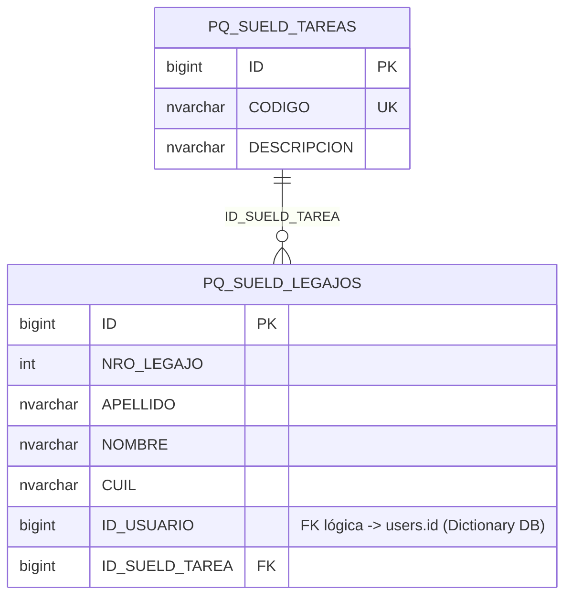
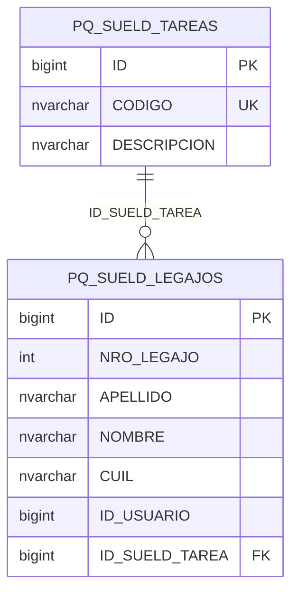

# Diagramas Mermaid – Base de Datos PQ_SUELD (Sueldos / Legajos)

Este archivo contiene los diagramas de entidad-relación en formato Mermaid para la base de datos **PQ_SUELD** (Company DB – Catálogo de tareas y legajos).

**Origen:** Los diagramas se derivan del modelo en `docs/modelo-datos/md-empresas/md-sueldos.md`.

**Archivos relacionados:**
- `md-sueldos.md` – Comandos SQL CREATE + definiciones de módulos
- `md-sueldos-diagramas.md` – Este archivo: diagramas Mermaid

---

## 1. Diagrama general (todas las tablas)

Vista consolidada de todas las entidades del módulo PQ_SUELD.

---

## 2. Módulo CATÁLOGOS / MAESTROS

**Objetivo:** Catálogo de tareas (PQ_SUELD_TAREAS) y legajos/operarios (PQ_SUELD_LEGAJOS) para uso en módulos como Partes Producción.

**Relaciones:**
- 1 tarea → varios legajos (cada legajo tiene una tarea asignada)

---

## Resumen de módulos

| Módulo | Tablas | Estado relaciones |
|--------|--------|-------------------|
| **CATÁLOGOS** | PQ_SUELD_TAREAS, PQ_SUELD_LEGAJOS | Definidas |
