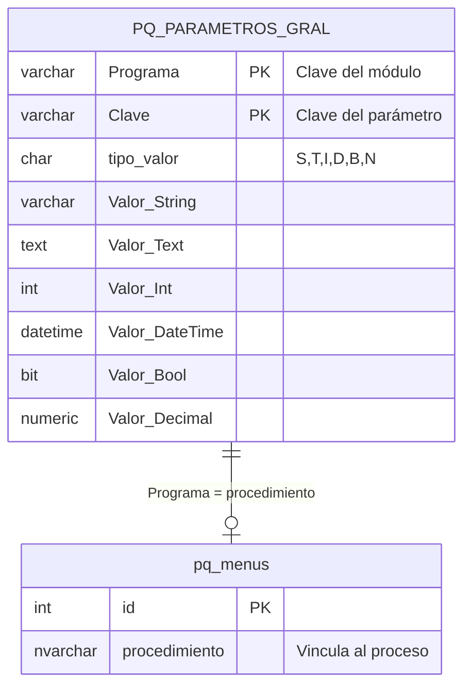

# PQ_PARAMETROS_GRAL – Parámetros generales por módulo

**Contexto:** Ver `docs/00-contexto/05-parametros-generales.md` para el objetivo y reglas de uso.

**Ubicación:** Esta tabla se crea en la **base de datos de cada empresa** (Company DB), **no** en el diccionario (PQ_DICCIONARIO). Cada empresa tiene su propia instancia de esta tabla.

Almacena valores configurables por módulo. Cada módulo define sus claves en la HU de parámetros; el proceso de mantenimiento (HU-007) permite solo editar valores, no agregar ni eliminar registros.

---

## CREATE TABLE (SQL Server) – Company DB

```sql
CREATE TABLE [dbo].[PQ_PARAMETROS_GRAL](
	[Programa] [varchar](50) NOT NULL,					-- Clave del módulo (ej. PartesProduccion, Ventas)
	[Clave] [varchar](50) NOT NULL,						-- Clave del parámetro dentro del módulo
	[tipo_valor] [char](1) NULL,							-- S=String, T=Text, I=Int, D=DateTime, B=Bool, N=Decimal
	[Valor_String] [varchar](255) NULL,
	[Valor_Text] [text] NULL,
	[Valor_Int] [int] NULL,
	[Valor_DateTime] [datetime] NULL,
	[Valor_Bool] [bit] NULL,
	[Valor_Decimal] [numeric](24, 6) NULL,
 CONSTRAINT [PK_PQ_PARAMETROS_GRAL] PRIMARY KEY CLUSTERED 
(
	[Programa] ASC,
	[Clave] ASC
) WITH (PAD_INDEX = OFF, STATISTICS_NORECOMPUTE = OFF, IGNORE_DUP_KEY = OFF, 
  ALLOW_ROW_LOCKS = ON, ALLOW_PAGE_LOCKS = ON, OPTIMIZE_FOR_SEQUENTIAL_KEY = OFF) ON [PRIMARY]
) ON [PRIMARY] TEXTIMAGE_ON [PRIMARY]
GO
```

---

## Diagrama ER



> **Nota:** `pq_menus` está en el diccionario; la relación es lógica (Programa = procedimiento).

---

## Mapeo tipo_valor → columna

| tipo_valor | Columna        | Tipo SQL     |
|------------|----------------|--------------|
| S          | Valor_String   | varchar(255) |
| T          | Valor_Text     | text         |
| I          | Valor_Int      | int          |
| D          | Valor_DateTime | datetime     |
| B          | Valor_Bool     | bit          |
| N          | Valor_Decimal  | numeric(24,6)|

---

## Referencias

- `docs/00-contexto/05-parametros-generales.md` – Objetivo y reglas
- `docs/03-hu-historias/000-Generalidades/HU-007-Parametros-generales.md` – HU del proceso general
