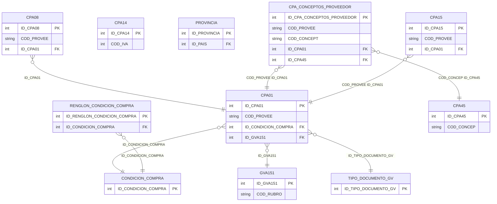

# Diseño de Tablas – Módulo Compras / Proveedores

Documentación del diseño y tablas del módulo de compras y proveedores. Incluye maestro de proveedores (CPA01), condiciones de compra, retenciones/exenciones (CPA08), impuestos IVA (CPA14), rubros (GVA151), provincias y tipos de documento.

**Tablas:** CPA01, CONDICION_COMPRA, CPA08, CPA14, GVA151, PROVINCIA, RENGLON_CONDICION_COMPRA, TIPO_DOCUMENTO_GV, CPA_CONCEPTOS_PROVEEDOR, CPA15

**Tabla externa:** CPA45 (conceptos de compra, vinculada por COD_CONCEP / ID_CPA45)

---

## Dependencias previas

Para ejecutar los scripts CREATE, deben existir:

- Tipos de usuario (UDT): D_ID, D_DESCRIPCION, D_COD_ANSES, D_IMPORTE_DGI, ENTERO_TG, DECIMAL_TG, ENTEROXL_TG, y tipos XML (CAMPOS_ADICIONALES_*).
- Tablas: PAIS (referenciada por PROVINCIA), CPA45 (conceptos de compra, maestra de conceptos).
- Esquemas XML para CAMPOS_ADICIONALES y tablas auxiliares.

---

## 1. Crear tipos de usuario (si no existen)

```sql
-- Tipos base usados en módulo compras/proveedores
CREATE TYPE dbo.D_ID FROM int;
CREATE TYPE dbo.D_DESCRIPCION FROM varchar(60);
CREATE TYPE dbo.D_COD_ANSES FROM varchar(6);
CREATE TYPE dbo.D_IMPORTE_DGI FROM decimal(22,7);
CREATE TYPE dbo.ENTERO_TG FROM int;
CREATE TYPE dbo.DECIMAL_TG FROM decimal(22,7);
CREATE TYPE dbo.ENTEROXL_TG FROM float;
```

---

## 2. Secuencias

```sql
CREATE SEQUENCE dbo.SEQUENCE_CPA01
    AS int START WITH 1 INCREMENT BY 1
    MINVALUE -9223372036854775808 MAXVALUE 9223372036854775807 NO CYCLE;

CREATE SEQUENCE dbo.SEQUENCE_CONDICION_COMPRA
    AS int START WITH 1 INCREMENT BY 1
    MINVALUE -9223372036854775808 MAXVALUE 9223372036854775807 NO CYCLE;

CREATE SEQUENCE dbo.SEQUENCE_CPA08
    AS int START WITH 1 INCREMENT BY 1
    MINVALUE -9223372036854775808 MAXVALUE 9223372036854775807 NO CYCLE;

CREATE SEQUENCE dbo.SEQUENCE_CPA14
    AS int START WITH 1 INCREMENT BY 1
    MINVALUE -9223372036854775808 MAXVALUE 9223372036854775807 NO CYCLE;

CREATE SEQUENCE dbo.SEQUENCE_GVA151
    AS int START WITH 1 INCREMENT BY 1
    MINVALUE -9223372036854775808 MAXVALUE 9223372036854775807 NO CYCLE;

CREATE SEQUENCE dbo.SEQUENCE_PROVINCIA
    AS int START WITH 1 INCREMENT BY 1
    MINVALUE -9223372036854775808 MAXVALUE 9223372036854775807 NO CYCLE;

CREATE SEQUENCE dbo.SEQUENCE_RENGLON_CONDICION_COMPRA
    AS int START WITH 1 INCREMENT BY 1
    MINVALUE -9223372036854775808 MAXVALUE 9223372036854775807 NO CYCLE;

CREATE SEQUENCE dbo.SEQUENCE_TIPO_DOCUMENTO_GV
    AS int START WITH 1 INCREMENT BY 1
    MINVALUE -9223372036854775808 MAXVALUE 9223372036854775807 NO CYCLE;

CREATE SEQUENCE dbo.SEQUENCE_CPA_CONCEPTOS_PROVEEDOR
    AS int START WITH 1 INCREMENT BY 1
    MINVALUE -9223372036854775808 MAXVALUE 9223372036854775807 NO CYCLE;

CREATE SEQUENCE dbo.SEQUENCE_CPA15
    AS int START WITH 1 INCREMENT BY 1
    MINVALUE -9223372036854775808 MAXVALUE 9223372036854775807 NO CYCLE;
```

---

## 3. Mapeo de tipos UDT a tipos base

| UDT           | Tipo base     | Notas            |
|---------------|---------------|------------------|
| D_ID          | int           | Identificadores  |
| D_DESCRIPCION | varchar(60)   | Descripciones    |
| D_COD_ANSES   | varchar(6)    | Código ANSES     |
| D_IMPORTE_DGI | decimal(22,7) | Importes DGI     |
| ENTERO_TG     | int           | Enteros          |
| DECIMAL_TG    | decimal(22,7) | Importes, %      |
| ENTEROXL_TG   | float         | Números internos |

---

## 4. Diagrama ER (Mermaid)



---

## 5. Resumen de tablas

| Tabla | PK | Descripción |
|-------|-----|-------------|
| CPA01 | ID_CPA01 | Maestro de proveedores |
| CONDICION_COMPRA | ID_CONDICION_COMPRA | Condiciones de compra |
| CPA08 | ID_CPA08 | Exenciones/retenciones por proveedor |
| CPA14 | ID_CPA14 | Impuestos IVA compras |
| GVA151 | ID_GVA151 | Rubros (ventas/compras) |
| PROVINCIA | ID_PROVINCIA | Provincias |
| RENGLON_CONDICION_COMPRA | ID_RENGLON_CONDICION_COMPRA | Renglones de condiciones de compra |
| TIPO_DOCUMENTO_GV | ID_TIPO_DOCUMENTO_GV | Tipos de documento |
| CPA_CONCEPTOS_PROVEEDOR | ID_CPA_CONCEPTOS_PROVEEDOR | Conceptos por proveedor (vincula CPA01 y CPA45) |
| CPA15 | ID_CPA15 | Artículos por proveedor |

---

## 6. Diagrama de relaciones (ASCII)

```
                    CPA01 (Proveedores)
                         │
    ┌────────┬───────────┼───────────┬────────┬────────┬──────────────────┬──────┐
    ▼        ▼           ▼           ▼        ▼        ▼                  ▼      ▼
CONDICION  CPA08      CPA14      GVA151  TIPO_DOC  PROVINCIA   CPA_CONCEPTOS  CPA15
 COMPRA    (reten.)  (IVA CP)    (rubros)    GV      (ID_PAIS)   PROVEEDOR   (art/prov)
    │                                                      │
    └── RENGLON_COND ──────────────────────────────────────┴──► CPA45 (COD_CONCEP)
```

---

## Relaciones con tablas externas

| Tabla origen | Tabla destino | Columna(s) enlace |
|--------------|--------------|-------------------|
| CPA_CONCEPTOS_PROVEEDOR | CPA01 | COD_PROVEE, ID_CPA01 |
| CPA_CONCEPTOS_PROVEEDOR | CPA45 | COD_CONCEP, ID_CPA45 |
| CPA15 | CPA01 | COD_PROVEE, ID_CPA01 |

**CPA45** es la tabla maestra de conceptos de compra; CPA_CONCEPTOS_PROVEEDOR la vincula por COD_CONCEP o ID_CPA45.

---

## 7. Scripts CREATE (documentados)

Los siguientes scripts se obtuvieron desde SQL Server. **No modificar.**

---

/****** Object:  Table [dbo].[CPA01]    Script Date: 17/2/2026 18:35:55 ******/
SET ANSI_NULLS ON
GO

SET QUOTED_IDENTIFIER ON
GO

CREATE TABLE [dbo].[CPA01](
	[FILLER] [varchar](20) NULL,
	[ADJUNTO] [varchar](60) NULL,
	[ASOCIA_CAR] [bit] NULL,
	[BMP] [varchar](60) NULL,
	[C_POSTAL] [varchar](8) NULL,
	[CAI] [varchar](14) NULL,
	[CITI_OPERA] [varchar](1) NULL,
	[CITI_TIPO] [varchar](1) NULL,
	[CLAS_SIAP] [varchar](3) NULL,
	[CLAUSULA] [bit] NULL,
	[COD_PROVEE] [varchar](6) NOT NULL,
	[COND_COMPR] [dbo].[ENTERO_TG] NULL,
	[COND_IVA] [varchar](3) NULL,
	[CONTACTO] [varchar](30) NULL,
	[CONTFISCAL] [bit] NULL,
	[DOMICILIO] [varchar](30) NULL,
	[E_MAIL] [varchar](255) NULL,
	[FECHA_ALTA] [datetime] NULL,
	[FECHA_ANT] [datetime] NULL,
	[FECHA_INHA] [datetime] NULL,
	[FECHA_VTO] [datetime] NULL,
	[ID_EXTERNO] [varchar](17) NULL,
	[ID_INTERNO] [varchar](17) NULL,
	[II_L] [bit] NULL,
	[II_S] [bit] NULL,
	[INC_II_LIS] [bit] NULL,
	[INC_IVA_LI] [bit] NULL,
	[IVA_L] [bit] NULL,
	[IVA_S] [bit] NULL,
	[LETRA_HABI] [varchar](1) NULL,
	[LIM_CREDIT] [dbo].[DECIMAL_TG] NULL,
	[LOCALIDAD] [varchar](20) NULL,
	[MON_CTE_HA] [varchar](1) NULL,
	[N_CUIT] [varchar](15) NULL,
	[N_ING_BRUT] [varchar](20) NULL,
	[N_IVA] [varchar](160) NULL,
	[NOM_PROVEE] [varchar](60) NULL,
	[OBSERVACIO] [varchar](60) NULL,
	[OBSERVAC_2] [varchar](60) NULL,
	[ORDEN] [varchar](60) NULL,
	[PROVINCIA] [varchar](2) NULL,
	[RNI] [bit] NULL,
	[SALDO_ANT] [dbo].[DECIMAL_TG] NULL,
	[SALDO_CC] [dbo].[DECIMAL_TG] NULL,
	[SALDO_DOC] [dbo].[DECIMAL_TG] NULL,
	[SALDOC_UNI] [dbo].[DECIMAL_TG] NULL,
	[T_FORM] [varchar](1) NULL,
	[TELEFONO_1] [varchar](30) NULL,
	[TELEFONO_2] [varchar](30) NULL,
	[TIPO] [varchar](1) NULL,
	[TIPO_DOC] [dbo].[ENTERO_TG] NULL,
	[FECHA_MODI] [datetime] NULL,
	[EXP_SALDO] [bit] NULL,
	[EXPORTA] [bit] NULL,
	[NOM_FANT] [varchar](60) NULL,
	[COD_DEPOSI] [varchar](2) NULL,
	[COD_SECTOR] [varchar](5) NULL,
	[COD_GASTO] [varchar](3) NULL,
	[COD_CONIVA] [varchar](3) NULL,
	[COD_COEXE] [varchar](3) NULL,
	[LISTA_XML] [dbo].[ENTERO_TG] NULL,
	[TALREM_XML] [dbo].[ENTERO_TG] NULL,
	[ART_FLETES] [varchar](15) NULL,
	[ART_SEGURO] [varchar](15) NULL,
	[CODCOM_FON] [varchar](3) NULL,
	[CODCTA_DEB] [dbo].[ENTEROXL_TG] NULL,
	[CODCTA_FON] [dbo].[ENTEROXL_TG] NULL,
	[COD_OPERAC] [varchar](2) NULL,
	[PROV_ELECT] [bit] NULL,
	[SUCUR_ORI] [dbo].[ENTERO_TG] NULL,
	[INF_IVA] [varchar](1) NULL,
	[CFONDO_PM] [dbo].[ENTEROXL_TG] NULL,
	[DIAS_CH_PM] [dbo].[ENTERO_TG] NULL,
	[CFUNICA_PM] [dbo].[ENTEROXL_TG] NULL,
	[PAGO_CHE] [bit] NULL,
	[EMAIL_DE] [varchar](60) NULL,
	[HABIL_PM] [bit] NULL,
	[WEB] [varchar](60) NULL,
	[COD_RUBRO] [varchar](4) NULL,
	[CTA_PRO] [dbo].[ENTEROXL_TG] NULL,
	[CTO_PRO] [varchar](10) NULL,
	[CALCU_RET] [varchar](1) NULL,
	[NUM_AUTOMA] [varchar](1) NULL,
	[TASIEN_DEB] [varchar](2) NULL,
	[TASIEN_CRE] [varchar](2) NULL,
	[TASIEN_FAC] [varchar](2) NULL,
	[COD_CPA01] [varchar](10) NOT NULL,
	[CBU] [varchar](22) NULL,
	[OC_OBLIGATORIA] [bit] NULL,
	[E_MAIL_OP] [varchar](255) NULL,
	[E_MAIL_OC] [varchar](255) NULL,
	[RG_3572_EMPRESA_VINCULADA_PROVEEDOR] [bit] NULL,
	[RG_3572_TIPO_OPERACION_HABITUAL_PROVEEDOR] [varchar](2) NULL,
	[RG_3685_TIPO_OPERACION_COMPRAS] [varchar](1) NULL,
	[RG_3685_COMPROBANTE_COMPRAS] [varchar](3) NULL,
	[RG_3685_GENERA_INFORMACION] [bit] NULL,
	[EDITA_COMPROBANTE_REFERENCIA_FACTURA_REMITO] [varchar](1) NULL,
	[DEFECTO_COMPROBANTE_REFERENCIA_FACTURA_REMITO] [varchar](3) NULL,
	[EDITA_COMPROBANTE_REFERENCIA_FACTURA] [varchar](1) NULL,
	[DEFECTO_COMPROBANTE_REFERENCIA_FACTURA] [varchar](3) NULL,
	[EDITA_COMPROBANTE_REFERENCIA_REMITO] [varchar](1) NULL,
	[DEFECTO_COMPROBANTE_REFERENCIA_REMITO] [varchar](3) NULL,
	[INGRESA_FACTURA_SIN_REMITO_ASOCIADO] [bit] NULL,
	[INGRESA_FLETE_POR_RENGLON] [varchar](1) NULL,
	[MONEDA_LIMITE_CREDITO_CTE] [bit] NULL,
	[SALDO_CC_UNIDADES] [dbo].[DECIMAL_TG] NULL,
	[SALDO_ANTERIOR_UNIDADES] [dbo].[DECIMAL_TG] NULL,
	[OBSERVACIONES] [varchar](max) NULL,
	[DOMICILIO_COMERCIAL] [varchar](30) NULL,
	[TELEFONO_MOVIL] [varchar](30) NULL,
	[PORC_DESC] [dbo].[DECIMAL_TG] NULL,
	[ID_CPA01] [dbo].[D_ID] NOT NULL,
	[TEXTO_IB_1] [varchar](60) NULL,
	[TEXTO_IB_2] [varchar](60) NULL,
	[TEXTO_IB_3] [varchar](60) NULL,
	[TEXTO_IB_4] [varchar](60) NULL,
	[TEXTO] [varchar](max) NULL,
	[CBU_2] [varchar](22) NULL,
	[CBU_3] [varchar](22) NULL,
	[DESCRIPCION_CBU] [varchar](30) NULL,
	[DESCRIPCION_CBU_2] [varchar](30) NULL,
	[DESCRIPCION_CBU_3] [varchar](30) NULL,
	[CONVERSOR_CLAUSULA_DIFERENCIA_ESTADOS] [varchar](1) NULL,
	[ROW_VERSION] [timestamp] NOT NULL,
	[CAMPOS_ADICIONALES] [xml](CONTENT [dbo].[CAMPOS_ADICIONALES_CPA01]) NULL,
	[ID_TIPO_DOCUMENTO_GV] [dbo].[D_ID] NULL,
	[ID_CPA57] [dbo].[D_ID] NULL,
	[ID_GVA151] [dbo].[D_ID] NULL,
	[ID_CATEGORIA_IVA_COND_IVA] [dbo].[D_ID] NULL,
	[ID_OPERACION_AFIP_RG_3685_TIPO_OPERACION_COMPRAS] [dbo].[D_ID] NULL,
	[ID_TIPO_COMPROBANTE_AFIP_RG_3685_COMPROBANTE_COMPRAS] [dbo].[D_ID] NULL,
	[ID_RG_3572_TIPO_OPERACION_HABITUAL_PROVEEDOR] [dbo].[D_ID] NULL,
	[ID_IVA_CLASIFICACION_SIAP_CLAS_SIAP] [dbo].[D_ID] NULL,
	[ID_SBA01_CFONDO_PM] [dbo].[D_ID] NULL,
	[ID_SBA01_CFUNICA_PM] [dbo].[D_ID] NULL,
	[ID_CONDICION_COMPRA] [dbo].[D_ID] NULL,
	[ID_SUCUR_ORI] [dbo].[D_ID] NULL,
	[CM_VIGENCIA_COEFICIENTE] [datetime] NULL,
	[ID_SUCURSAL_DESTINO] [dbo].[D_ID] NULL,
	[HABILITADO]  AS (CONVERT([bit],case when isnull([CPA01].[FECHA_INHA],(0))<=(0) OR [CPA01].[FECHA_INHA]>getdate() then (1) else (0) end)),
 CONSTRAINT [PK_CPA01] PRIMARY KEY CLUSTERED 
(
	[ID_CPA01] ASC
)WITH (PAD_INDEX = OFF, STATISTICS_NORECOMPUTE = OFF, IGNORE_DUP_KEY = OFF, ALLOW_ROW_LOCKS = ON, ALLOW_PAGE_LOCKS = ON, OPTIMIZE_FOR_SEQUENTIAL_KEY = OFF) ON [PRIMARY]
) ON [PRIMARY] TEXTIMAGE_ON [PRIMARY]
GO

/****** Object:  Table [dbo].[CONDICION_COMPRA]    Script Date: 17/2/2026 19:19:30 ******/
SET ANSI_NULLS ON
GO

SET QUOTED_IDENTIFIER ON
GO

CREATE TABLE [dbo].[CONDICION_COMPRA](
	[ID_CONDICION_COMPRA] [dbo].[D_ID] NOT NULL,
	[FILLER] [varchar](20) NULL,
	[COD_CONDIC] [dbo].[ENTERO_TG] NULL,
	[DESC_CONDI] [varchar](60) NULL,
	[F_CREDITO] [bit] NULL,
	[OBSERVACIONES] [varchar](1000) NULL,
	[ROW_VERSION] [timestamp] NOT NULL,
	[CAMPOS_ADICIONALES] [xml](CONTENT [dbo].[CAMPOS_ADICIONALES_CONDICION_COMPRA]) NULL,
 CONSTRAINT [PK_CONDICION_COMPRA] PRIMARY KEY CLUSTERED 
(
	[ID_CONDICION_COMPRA] ASC
)WITH (PAD_INDEX = OFF, STATISTICS_NORECOMPUTE = OFF, IGNORE_DUP_KEY = OFF, ALLOW_ROW_LOCKS = ON, ALLOW_PAGE_LOCKS = ON, OPTIMIZE_FOR_SEQUENTIAL_KEY = OFF) ON [PRIMARY]
) ON [PRIMARY] TEXTIMAGE_ON [PRIMARY]
GO

/****** Object:  Table [dbo].[CPA08]    Script Date: 17/2/2026 19:19:31 ******/
SET ANSI_NULLS ON
GO

SET QUOTED_IDENTIFIER ON
GO

CREATE TABLE [dbo].[CPA08](
	[FILLER] [varchar](20) NULL,
	[CERT_EXEN] [varchar](20) NULL,
	[COD_PROVEE] [varchar](6) NOT NULL,
	[COD_RETEN] [varchar](2) NULL,
	[DESDE_EXEN] [datetime] NULL,
	[HASTA_EXEN] [datetime] NULL,
	[LEYENDA] [varchar](60) NULL,
	[PORC_EXEN] [dbo].[DECIMAL_TG] NULL,
	[TIPO_RETEN] [varchar](1) NOT NULL,
	[ID_CPA08] [dbo].[D_ID] NOT NULL,
	[ID_CPA01] [dbo].[D_ID] NULL,
	[ROW_VERSION] [timestamp] NOT NULL,
	[ID_RETENCION_COMPRAS] [dbo].[D_ID] NULL,
 CONSTRAINT [PK_CPA08] PRIMARY KEY CLUSTERED 
(
	[ID_CPA08] ASC
)WITH (PAD_INDEX = OFF, STATISTICS_NORECOMPUTE = OFF, IGNORE_DUP_KEY = OFF, ALLOW_ROW_LOCKS = ON, ALLOW_PAGE_LOCKS = ON, OPTIMIZE_FOR_SEQUENTIAL_KEY = OFF) ON [PRIMARY]
) ON [PRIMARY]
GO

/****** Object:  Table [dbo].[CPA14]    Script Date: 17/2/2026 19:19:31 ******/
SET ANSI_NULLS ON
GO

SET QUOTED_IDENTIFIER ON
GO

CREATE TABLE [dbo].[CPA14](
	[FILLER] [varchar](20) NULL,
	[COD_IVA] [dbo].[ENTERO_TG] NOT NULL,
	[DESC_IVA] [varchar](20) NULL,
	[IMP_GAN] [bit] NOT NULL,
	[JURISDIC] [varchar](1) NULL,
	[MINIMO] [dbo].[DECIMAL_TG] NOT NULL,
	[PERCEPCION] [bit] NOT NULL,
	[PORC_IVA] [dbo].[DECIMAL_TG] NOT NULL,
	[TIPO_ALI] [varchar](2) NULL,
	[COD_PROV] [varchar](2) NULL,
	[REC_BANC] [bit] NOT NULL,
	[AFEC_COSTO] [bit] NOT NULL,
	[CODIMP_SII] [varchar](3) NULL,
	[GRUPO] [varchar](2) NULL,
	[GRUPO_AGIP] [varchar](2) NULL,
	[GRUPO_MAGNITUDES_SUPERADAS_AGIP] [varchar](2) NULL,
	[GRUPO_EXENTOS_AGIP] [varchar](2) NULL,
	[GRUPO_REGIMEN_GENERAL_AGIP] [varchar](2) NULL,
	[DEVOLUCION_IVA_TURISMO] [bit] NOT NULL,
	[ROW_VERSION] [timestamp] NOT NULL,
	[CAMPOS_ADICIONALES] [xml](CONTENT [dbo].[CAMPOS_ADICIONALES_CPA14]) NULL,
	[ID_CPA14] [dbo].[D_ID] NOT NULL,
	[ID_CPA57] [dbo].[D_ID] NULL,
	[PADRON] [smallint] NULL,
	[GRUPO_PADRON] [varchar](2) NULL,
	[OBSERVACIONES] [varchar](max) NULL,
	[APLICA_IVA_SIMPLE] [bit] NULL,
	[REGIMEN_IVA_SIMPLE] [varchar](3) NULL,
 CONSTRAINT [PK_CPA14] PRIMARY KEY CLUSTERED 
(
	[ID_CPA14] ASC
)WITH (PAD_INDEX = OFF, STATISTICS_NORECOMPUTE = OFF, IGNORE_DUP_KEY = OFF, ALLOW_ROW_LOCKS = ON, ALLOW_PAGE_LOCKS = ON, OPTIMIZE_FOR_SEQUENTIAL_KEY = OFF) ON [PRIMARY]
) ON [PRIMARY] TEXTIMAGE_ON [PRIMARY]
GO

/****** Object:  Table [dbo].[GVA151]    Script Date: 17/2/2026 19:19:31 ******/
SET ANSI_NULLS ON
GO

SET QUOTED_IDENTIFIER ON
GO

CREATE TABLE [dbo].[GVA151](
	[COD_RUBRO] [varchar](4) NOT NULL,
	[DESC_RUBRO] [varchar](40) NULL,
	[AFECTA_GV] [bit] NULL,
	[AFECTA_CP] [bit] NULL,
	[FILLER] [varchar](20) NULL,
	[COD_GVA151] [varchar](5) NOT NULL,
	[OBSERVACIONES] [varchar](max) NULL,
	[ID_GVA151] [dbo].[D_ID] NOT NULL,
	[ROW_VERSION] [timestamp] NOT NULL,
	[CAMPOS_ADICIONALES] [xml](CONTENT [dbo].[CAMPOS_ADICIONALES_GVA151]) NULL,
 CONSTRAINT [PK_GVA151] PRIMARY KEY CLUSTERED 
(
	[ID_GVA151] ASC
)WITH (PAD_INDEX = OFF, STATISTICS_NORECOMPUTE = OFF, IGNORE_DUP_KEY = OFF, ALLOW_ROW_LOCKS = ON, ALLOW_PAGE_LOCKS = ON, OPTIMIZE_FOR_SEQUENTIAL_KEY = OFF) ON [PRIMARY]
) ON [PRIMARY] TEXTIMAGE_ON [PRIMARY]
GO

/****** Object:  Table [dbo].[PROVINCIA]    Script Date: 17/2/2026 19:19:31 ******/
SET ANSI_NULLS ON
GO

SET QUOTED_IDENTIFIER ON
GO

CREATE TABLE [dbo].[PROVINCIA](
	[ID_PROVINCIA] [dbo].[D_ID] NOT NULL,
	[ID_PAIS] [dbo].[D_ID] NOT NULL,
	[PROVINCIA] [varchar](40) NOT NULL,
	[COD_ANSES] [dbo].[D_COD_ANSES] NULL,
	[COD_SICORE] [varchar](2) NULL,
	[MINIMO_IB] [dbo].[D_IMPORTE_DGI] NULL,
	[COD_JURISDICCION] [varchar](3) NULL,
	[COD_SIRADIG] [varchar](2) NULL,
	[ROW_VERSION] [timestamp] NOT NULL,
	[CAMPOS_ADICIONALES] [xml](CONTENT [dbo].[CAMPOS_ADICIONALES_PROVINCIA]) NULL,
 CONSTRAINT [PK_PROVINCIA] PRIMARY KEY CLUSTERED 
(
	[ID_PROVINCIA] ASC
)WITH (PAD_INDEX = OFF, STATISTICS_NORECOMPUTE = OFF, IGNORE_DUP_KEY = OFF, ALLOW_ROW_LOCKS = ON, ALLOW_PAGE_LOCKS = ON, OPTIMIZE_FOR_SEQUENTIAL_KEY = OFF) ON [PRIMARY]
) ON [PRIMARY] TEXTIMAGE_ON [PRIMARY]
GO

/****** Object:  Table [dbo].[RENGLON_CONDICION_COMPRA]    Script Date: 17/2/2026 19:19:31 ******/
SET ANSI_NULLS ON
GO

SET QUOTED_IDENTIFIER ON
GO

CREATE TABLE [dbo].[RENGLON_CONDICION_COMPRA](
	[ID_RENGLON_CONDICION_COMPRA] [dbo].[D_ID] NOT NULL,
	[ID_CONDICION_COMPRA] [dbo].[D_ID] NOT NULL,
	[PORC_MONTO] [dbo].[DECIMAL_TG] NULL,
	[CANT_CUOTA] [dbo].[ENTERO_TG] NULL,
	[A_VENCER] [dbo].[ENTERO_TG] NULL,
	[DIA_MES] [varchar](1) NULL,
	[CANT_DIAS] [dbo].[ENTERO_TG] NULL,
	[N_RENGLON] [dbo].[ENTERO_TG] NULL,
	[ROW_VERSION] [timestamp] NOT NULL,
 CONSTRAINT [PK_RENGLON_CONDICION_COMPRA] PRIMARY KEY CLUSTERED 
(
	[ID_RENGLON_CONDICION_COMPRA] ASC
)WITH (PAD_INDEX = OFF, STATISTICS_NORECOMPUTE = OFF, IGNORE_DUP_KEY = OFF, ALLOW_ROW_LOCKS = ON, ALLOW_PAGE_LOCKS = ON, OPTIMIZE_FOR_SEQUENTIAL_KEY = OFF) ON [PRIMARY]
) ON [PRIMARY]
GO

/****** Object:  Table [dbo].[TIPO_DOCUMENTO_GV]    Script Date: 17/2/2026 19:19:31 ******/
SET ANSI_NULLS ON
GO

SET QUOTED_IDENTIFIER ON
GO

CREATE TABLE [dbo].[TIPO_DOCUMENTO_GV](
	[COD_TIPO_DOCUMENTO_GV] [dbo].[ENTERO_TG] NOT NULL,
	[DESC_TIPO_DOCUMENTO_GV] [dbo].[D_DESCRIPCION] NULL,
	[HABILITADO_PARA_INGRESO] [varchar](1) NULL,
	[ID_TIPO_DOCUMENTO_GV] [dbo].[D_ID] NOT NULL,
 CONSTRAINT [PK_TIPO_DOCUMENTO_GV] PRIMARY KEY CLUSTERED 
(
	[ID_TIPO_DOCUMENTO_GV] ASC
)WITH (PAD_INDEX = OFF, STATISTICS_NORECOMPUTE = OFF, IGNORE_DUP_KEY = OFF, ALLOW_ROW_LOCKS = ON, ALLOW_PAGE_LOCKS = ON, OPTIMIZE_FOR_SEQUENTIAL_KEY = OFF) ON [PRIMARY]
) ON [PRIMARY]
GO
CREATE TABLE [dbo].[CPA_CONCEPTOS_PROVEEDOR](
	[ID_CPA_CONCEPTOS_PROVEEDOR] [dbo].[D_ID] NOT NULL,
	[FILLER] [varchar](100) NULL,
	[COD_PROVEE] [varchar](6) NULL,
	[COD_CONCEPT] [varchar](3) NULL,
	[ID_CPA45] [dbo].[D_ID] NULL,
	[ID_CPA01] [dbo].[D_ID] NULL,
	[ROW_VERSION] [timestamp] NOT NULL,
 CONSTRAINT [PK_CPA_CONCEPTOS_PROVEEDOR] PRIMARY KEY CLUSTERED 
(
	[ID_CPA_CONCEPTOS_PROVEEDOR] ASC
)WITH (PAD_INDEX = OFF, STATISTICS_NORECOMPUTE = OFF, IGNORE_DUP_KEY = OFF, ALLOW_ROW_LOCKS = ON, ALLOW_PAGE_LOCKS = ON, OPTIMIZE_FOR_SEQUENTIAL_KEY = OFF) ON [PRIMARY]
) ON [PRIMARY]
GO

/****** Object:  Table [dbo].[CPA15]    Script Date: 17/2/2026 19:27:47 ******/
SET ANSI_NULLS ON
GO

SET QUOTED_IDENTIFIER ON
GO

CREATE TABLE [dbo].[CPA15](
	[FILLER] [varchar](20) NULL,
	[COD_ARTICU] [varchar](15) NOT NULL,
	[COD_PROVEE] [varchar](6) NOT NULL,
	[COD_SINONI] [varchar](15) NULL,
	[USA_ESC] [varchar](1) NULL,
	[TIPO_COD] [varchar](10) NULL,
	[CODART_XML] [varchar](35) NULL,
	[DESCR_XML] [varchar](80) NULL,
	[COD_CPA01_PROVEEDOR] [varchar](10) NULL,
	[ID_MEDIDA_COMPRA] [dbo].[D_ID] NULL,
	[UNIDAD_MEDIDA_SELECCIONADA] [char](1) NULL,
	[PROV_HABITUAL] [varchar](1) NULL,
	[ID_STA11] [dbo].[D_ID] NULL,
	[ID_CPA01] [dbo].[D_ID] NULL,
	[ROW_VERSION] [timestamp] NOT NULL,
	[ID_CPA15] [dbo].[D_ID] NOT NULL,
	[SINONIMO_MEDIDA] [varchar](25) NULL,
 CONSTRAINT [PK_CPA15] PRIMARY KEY CLUSTERED 
(
	[ID_CPA15] ASC
)WITH (PAD_INDEX = OFF, STATISTICS_NORECOMPUTE = OFF, IGNORE_DUP_KEY = OFF, ALLOW_ROW_LOCKS = ON, ALLOW_PAGE_LOCKS = ON, OPTIMIZE_FOR_SEQUENTIAL_KEY = OFF) ON [PRIMARY]
) ON [PRIMARY]
GO