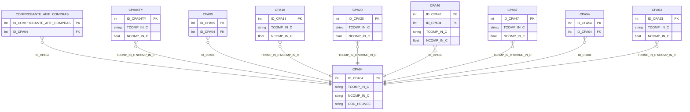

# Diseño de Tablas – Módulo Compras (Comprobantes)

Documentación del diseño y tablas del módulo de compras (comprobantes). Incluye cabecera de comprobantes (CPA04), renglones de artículos (CPA46), conceptos (CPA47), vencimientos (CPA54, CPA05), impuestos (CPA18, CPA63), datos proveedor (CPA20), comprobantes AFIP y tipos (CPA04TY).

**Tablas:** COMPROBANTE_AFIP_COMPRAS, CPA04, CPA04TY, CPA05, CPA18, CPA20, CPA46, CPA47, CPA54, CPA63

---

## Dependencias previas

Para ejecutar los scripts CREATE, deben existir:

- Tipos de usuario (UDT): D_ID, D_SINO_NO, T_D_RENGLON, ENTERO_TG, DECIMAL_TG, ENTEROXL_TG, y tipos XML (CAMPOS_ADICIONALES_*).
- Tablas: CPA01 (proveedores), STA11 (artículos) para FKs lógicas.
- Esquemas XML para CAMPOS_ADICIONALES.

---

## 1. Crear tipos de usuario (si no existen)

```sql
-- Tipos base usados en módulo compras (comprobantes)
CREATE TYPE dbo.D_ID FROM int;
CREATE TYPE dbo.D_SINO_NO FROM char(1);
CREATE TYPE dbo.T_D_RENGLON FROM int;
CREATE TYPE dbo.ENTERO_TG FROM int;
CREATE TYPE dbo.DECIMAL_TG FROM decimal(22,7);
CREATE TYPE dbo.ENTEROXL_TG FROM float;
```

---

## 2. Secuencias

```sql
CREATE SEQUENCE dbo.SEQUENCE_COMPROBANTE_AFIP_COMPRAS
    AS int START WITH 1 INCREMENT BY 1
    MINVALUE -9223372036854775808 MAXVALUE 9223372036854775807 NO CYCLE;

CREATE SEQUENCE dbo.SEQUENCE_CPA04
    AS int START WITH 1 INCREMENT BY 1
    MINVALUE -9223372036854775808 MAXVALUE 9223372036854775807 NO CYCLE;

CREATE SEQUENCE dbo.SEQUENCE_CPA46
    AS int START WITH 1 INCREMENT BY 1
    MINVALUE -9223372036854775808 MAXVALUE 9223372036854775807 NO CYCLE;
```

> **Nota:** CPA04TY, CPA05, CPA18, CPA20, CPA47, CPA54, CPA63 usan IDENTITY como PK; no requieren secuencia explícita.

---

## 3. Mapeo de tipos UDT a tipos base

| UDT         | Tipo base     | Notas            |
|-------------|---------------|------------------|
| D_ID        | int           | Identificadores  |
| D_SINO_NO   | char(1)       | Sí/No            |
| T_D_RENGLON | int           | Número renglón   |
| ENTERO_TG   | int           | Enteros          |
| DECIMAL_TG  | decimal(22,7) | Importes, %      |
| ENTEROXL_TG | float         | Números internos |

---

## 4. Diagrama ER (Mermaid)



---

## 5. Resumen de tablas

| Tabla | PK | Descripción |
|-------|-----|-------------|
| CPA04 | ID_CPA04 | Cabecera de comprobantes de compra |
| COMPROBANTE_AFIP_COMPRAS | ID_COMPROBANTE_AFIP_COMPRAS | Comprobantes AFIP importados |
| CPA04TY | ID_CPA04TY | Tipos/formularios por comprobante |
| CPA05 | ID_CPA05 | Cancelaciones de comprobantes |
| CPA18 | ID_CPA18 | Impuestos por comprobante |
| CPA20 | ID_CPA20 | Datos proveedor (snapshot) por comprobante |
| CPA46 | ID_CPA46 | Renglones de artículos |
| CPA47 | ID_CPA47 | Renglones de conceptos |
| CPA54 | ID_CPA54 | Vencimientos |
| CPA63 | ID_CPA63 | Alícuotas IVA por comprobante |

---

## 6. Diagrama de relaciones (ASCII)

```
                    CPA04 (Comprobantes)
                         │
    ┌────────┬───────────┼───────────┬────────┬────────┬────────┐
    ▼        ▼           ▼           ▼        ▼        ▼        ▼
COMPROB_AFIP CPA04TY   CPA05      CPA46    CPA47    CPA54    CPA18, CPA20, CPA63
    │         │         │          │        │        │
    └─────────┴─────────┴──────────┴────────┴────────┴──► TCOMP_IN_C, NCOMP_IN_C
```

---

## 7. Scripts CREATE (documentados)

Los siguientes scripts se obtuvieron desde SQL Server. **No modificar.**

---

/****** Object:  Table [dbo].[COMPROBANTE_AFIP_COMPRAS]    Script Date: 17/2/2026 19:24:26 ******/
SET ANSI_NULLS ON
GO

SET QUOTED_IDENTIFIER ON
GO

CREATE TABLE [dbo].[COMPROBANTE_AFIP_COMPRAS](
	[ID_COMPROBANTE_AFIP_COMPRAS] [dbo].[D_ID] NOT NULL,
	[FECHA_EMISION] [datetime] NULL,
	[TIPO_COMPROBANTE] [varchar](100) NULL,
	[PUNTO_VENTA] [int] NULL,
	[NUMERO] [varchar](15) NULL,
	[DENOMINACION] [varchar](60) NULL,
	[TIPO_DOCUMENTO] [varchar](20) NULL,
	[NUMERO_DOCUMENTO] [varchar](15) NULL,
	[TIPO_CAMBIO] [dbo].[DECIMAL_TG] NULL,
	[MONEDA] [varchar](3) NULL,
	[NETO] [dbo].[DECIMAL_TG] NULL,
	[NO_GRAVADO] [dbo].[DECIMAL_TG] NULL,
	[EXENTO] [dbo].[DECIMAL_TG] NULL,
	[IVA] [dbo].[DECIMAL_TG] NULL,
	[TOTAL] [dbo].[DECIMAL_TG] NULL,
	[ESTADO_CPA04] [dbo].[ENTERO_TG] NULL,
	[PENDIENTE] [dbo].[D_SINO_NO] NOT NULL,
	[HASH_IMPORTACION] [varchar](15) NULL,
	[ID_CPA04] [dbo].[D_ID] NULL,
	[CODIGO_AUTORIZACION] [varchar](14) NULL,
	[OTROS_TRIBUTOS] [dbo].[DECIMAL_TG] NULL,
	[N_COMP] [varchar](13) NULL,
	[ROW_VERSION] [timestamp] NOT NULL,
	[CAMPOS_ADICIONALES] [xml](CONTENT [dbo].[CAMPOS_ADICIONALES_COMPROBANTE_AFIP_COMPRAS]) NULL,
 CONSTRAINT [PK_COMPROBANTE_AFIP_COMPRAS] PRIMARY KEY CLUSTERED 
(
	[ID_COMPROBANTE_AFIP_COMPRAS] ASC
)WITH (PAD_INDEX = OFF, STATISTICS_NORECOMPUTE = OFF, IGNORE_DUP_KEY = OFF, ALLOW_ROW_LOCKS = ON, ALLOW_PAGE_LOCKS = ON, OPTIMIZE_FOR_SEQUENTIAL_KEY = OFF) ON [PRIMARY]
) ON [PRIMARY] TEXTIMAGE_ON [PRIMARY]
GO

/****** Object:  Table [dbo].[CPA04]    Script Date: 17/2/2026 19:24:26 ******/
SET ANSI_NULLS ON
GO

SET QUOTED_IDENTIFIER ON
GO

CREATE TABLE [dbo].[CPA04](
	[FILLER] [varchar](20) NULL,
	[BARRA_FON] [dbo].[ENTERO_TG] NULL,
	[CAI] [varchar](14) NULL,
	[CAT_IVA] [varchar](3) NULL,
	[CITI_OPERA] [varchar](1) NULL,
	[CITI_TIPO] [varchar](1) NULL,
	[COD_GASTO] [varchar](3) NULL,
	[COD_IVA1] [dbo].[ENTERO_TG] NULL,
	[COD_IVA2] [dbo].[ENTERO_TG] NULL,
	[COD_IVA3] [dbo].[ENTERO_TG] NULL,
	[COD_IVA4] [dbo].[ENTERO_TG] NULL,
	[COD_IVA5] [dbo].[ENTERO_TG] NULL,
	[COD_PROVEE] [varchar](6) NULL,
	[COD_SECTOR] [varchar](5) NULL,
	[COMP_AFIP] [dbo].[ENTERO_TG] NULL,
	[COND_COMPR] [dbo].[ENTERO_TG] NULL,
	[CONTABILIZ] [bit] NULL,
	[CONTFISCAL] [bit] NULL,
	[COTIZACION] [dbo].[DECIMAL_TG] NULL,
	[DESPACHO] [varchar](25) NULL,
	[ESTADO] [varchar](3) NULL,
	[ESTADO_AUT] [varchar](1) NULL,
	[ESTADO_STK] [varchar](1) NULL,
	[FECHA_CONT] [datetime] NULL,
	[FECHA_EMIS] [datetime] NULL,
	[FECHA_VTO] [datetime] NULL,
	[IMP_IVA1] [dbo].[DECIMAL_TG] NULL,
	[IMP_IVA2] [dbo].[DECIMAL_TG] NULL,
	[IMP_IVA3] [dbo].[DECIMAL_TG] NULL,
	[IMP_IVA4] [dbo].[DECIMAL_TG] NULL,
	[IMP_IVA5] [dbo].[DECIMAL_TG] NULL,
	[IMPORTE_AN] [dbo].[DECIMAL_TG] NULL,
	[IMPORTE_BO] [dbo].[DECIMAL_TG] NULL,
	[IMPORTE_EX] [dbo].[DECIMAL_TG] NULL,
	[IMPORTE_FL] [dbo].[DECIMAL_TG] NULL,
	[IMPORTE_IN] [dbo].[DECIMAL_TG] NULL,
	[IMPORTE_NE] [dbo].[DECIMAL_TG] NULL,
	[IMPORTE_TO] [dbo].[DECIMAL_TG] NULL,
	[INC_II] [bit] NULL,
	[INC_IVA] [bit] NULL,
	[LEYENDA] [varchar](30) NULL,
	[LOTE] [dbo].[ENTEROXL_TG] NULL,
	[MON_CTE] [bit] NULL,
	[N_COMP] [varchar](14) NULL,
	[N_COMP_FON] [varchar](14) NULL,
	[NCOMP_IN_C] [dbo].[ENTEROXL_TG] NULL,
	[PORC_BONIF] [dbo].[DECIMAL_TG] NULL,
	[PORC_IVA1] [dbo].[DECIMAL_TG] NULL,
	[PORC_IVA2] [dbo].[DECIMAL_TG] NULL,
	[PORC_IVA3] [dbo].[DECIMAL_TG] NULL,
	[PORC_IVA4] [dbo].[DECIMAL_TG] NULL,
	[PORC_IVA5] [dbo].[DECIMAL_TG] NULL,
	[SUBT_EXENT] [dbo].[DECIMAL_TG] NULL,
	[SUBT_GRAVA] [dbo].[DECIMAL_TG] NULL,
	[T_COMP] [varchar](3) NULL,
	[T_COMP_FON] [varchar](3) NULL,
	[TCOMP_IN_C] [varchar](2) NOT NULL,
	[TIPO_ASIEN] [varchar](2) NULL,
	[TIPO_COMPR] [varchar](1) NULL,
	[TIPO_IMPOR] [varchar](1) NULL,
	[UNIDADES] [dbo].[DECIMAL_TG] NULL,
	[HORA] [varchar](30) NULL,
	[DIFERENCIA] [varchar](1) NULL,
	[EXPORTADO] [bit] NULL,
	[NRO_SUCURS] [dbo].[ENTERO_TG] NULL,
	[CCONTROL] [varchar](14) NULL,
	[BO_AUTORIZ] [dbo].[ENTEROXL_TG] NULL,
	[DOC_ELECTR] [bit] NULL,
	[CAICAE_VTO] [datetime] NULL,
	[MO_NO_CRED] [varchar](100) NULL,
	[INF_IVA] [varchar](1) NULL,
	[CAICAE] [varchar](14) NULL,
	[T_DOC_DTE] [varchar](3) NULL,
	[N_INT_MES] [dbo].[ENTEROXL_TG] NULL,
	[IVA_CHILE] [varchar](1) NULL,
	[SUCURS_SII] [dbo].[ENTEROXL_TG] NULL,
	[CERRADO] [bit] NULL,
	[COD_CLASIF] [varchar](6) NULL,
	[AFECTO_AF] [dbo].[DECIMAL_TG] NULL,
	[EXENTO_AF] [dbo].[DECIMAL_TG] NULL,
	[IVA_AF] [dbo].[DECIMAL_TG] NULL,
	[ACTIVOFIJO] [varchar](1) NULL,
	[ID_ASIENTO_MODELO_CP] [dbo].[D_ID] NULL,
	[GENERA_ASIENTO] [char](1) NULL,
	[FECHA_INGRESO] [datetime] NULL,
	[HORA_INGRESO] [varchar](6) NULL,
	[USUARIO_INGRESO] [varchar](120) NULL,
	[TERMINAL_INGRESO] [varchar](255) NULL,
	[FECHA_ULTIMA_MODIFICACION] [datetime] NULL,
	[HORA_ULTIMA_MODIFICACION] [varchar](6) NULL,
	[USUA_ULTIMA_MODIFICACION] [varchar](120) NULL,
	[TERM_ULTIMA_MODIFICACION] [varchar](255) NULL,
	[N_INT_ORI] [dbo].[ENTEROXL_TG] NULL,
	[T_INT_ORI] [varchar](2) NULL,
	[RG_3572_TIPO_OPERACION_HABITUAL_COMPRAS] [varchar](2) NULL,
	[RG_3572_CUIT_INTERMEDIARIO] [varchar](15) NULL,
	[COD_NO_RECUP] [varchar](1) NULL,
	[RG_3572_DENOMINACION_INTERMEDIARIO] [varchar](30) NULL,
	[RG_3685_TIPO_OPERACION_COMPRAS] [varchar](1) NULL,
	[RG_3685_COMPROBANTE_COMPRAS] [varchar](3) NULL,
	[RG_3685_IVA_COMISION] [dbo].[DECIMAL_TG] NOT NULL,
	[BO_TIPO_COMPRA] [dbo].[ENTERO_TG] NULL,
	[BO_ES_COMBUSTIBLE] [bit] NULL,
	[IMPORTE_FLETE_RENGLON] [dbo].[DECIMAL_TG] NULL,
	[SUBTOTAL_FLETE_RENGLON] [dbo].[DECIMAL_TG] NULL,
	[TIPO_TRANSACCION_VENTA] [int] NULL,
	[TIPO_TRANSACCION_COMPRA] [int] NULL,
	[ESTADO_UNIDADES] [varchar](3) NULL,
	[OBSERVACIONES] [text] NULL,
	[OBSERVACIONES_COMERCIALES] [text] NULL,
	[LEYENDA_1] [varchar](60) NULL,
	[LEYENDA_2] [varchar](60) NULL,
	[LEYENDA_3] [varchar](60) NULL,
	[LEYENDA_4] [varchar](60) NULL,
	[LEYENDA_5] [varchar](60) NULL,
	[TALONARIO] [dbo].[ENTERO_TG] NULL,
	[MOTIVO_ANULACION_OP] [varchar](30) NULL,
	[FECHA_ANULACION_OP] [datetime] NULL,
	[HORA_ANULACION_OP] [varchar](6) NULL,
	[USUARIO_ANULACION_OP] [varchar](120) NULL,
	[TERMINAL_ANULACION_OP] [varchar](255) NULL,
	[ID_CPA04] [dbo].[D_ID] NOT NULL,
	[CONVERSOR_CLAUSULA_DIFERENCIA_ESTADOS] [varchar](1) NULL,
	[NOTAS_OP] [varchar](40) NULL,
	[OP_NETO_GRAVADO_PAGO_CUENTA] [dbo].[DECIMAL_TG] NULL,
	[OP_NETO_NO_GRAVADO_PAGO_CUENTA] [dbo].[DECIMAL_TG] NULL,
	[OP_IMPORTE_TOTAL_PAGO_CUENTA] [dbo].[DECIMAL_TG] NULL,
	[OP_IMPORTE_IVA_PAGO_CUENTA] [dbo].[DECIMAL_TG] NULL,
	[OP_IMPORTE_SIN_IVA_PAGO_CUENTA] [dbo].[DECIMAL_TG] NULL,
	[OP_IMPORTE_NO_CONSIDERA_PAGO_CUENTA] [dbo].[DECIMAL_TG] NULL,
	[OP_TOTAL_PAGO_CUENTA] [dbo].[DECIMAL_TG] NULL,
	[OP_IMPORTE_TOTAL_RETENCIONES] [dbo].[DECIMAL_TG] NULL,
	[RETENCION_MODIFICADA] [bit] NULL,
	[IMPUTACION_MODIFICADA] [varchar](1) NULL,
	[COD_CPA01] [varchar](10) NULL,
	[EXPORTADO_LID_CT] [bit] NOT NULL,
	[NRO_SUCURSAL_DESTINO] [dbo].[ENTERO_TG] NULL,
	[ID_LOTE_IMPORTACION_EXCEL] [uniqueidentifier] NULL,
 CONSTRAINT [PK_CPA04] PRIMARY KEY CLUSTERED 
(
	[ID_CPA04] ASC
)WITH (PAD_INDEX = OFF, STATISTICS_NORECOMPUTE = OFF, IGNORE_DUP_KEY = OFF, ALLOW_ROW_LOCKS = ON, ALLOW_PAGE_LOCKS = ON, OPTIMIZE_FOR_SEQUENTIAL_KEY = OFF) ON [PRIMARY]
) ON [PRIMARY] TEXTIMAGE_ON [PRIMARY]
GO

/****** Object:  Table [dbo].[CPA04TY]    Script Date: 17/2/2026 19:24:26 ******/
SET ANSI_NULLS ON
GO

SET QUOTED_IDENTIFIER ON
GO

CREATE TABLE [dbo].[CPA04TY](
	[ID_CPA04TY] [int] IDENTITY(1,1) NOT NULL,
	[FILLER] [varchar](20) NULL,
	[TCOMP_IN_C] [varchar](2) NOT NULL,
	[NCOMP_IN_C] [dbo].[ENTEROXL_TG] NOT NULL,
	[IMG_TYP] [text] NULL,
	[COMPRIMIDO] [bit] NULL,
	[PATH_CREACION_PDF] [varchar](255) NULL,
 CONSTRAINT [PK_CPA04TY] PRIMARY KEY CLUSTERED 
(
	[ID_CPA04TY] ASC
)WITH (PAD_INDEX = OFF, STATISTICS_NORECOMPUTE = OFF, IGNORE_DUP_KEY = OFF, ALLOW_ROW_LOCKS = ON, ALLOW_PAGE_LOCKS = ON, OPTIMIZE_FOR_SEQUENTIAL_KEY = OFF) ON [PRIMARY]
) ON [PRIMARY] TEXTIMAGE_ON [PRIMARY]
GO

/****** Object:  Table [dbo].[CPA05]    Script Date: 17/2/2026 19:24:26 ******/
SET ANSI_NULLS ON
GO

SET QUOTED_IDENTIFIER ON
GO

CREATE TABLE [dbo].[CPA05](
	[ID_CPA05] [int] IDENTITY(1,1) NOT NULL,
	[FILLER] [varchar](20) NULL,
	[COD_PROVEE] [varchar](6) NULL,
	[F_COMP_CAN] [datetime] NULL,
	[FECHA_VTO] [datetime] NULL,
	[IMPORT_CAN] [dbo].[DECIMAL_TG] NULL,
	[IMPORT_VTO] [dbo].[DECIMAL_TG] NULL,
	[N_COMP_CAN] [varchar](14) NULL,
	[N_COMP_FAC] [varchar](14) NULL,
	[T_COMP_CAN] [varchar](3) NULL,
	[T_COMP_FAC] [varchar](3) NULL,
	[IMPORTE_CANCELADO_UNIDADES] [dbo].[DECIMAL_TG] NULL,
	[IMPORTE_VENCIMIENTO_UNIDADES] [dbo].[DECIMAL_TG] NULL,
	[ID_CPA04_CANCELADO] [dbo].[D_ID] NULL,
	[MOTIVO] [varchar](max) NULL,
	[ID_CPA04] [dbo].[D_ID] NULL,
	[ID_CPA04_ORIGEN_DIFERENCIA_CAMBIO] [dbo].[D_ID] NULL,
	[ID_CPA04_OP] [dbo].[D_ID] NULL,
 CONSTRAINT [PK_CPA05] PRIMARY KEY CLUSTERED 
(
	[ID_CPA05] ASC
)WITH (PAD_INDEX = OFF, STATISTICS_NORECOMPUTE = OFF, IGNORE_DUP_KEY = OFF, ALLOW_ROW_LOCKS = ON, ALLOW_PAGE_LOCKS = ON, OPTIMIZE_FOR_SEQUENTIAL_KEY = OFF) ON [PRIMARY]
) ON [PRIMARY] TEXTIMAGE_ON [PRIMARY]
GO

/****** Object:  Table [dbo].[CPA18]    Script Date: 17/2/2026 19:24:26 ******/
SET ANSI_NULLS ON
GO

SET QUOTED_IDENTIFIER ON
GO

CREATE TABLE [dbo].[CPA18](
	[ID_CPA18] [int] IDENTITY(1,1) NOT NULL,
	[FILLER] [varchar](20) NULL,
	[COD_IMPUES] [varchar](3) NULL,
	[COD_PROVEE] [varchar](6) NOT NULL,
	[F_COMP] [datetime] NULL,
	[IMPORTE] [dbo].[DECIMAL_TG] NULL,
	[NCOMP_IN_C] [dbo].[ENTEROXL_TG] NOT NULL,
	[TCOMP_IN_C] [varchar](2) NOT NULL,
	[COD_PROV] [varchar](2) NULL,
	[COD_SII] [varchar](3) NULL,
 CONSTRAINT [PK_CPA18] PRIMARY KEY CLUSTERED 
(
	[ID_CPA18] ASC
)WITH (PAD_INDEX = OFF, STATISTICS_NORECOMPUTE = OFF, IGNORE_DUP_KEY = OFF, ALLOW_ROW_LOCKS = ON, ALLOW_PAGE_LOCKS = ON, OPTIMIZE_FOR_SEQUENTIAL_KEY = OFF) ON [PRIMARY]
) ON [PRIMARY]
GO

/****** Object:  Table [dbo].[CPA20]    Script Date: 17/2/2026 19:24:26 ******/
SET ANSI_NULLS ON
GO

SET QUOTED_IDENTIFIER ON
GO

CREATE TABLE [dbo].[CPA20](
	[ID_CPA20] [int] IDENTITY(1,1) NOT NULL,
	[FILLER] [varchar](20) NULL,
	[CLAS_SIAP] [varchar](3) NULL,
	[COND_IVA] [varchar](3) NULL,
	[N_CUIT] [varchar](15) NULL,
	[N_ING_BRUT] [varchar](20) NULL,
	[N_IVA] [varchar](160) NULL,
	[NCOMP_IN_C] [dbo].[ENTEROXL_TG] NULL,
	[PROVINCIA] [varchar](2) NULL,
	[RAZON_SOCI] [varchar](60) NULL,
	[TCOMP_IN_C] [varchar](2) NOT NULL,
	[TIPO] [varchar](1) NULL,
	[TIPO_DOC] [dbo].[ENTERO_TG] NULL,
	[EMAIL_DE] [varchar](60) NULL,
	[PROV_ELECT] [bit] NULL,
	[WEB] [varchar](60) NULL,
	[E_MAIL] [varchar](60) NULL,
	[COD_RUBRO] [varchar](4) NULL,
	[CTA_PRO] [dbo].[ENTEROXL_TG] NULL,
	[CTO_PRO] [varchar](10) NULL,
	[RG_3685_GENERA_INFORMACION] [bit] NULL,
	[INGRESA_FLETE_POR_RENGLON] [varchar](1) NULL,
	[ROW_VERSION] [timestamp] NOT NULL,
 CONSTRAINT [PK_CPA20] PRIMARY KEY CLUSTERED 
(
	[ID_CPA20] ASC
)WITH (PAD_INDEX = OFF, STATISTICS_NORECOMPUTE = OFF, IGNORE_DUP_KEY = OFF, ALLOW_ROW_LOCKS = ON, ALLOW_PAGE_LOCKS = ON, OPTIMIZE_FOR_SEQUENTIAL_KEY = OFF) ON [PRIMARY]
) ON [PRIMARY]
GO

/****** Object:  Table [dbo].[CPA46]    Script Date: 17/2/2026 19:24:26 ******/
SET ANSI_NULLS ON
GO

SET QUOTED_IDENTIFIER ON
GO

CREATE TABLE [dbo].[CPA46](
	[FILLER] [varchar](20) NULL,
	[CANTIDAD] [dbo].[DECIMAL_TG] NULL,
	[COD_ARTICU] [varchar](15) NULL,
	[COD_DEPOSI] [varchar](2) NULL,
	[EQUIVALENC] [dbo].[DECIMAL_TG] NULL,
	[FALTA_REM] [dbo].[DECIMAL_TG] NULL,
	[FECHA_MOV] [datetime] NULL,
	[IMP_NETO_P] [dbo].[DECIMAL_TG] NULL,
	[N_RENGL_C] [dbo].[T_D_RENGLON] NULL,
	[NCOMP_IN_C] [dbo].[ENTEROXL_TG] NOT NULL,
	[PORCE_DCTO] [dbo].[DECIMAL_TG] NULL,
	[PRECIO_NET] [dbo].[DECIMAL_TG] NULL,
	[PRECIO_PAN] [dbo].[DECIMAL_TG] NULL,
	[TCOMP_IN_C] [varchar](2) NOT NULL,
	[COD_CLASIF] [varchar](6) NULL,
	[IMPORTE_EXENTO] [dbo].[DECIMAL_TG] NULL,
	[IMPORTE_GRAVADO] [dbo].[DECIMAL_TG] NULL,
	[ID_MEDIDA_COMPRA] [dbo].[D_ID] NULL,
	[ID_MEDIDA_STOCK] [dbo].[D_ID] NULL,
	[ID_MEDIDA_STOCK_2] [dbo].[D_ID] NULL,
	[CANTIDAD_2] [dbo].[DECIMAL_TG] NULL,
	[FALTA_REM_2] [dbo].[DECIMAL_TG] NULL,
	[UNIDAD_MEDIDA_SELECCIONADA] [char](1) NULL,
	[IMPORTE_FLETE] [dbo].[DECIMAL_TG] NULL,
	[IMPORTE_IMPUESTOS_COSTOS] [dbo].[DECIMAL_TG] NULL,
	[ID_STA11] [dbo].[D_ID] NULL,
	[ID_CPA04] [dbo].[D_ID] NULL,
	[ID_CPA46] [dbo].[D_ID] NOT NULL,
 CONSTRAINT [PK_CPA46] PRIMARY KEY CLUSTERED 
(
	[ID_CPA46] ASC
)WITH (PAD_INDEX = OFF, STATISTICS_NORECOMPUTE = OFF, IGNORE_DUP_KEY = OFF, ALLOW_ROW_LOCKS = ON, ALLOW_PAGE_LOCKS = ON, OPTIMIZE_FOR_SEQUENTIAL_KEY = OFF) ON [PRIMARY]
) ON [PRIMARY]
GO

/****** Object:  Table [dbo].[CPA47]    Script Date: 17/2/2026 19:24:27 ******/
SET ANSI_NULLS ON
GO

SET QUOTED_IDENTIFIER ON
GO

CREATE TABLE [dbo].[CPA47](
	[ID_CPA47] [int] IDENTITY(1,1) NOT NULL,
	[FILLER] [varchar](20) NULL,
	[COD_CONCEP] [varchar](3) NULL,
	[FECHA_MOV] [datetime] NULL,
	[IMPORTE_NE] [dbo].[DECIMAL_TG] NULL,
	[IMPORT_PAN] [dbo].[DECIMAL_TG] NULL,
	[IMP_NETO_P] [dbo].[DECIMAL_TG] NULL,
	[NCOMP_IN_C] [dbo].[ENTEROXL_TG] NOT NULL,
	[N_RENGL_C] [dbo].[T_D_RENGLON] NULL,
	[TCOMP_IN_C] [varchar](2) NOT NULL,
	[COD_CLASIF] [varchar](6) NULL,
	[IMPORTE_EXENTO] [dbo].[DECIMAL_TG] NULL,
	[IMPORTE_GRAVADO] [dbo].[DECIMAL_TG] NULL,
 CONSTRAINT [PK_CPA47] PRIMARY KEY CLUSTERED 
(
	[ID_CPA47] ASC
)WITH (PAD_INDEX = OFF, STATISTICS_NORECOMPUTE = OFF, IGNORE_DUP_KEY = OFF, ALLOW_ROW_LOCKS = ON, ALLOW_PAGE_LOCKS = ON, OPTIMIZE_FOR_SEQUENTIAL_KEY = OFF) ON [PRIMARY]
) ON [PRIMARY]
GO

/****** Object:  Table [dbo].[CPA54]    Script Date: 17/2/2026 19:24:27 ******/
SET ANSI_NULLS ON
GO

SET QUOTED_IDENTIFIER ON
GO

CREATE TABLE [dbo].[CPA54](
	[ID_CPA54] [int] IDENTITY(1,1) NOT NULL,
	[FILLER] [varchar](20) NULL,
	[COD_PROVEE] [varchar](6) NOT NULL,
	[ESTADO_AUT] [varchar](1) NULL,
	[ESTADO_VTO] [varchar](3) NULL,
	[FECHA_VTO] [datetime] NULL,
	[IMPORT_VTO] [dbo].[DECIMAL_TG] NULL,
	[N_COMP] [varchar](14) NOT NULL,
	[T_COMP] [varchar](3) NOT NULL,
	[ESTADO_UNIDADES] [varchar](3) NULL,
	[IMPORTE_VENCIMIENTO_UNIDADES] [dbo].[DECIMAL_TG] NULL,
	[ID_CPA04] [dbo].[D_ID] NULL,
 CONSTRAINT [PK_CPA54] PRIMARY KEY CLUSTERED 
(
	[ID_CPA54] ASC
)WITH (PAD_INDEX = OFF, STATISTICS_NORECOMPUTE = OFF, IGNORE_DUP_KEY = OFF, ALLOW_ROW_LOCKS = ON, ALLOW_PAGE_LOCKS = ON, OPTIMIZE_FOR_SEQUENTIAL_KEY = OFF) ON [PRIMARY]
) ON [PRIMARY]
GO

/****** Object:  Table [dbo].[CPA63]    Script Date: 17/2/2026 19:24:27 ******/
SET ANSI_NULLS ON
GO

SET QUOTED_IDENTIFIER ON
GO

CREATE TABLE [dbo].[CPA63](
	[ID_CPA63] [int] IDENTITY(1,1) NOT NULL,
	[FILLER] [varchar](20) NULL,
	[CLAS_SIAP] [varchar](3) NULL,
	[IMPORTE] [dbo].[DECIMAL_TG] NULL,
	[NCOMP_IN_C] [dbo].[ENTEROXL_TG] NOT NULL,
	[PORC_ALICU] [dbo].[DECIMAL_TG] NOT NULL,
	[TCOMP_IN_C] [varchar](2) NOT NULL,
 CONSTRAINT [PK_CPA63] PRIMARY KEY CLUSTERED 
(
	[ID_CPA63] ASC
)WITH (PAD_INDEX = OFF, STATISTICS_NORECOMPUTE = OFF, IGNORE_DUP_KEY = OFF, ALLOW_ROW_LOCKS = ON, ALLOW_PAGE_LOCKS = ON, OPTIMIZE_FOR_SEQUENTIAL_KEY = OFF) ON [PRIMARY]
) ON [PRIMARY]
GO
