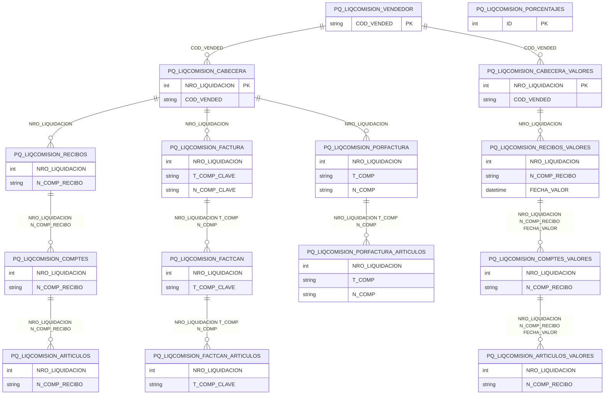

# Diseño de Tablas – Módulo PQ Liquidación de Comisiones

Documentación del diseño y tablas del módulo de liquidación de comisiones a vendedores: cabecera, recibos, facturas, comprobantes, artículos, porcentajes por vendedor.

**Tablas:** PQ_LIQCOMISION_ARTICULOS, PQ_LIQCOMISION_ARTICULOS_VALORES, PQ_LIQCOMISION_CABECERA, PQ_LIQCOMISION_CABECERA_VALORES, PQ_LIQCOMISION_COMPTES, PQ_LIQCOMISION_COMPTES_VALORES, PQ_LIQCOMISION_FACTCAN, PQ_LIQCOMISION_FACTCAN_ARTICULOS, PQ_LIQCOMISION_FACTURA, PQ_LIQCOMISION_PORCENTAJES, PQ_LIQCOMISION_PORFACTURA, PQ_LIQCOMISION_PORFACTURA_ARTICULOS, PQ_LIQCOMISION_RECIBOS, PQ_LIQCOMISION_RECIBOS_VALORES, PQ_LIQCOMISION_VENDEDOR

---

## Dependencias previas

- Tablas Tango: GVA23 (vendedores), GVA12 (comprobantes venta), artículos.
- Usa tipos estándar SQL.

---

## 1. Resumen de tablas

**Jerarquía de dependencias (padre → hijos):**

| Padre | Hijos |
|-------|-------|
| VENDEDOR | CABECERA, CABECERA_VALORES |
| CABECERA | RECIBOS, FACTURA, PORFACTURA |
| CABECERA_VALORES | RECIBOS_VALORES |
| RECIBOS | COMPTES |
| COMPTES | ARTICULOS |
| FACTURA | FACTCAN |
| FACTCAN | FACTCAN_ARTICULOS |
| PORFACTURA | PORFACTURA_ARTICULOS |
| RECIBOS_VALORES | COMPTES_VALORES |
| COMPTES_VALORES | ARTICULOS_VALORES |
| Sin referencia | PORCENTAJES |

| Tabla | PK / Clave | Descripción |
|-------|------------|-------------|
| PQ_LIQCOMISION_VENDEDOR | COD_VENDED | Configuración vendedor (modalidad, origen %); padre de CABECERA y CABECERA_VALORES |
| PQ_LIQCOMISION_CABECERA | NRO_LIQUIDACION | Cabecera liquidación por vendedor |
| PQ_LIQCOMISION_CABECERA_VALORES | NRO_LIQUIDACION | Cabecera liquidación (modalidad valores) |
| PQ_LIQCOMISION_RECIBOS | NRO_LIQUIDACION, N_COMP_RECIBO | Recibos incluidos (Comisión por Recibo) |
| PQ_LIQCOMISION_COMPTES | NRO_LIQUIDACION, N_COMP_RECIBO, T_COMP, … | Comprobantes aplicados |
| PQ_LIQCOMISION_ARTICULOS | NRO_LIQUIDACION, N_COMP_RECIBO, T_COMP, N_COMP, … | Artículos con comisión por recibo |
| PQ_LIQCOMISION_FACTURA | NRO_LIQUIDACION, T_COMP_CLAVE, N_COMP_CLAVE | Facturas (Factura cancelada) |
| PQ_LIQCOMISION_FACTCAN | NRO_LIQUIDACION, T_COMP_CLAVE, … | Facturas canceladas |
| PQ_LIQCOMISION_FACTCAN_ARTICULOS | NRO_LIQUIDACION, T_COMP_CLAVE, … | Artículos de facturas canceladas |
| PQ_LIQCOMISION_PORFACTURA | NRO_LIQUIDACION, T_COMP, N_COMP | Comisión por factura |
| PQ_LIQCOMISION_PORFACTURA_ARTICULOS | NRO_LIQUIDACION, T_COMP, N_COMP, N_RENGLON | Artículos por factura |
| PQ_LIQCOMISION_RECIBOS_VALORES | NRO_LIQUIDACION, N_COMP_RECIBO, FECHA_VALOR | Recibos (modalidad valores) |
| PQ_LIQCOMISION_COMPTES_VALORES | NRO_LIQUIDACION, N_COMP_RECIBO, FECHA_VALOR, … | Comprobantes (modalidad valores) |
| PQ_LIQCOMISION_ARTICULOS_VALORES | NRO_LIQUIDACION, N_COMP_RECIBO, FECHA_VALOR, … | Artículos (modalidad valores) |
| PQ_LIQCOMISION_PORCENTAJES | ID | Porcentajes (artículo/vendedor/cliente); sin referencia |

---

## 2. Diagrama ER (Mermaid)



---

## 3. Diagrama de relaciones (ASCII)

```
        VENDEDOR (COD_VENDED)
              │
    ┌─────────┴─────────┐
    ▼                   ▼
 CABECERA         CABECERA_VALORES

  ┌── Comisión por Recibo ──────────────────────────────────────────────────┐
  │   CABECERA ──► RECIBOS ──► COMPTES ──► ARTICULOS                         │
  └─────────────────────────────────────────────────────────────────────────┘

  ┌── Comisión por Factura totalmente cancelada ────────────────────────────┐
  │   CABECERA ──► FACTURA ──► FACTCAN ──► FACTCAN_ARTICULOS                  │
  └─────────────────────────────────────────────────────────────────────────┘

  ┌── Comisión por factura ──────────────────────────────────────────────────┐
  │   CABECERA ──► PORFACTURA ──► PORFACTURA_ARTICULOS                        │
  └─────────────────────────────────────────────────────────────────────────┘

  ┌── Comisión por recibo por fecha valores ─────────────────────────────────┐
  │   CABECERA_VALORES ──► RECIBOS_VALORES ──► COMPTES_VALORES ──► ARTICULOS_VALORES │
  └─────────────────────────────────────────────────────────────────────────┘

  Sin referencia: PORCENTAJES
```

---

## 4. Scripts CREATE (documentados)

Los siguientes scripts se obtuvieron desde SQL Server. **No modificar.**

---

/****** Object:  Table [dbo].[PQ_LIQCOMISION_ARTICULOS]    Script Date: 17/2/2026 19:50:17 ******/
SET ANSI_NULLS ON
GO

SET QUOTED_IDENTIFIER ON
GO

CREATE TABLE [dbo].[PQ_LIQCOMISION_ARTICULOS](
	[PORCE_APLICADO] [numeric](6, 2) NOT NULL,
	[NRO_LIQUIDACION] [int] NOT NULL,
	[N_COMP_RECIBO] [varchar](14) NOT NULL,
	[T_COMP] [varchar](3) NOT NULL,
	[N_COMP] [varchar](14) NOT NULL,
	[COD_ARTICU] [varchar](15) NOT NULL,
	[N_RENGLON] [int] NOT NULL,
	[T_COMP_CLAVE] [varchar](3) NOT NULL,
	[N_COMP_CLAVE] [varchar](14) NOT NULL,
	[FECHA_VTO_CLAVE] [datetime] NOT NULL,
	[PORCE_COMISION] [numeric](6, 2) NOT NULL,
	[IMPORTE] [numeric](15, 2) NOT NULL,
	[APLICADO] [numeric](15, 2) NOT NULL,
	[COMISION] [numeric](15, 2) NOT NULL,
	[CANTIDAD] [numeric](15, 2) NOT NULL,
	[PRECIO_NET] [numeric](15, 2) NOT NULL,
 CONSTRAINT [PK_PQ_LIQCOMISION_ARTICULOS] PRIMARY KEY CLUSTERED 
(
	[NRO_LIQUIDACION] ASC,
	[N_COMP_RECIBO] ASC,
	[T_COMP] ASC,
	[N_COMP] ASC,
	[COD_ARTICU] ASC,
	[N_RENGLON] ASC,
	[T_COMP_CLAVE] ASC,
	[N_COMP_CLAVE] ASC,
	[FECHA_VTO_CLAVE] ASC
)WITH (PAD_INDEX = OFF, STATISTICS_NORECOMPUTE = OFF, IGNORE_DUP_KEY = OFF, ALLOW_ROW_LOCKS = ON, ALLOW_PAGE_LOCKS = ON) ON [PRIMARY]
) ON [PRIMARY]
GO

/****** Object:  Table [dbo].[PQ_LIQCOMISION_ARTICULOS_VALORES]    Script Date: 17/2/2026 19:50:17 ******/
SET ANSI_NULLS ON
GO

SET QUOTED_IDENTIFIER ON
GO

CREATE TABLE [dbo].[PQ_LIQCOMISION_ARTICULOS_VALORES](
	[PORCE_APLICADO] [numeric](6, 2) NOT NULL,
	[NRO_LIQUIDACION] [int] NOT NULL,
	[N_COMP_RECIBO] [varchar](15) NOT NULL,
	[FECHA_VALOR] [datetime] NOT NULL,
	[T_COMP] [varchar](3) NOT NULL,
	[N_COMP] [varchar](15) NOT NULL,
	[COD_ARTICU] [varchar](15) NOT NULL,
	[N_RENGLON] [int] NOT NULL,
	[T_COMP_CLAVE] [varchar](3) NOT NULL,
	[N_COMP_CLAVE] [varchar](15) NOT NULL,
	[FECHA_VTO_CLAVE] [datetime] NOT NULL,
	[PORCE_COMISION] [numeric](6, 2) NOT NULL,
	[IMPORTE] [numeric](15, 2) NOT NULL,
	[APLICADO] [numeric](15, 2) NOT NULL,
	[COMISION] [numeric](15, 2) NOT NULL,
	[CANTIDAD] [numeric](15, 2) NOT NULL,
	[PRECIO_NET] [numeric](15, 2) NOT NULL,
 CONSTRAINT [PK_PQ_LIQCOMISION_ARTICULOS_VALORES] PRIMARY KEY CLUSTERED 
(
	[NRO_LIQUIDACION] ASC,
	[N_COMP_RECIBO] ASC,
	[FECHA_VALOR] ASC,
	[T_COMP] ASC,
	[N_COMP] ASC,
	[COD_ARTICU] ASC,
	[N_RENGLON] ASC,
	[T_COMP_CLAVE] ASC,
	[N_COMP_CLAVE] ASC,
	[FECHA_VTO_CLAVE] ASC
)WITH (PAD_INDEX = OFF, STATISTICS_NORECOMPUTE = OFF, IGNORE_DUP_KEY = OFF, ALLOW_ROW_LOCKS = ON, ALLOW_PAGE_LOCKS = ON) ON [PRIMARY]
) ON [PRIMARY]
GO

/****** Object:  Table [dbo].[PQ_LIQCOMISION_CABECERA]    Script Date: 17/2/2026 19:50:17 ******/
SET ANSI_NULLS ON
GO

SET QUOTED_IDENTIFIER ON
GO

CREATE TABLE [dbo].[PQ_LIQCOMISION_CABECERA](
	[NRO_LIQUIDACION] [int] IDENTITY(1,1) NOT NULL,
	[COD_VENDED] [varchar](10) NOT NULL,
	[FECHA_LIQ] [datetime] NOT NULL,
 CONSTRAINT [PK_PQ_LIQCOMISION_CABECERA] PRIMARY KEY CLUSTERED 
(
	[NRO_LIQUIDACION] ASC
)WITH (PAD_INDEX = OFF, STATISTICS_NORECOMPUTE = OFF, IGNORE_DUP_KEY = OFF, ALLOW_ROW_LOCKS = ON, ALLOW_PAGE_LOCKS = ON) ON [PRIMARY]
) ON [PRIMARY]
GO

/****** Object:  Table [dbo].[PQ_LIQCOMISION_CABECERA_VALORES]    Script Date: 17/2/2026 19:50:17 ******/
SET ANSI_NULLS ON
GO

SET QUOTED_IDENTIFIER ON
GO

CREATE TABLE [dbo].[PQ_LIQCOMISION_CABECERA_VALORES](
	[NRO_LIQUIDACION] [int] IDENTITY(1,1) NOT NULL,
	[COD_VENDED] [varchar](10) NOT NULL,
	[FECHA_LIQ] [datetime] NOT NULL,
 CONSTRAINT [PK_PQ_LIQCOMISION_CABECERA_VALORES] PRIMARY KEY CLUSTERED 
(
	[NRO_LIQUIDACION] ASC
)WITH (PAD_INDEX = OFF, STATISTICS_NORECOMPUTE = OFF, IGNORE_DUP_KEY = OFF, ALLOW_ROW_LOCKS = ON, ALLOW_PAGE_LOCKS = ON) ON [PRIMARY]
) ON [PRIMARY]
GO

/****** Object:  Table [dbo].[PQ_LIQCOMISION_COMPTES]    Script Date: 17/2/2026 19:50:17 ******/
SET ANSI_NULLS ON
GO

SET QUOTED_IDENTIFIER ON
GO

CREATE TABLE [dbo].[PQ_LIQCOMISION_COMPTES](
	[NRO_LIQUIDACION] [int] NOT NULL,
	[N_COMP_RECIBO] [varchar](14) NOT NULL,
	[T_COMP] [varchar](3) NOT NULL,
	[N_COMP] [varchar](14) NOT NULL,
	[T_COMP_CLAVE] [varchar](3) NOT NULL,
	[N_COMP_CLAVE] [varchar](14) NOT NULL,
	[FECHA_VTO_CLAVE] [datetime] NOT NULL,
	[PORCE_APLICADO] [numeric](6, 2) NOT NULL,
	[TOTAL_COMPTE] [numeric](15, 2) NOT NULL,
	[TOTAL_APLICADO] [numeric](15, 2) NOT NULL,
	[COMISION] [numeric](15, 2) NOT NULL,
	[IMPORT_CAN] [numeric](15, 2) NOT NULL,
 CONSTRAINT [PK_PQ_LIQCOMISION_COMPTES] PRIMARY KEY CLUSTERED 
(
	[NRO_LIQUIDACION] ASC,
	[N_COMP_RECIBO] ASC,
	[T_COMP] ASC,
	[N_COMP] ASC,
	[T_COMP_CLAVE] ASC,
	[N_COMP_CLAVE] ASC,
	[FECHA_VTO_CLAVE] ASC
)WITH (PAD_INDEX = OFF, STATISTICS_NORECOMPUTE = OFF, IGNORE_DUP_KEY = OFF, ALLOW_ROW_LOCKS = ON, ALLOW_PAGE_LOCKS = ON) ON [PRIMARY]
) ON [PRIMARY]
GO

/****** Object:  Table [dbo].[PQ_LIQCOMISION_COMPTES_VALORES]    Script Date: 17/2/2026 19:50:17 ******/
SET ANSI_NULLS ON
GO

SET QUOTED_IDENTIFIER ON
GO

CREATE TABLE [dbo].[PQ_LIQCOMISION_COMPTES_VALORES](
	[NRO_LIQUIDACION] [int] NOT NULL,
	[N_COMP_RECIBO] [varchar](15) NOT NULL,
	[FECHA_VALOR] [datetime] NOT NULL,
	[T_COMP] [varchar](3) NOT NULL,
	[N_COMP] [varchar](15) NOT NULL,
	[T_COMP_CLAVE] [varchar](3) NOT NULL,
	[N_COMP_CLAVE] [varchar](15) NOT NULL,
	[FECHA_VTO_CLAVE] [datetime] NOT NULL,
	[PORCE_APLICADO] [numeric](6, 2) NOT NULL,
	[TOTAL_COMPTE] [numeric](15, 2) NOT NULL,
	[TOTAL_APLICADO] [numeric](15, 2) NOT NULL,
	[COMISION] [numeric](15, 2) NOT NULL,
	[IMPORT_CAN] [numeric](15, 2) NOT NULL,
 CONSTRAINT [PK_PQ_LIQCOMISION_COMPTES_VALORES] PRIMARY KEY CLUSTERED 
(
	[NRO_LIQUIDACION] ASC,
	[N_COMP_RECIBO] ASC,
	[FECHA_VALOR] ASC,
	[T_COMP] ASC,
	[N_COMP] ASC,
	[T_COMP_CLAVE] ASC,
	[N_COMP_CLAVE] ASC,
	[FECHA_VTO_CLAVE] ASC
)WITH (PAD_INDEX = OFF, STATISTICS_NORECOMPUTE = OFF, IGNORE_DUP_KEY = OFF, ALLOW_ROW_LOCKS = ON, ALLOW_PAGE_LOCKS = ON) ON [PRIMARY]
) ON [PRIMARY]
GO

/****** Object:  Table [dbo].[PQ_LIQCOMISION_FACTCAN]    Script Date: 17/2/2026 19:50:17 ******/
SET ANSI_NULLS ON
GO

SET QUOTED_IDENTIFIER ON
GO

CREATE TABLE [dbo].[PQ_LIQCOMISION_FACTCAN](
	[NRO_LIQUIDACION] [int] NOT NULL,
	[T_COMP_CLAVE] [varchar](3) NOT NULL,
	[N_COMP_CLAVE] [varchar](14) NOT NULL,
	[T_COMP] [varchar](3) NOT NULL,
	[N_COMP] [varchar](14) NOT NULL,
	[FECHA_CANC] [datetime] NOT NULL,
	[VIGENTE] [bit] NOT NULL,
	[SUB_TOTAL] [numeric](15, 2) NOT NULL,
	[TOTAL] [numeric](15, 2) NOT NULL,
	[CANCELADO] [numeric](15, 2) NOT NULL,
	[PORCE_APLICADO] [numeric](6, 2) NOT NULL,
	[COMISION] [numeric](15, 2) NOT NULL,
 CONSTRAINT [PK_PQ_LIQCOMISION_FACTCAN] PRIMARY KEY CLUSTERED 
(
	[NRO_LIQUIDACION] ASC,
	[T_COMP_CLAVE] ASC,
	[N_COMP_CLAVE] ASC,
	[T_COMP] ASC,
	[N_COMP] ASC
)WITH (PAD_INDEX = OFF, STATISTICS_NORECOMPUTE = OFF, IGNORE_DUP_KEY = OFF, ALLOW_ROW_LOCKS = ON, ALLOW_PAGE_LOCKS = ON) ON [PRIMARY]
) ON [PRIMARY]
GO

/****** Object:  Table [dbo].[PQ_LIQCOMISION_FACTCAN_ARTICULOS]    Script Date: 17/2/2026 19:50:17 ******/
SET ANSI_NULLS ON
GO

SET QUOTED_IDENTIFIER ON
GO

CREATE TABLE [dbo].[PQ_LIQCOMISION_FACTCAN_ARTICULOS](
	[NRO_LIQUIDACION] [int] NOT NULL,
	[T_COMP_CLAVE] [varchar](3) NOT NULL,
	[N_COMP_CLAVE] [varchar](14) NOT NULL,
	[T_COMP] [varchar](3) NOT NULL,
	[N_COMP] [varchar](14) NOT NULL,
	[N_RENGLON] [numeric](4, 0) NOT NULL,
	[COD_ARTICU] [varchar](15) NOT NULL,
	[PORCE_COMISION] [numeric](6, 2) NOT NULL,
	[COMISION] [numeric](15, 2) NOT NULL,
 CONSTRAINT [PK_PQ_LIQCOMISION_FACTCAN_ARTICULOS] PRIMARY KEY CLUSTERED 
(
	[NRO_LIQUIDACION] ASC,
	[T_COMP_CLAVE] ASC,
	[N_COMP_CLAVE] ASC,
	[T_COMP] ASC,
	[N_COMP] ASC,
	[N_RENGLON] ASC
)WITH (PAD_INDEX = OFF, STATISTICS_NORECOMPUTE = OFF, IGNORE_DUP_KEY = OFF, ALLOW_ROW_LOCKS = ON, ALLOW_PAGE_LOCKS = ON) ON [PRIMARY]
) ON [PRIMARY]
GO

/****** Object:  Table [dbo].[PQ_LIQCOMISION_FACTURA]    Script Date: 17/2/2026 19:50:17 ******/
SET ANSI_NULLS ON
GO

SET QUOTED_IDENTIFIER ON
GO

CREATE TABLE [dbo].[PQ_LIQCOMISION_FACTURA](
	[NRO_LIQUIDACION] [int] NOT NULL,
	[T_COMP_CLAVE] [varchar](3) NOT NULL,
	[N_COMP_CLAVE] [varchar](14) NOT NULL,
	[FECHA_CANC] [datetime] NOT NULL,
	[VIGENTE] [bit] NOT NULL,
	[SUBTOTAL] [numeric](15, 2) NOT NULL,
	[TOTAL] [numeric](15, 2) NOT NULL,
	[COMISION] [numeric](15, 2) NOT NULL,
 CONSTRAINT [PK_PQ_LIQCOMISION_FACTURA] PRIMARY KEY CLUSTERED 
(
	[NRO_LIQUIDACION] ASC,
	[T_COMP_CLAVE] ASC,
	[N_COMP_CLAVE] ASC
)WITH (PAD_INDEX = OFF, STATISTICS_NORECOMPUTE = OFF, IGNORE_DUP_KEY = OFF, ALLOW_ROW_LOCKS = ON, ALLOW_PAGE_LOCKS = ON) ON [PRIMARY]
) ON [PRIMARY]
GO

/****** Object:  Table [dbo].[PQ_LIQCOMISION_PORCENTAJES]    Script Date: 17/2/2026 19:50:17 ******/
SET ANSI_NULLS ON
GO

SET QUOTED_IDENTIFIER ON
GO

CREATE TABLE [dbo].[PQ_LIQCOMISION_PORCENTAJES](
	[ID] [int] IDENTITY(1,1) NOT NULL,
	[COD_ARTICU] [varchar](15) NULL,
	[COD_VENDED] [varchar](15) NULL,
	[COD_CLIENT] [varchar](15) NULL,
	[PORCENTAJE] [numeric](15, 2) NOT NULL,
 CONSTRAINT [PK_PQ_LIQCOMISION_PORCENTAJES] PRIMARY KEY CLUSTERED 
(
	[ID] ASC
)WITH (PAD_INDEX = OFF, STATISTICS_NORECOMPUTE = OFF, IGNORE_DUP_KEY = OFF, ALLOW_ROW_LOCKS = ON, ALLOW_PAGE_LOCKS = ON) ON [PRIMARY],
 CONSTRAINT [UK_PQ_LIQCOMISION_PORCENTAJES] UNIQUE NONCLUSTERED 
(
	[COD_ARTICU] ASC,
	[COD_VENDED] ASC,
	[COD_CLIENT] ASC
)WITH (PAD_INDEX = OFF, STATISTICS_NORECOMPUTE = OFF, IGNORE_DUP_KEY = OFF, ALLOW_ROW_LOCKS = ON, ALLOW_PAGE_LOCKS = ON) ON [PRIMARY]
) ON [PRIMARY]
GO

/****** Object:  Table [dbo].[PQ_LIQCOMISION_PORFACTURA]    Script Date: 17/2/2026 19:50:17 ******/
SET ANSI_NULLS ON
GO

SET QUOTED_IDENTIFIER ON
GO

CREATE TABLE [dbo].[PQ_LIQCOMISION_PORFACTURA](
	[NRO_LIQUIDACION] [int] NOT NULL,
	[T_COMP] [varchar](3) NOT NULL,
	[N_COMP] [varchar](14) NOT NULL,
	[FECHA_CANC] [datetime] NOT NULL,
	[VIGENTE] [bit] NOT NULL,
	[SUB_TOTAL] [numeric](15, 2) NOT NULL,
	[TOTAL] [numeric](15, 2) NOT NULL,
	[COMISION] [numeric](15, 2) NOT NULL,
 CONSTRAINT [PK_PQ_LIQCOMISION_PORFACTURA] PRIMARY KEY CLUSTERED 
(
	[NRO_LIQUIDACION] ASC,
	[T_COMP] ASC,
	[N_COMP] ASC
)WITH (PAD_INDEX = OFF, STATISTICS_NORECOMPUTE = OFF, IGNORE_DUP_KEY = OFF, ALLOW_ROW_LOCKS = ON, ALLOW_PAGE_LOCKS = ON) ON [PRIMARY]
) ON [PRIMARY]
GO

/****** Object:  Table [dbo].[PQ_LIQCOMISION_PORFACTURA_ARTICULOS]    Script Date: 17/2/2026 19:50:17 ******/
SET ANSI_NULLS ON
GO

SET QUOTED_IDENTIFIER ON
GO

CREATE TABLE [dbo].[PQ_LIQCOMISION_PORFACTURA_ARTICULOS](
	[NRO_LIQUIDACION] [int] NOT NULL,
	[T_COMP] [varchar](3) NOT NULL,
	[N_COMP] [varchar](14) NOT NULL,
	[N_RENGLON] [numeric](4, 0) NOT NULL,
	[COD_ARTICU] [varchar](15) NOT NULL,
	[PORCE_COMISION] [numeric](6, 2) NOT NULL,
	[COMISION] [numeric](15, 2) NOT NULL,
 CONSTRAINT [PK_PQ_LIQCOMISION_PORFACTURA_ARTICULOS] PRIMARY KEY CLUSTERED 
(
	[NRO_LIQUIDACION] ASC,
	[T_COMP] ASC,
	[N_COMP] ASC,
	[N_RENGLON] ASC
)WITH (PAD_INDEX = OFF, STATISTICS_NORECOMPUTE = OFF, IGNORE_DUP_KEY = OFF, ALLOW_ROW_LOCKS = ON, ALLOW_PAGE_LOCKS = ON) ON [PRIMARY]
) ON [PRIMARY]
GO

/****** Object:  Table [dbo].[PQ_LIQCOMISION_RECIBOS]    Script Date: 17/2/2026 19:50:17 ******/
SET ANSI_NULLS ON
GO

SET QUOTED_IDENTIFIER ON
GO

CREATE TABLE [dbo].[PQ_LIQCOMISION_RECIBOS](
	[NRO_LIQUIDACION] [int] NOT NULL,
	[N_COMP_RECIBO] [varchar](14) NOT NULL,
	[FECHA_RECIBO] [datetime] NOT NULL,
	[VIGENTE] [bit] NOT NULL,
	[SALDO_ANTERIOR] [numeric](15, 2) NOT NULL,
	[PAGO_A_CUENTA] [numeric](15, 2) NOT NULL,
	[TOTAL_RECIBO] [numeric](15, 2) NOT NULL,
	[COMISION] [numeric](15, 2) NOT NULL,
 CONSTRAINT [PK_PQ_LIQCOMISION_RECIBOS] PRIMARY KEY CLUSTERED 
(
	[NRO_LIQUIDACION] ASC,
	[N_COMP_RECIBO] ASC
)WITH (PAD_INDEX = OFF, STATISTICS_NORECOMPUTE = OFF, IGNORE_DUP_KEY = OFF, ALLOW_ROW_LOCKS = ON, ALLOW_PAGE_LOCKS = ON) ON [PRIMARY]
) ON [PRIMARY]
GO

/****** Object:  Table [dbo].[PQ_LIQCOMISION_RECIBOS_VALORES]    Script Date: 17/2/2026 19:50:17 ******/
SET ANSI_NULLS ON
GO

SET QUOTED_IDENTIFIER ON
GO

CREATE TABLE [dbo].[PQ_LIQCOMISION_RECIBOS_VALORES](
	[NRO_LIQUIDACION] [int] NOT NULL,
	[N_COMP_RECIBO] [varchar](15) NOT NULL,
	[FECHA_VALOR] [datetime] NOT NULL,
	[FECHA_RECIBO] [datetime] NOT NULL,
	[VIGENTE] [bit] NOT NULL,
	[SALDO_ANTERIOR] [numeric](15, 2) NOT NULL,
	[PAGO_A_CUENTA] [numeric](15, 2) NOT NULL,
	[TOTAL_RECIBO] [numeric](15, 2) NOT NULL,
	[COMISION] [numeric](15, 2) NOT NULL,
 CONSTRAINT [PK_PQ_LIQCOMISION_RECIBOS_VALORES] PRIMARY KEY CLUSTERED 
(
	[NRO_LIQUIDACION] ASC,
	[N_COMP_RECIBO] ASC,
	[FECHA_VALOR] ASC
)WITH (PAD_INDEX = OFF, STATISTICS_NORECOMPUTE = OFF, IGNORE_DUP_KEY = OFF, ALLOW_ROW_LOCKS = ON, ALLOW_PAGE_LOCKS = ON) ON [PRIMARY]
) ON [PRIMARY]
GO

/****** Object:  Table [dbo].[PQ_LIQCOMISION_VENDEDOR]    Script Date: 17/2/2026 19:50:17 ******/
SET ANSI_NULLS ON
GO

SET QUOTED_IDENTIFIER ON
GO

CREATE TABLE [dbo].[PQ_LIQCOMISION_VENDEDOR](
	[COD_VENDED] [varchar](10) NOT NULL,
	[FECHA_INICIO] [datetime] NOT NULL,
	[MODALIDAD] [int] NOT NULL,
	[ORIGEN_PORCENTAJE] [int] NOT NULL,
 CONSTRAINT [PK_PQ_LIQCOMISION_VENDEDOR] PRIMARY KEY CLUSTERED 
(
	[COD_VENDED] ASC
)WITH (PAD_INDEX = OFF, STATISTICS_NORECOMPUTE = OFF, IGNORE_DUP_KEY = OFF, ALLOW_ROW_LOCKS = ON, ALLOW_PAGE_LOCKS = ON) ON [PRIMARY]
) ON [PRIMARY]
GO


