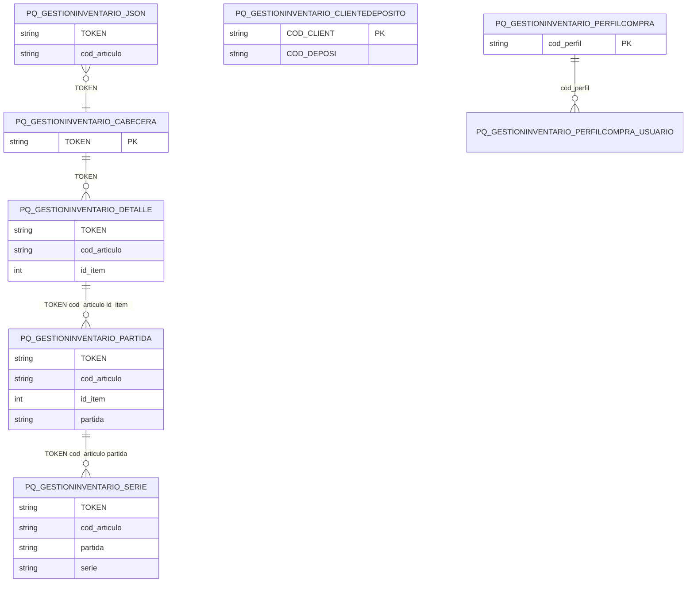

# Diseño de Tablas – Módulo PQ GESTIONINVENTARIO (Mobile)

Documentación del diseño y tablas del módulo de gestión de inventario móvil: cabecera de procesos, detalle, perfiles de compra/venta/ingreso/precios, clientes por depósito, partidas, series y transferencias.

**Tablas:** PQ_GESTIONINVENTARIO_JSON, PQ_GESTIONINVENTARIO_CABECERA, PQ_GESTIONINVENTARIO_CLIENTEDEPOSITO, PQ_GESTIONINVENTARIO_DETALLE, PQ_GESTIONINVENTARIO_PARTIDA, PQ_GESTIONINVENTARIO_PERFILCOMPRA, PQ_GESTIONINVENTARIO_PERFILCOMPRA_USUARIO, PQ_GESTIONINVENTARIO_PERFILINGRESO, PQ_GESTIONINVENTARIO_PERFILINGRESO_USUARIO, PQ_GESTIONINVENTARIO_PERFILPRECIOS, PQ_GESTIONINVENTARIO_PERFILPRECIOS_PRECIOS, PQ_GESTIONINVENTARIO_PERFILPRECIOS_USUARIOS, PQ_GESTIONINVENTARIO_PERFILVENTA, PQ_GESTIONINVENTARIO_PERFILVENTA_USUARIO, PQ_GESTIONINVENTARIO_SERIE, PQ_GESTIONINVENTARIO_TRANSFERENCIAS

---

## Dependencias previas

- Tablas Tango: clientes (COD_CLIENT), artículos (cod_articulo), depósitos.
- Usa tipos estándar SQL.

---

## 1. Resumen de tablas

| Tabla | PK / Clave | Descripción |
|-------|------------|-------------|
| PQ_GESTIONINVENTARIO_JSON | TOKEN, cod_articulo | Datos JSON de captura (origen del proceso) |
| PQ_GESTIONINVENTARIO_CABECERA | TOKEN | Cabecera de proceso (compra/venta/ingreso/traslado), generada desde JSON |
| PQ_GESTIONINVENTARIO_CLIENTEDEPOSITO | COD_CLIENT | Cliente ↔ depósito asociado |
| PQ_GESTIONINVENTARIO_DETALLE | TOKEN, cod_articulo, id_item | Detalle de ítems por proceso |
| PQ_GESTIONINVENTARIO_PARTIDA | TOKEN, cod_articulo, id_item, partida | Partidas de lotes (depende de DETALLE) |
| PQ_GESTIONINVENTARIO_PERFILCOMPRA | cod_perfil | Perfiles de compra |
| PQ_GESTIONINVENTARIO_PERFILCOMPRA_USUARIO | COD_PERFIL, USUARIO | Usuarios por perfil compra |
| PQ_GESTIONINVENTARIO_PERFILINGRESO | cod_perfil | Perfiles de ingreso |
| PQ_GESTIONINVENTARIO_PERFILINGRESO_USUARIO | COD_PERFIL, USUARIO | Usuarios por perfil ingreso |
| PQ_GESTIONINVENTARIO_PERFILPRECIOS | — | Perfiles de precios |
| PQ_GESTIONINVENTARIO_PERFILPRECIOS_PRECIOS | — | Precios por perfil |
| PQ_GESTIONINVENTARIO_PERFILPRECIOS_USUARIOS | COD_PERFIL, USUARIO | Usuarios por perfil precios |
| PQ_GESTIONINVENTARIO_PERFILVENTA | cod_perfil | Perfiles de venta |
| PQ_GESTIONINVENTARIO_PERFILVENTA_USUARIO | COD_PERFIL, USUARIO | Usuarios por perfil venta |
| PQ_GESTIONINVENTARIO_SERIE | TOKEN, cod_articulo, partida, serie | Series de artículos (depende de PARTIDA) |
| PQ_GESTIONINVENTARIO_TRANSFERENCIAS | COD_CLIENT, COD_DEPOSI, NRO_REMITO | Transferencias entre depósitos |

---

## 2. Diagrama ER (Mermaid)



---

## 3. Diagrama de relaciones (ASCII)

```
        JSON (TOKEN, cod_articulo)   ← datos crudos / captura desde dispositivo
              │
              ▼
        CABECERA (TOKEN)             ← proceso generado a partir del JSON
              │
              ▼
         DETALLE (TOKEN, cod_articulo, id_item)
              │
              ▼
         PARTIDA (TOKEN, cod_articulo, id_item, partida)  ← depende de DETALLE
              │
              ▼
         SERIE (TOKEN, cod_articulo, partida, serie)      ← depende de PARTIDA

    ┌─────────┼─────────────────────────┐
    ▼         ▼         ▼               ▼
PERFIL     PERFIL    PERFIL        PERFIL
COMPRA    INGRESO   PRECIOS        VENTA
    │         │         │               │
    └─────────┴──*_USUARIO─────────────┘
```

---

## 4. Scripts CREATE (documentados)

Los siguientes scripts se obtuvieron desde SQL Server. **No modificar.**

---

CREATE TABLE [dbo].[PQ_GESTIONINVENTARIO_CABECERA](
	[TOKEN] [nvarchar](255) NOT NULL,
	[proceso] [nvarchar](20) NOT NULL,
	[usuario] [nvarchar](120) NOT NULL,
	[cod_perfil] [nvarchar](6) NOT NULL,
	[cod_deposito] [nvarchar](10) NOT NULL,
	[cod_proveedor] [nvarchar](6) NULL,
	[cod_cliente] [nvarchar](6) NULL,
	[id_direccion_entrega] [int] NULL,
	[cod_deposito_destino] [nvarchar](10) NULL,
	[nro_comprobante] [nvarchar](15) NOT NULL,
	[t_comp] [nvarchar](3) NOT NULL,
	[cierra_pendientes] [bit] NULL,
	[traslado] [bit] NULL,
	[directo] [bit] NULL,
	[n_comp_tango] [nvarchar](15) NULL,
	[mensajeError] [nvarchar](255) NULL,
	[fecha] [datetime] NULL,
 CONSTRAINT [PK_PQ_GESTIONINVENTARIO_CABECERA] PRIMARY KEY CLUSTERED 
(
	[TOKEN] ASC
)WITH (PAD_INDEX = OFF, STATISTICS_NORECOMPUTE = OFF, IGNORE_DUP_KEY = OFF, ALLOW_ROW_LOCKS = ON, ALLOW_PAGE_LOCKS = ON) ON [PRIMARY]
) ON [PRIMARY]
GO

/****** Object:  Table [dbo].[PQ_GESTIONINVENTARIO_CLIENTEDEPOSITO]    Script Date: 17/2/2026 19:51:57 ******/
SET ANSI_NULLS ON
GO

SET QUOTED_IDENTIFIER ON
GO

CREATE TABLE [dbo].[PQ_GESTIONINVENTARIO_CLIENTEDEPOSITO](
	[COD_CLIENT] [varchar](6) NOT NULL,
	[COD_DEPOSI] [varchar](2) NOT NULL,
 CONSTRAINT [PK_PQ_GESTIONINVENTARIO_CLIENTEDEPOSITO] PRIMARY KEY CLUSTERED 
(
	[COD_CLIENT] ASC
)WITH (PAD_INDEX = OFF, STATISTICS_NORECOMPUTE = OFF, IGNORE_DUP_KEY = OFF, ALLOW_ROW_LOCKS = ON, ALLOW_PAGE_LOCKS = ON) ON [PRIMARY]
) ON [PRIMARY]
GO

/****** Object:  Table [dbo].[PQ_GESTIONINVENTARIO_DETALLE]    Script Date: 17/2/2026 19:51:57 ******/
SET ANSI_NULLS ON
GO

SET QUOTED_IDENTIFIER ON
GO

CREATE TABLE [dbo].[PQ_GESTIONINVENTARIO_DETALLE](
	[TOKEN] [nvarchar](255) NOT NULL,
	[cod_articulo] [nvarchar](15) NOT NULL,
	[id_item] [int] NOT NULL,
	[cantidad] [numeric](15, 4) NOT NULL,
	[vencto_art] [datetime] NULL,
 CONSTRAINT [PK_PQ_GESTIONINVENTARIO_DETALLE] PRIMARY KEY CLUSTERED 
(
	[TOKEN] ASC,
	[cod_articulo] ASC,
	[id_item] ASC
)WITH (PAD_INDEX = OFF, STATISTICS_NORECOMPUTE = OFF, IGNORE_DUP_KEY = OFF, ALLOW_ROW_LOCKS = ON, ALLOW_PAGE_LOCKS = ON) ON [PRIMARY]
) ON [PRIMARY]
GO

/****** Object:  Table [dbo].[PQ_GESTIONINVENTARIO_JSON]    Script Date: 17/2/2026 19:51:57 ******/
SET ANSI_NULLS ON
GO

SET QUOTED_IDENTIFIER ON
GO

CREATE TABLE [dbo].[PQ_GESTIONINVENTARIO_JSON](
	[TOKEN] [nvarchar](255) NOT NULL,
	[cod_articulo] [nvarchar](15) NOT NULL,
	[vencto_art] [datetime] NULL,
	[t_comp] [nvarchar](3) NOT NULL,
	[id] [int] NOT NULL,
	[cantidad] [numeric](15, 4) NOT NULL,
	[partida] [nvarchar](25) NULL,
	[despacho] [nvarchar](25) NULL,
	[pais] [nvarchar](20) NULL,
	[aduana] [nvarchar](20) NULL,
	[comentario] [nvarchar](20) NULL,
	[vencto] [datetime] NULL,
	[serie] [nvarchar](30) NULL,
	[descripcion_1] [nvarchar](25) NULL,
	[descripcion_2] [nvarchar](25) NULL,
	[cierre_pendiente] [bit] NULL
) ON [PRIMARY]
GO

/****** Object:  Table [dbo].[PQ_GESTIONINVENTARIO_PARTIDA]    Script Date: 17/2/2026 19:51:57 ******/
SET ANSI_NULLS ON
GO

SET QUOTED_IDENTIFIER ON
GO

CREATE TABLE [dbo].[PQ_GESTIONINVENTARIO_PARTIDA](
	[TOKEN] [nvarchar](255) NOT NULL,
	[cod_articulo] [nvarchar](15) NOT NULL,
	[id_item] [int] NOT NULL,
	[partida] [nvarchar](25) NOT NULL,
	[despacho] [nvarchar](25) NULL,
	[pais] [nvarchar](20) NULL,
	[aduana] [nvarchar](20) NULL,
	[comentario] [nvarchar](20) NULL,
	[vencto] [datetime] NULL,
	[cantidad] [numeric](15, 4) NOT NULL,
 CONSTRAINT [PK_PQ_GESTIONINVENTARIO_PARTIDA] PRIMARY KEY CLUSTERED 
(
	[TOKEN] ASC,
	[cod_articulo] ASC,
	[id_item] ASC,
	[partida] ASC
)WITH (PAD_INDEX = OFF, STATISTICS_NORECOMPUTE = OFF, IGNORE_DUP_KEY = OFF, ALLOW_ROW_LOCKS = ON, ALLOW_PAGE_LOCKS = ON) ON [PRIMARY]
) ON [PRIMARY]
GO

/****** Object:  Table [dbo].[PQ_GESTIONINVENTARIO_PERFILCOMPRA]    Script Date: 17/2/2026 19:51:57 ******/
SET ANSI_NULLS ON
GO

SET QUOTED_IDENTIFIER ON
GO

CREATE TABLE [dbo].[PQ_GESTIONINVENTARIO_PERFILCOMPRA](
	[cod_perfil] [varchar](10) NOT NULL,
	[descripcion] [varchar](50) NULL,
	[tipo_referencia] [char](1) NULL,
	[referencia_defecto] [char](3) NULL,
	[permite_agregar_articulos] [bit] NULL,
	[permite_agregar_cantidades] [bit] NULL,
	[porcentaje_desvio] [numeric](6, 2) NULL,
	[solicita_cierre_pendientes] [bit] NULL,
	[completo] [bit] NULL,
 CONSTRAINT [PK_PQ_GESTIONINVENTARIO_PERFILCOMPRA] PRIMARY KEY CLUSTERED 
(
	[cod_perfil] ASC
)WITH (PAD_INDEX = OFF, STATISTICS_NORECOMPUTE = OFF, IGNORE_DUP_KEY = OFF, ALLOW_ROW_LOCKS = ON, ALLOW_PAGE_LOCKS = ON) ON [PRIMARY]
) ON [PRIMARY]
GO

/****** Object:  Table [dbo].[PQ_GESTIONINVENTARIO_PERFILCOMPRA_USUARIO]    Script Date: 17/2/2026 19:51:57 ******/
SET ANSI_NULLS ON
GO

SET QUOTED_IDENTIFIER ON
GO

CREATE TABLE [dbo].[PQ_GESTIONINVENTARIO_PERFILCOMPRA_USUARIO](
	[COD_PERFIL] [varchar](10) NOT NULL,
	[USUARIO] [varchar](50) NOT NULL,
 CONSTRAINT [PK_PQ_GESTIONINVENTARIO_PERFILCOMPRA_USUARIO] PRIMARY KEY CLUSTERED 
(
	[COD_PERFIL] ASC,
	[USUARIO] ASC
)WITH (PAD_INDEX = OFF, STATISTICS_NORECOMPUTE = OFF, IGNORE_DUP_KEY = OFF, ALLOW_ROW_LOCKS = ON, ALLOW_PAGE_LOCKS = ON) ON [PRIMARY]
) ON [PRIMARY]
GO

/****** Object:  Table [dbo].[PQ_GESTIONINVENTARIO_PERFILINGRESO]    Script Date: 17/2/2026 19:51:57 ******/
SET ANSI_NULLS ON
GO

SET QUOTED_IDENTIFIER ON
GO

CREATE TABLE [dbo].[PQ_GESTIONINVENTARIO_PERFILINGRESO](
	[cod_perfil] [varchar](10) NOT NULL,
	[descripcion] [varchar](50) NULL,
	[tipo_referencia] [char](1) NULL,
	[referencia_defecto] [char](3) NULL,
	[t_comp] [varchar](3) NULL,
	[porcentaje_desvio] [numeric](6, 2) NULL,
	[permite_agregar_articulos] [bit] NULL,
	[permite_agregar_cantidades] [bit] NULL,
	[solicita_cierre_pendientes] [bit] NULL,
 CONSTRAINT [PK_PQ_GESTIONINVENTARIO_PERFILINGRESO] PRIMARY KEY CLUSTERED 
(
	[cod_perfil] ASC
)WITH (PAD_INDEX = OFF, STATISTICS_NORECOMPUTE = OFF, IGNORE_DUP_KEY = OFF, ALLOW_ROW_LOCKS = ON, ALLOW_PAGE_LOCKS = ON) ON [PRIMARY]
) ON [PRIMARY]
GO

/****** Object:  Table [dbo].[PQ_GESTIONINVENTARIO_PERFILINGRESO_USUARIO]    Script Date: 17/2/2026 19:51:57 ******/
SET ANSI_NULLS ON
GO

SET QUOTED_IDENTIFIER ON
GO

CREATE TABLE [dbo].[PQ_GESTIONINVENTARIO_PERFILINGRESO_USUARIO](
	[COD_PERFIL] [varchar](10) NOT NULL,
	[USUARIO] [varchar](50) NOT NULL,
 CONSTRAINT [PK_PQ_GESTIONINVENTARIO_PERFILINGRESO_USUARIO] PRIMARY KEY CLUSTERED 
(
	[COD_PERFIL] ASC,
	[USUARIO] ASC
)WITH (PAD_INDEX = OFF, STATISTICS_NORECOMPUTE = OFF, IGNORE_DUP_KEY = OFF, ALLOW_ROW_LOCKS = ON, ALLOW_PAGE_LOCKS = ON) ON [PRIMARY]
) ON [PRIMARY]
GO

/****** Object:  Table [dbo].[PQ_GESTIONINVENTARIO_PERFILPRECIOS]    Script Date: 17/2/2026 19:51:57 ******/
SET ANSI_NULLS ON
GO

SET QUOTED_IDENTIFIER ON
GO

CREATE TABLE [dbo].[PQ_GESTIONINVENTARIO_PERFILPRECIOS](
	[cod_perfil] [varchar](10) NULL,
	[descripcion] [varchar](50) NULL
) ON [PRIMARY]
GO

/****** Object:  Table [dbo].[PQ_GESTIONINVENTARIO_PERFILPRECIOS_PRECIOS]    Script Date: 17/2/2026 19:51:57 ******/
SET ANSI_NULLS ON
GO

SET QUOTED_IDENTIFIER ON
GO

CREATE TABLE [dbo].[PQ_GESTIONINVENTARIO_PERFILPRECIOS_PRECIOS](
	[cod_perfil] [varchar](10) NULL,
	[modulo] [char](50) NULL,
	[cod_lista] [int] NULL
) ON [PRIMARY]
GO

/****** Object:  Table [dbo].[PQ_GESTIONINVENTARIO_PERFILPRECIOS_USUARIOS]    Script Date: 17/2/2026 19:51:57 ******/
SET ANSI_NULLS ON
GO

SET QUOTED_IDENTIFIER ON
GO

CREATE TABLE [dbo].[PQ_GESTIONINVENTARIO_PERFILPRECIOS_USUARIOS](
	[COD_PERFIL] [varchar](10) NOT NULL,
	[USUARIO] [varchar](50) NOT NULL,
 CONSTRAINT [PK_PQ_GESTIONINVENTARIO_PERFILPRECIOS_USUARIO] PRIMARY KEY CLUSTERED 
(
	[COD_PERFIL] ASC,
	[USUARIO] ASC
)WITH (PAD_INDEX = OFF, STATISTICS_NORECOMPUTE = OFF, IGNORE_DUP_KEY = OFF, ALLOW_ROW_LOCKS = ON, ALLOW_PAGE_LOCKS = ON) ON [PRIMARY]
) ON [PRIMARY]
GO

/****** Object:  Table [dbo].[PQ_GESTIONINVENTARIO_PERFILVENTA]    Script Date: 17/2/2026 19:51:57 ******/
SET ANSI_NULLS ON
GO

SET QUOTED_IDENTIFIER ON
GO

CREATE TABLE [dbo].[PQ_GESTIONINVENTARIO_PERFILVENTA](
	[cod_perfil] [varchar](10) NOT NULL,
	[descripcion] [varchar](50) NULL,
	[tipo_referencia] [char](1) NULL,
	[referencia_defecto] [char](3) NULL,
	[permite_agregar_articulos] [bit] NULL,
	[permite_agregar_cantidades] [bit] NULL,
	[porcentaje_desvio] [numeric](6, 2) NULL,
	[solicita_cierre_pendientes] [bit] NULL,
	[traslado] [bit] NULL,
	[directo] [bit] NULL,
	[completo] [bit] NULL,
	[talonario] [int] NULL,
	[lista_precios] [int] NULL,
 CONSTRAINT [PK_PQ_GESTIONINVENTARIO_PERFILVENTA] PRIMARY KEY CLUSTERED 
(
	[cod_perfil] ASC
)WITH (PAD_INDEX = OFF, STATISTICS_NORECOMPUTE = OFF, IGNORE_DUP_KEY = OFF, ALLOW_ROW_LOCKS = ON, ALLOW_PAGE_LOCKS = ON) ON [PRIMARY]
) ON [PRIMARY]
GO

/****** Object:  Table [dbo].[PQ_GESTIONINVENTARIO_PERFILVENTA_USUARIO]    Script Date: 17/2/2026 19:51:57 ******/
SET ANSI_NULLS ON
GO

SET QUOTED_IDENTIFIER ON
GO

CREATE TABLE [dbo].[PQ_GESTIONINVENTARIO_PERFILVENTA_USUARIO](
	[COD_PERFIL] [varchar](10) NOT NULL,
	[USUARIO] [varchar](50) NOT NULL,
 CONSTRAINT [PK_PQ_GESTIONINVENTARIO_PERFILVENTA_USUARIO] PRIMARY KEY CLUSTERED 
(
	[COD_PERFIL] ASC,
	[USUARIO] ASC
)WITH (PAD_INDEX = OFF, STATISTICS_NORECOMPUTE = OFF, IGNORE_DUP_KEY = OFF, ALLOW_ROW_LOCKS = ON, ALLOW_PAGE_LOCKS = ON) ON [PRIMARY]
) ON [PRIMARY]
GO

/****** Object:  Table [dbo].[PQ_GESTIONINVENTARIO_SERIE]    Script Date: 17/2/2026 19:51:57 ******/
SET ANSI_NULLS ON
GO

SET QUOTED_IDENTIFIER ON
GO

CREATE TABLE [dbo].[PQ_GESTIONINVENTARIO_SERIE](
	[TOKEN] [nvarchar](255) NOT NULL,
	[cod_articulo] [nvarchar](15) NOT NULL,
	[id_item] [int] NOT NULL,
	[partida] [nvarchar](25) NOT NULL,
	[serie] [nvarchar](30) NOT NULL,
	[descripcion_1] [nvarchar](25) NOT NULL,
	[descripcion_2] [nvarchar](25) NOT NULL,
 CONSTRAINT [PK_PQ_GESTIONINVENTARIO_SERIE] PRIMARY KEY CLUSTERED 
(
	[TOKEN] ASC,
	[cod_articulo] ASC,
	[partida] ASC,
	[serie] ASC
)WITH (PAD_INDEX = OFF, STATISTICS_NORECOMPUTE = OFF, IGNORE_DUP_KEY = OFF, ALLOW_ROW_LOCKS = ON, ALLOW_PAGE_LOCKS = ON) ON [PRIMARY]
) ON [PRIMARY]
GO

/****** Object:  Table [dbo].[PQ_GESTIONINVENTARIO_TRANSFERENCIAS]    Script Date: 17/2/2026 19:51:57 ******/
SET ANSI_NULLS ON
GO

SET QUOTED_IDENTIFIER ON
GO

CREATE TABLE [dbo].[PQ_GESTIONINVENTARIO_TRANSFERENCIAS](
	[COD_CLIENT] [varchar](6) NOT NULL,
	[COD_DEPOSI] [varchar](2) NOT NULL,
	[NRO_REMITO] [varchar](14) NOT NULL,
	[TCOMP_IN_S_ENTRADA] [varchar](2) NULL,
	[NCOMP_IN_S_ENTRADA] [varchar](8) NULL,
	[TCOMP_IN_S_SALIDA] [varchar](2) NULL,
	[NCOMP_IN_S_SALIDA] [varchar](8) NULL,
 CONSTRAINT [PK_PQ_GESTIONINVENTARIO_TRANSFERENCIAS] PRIMARY KEY CLUSTERED 
(
	[COD_CLIENT] ASC,
	[COD_DEPOSI] ASC,
	[NRO_REMITO] ASC
)WITH (PAD_INDEX = OFF, STATISTICS_NORECOMPUTE = OFF, IGNORE_DUP_KEY = OFF, ALLOW_ROW_LOCKS = ON, ALLOW_PAGE_LOCKS = ON) ON [PRIMARY]
) ON [PRIMARY]
GO
