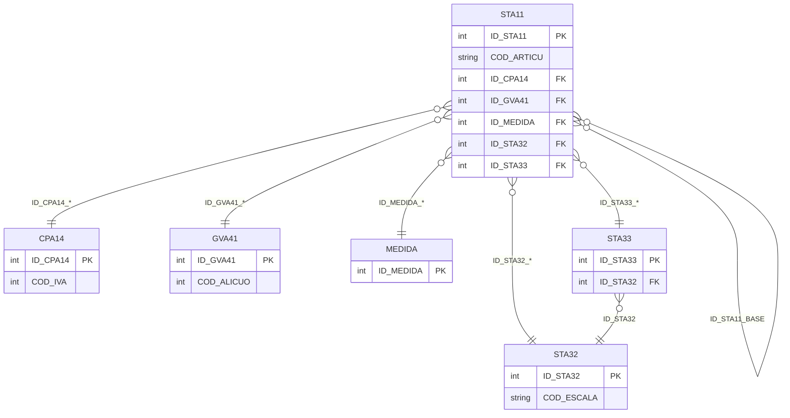

# Diseño de Tablas – Módulo Artículos

Documentación del diseño y tablas del módulo de artículos. Incluye maestro de artículos (STA11), impuestos ventas (GVA41), impuestos compras (CPA14), unidades de medida (MEDIDA), escalas (STA32, STA33).

**Tablas:** STA11, CPA14, GVA41, MEDIDA, STA32, STA33

---

## Dependencias previas

Para ejecutar los scripts CREATE, deben existir:

- Tipos de usuario (UDT): D_ID, D_CODIGO, D_DESCRIPCION, D_CANT_DECIMAL_ARTIC_UNI_ADIC, D_EQUIVALENCIA_UM, ENTERO_TG, DECIMAL_TG, ENTEROXL_TG, y tipos XML (CAMPOS_ADICIONALES_*).
- Esquemas XML para CAMPOS_ADICIONALES y tablas auxiliares.

---

## 1. Crear tipos de usuario (si no existen)

```sql
-- Tipos base usados en módulo artículos
CREATE TYPE dbo.D_ID FROM int;
CREATE TYPE dbo.D_CODIGO FROM varchar(20);
CREATE TYPE dbo.D_DESCRIPCION FROM varchar(60);
CREATE TYPE dbo.D_CANT_DECIMAL_ARTIC_UNI_ADIC FROM tinyint;
CREATE TYPE dbo.D_EQUIVALENCIA_UM FROM decimal(22,7);
CREATE TYPE dbo.ENTERO_TG FROM int;
CREATE TYPE dbo.DECIMAL_TG FROM decimal(22,7);
CREATE TYPE dbo.ENTEROXL_TG FROM float;
```

---

## 2. Secuencias

```sql
CREATE SEQUENCE dbo.SEQUENCE_STA11
    AS int START WITH 1 INCREMENT BY 1
    MINVALUE -9223372036854775808 MAXVALUE 9223372036854775807 NO CYCLE;

CREATE SEQUENCE dbo.SEQUENCE_CPA14
    AS int START WITH 1 INCREMENT BY 1
    MINVALUE -9223372036854775808 MAXVALUE 9223372036854775807 NO CYCLE;

CREATE SEQUENCE dbo.SEQUENCE_GVA41
    AS int START WITH 1 INCREMENT BY 1
    MINVALUE -9223372036854775808 MAXVALUE 9223372036854775807 NO CYCLE;

CREATE SEQUENCE dbo.SEQUENCE_MEDIDA
    AS int START WITH 1 INCREMENT BY 1
    MINVALUE -9223372036854775808 MAXVALUE 9223372036854775807 NO CYCLE;

CREATE SEQUENCE dbo.SEQUENCE_STA32
    AS int START WITH 1 INCREMENT BY 1
    MINVALUE -9223372036854775808 MAXVALUE 9223372036854775807 NO CYCLE;

CREATE SEQUENCE dbo.SEQUENCE_STA33
    AS int START WITH 1 INCREMENT BY 1
    MINVALUE -9223372036854775808 MAXVALUE 9223372036854775807 NO CYCLE;
```

---

## 3. Mapeo de tipos UDT a tipos base

| UDT                       | Tipo base     | Notas            |
|---------------------------|---------------|------------------|
| D_ID                      | int           | Identificadores  |
| D_CODIGO                  | varchar(20)    | Códigos          |
| D_DESCRIPCION             | varchar(60)    | Descripciones    |
| D_CANT_DECIMAL_ARTIC_UNI_ADIC | tinyint   | Decimales        |
| D_EQUIVALENCIA_UM         | decimal(22,7)  | Equivalencias UM |
| ENTERO_TG                 | int           | Enteros          |
| DECIMAL_TG                | decimal(22,7) | Importes, %      |
| ENTEROXL_TG               | float         | Números internos |

---

## 4. Diagrama ER (Mermaid)



---

## 5. Resumen de tablas

| Tabla | PK | Descripción |
|-------|-----|-------------|
| STA11 | ID_STA11 | Maestro de artículos |
| CPA14 | ID_CPA14 | Impuestos IVA compras |
| GVA41 | ID_GVA41 | Alícuotas/impuestos ventas |
| MEDIDA | ID_MEDIDA | Unidades de medida |
| STA32 | ID_STA32 | Escalas de artículos |
| STA33 | ID_STA33 | Valores de escala (vinculado a STA32) |

---

## 6. Diagrama de relaciones (ASCII)

```
                    STA11 (Artículos)
                         │
    ┌────────┬───────────┼───────────┬────────┬────────┐
    ▼        ▼           ▼           ▼        ▼        ▼
  CPA14    GVA41      MEDIDA      STA32    STA33    STA11
  (IVA CP) (IVA GV)  (unidades)   (escala)   │     (base)
                                             └──► STA32
```

---

## 7. Scripts CREATE (documentados)

Los siguientes scripts se obtuvieron desde SQL Server. **No modificar.**

---

/****** Object:  Table [dbo].[STA11]    Script Date: 17/2/2026 18:30:13 ******/
SET ANSI_NULLS ON
GO

SET QUOTED_IDENTIFIER ON
GO

CREATE TABLE [dbo].[STA11](
	[FILLER] [varchar](20) NULL,
	[ADJUNTO] [varchar](60) NULL,
	[ALI_NO_CAT] [dbo].[ENTERO_TG] NULL,
	[BAJA_STK] [varchar](2) NULL,
	[BMP] [varchar](60) NULL,
	[CL_SIAP_CP] [varchar](3) NULL,
	[CL_SIAP_GV] [varchar](3) NULL,
	[COD_ACTIVI] [dbo].[ENTERO_TG] NULL,
	[COD_ARTICU] [varchar](15) NOT NULL,
	[COD_BARRA] [varchar](40) NULL,
	[COD_DEP] [varchar](2) NULL,
	[COD_IB] [dbo].[ENTERO_TG] NULL,
	[COD_IB3] [dbo].[ENTERO_TG] NULL,
	[COD_II] [dbo].[ENTERO_TG] NULL,
	[COD_II_CO] [dbo].[ENTERO_TG] NULL,
	[COD_IVA] [dbo].[ENTERO_TG] NULL,
	[COD_IVA_CO] [dbo].[ENTERO_TG] NULL,
	[COD_S_II] [dbo].[ENTERO_TG] NULL,
	[COD_S_II_C] [dbo].[ENTERO_TG] NULL,
	[COD_S_IVA] [dbo].[ENTERO_TG] NULL,
	[COD_S_IV_C] [dbo].[ENTERO_TG] NULL,
	[COMISION_V] [dbo].[DECIMAL_TG] NULL,
	[CONSID_TMP] [bit] NULL,
	[CTA_COMPRA] [dbo].[ENTEROXL_TG] NULL,
	[CTA_VENTAS] [dbo].[ENTEROXL_TG] NULL,
	[CTO_COMPRA] [varchar](10) NULL,
	[CTO_VENTAS] [varchar](10) NULL,
	[DESC_ADIC] [varchar](20) NULL,
	[DESCRIPCIO] [varchar](50) NULL,
	[DESCUENTO] [dbo].[DECIMAL_TG] NULL,
	[DESTI_ART] [bit] NULL,
	[EQUIVALE_V] [dbo].[DECIMAL_TG] NULL,
	[ESCALA_1] [varchar](2) NULL,
	[ESCALA_2] [varchar](2) NULL,
	[ESPEC_AUTO] [varchar](1) NULL,
	[FACT_IMPOR] [bit] NULL,
	[FAVORITO] [bit] NULL,
	[FECHA_ALTA] [datetime] NULL,
	[GEN_IB] [bit] NULL,
	[GEN_IB3] [bit] NULL,
	[IMPR_CARTA] [bit] NULL,
	[IMPUESTO_I] [dbo].[DECIMAL_TG] NULL,
	[IMPUEST_IC] [dbo].[DECIMAL_TG] NULL,
	[MOD_DESCAR] [varchar](1) NULL,
	[PERC_NO_CA] [bit] NULL,
	[PERFIL] [varchar](1) NULL,
	[PORC_DESVI] [dbo].[DECIMAL_TG] NULL,
	[PORC_SCRAP] [dbo].[DECIMAL_TG] NULL,
	[PORC_UTILI] [dbo].[DECIMAL_TG] NULL,
	[PROMODESDE] [datetime] NULL,
	[PROMOHASTA] [datetime] NULL,
	[PROMO_MENU] [varchar](1) NULL,
	[PTO_PEDIDO] [dbo].[DECIMAL_TG] NULL,
	[PUNTAJE] [dbo].[ENTEROXL_TG] NULL,
	[RET_RNI] [bit] NULL,
	[RET_RNI_CO] [dbo].[ENTERO_TG] NULL,
	[SINONIMO] [varchar](15) NULL,
	[STOCK] [bit] NULL,
	[STOCK_MAXI] [dbo].[DECIMAL_TG] NULL,
	[STOCK_MINI] [dbo].[DECIMAL_TG] NULL,
	[STOCK_NEG] [bit] NULL,
	[TIEMPO] [varchar](4) NULL,
	[TIPO_PROMO] [varchar](1) NULL,
	[USA_ESC] [varchar](1) NULL,
	[USA_PARTID] [bit] NULL,
	[USA_SCRAP] [bit] NULL,
	[USA_SERIE] [bit] NULL,
	[FECHA_MODI] [datetime] NULL,
	[DISP_MOVIL] [varchar](1) NULL,
	[RENTA_UM_S] [varchar](1) NULL,
	[RENTA_UM_V] [varchar](1) NULL,
	[RENTA_PROD] [varchar](6) NULL,
	[RENTA_EQ_S] [dbo].[DECIMAL_TG] NULL,
	[RENTA_EQ_V] [dbo].[DECIMAL_TG] NULL,
	[GENERACOT] [bit] NULL,
	[USA_CTRPRE] [bit] NULL,
	[COD_II_V_2] [dbo].[ENTERO_TG] NULL,
	[COD_SII_V2] [dbo].[ENTERO_TG] NULL,
	[IMP_II_V_2] [dbo].[DECIMAL_TG] NULL,
	[AFIP_EQ_S] [dbo].[DECIMAL_TG] NULL,
	[AFIP_UM_V] [dbo].[ENTERO_TG] NULL,
	[AFIP_UM_S] [dbo].[ENTERO_TG] NULL,
	[AFIP_EQ_V] [dbo].[DECIMAL_TG] NULL,
	[BASE] [varchar](15) NULL,
	[VALOR1] [varchar](10) NULL,
	[VALOR2] [varchar](10) NULL,
	[MET_DES_PA] [varchar](3) NULL,
	[ORD_DES_PA] [varchar](1) NULL,
	[FERIADOS] [bit] NULL,
	[LUNES] [bit] NULL,
	[MARTES] [bit] NULL,
	[MIERCOLES] [bit] NULL,
	[JUEVES] [bit] NULL,
	[VIERNES] [bit] NULL,
	[SABADO] [bit] NULL,
	[DOMINGO] [bit] NULL,
	[COD_PLANTI] [varchar](10) NULL,
	[AFECTA_AF] [bit] NULL,
	[COD_TIPOB] [varchar](10) NULL,
	[REMITIBLE] [varchar](1) NULL,
	[CARGA_RAP] [varchar](1) NULL,
	[COD_STA11] [varchar](17) NOT NULL,
	[AFIP_UMEX_V] [dbo].[ENTERO_TG] NULL,
	[AFIP_UMEX_S] [dbo].[ENTERO_TG] NULL,
	[LLEVA_DOBLE_UNIDAD_MEDIDA] [bit] NULL,
	[EQUIVALENCIA_STOCK_2] [dbo].[DECIMAL_TG] NULL,
	[ID_MEDIDA_STOCK_2] [dbo].[D_ID] NULL,
	[ID_MEDIDA_STOCK] [dbo].[D_ID] NULL,
	[ID_MEDIDA_VENTAS] [dbo].[D_ID] NULL,
	[EQUIVALENCIA_MEDIDA_PESO] [dbo].[DECIMAL_TG] NULL,
	[EQUIVALENCIA_MEDIDA_VOLUMEN] [dbo].[DECIMAL_TG] NULL,
	[FECHA_INGRESO] [datetime] NULL,
	[USUARIO] [varchar](120) NULL,
	[TERMINAL] [varchar](255) NULL,
	[FECHA_ULTIMA_MODIFICACION] [datetime] NULL,
	[USUA_ULTIMA_MODIFICACION] [varchar](120) NULL,
	[TERM_ULTIMA_MODIFICACION] [varchar](255) NULL,
	[OBSERVACIONES] [varchar](max) NULL,
	[ID_STA11] [dbo].[D_ID] NOT NULL,
	[DESCARGA_NEGATIVO_STOCK] [bit] NULL,
	[DESCARGA_NEGATIVO_VENTAS] [bit] NULL,
	[ID_TYPS] [dbo].[D_ID] NULL,
	[ADMITE_VENTA_FRACCIONADA] [bit] NULL,
	[ADMITE_INVITACION] [bit] NULL,
	[TIPO_RECARGO_VENTA_FRACCIONADA] [varchar](1) NULL,
	[PORC_RECARGO_VENTA_FRACCIONADA] [dbo].[DECIMAL_TG] NULL,
	[IMP_RECARGO_VENTA_FRACCIONADA] [dbo].[DECIMAL_TG] NULL,
	[CIGARRILLO] [varchar](1) NULL,
	[RELACION_UNIDADES_STOCK] [varchar](1) NULL,
	[DESVIO_CONTROL_UNIDADES_STOCK] [dbo].[DECIMAL_TG] NULL,
	[DESVIO_CIERRE_PEDIDOS] [dbo].[DECIMAL_TG] NULL,
	[ID_MEDIDA_CONTROL_STOCK] [dbo].[D_ID] NULL,
	[USA_CONTROL_UNIDADES_STOCK] [bit] NULL,
	[PRODUCTO_TERMINADO_COT] [varchar](1) NULL,
	[COD_NCM] [varchar](11) NULL,
	[EDITA_PRECIO] [varchar](1) NULL,
	[DESCRIPCION_VARIABLE] [bit] NULL,
	[SERIE_DESC_ADICIONAL_1] [varchar](25) NULL,
	[SERIE_DESC_ADICIONAL_2] [varchar](25) NULL,
	[EGRESO_MODIFICA_PARTIDA_PROPUESTA] [varchar](1) NULL,
	[CALCULA_CM] [bit] NULL,
	[ORIGEN_PARA_CM] [varchar](1) NULL,
	[PUBLICA_WEB] [bit] NULL,
	[ID_ACTIVIDAD_DGI] [dbo].[D_ID] NULL,
	[PUBLICA_WEB_PEDIDO] [varchar](1) NULL,
	[SINCRONIZA_WEB_PEDIDO] [varchar](1) NULL,
	[DESCRIPCION_LARGA] [varchar](max) NULL,
	[ID_TRA_CLASE_ARTICULO] [dbo].[D_ID] NULL,
	[ID_CODIGO_ITEM_TURISMO] [dbo].[D_ID] NULL,
	[ID_TIPO_UNIDAD_TURISMO] [dbo].[D_ID] NULL,
	[ID_TIPO_ITEM_AFIP] [dbo].[D_ID] NULL,
	[SOLICITA_PRECIO] [varchar](1) NULL,
	[SEPARADOR_DEFECTO] [varchar](2) NULL,
	[REV_PEND] [bit] NOT NULL,
	[DESCRIPCION_RECETA] [varchar](max) NULL,
	[FECHA_MODI_PORC_UTILIDAD] [datetime] NULL,
	[ID_STA32_ESCALA_1] [dbo].[D_ID] NULL,
	[ID_STA32_ESCALA_2] [dbo].[D_ID] NULL,
	[ID_STA33_VALOR1] [dbo].[D_ID] NULL,
	[ID_STA33_VALOR2] [dbo].[D_ID] NULL,
	[ROW_VERSION] [timestamp] NOT NULL,
	[CAMPOS_ADICIONALES] [xml](CONTENT [dbo].[CAMPOS_ADICIONALES_STA11]) NULL,
	[ID_STA11_BASE] [dbo].[D_ID] NULL,
	[ID_GVA22] [dbo].[D_ID] NULL,
	[ID_TIPO_BIEN] [dbo].[D_ID] NULL,
	[ID_STA115] [dbo].[D_ID] NULL,
	[ID_GVA41_COD_IVA] [dbo].[D_ID] NULL,
	[ID_GVA41_COD_S_IVA] [dbo].[D_ID] NULL,
	[ID_GVA41_COD_II] [dbo].[D_ID] NULL,
	[ID_GVA41_COD_S_II] [dbo].[D_ID] NULL,
	[ID_GVA41_COD_II_V_2] [dbo].[D_ID] NULL,
	[ID_GVA41_COD_SII_V2] [dbo].[D_ID] NULL,
	[ID_GVA41_COD_IB] [dbo].[D_ID] NULL,
	[ID_GVA41_COD_IB3] [dbo].[D_ID] NULL,
	[ID_GVA41_ALI_NO_CAT] [dbo].[D_ID] NULL,
	[ID_CPA14_COD_IVA_CO] [dbo].[D_ID] NULL,
	[ID_CPA14_COD_S_IV_C] [dbo].[D_ID] NULL,
	[ID_CPA14_COD_II_CO] [dbo].[D_ID] NULL,
	[ID_CPA14_COD_S_II_C] [dbo].[D_ID] NULL,
	[ID_GVA125] [dbo].[D_ID] NULL,
	[ID_UNIDAD_MEDIDA_AFIP_UM_S] [dbo].[D_ID] NULL,
	[ID_UNIDAD_MEDIDA_AFIP_UM_V] [dbo].[D_ID] NULL,
	[ID_UNIDAD_MEDIDA_AFIP_UMEX_S] [dbo].[D_ID] NULL,
	[ID_UNIDAD_MEDIDA_AFIP_UMEX_V] [dbo].[D_ID] NULL,
	[ID_CLASIFICACION_SIAP_CL_SIAP_GV] [dbo].[D_ID] NULL,
	[ID_CLASIFICACION_SIAP_CL_SIAP_CP] [dbo].[D_ID] NULL,
	[ID_MODELO_PERCEPCION_VENTAS] [dbo].[D_ID] NULL,
	[ID_CPA01_HABITUAL] [dbo].[D_ID] NULL,
	[SINCRONIZA_NEXO_TIENDAS] [bit] NULL,
 CONSTRAINT [PK_STA11] PRIMARY KEY CLUSTERED 
(
	[ID_STA11] ASC
)WITH (PAD_INDEX = OFF, STATISTICS_NORECOMPUTE = OFF, IGNORE_DUP_KEY = OFF, ALLOW_ROW_LOCKS = ON, ALLOW_PAGE_LOCKS = ON, OPTIMIZE_FOR_SEQUENTIAL_KEY = OFF) ON [PRIMARY]
) ON [PRIMARY] TEXTIMAGE_ON [PRIMARY]
GO

/****** Object:  Table [dbo].[CPA14]    Script Date: 17/2/2026 18:31:27 ******/
SET ANSI_NULLS ON
GO

SET QUOTED_IDENTIFIER ON
GO

CREATE TABLE [dbo].[CPA14](
	[FILLER] [varchar](20) NULL,
	[COD_IVA] [dbo].[ENTERO_TG] NOT NULL,
	[DESC_IVA] [varchar](20) NULL,
	[IMP_GAN] [bit] NOT NULL,
	[JURISDIC] [varchar](1) NULL,
	[MINIMO] [dbo].[DECIMAL_TG] NOT NULL,
	[PERCEPCION] [bit] NOT NULL,
	[PORC_IVA] [dbo].[DECIMAL_TG] NOT NULL,
	[TIPO_ALI] [varchar](2) NULL,
	[COD_PROV] [varchar](2) NULL,
	[REC_BANC] [bit] NOT NULL,
	[AFEC_COSTO] [bit] NOT NULL,
	[CODIMP_SII] [varchar](3) NULL,
	[GRUPO] [varchar](2) NULL,
	[GRUPO_AGIP] [varchar](2) NULL,
	[GRUPO_MAGNITUDES_SUPERADAS_AGIP] [varchar](2) NULL,
	[GRUPO_EXENTOS_AGIP] [varchar](2) NULL,
	[GRUPO_REGIMEN_GENERAL_AGIP] [varchar](2) NULL,
	[DEVOLUCION_IVA_TURISMO] [bit] NOT NULL,
	[ROW_VERSION] [timestamp] NOT NULL,
	[CAMPOS_ADICIONALES] [xml](CONTENT [dbo].[CAMPOS_ADICIONALES_CPA14]) NULL,
	[ID_CPA14] [dbo].[D_ID] NOT NULL,
	[ID_CPA57] [dbo].[D_ID] NULL,
	[PADRON] [smallint] NULL,
	[GRUPO_PADRON] [varchar](2) NULL,
	[OBSERVACIONES] [varchar](max) NULL,
	[APLICA_IVA_SIMPLE] [bit] NULL,
	[REGIMEN_IVA_SIMPLE] [varchar](3) NULL,
 CONSTRAINT [PK_CPA14] PRIMARY KEY CLUSTERED 
(
	[ID_CPA14] ASC
)WITH (PAD_INDEX = OFF, STATISTICS_NORECOMPUTE = OFF, IGNORE_DUP_KEY = OFF, ALLOW_ROW_LOCKS = ON, ALLOW_PAGE_LOCKS = ON, OPTIMIZE_FOR_SEQUENTIAL_KEY = OFF) ON [PRIMARY]
) ON [PRIMARY] TEXTIMAGE_ON [PRIMARY]
GO
/****** Object:  Table [dbo].[GVA41]    Script Date: 17/2/2026 18:32:23 ******/
SET ANSI_NULLS ON
GO

SET QUOTED_IDENTIFIER ON
GO

CREATE TABLE [dbo].[GVA41](
	[FILLER] [varchar](20) NULL,
	[COD_ALICUO] [dbo].[ENTERO_TG] NOT NULL,
	[COD_REGIM] [dbo].[ENTERO_TG] NULL,
	[DESCRIPCIO] [varchar](20) NULL,
	[IMPORTE] [dbo].[DECIMAL_TG] NULL,
	[PORCENTAJE] [dbo].[DECIMAL_TG] NULL,
	[PROVINCIA] [varchar](2) NULL,
	[GRUPO] [varchar](2) NULL,
	[GRUPO_AGIP] [varchar](2) NULL,
	[COD_SII] [varchar](3) NULL,
	[GRUPO_MAGNITUDES_SUPERADAS_AGIP] [varchar](2) NULL,
	[GRUPO_EXENTOS_AGIP] [varchar](2) NULL,
	[GRUPO_REGIMEN_GENERAL_AGIP] [varchar](2) NULL,
	[COD_GVA18] [varchar](4) NULL,
	[OBSERVACIONES] [varchar](max) NULL,
	[ID_GVA41] [dbo].[D_ID] NOT NULL,
	[ROW_VERSION] [timestamp] NOT NULL,
	[CAMPOS_ADICIONALES] [xml](CONTENT [dbo].[CAMPOS_ADICIONALES_GVA41]) NULL,
	[ID_GVA18] [dbo].[D_ID] NULL,
	[PADRON] [smallint] NULL,
	[GRUPO_PADRON] [varchar](2) NULL,
 CONSTRAINT [PK_GVA41] PRIMARY KEY CLUSTERED 
(
	[ID_GVA41] ASC
)WITH (PAD_INDEX = OFF, STATISTICS_NORECOMPUTE = OFF, IGNORE_DUP_KEY = OFF, ALLOW_ROW_LOCKS = ON, ALLOW_PAGE_LOCKS = ON, OPTIMIZE_FOR_SEQUENTIAL_KEY = OFF) ON [PRIMARY]
) ON [PRIMARY] TEXTIMAGE_ON [PRIMARY]
GO
/****** Object:  Table [dbo].[MEDIDA]    Script Date: 17/2/2026 18:33:00 ******/
SET ANSI_NULLS ON
GO

SET QUOTED_IDENTIFIER ON
GO

CREATE TABLE [dbo].[MEDIDA](
	[ID_MEDIDA] [dbo].[D_ID] NOT NULL,
	[COD_MEDIDA] [dbo].[D_CODIGO] NOT NULL,
	[DESC_MEDIDA] [dbo].[D_DESCRIPCION] NULL,
	[SIGLA_MEDIDA] [varchar](3) NOT NULL,
	[CANT_DECIMAL_MEDIDA] [dbo].[D_CANT_DECIMAL_ARTIC_UNI_ADIC] NULL,
	[OBSERVACIONES] [varchar](1000) NULL,
	[TIPO_UNIDAD] [varchar](20) NULL,
	[COD_MEDIDA_AFIP] [int] NULL,
	[EQUIVALENCIA_AFIP] [dbo].[D_EQUIVALENCIA_UM] NULL,
	[COD_MEDIDA_TRANSPORTE] [char](1) NULL,
	[EQUIVALENCIA_TRANSPORTE] [dbo].[D_EQUIVALENCIA_UM] NULL,
	[SIGLA_SII] [varchar](4) NULL,
	[ROW_VERSION] [timestamp] NOT NULL,
	[CAMPOS_ADICIONALES] [xml](CONTENT [dbo].[CAMPOS_ADICIONALES_MEDIDA]) NULL,
	[ID_UNIDAD_MEDIDA_AFIP] [dbo].[D_ID] NULL,
 CONSTRAINT [PK_MEDIDA] PRIMARY KEY CLUSTERED 
(
	[ID_MEDIDA] ASC
)WITH (PAD_INDEX = OFF, STATISTICS_NORECOMPUTE = OFF, IGNORE_DUP_KEY = OFF, ALLOW_ROW_LOCKS = ON, ALLOW_PAGE_LOCKS = ON, OPTIMIZE_FOR_SEQUENTIAL_KEY = OFF) ON [PRIMARY]
) ON [PRIMARY] TEXTIMAGE_ON [PRIMARY]
GO
CREATE TABLE [dbo].[STA32](
	[FILLER] [varchar](20) NULL,
	[COD_ESCALA] [varchar](2) NOT NULL,
	[DESCRIP_ES] [varchar](30) NULL,
	[NRO_ESCALA] [dbo].[ENTERO_TG] NULL,
	[ID_STA32] [dbo].[D_ID] NOT NULL,
	[COD_STA32] [varchar](4) NOT NULL,
	[OBSERVACIONES] [varchar](1000) NULL,
	[ROW_VERSION] [timestamp] NOT NULL,
	[CAMPOS_ADICIONALES] [xml](CONTENT [dbo].[CAMPOS_ADICIONALES_STA32]) NULL,
 CONSTRAINT [PK_STA32] PRIMARY KEY CLUSTERED 
(
	[ID_STA32] ASC
)WITH (PAD_INDEX = OFF, STATISTICS_NORECOMPUTE = OFF, IGNORE_DUP_KEY = OFF, ALLOW_ROW_LOCKS = ON, ALLOW_PAGE_LOCKS = ON, OPTIMIZE_FOR_SEQUENTIAL_KEY = OFF) ON [PRIMARY]
) ON [PRIMARY] TEXTIMAGE_ON [PRIMARY]
GO

/****** Object:  Table [dbo].[STA33]    Script Date: 17/2/2026 18:33:56 ******/
SET ANSI_NULLS ON
GO

SET QUOTED_IDENTIFIER ON
GO

CREATE TABLE [dbo].[STA33](
	[FILLER] [varchar](20) NULL,
	[COD_ESCALA] [varchar](2) NOT NULL,
	[COD_VALOR] [varchar](10) NULL,
	[DESC_VALOR] [varchar](10) NULL,
	[ID_STA33] [dbo].[D_ID] NOT NULL,
	[ID_STA32] [dbo].[D_ID] NOT NULL,
	[ROW_VERSION] [timestamp] NOT NULL,
	[HABILITADO] [bit] NOT NULL,
 CONSTRAINT [PK_STA33] PRIMARY KEY CLUSTERED 
(
	[ID_STA33] ASC
)WITH (PAD_INDEX = OFF, STATISTICS_NORECOMPUTE = OFF, IGNORE_DUP_KEY = OFF, ALLOW_ROW_LOCKS = ON, ALLOW_PAGE_LOCKS = ON, OPTIMIZE_FOR_SEQUENTIAL_KEY = OFF) ON [PRIMARY]
) ON [PRIMARY]
GO
