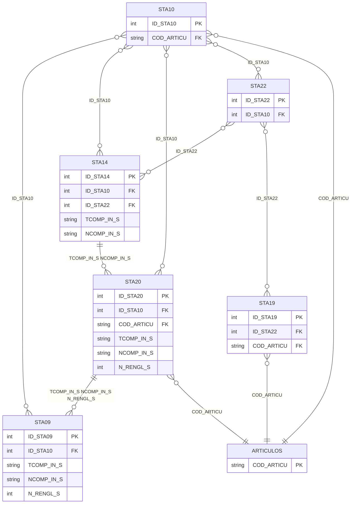

# Diseño de Tablas – Módulo Stock

Documentación del diseño y relaciones de las tablas del módulo de stock/inventarios. Incluye la entidad genérica **ARTICULOS** vinculada por COD_ARTICU.

**Tablas:** STA14, STA20, STA09, STA19, STA10, STA22

**Entidad externa:** ARTICULOS (módulo genérico vinculado por COD_ARTICU)

---

## Dependencias previas

Para ejecutar los scripts CREATE, deben existir:

- Tablas externas: tabla de artículos (COD_ARTICU), depósitos si aplica.
- Tipos de usuario (UDT): D_ID, DECIMAL_TG, ENTEROXL_TG, ENTERO_TG, T_D_RENGLON, T_D_FECHA y demás UDTs del ERP.

---

## 1. Crear tipos de usuario (si no existen)

```sql
-- Tipos base usados en módulo stock
CREATE TYPE dbo.D_ID FROM int;
CREATE TYPE dbo.DECIMAL_TG FROM decimal(22,7);
CREATE TYPE dbo.ENTEROXL_TG FROM float;
CREATE TYPE dbo.ENTERO_TG FROM int;
CREATE TYPE dbo.T_D_RENGLON FROM int;
CREATE TYPE dbo.T_D_FECHA FROM datetime;
```

---

## 2. Secuencias

```sql
CREATE SEQUENCE dbo.SEQUENCE_STA10
    AS int START WITH 1 INCREMENT BY 1
    MINVALUE -9223372036854775808 MAXVALUE 9223372036854775807 NO CYCLE;

CREATE SEQUENCE dbo.SEQUENCE_STA14
    AS int START WITH 1 INCREMENT BY 1
    MINVALUE -9223372036854775808 MAXVALUE 9223372036854775807 NO CYCLE;

CREATE SEQUENCE dbo.SEQUENCE_STA09
    AS int START WITH 1 INCREMENT BY 1
    MINVALUE -9223372036854775808 MAXVALUE 9223372036854775807 NO CYCLE;

CREATE SEQUENCE dbo.SEQUENCE_STA19
    AS int START WITH 1 INCREMENT BY 1
    MINVALUE -9223372036854775808 MAXVALUE 9223372036854775807 NO CYCLE;

CREATE SEQUENCE dbo.SEQUENCE_STA20
    AS int START WITH 1 INCREMENT BY 1
    MINVALUE -9223372036854775808 MAXVALUE 9223372036854775807 NO CYCLE;

CREATE SEQUENCE dbo.SEQUENCE_STA22
    AS int START WITH 1 INCREMENT BY 1
    MINVALUE -9223372036854775808 MAXVALUE 9223372036854775807 NO CYCLE;
```

---

## 3. Comando CREATE de cada tabla

> **Nota:** Las tablas operativas pueden tener muchas columnas. Los siguientes scripts muestran la estructura esencial (PK, FKs). El script completo puede generarse vía MCP o herramienta de scripting de SQL Server.

### STA08

CREATE TABLE [dbo].[STA08](
	[ID_STA08] [int] IDENTITY(1,1) NOT NULL,
	[FILLER] [varchar](20) NULL,
	[ADUANA] [varchar](20) NULL,
	[COD_PROVEE] [varchar](6) NULL,
	[COMENTARIO] [varchar](20) NULL,
	[FECHA] [datetime] NULL,
	[FECHA_VTO] [datetime] NULL,
	[ID_CARPETA] [varchar](13) NOT NULL,
	[N_COMP] [varchar](14) NULL,
	[N_DESPACHO] [varchar](25) NULL,
	[N_PARTIDA] [varchar](25) NOT NULL,
	[PAIS] [varchar](20) NULL,
	[T_COMP] [varchar](3) NULL,
	[PARTIDA_DESC_ADICIONAL_1] [varchar](25) NULL,
	[PARTIDA_DESC_ADICIONAL_2] [varchar](25) NULL,
	[ID_CPA01] [dbo].[D_ID] NULL,
	[ID_STA14] [dbo].[D_ID] NULL,
	[ID_STA13] [dbo].[D_ID] NULL,
	[ROW_VERSION] [timestamp] NOT NULL,
	[CAMPOS_ADICIONALES] [xml](CONTENT [dbo].[CAMPOS_ADICIONALES_STA08]) NULL,
 CONSTRAINT [PK_STA08] PRIMARY KEY CLUSTERED 
(
	[ID_STA08] ASC
)WITH (PAD_INDEX = OFF, STATISTICS_NORECOMPUTE = OFF, IGNORE_DUP_KEY = OFF, ALLOW_ROW_LOCKS = ON, ALLOW_PAGE_LOCKS = ON, FILLFACTOR = 90, OPTIMIZE_FOR_SEQUENTIAL_KEY = OFF) ON [PRIMARY]
) ON [PRIMARY] TEXTIMAGE_ON [PRIMARY]
GO

### STA09

CREATE TABLE [dbo].[STA09](
	[ID_STA09] [int] IDENTITY(1,1) NOT NULL,
	[FILLER] [varchar](20) NULL,
	[CANTIDAD] [dbo].[DECIMAL_TG] NULL,
	[COD_ARTICU] [varchar](15) NULL,
	[COD_DEPOSI] [varchar](2) NULL,
	[N_PARTIDA] [varchar](25) NULL,
	[N_RENGL_S] [dbo].[T_D_RENGLON] NOT NULL,
	[NCOMP_IN_S] [varchar](8) NOT NULL,
	[TCOMP_IN_S] [varchar](2) NOT NULL,
	[CANTIDAD_2] [dbo].[DECIMAL_TG] NULL,
	[CANT_DEV] [dbo].[DECIMAL_TG] NULL,
	[CANT_DEV_2] [dbo].[DECIMAL_TG] NULL,
	[ROW_VERSION] [timestamp] NOT NULL,
 CONSTRAINT [PK_STA09] PRIMARY KEY CLUSTERED 
(
	[ID_STA09] ASC
)WITH (PAD_INDEX = OFF, STATISTICS_NORECOMPUTE = OFF, IGNORE_DUP_KEY = OFF, ALLOW_ROW_LOCKS = ON, ALLOW_PAGE_LOCKS = ON, FILLFACTOR = 90, OPTIMIZE_FOR_SEQUENTIAL_KEY = OFF) ON [PRIMARY]
) ON [PRIMARY]
GO

### STA10

CREATE TABLE [dbo].[STA10](
	[ID_STA10] [int] IDENTITY(1,1) NOT NULL,
	[FILLER] [varchar](20) NULL,
	[CANT_DESPA] [dbo].[DECIMAL_TG] NULL,
	[CANTIDAD] [dbo].[DECIMAL_TG] NULL,
	[COD_ARTICU] [varchar](15) NOT NULL,
	[COD_DEPOSI] [varchar](2) NOT NULL,
	[COSTO_BLOQ] [bit] NULL,
	[COSTO_EX] [dbo].[DECIMAL_TG] NULL,
	[COSTO_LO] [dbo].[DECIMAL_TG] NULL,
	[N_PARTIDA] [varchar](25) NOT NULL,
	[SALDO_ANT] [dbo].[DECIMAL_TG] NULL,
	[EXP_SALDO] [bit] NULL,
	[FECHA] [datetime] NULL,
	[FECHA_VTO] [datetime] NULL,
	[CANTIDAD_2] [dbo].[DECIMAL_TG] NULL,
	[SALDO_ANT_STOCK_2] [dbo].[DECIMAL_TG] NULL,
	[CANT_DESPA_2] [dbo].[DECIMAL_TG] NULL,
	[ROW_VERSION] [timestamp] NOT NULL,
	[ID_STA08] [dbo].[D_ID] NULL,
	[ID_STA11] [dbo].[D_ID] NULL,
	[ID_STA22] [dbo].[D_ID] NULL,
 CONSTRAINT [PK_STA10] PRIMARY KEY CLUSTERED 
(
	[ID_STA10] ASC
)WITH (PAD_INDEX = OFF, STATISTICS_NORECOMPUTE = OFF, IGNORE_DUP_KEY = OFF, ALLOW_ROW_LOCKS = ON, ALLOW_PAGE_LOCKS = ON, FILLFACTOR = 90, OPTIMIZE_FOR_SEQUENTIAL_KEY = OFF) ON [PRIMARY]
) ON [PRIMARY]
GO

### STA14

CREATE TABLE [dbo].[STA14](
	[ID_STA14] [int] IDENTITY(1,1) NOT NULL,
	[FILLER] [varchar](20) NULL,
	[COD_PRO_CL] [varchar](6) NULL,
	[COTIZ] [dbo].[DECIMAL_TG] NULL,
	[ESTADO_MOV] [varchar](1) NULL,
	[EXPORTADO] [bit] NULL,
	[EXP_STOCK] [bit] NULL,
	[FECHA_ANU] [datetime] NULL,
	[FECHA_MOV] [datetime] NULL,
	[HORA] [varchar](4) NULL,
	[LISTA_REM] [dbo].[ENTERO_TG] NULL,
	[LOTE] [dbo].[ENTEROXL_TG] NULL,
	[LOTE_ANU] [dbo].[ENTEROXL_TG] NULL,
	[MON_CTE] [bit] NULL,
	[MOTIVO_REM] [varchar](1) NULL,
	[N_COMP] [varchar](14) NULL,
	[N_REMITO] [varchar](14) NULL,
	[NCOMP_IN_S] [varchar](8) NULL,
	[NCOMP_ORIG] [varchar](14) NULL,
	[NRO_SUCURS] [dbo].[ENTERO_TG] NULL,
	[OBSERVACIO] [varchar](30) NULL,
	[SUC_ORIG] [dbo].[ENTERO_TG] NULL,
	[T_COMP] [varchar](3) NULL,
	[TALONARIO] [dbo].[ENTERO_TG] NULL,
	[TCOMP_IN_S] [varchar](2) NOT NULL,
	[TCOMP_ORIG] [varchar](3) NULL,
	[USUARIO] [varchar](30) NULL,
	[COD_TRANSP] [varchar](10) NULL,
	[HORA_COMP] [varchar](6) NULL,
	[ID_A_RENTA] [dbo].[ENTEROXL_TG] NULL,
	[DOC_ELECTR] [bit] NULL,
	[COD_CLASIF] [varchar](6) NULL,
	[AUDIT_IMP] [varchar](60) NULL,
	[IMP_IVA] [dbo].[DECIMAL_TG] NULL,
	[IMP_OTIMP] [dbo].[DECIMAL_TG] NULL,
	[IMPORTE_BO] [dbo].[DECIMAL_TG] NULL,
	[IMPORTE_TO] [dbo].[DECIMAL_TG] NULL,
	[DIFERENCIA] [varchar](1) NULL,
	[SUC_DESTIN] [dbo].[ENTERO_TG] NULL,
	[T_DOC_DTE] [varchar](3) NULL,
	[LEYENDA1] [varchar](60) NULL,
	[LEYENDA2] [varchar](60) NULL,
	[LEYENDA3] [varchar](60) NULL,
	[LEYENDA4] [varchar](60) NULL,
	[LEYENDA5] [varchar](60) NULL,
	[DCTO_CLIEN] [dbo].[DECIMAL_TG] NULL,
	[T_INT_ORI] [varchar](2) NULL,
	[N_INT_ORI] [varchar](8) NULL,
	[FECHA_INGRESO] [datetime] NULL,
	[HORA_INGRESO] [varchar](6) NULL,
	[USUARIO_INGRESO] [varchar](120) NULL,
	[TERMINAL_INGRESO] [varchar](255) NULL,
	[IMPORTE_TOTAL_CON_IMPUESTOS] [dbo].[DECIMAL_TG] NULL,
	[CANTIDAD_KILOS] [dbo].[DECIMAL_TG] NULL,
	[ID_DIRECCION_ENTREGA] [dbo].[D_ID] NULL,
	[IMPORTE_GRAVADO] [dbo].[DECIMAL_TG] NULL,
	[IMPORTE_EXENTO] [dbo].[DECIMAL_TG] NULL,
	[ID_STA13] [dbo].[D_ID] NULL,
	[NRO_SUCURSAL_DESTINO_REMITO] [dbo].[ENTERO_TG] NULL,
	[ROW_VERSION] [timestamp] NOT NULL,
	[ID_GVA14] [dbo].[D_ID] NULL,
	[CAMPOS_ADICIONALES] [xml](CONTENT [dbo].[CAMPOS_ADICIONALES_STA14]) NULL,
 CONSTRAINT [PK_STA14] PRIMARY KEY CLUSTERED 
(
	[ID_STA14] ASC
)WITH (PAD_INDEX = OFF, STATISTICS_NORECOMPUTE = OFF, IGNORE_DUP_KEY = OFF, ALLOW_ROW_LOCKS = ON, ALLOW_PAGE_LOCKS = ON, FILLFACTOR = 90, OPTIMIZE_FOR_SEQUENTIAL_KEY = OFF) ON [PRIMARY]
) ON [PRIMARY] TEXTIMAGE_ON [PRIMARY]
GO

### STA20

CREATE TABLE [dbo].[STA20](
	[ID_STA20] [int] IDENTITY(1,1) NOT NULL,
	[FILLER] [varchar](20) NULL,
	[CAN_EQUI_V] [dbo].[DECIMAL_TG] NULL,
	[CANT_DEV] [dbo].[DECIMAL_TG] NULL,
	[CANT_OC] [dbo].[DECIMAL_TG] NULL,
	[CANT_PEND] [dbo].[DECIMAL_TG] NULL,
	[CANT_SCRAP] [dbo].[DECIMAL_TG] NULL,
	[CANTIDAD] [dbo].[DECIMAL_TG] NULL,
	[COD_ARTICU] [varchar](15) NULL,
	[COD_DEPOSI] [varchar](2) NULL,
	[DEPOSI_DDE] [varchar](2) NULL,
	[EQUIVALENC] [dbo].[DECIMAL_TG] NULL,
	[FECHA_MOV] [datetime] NULL,
	[N_ORDEN_CO] [varchar](14) NULL,
	[N_RENGL_OC] [dbo].[T_D_RENGLON] NULL,
	[N_RENGL_S] [dbo].[T_D_RENGLON] NULL,
	[NCOMP_IN_S] [varchar](8) NOT NULL,
	[PLISTA_REM] [dbo].[DECIMAL_TG] NULL,
	[PPP_EX] [dbo].[DECIMAL_TG] NULL,
	[PPP_LO] [dbo].[DECIMAL_TG] NULL,
	[PRECIO] [dbo].[DECIMAL_TG] NULL,
	[PRECIO_REM] [dbo].[DECIMAL_TG] NULL,
	[TCOMP_IN_S] [varchar](2) NULL,
	[TIPO_MOV] [varchar](1) NULL,
	[COD_CLASIF] [varchar](6) NULL,
	[CANT_FACTU] [dbo].[DECIMAL_TG] NULL,
	[DCTO_FACTU] [dbo].[DECIMAL_TG] NULL,
	[CANT_DEV_2] [dbo].[DECIMAL_TG] NULL,
	[CANT_PEND_2] [dbo].[DECIMAL_TG] NULL,
	[CANTIDAD_2] [dbo].[DECIMAL_TG] NULL,
	[CANT_FACTU_2] [dbo].[DECIMAL_TG] NULL,
	[ID_MEDIDA_STOCK_2] [dbo].[D_ID] NULL,
	[ID_MEDIDA_STOCK] [dbo].[D_ID] NULL,
	[ID_MEDIDA_VENTAS] [dbo].[D_ID] NULL,
	[ID_MEDIDA_COMPRA] [dbo].[D_ID] NULL,
	[UNIDAD_MEDIDA_SELECCIONADA] [char](1) NULL,
	[PRECIO_REMITO_VENTAS] [dbo].[DECIMAL_TG] NULL,
	[CANT_OC_2] [dbo].[DECIMAL_TG] NULL,
	[RENGL_PADR] [dbo].[T_D_RENGLON] NULL,
	[COD_ARTICU_KIT] [varchar](15) NULL,
	[PROMOCION] [bit] NULL,
	[PRECIO_ADICIONAL_KIT] [dbo].[DECIMAL_TG] NULL,
	[TALONARIO_OC] [dbo].[ENTERO_TG] NULL,
	[ID_STA11] [dbo].[D_ID] NULL,
	[ID_STA14] [dbo].[D_ID] NULL,
	[ROW_VERSION] [timestamp] NOT NULL,
	[COD_DEPOSI_INGRESO] [varchar](2) NULL,
	[OBSERVACIONES] [varchar](8000) NULL,
 CONSTRAINT [PK_STA20] PRIMARY KEY CLUSTERED 
(
	[ID_STA20] ASC
)WITH (PAD_INDEX = OFF, STATISTICS_NORECOMPUTE = OFF, IGNORE_DUP_KEY = OFF, ALLOW_ROW_LOCKS = ON, ALLOW_PAGE_LOCKS = ON, FILLFACTOR = 90, OPTIMIZE_FOR_SEQUENTIAL_KEY = OFF) ON [PRIMARY]
) ON [PRIMARY]
GO

### STA22

CREATE TABLE [dbo].[STA22](
	[FILLER] [varchar](20) NULL,
	[ABASTECE] [bit] NULL,
	[COD_SUCURS] [varchar](2) NOT NULL,
	[DIR_SUCURS] [varchar](30) NULL,
	[NOMBRE_SUC] [varchar](30) NULL,
	[INHABILITA] [bit] NULL,
	[COD_STA22] [varchar](10) NOT NULL,
	[SUCURSAL_DESTINO] [dbo].[ENTERO_TG] NULL,
	[SINCRONIZA_NEXO_PEDIDOS] [bit] NULL,
	[OBSERVACIONES] [varchar](max) NULL,
	[ID_STA22] [dbo].[D_ID] NOT NULL,
	[ID_SUCURSAL] [dbo].[D_ID] NULL,
	[ROW_VERSION] [timestamp] NOT NULL,
	[CAMPOS_ADICIONALES] [xml](CONTENT [dbo].[CAMPOS_ADICIONALES_STA22]) NULL,
 CONSTRAINT [PK_STA22] PRIMARY KEY CLUSTERED 
(
	[ID_STA22] ASC
)WITH (PAD_INDEX = OFF, STATISTICS_NORECOMPUTE = OFF, IGNORE_DUP_KEY = OFF, ALLOW_ROW_LOCKS = ON, ALLOW_PAGE_LOCKS = ON, OPTIMIZE_FOR_SEQUENTIAL_KEY = OFF) ON [PRIMARY]
) ON [PRIMARY] TEXTIMAGE_ON [PRIMARY]
GO

-- Relación lógica: STA14 → STA20 por TCOMP_IN_S, NCOMP_IN_S
-- Relación lógica: STA20 → STA09 por TCOMP_IN_S, NCOMP_IN_S, N_RENGL_S
-- Relación lógica: STA20 → ARTICULOS por COD_ARTICU
```

---

## Mapeo de tipos UDT a tipos base

| UDT          | Tipo base     | Notas            |
|--------------|---------------|------------------|
| D_ID         | int           | Identificadores  |
| DECIMAL_TG   | decimal(22,7) | Cantidades, %    |
| ENTEROXL_TG  | float         | Números internos |
| ENTERO_TG    | int           | Enteros          |
| T_D_RENGLON  | int           | Número renglón   |
| T_D_FECHA    | datetime      | Fechas           |

---

## Diagrama ER (Mermaid)



---

## Resumen de tablas

| Tabla | PK | Descripción |
|-------|-----|-------------|
| STA10 | ID_STA10 | Depósitos / almacenes |
| STA09 | ID_STA09 | Stock por depósito / artículos |
| STA14 | ID_STA14 | Movimientos de stock |
| STA19 | ID_STA19 | Detalle de movimientos |
| STA20 | ID_STA20 | Stock actual / auxiliar |
| STA22 | ID_STA22 | Cabecera de movimientos |

---

## Relaciones (solo entre estas tablas)

| Tabla origen | Tabla destino | Columna(s) enlace | Cardinalidad |
|--------------|--------------|-------------------|--------------|
| STA09 | STA10 | ID_STA10 | |
| STA14 | STA10 | ID_STA10 | |
| STA14 | STA22 | ID_STA22 | |
| STA14 | STA20 | TCOMP_IN_S, NCOMP_IN_S | 1 a 1 o muchos |
| STA19 | STA22 | ID_STA22 | |
| STA20 | STA10 | ID_STA10 | |
| STA20 | STA09 | TCOMP_IN_S, NCOMP_IN_S, N_RENGL_S | 1 a 0, 1 o muchos |
| STA22 | STA10 | ID_STA10 | |

## Relaciones con módulo externo ARTICULOS

| Tabla origen | Tabla destino | Columna(s) enlace |
|--------------|--------------|-------------------|
| STA10 | ARTICULOS | COD_ARTICU |
| STA19 | ARTICULOS | COD_ARTICU |
| STA20 | ARTICULOS | COD_ARTICU |

---

## Diagrama de relaciones (ASCII)

```
                         ARTICULOS (COD_ARTICU)
                              ▲  ▲  ▲
                              │  │  │
                    STA10 ────┘  │  └──── STA19
                    STA20 ───────┘
                         
                         STA10 (Depósitos)
                    ┌─────┼─────┬─────┬─────┐
                    ▼     ▼     ▼     ▼     ▼
                  STA09 STA14 STA20 STA22
                    ▲     │     │     │
                    │     │     │     ├──► STA14
                    │     │     │     └──► STA19
                    │     └──┬──┘
                    │        │
                    │   STA14 ──TCOMP_IN_S,NCOMP_IN_S──► STA20
                    │
                    └── STA20 ──TCOMP_IN_S,NCOMP_IN_S,N_RENGL_S──► STA09
```

---

## Notas

- **ARTICULOS:** Módulo genérico externo; vinculado con STA10, STA19 y STA20 por COD_ARTICU.
- **STA10** suele ser la tabla maestra de depósitos/almacenes; otras tablas la referencian.
- **STA22** y **STA14/STA19** forman la jerarquía típica de movimientos (cabecera–renglones).
- **STA14 → STA20:** relación por comprobante interno stock (TCOMP_IN_S, NCOMP_IN_S). Cardinalidad: **1 a 1 o muchos**.
- **STA20 → STA09:** relación por comprobante y renglón (TCOMP_IN_S, NCOMP_IN_S, N_RENGL_S). Cardinalidad: **1 a 0, 1 o muchos**.
- Las relaciones exactas y el número de columnas pueden variar; validar con el esquema real vía MCP o scripting de SQL Server.
