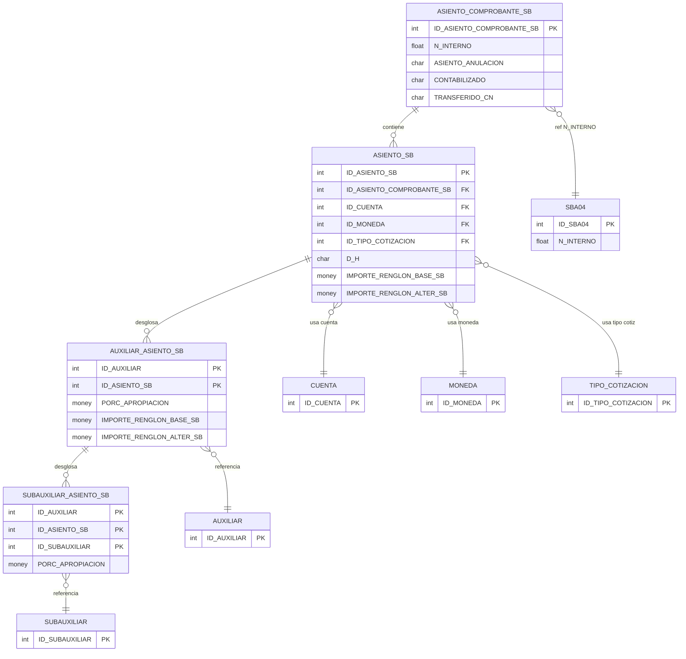

# Diseño de Tablas – Tesorería Contable

Documentación de las tablas de asientos contables obtenidas desde SQL Server mediante MCP.

**Tablas:** `ASIENTO_COMPROBANTE_SB`, `ASIENTO_SB`, `AUXILIAR_ASIENTO_SB`, `SUBAUXILIAR_ASIENTO_SB`


### Diagrama ER (Mermaid)



---

## Dependencias previas

Para ejecutar estos scripts, deben existir:

- Tablas: `CUENTA`, `MONEDA`, `TIPO_COTIZACION`, `AUXILIAR`, `SUBAUXILIAR`
- Tipos de usuario (UDT): `D_ID`, `D_SINO_NO`, `D_SINO_SI`, `D_NRO_ORDEN`, `D_IMPORTE_SB`, `D_LEYENDA_ASIENTO`, `D_DEBE_HABER`, `D_COTIZACION`, `D_PORCENTAJES`, `ENTEROXL_TG`

---

## 1. Crear tipos de usuario (si no existen)

```sql
-- Tipos base usados en tesorería-contable
CREATE TYPE dbo.D_ID FROM int;
CREATE TYPE dbo.D_SINO_NO FROM char(1);
CREATE TYPE dbo.D_SINO_SI FROM char(1);
CREATE TYPE dbo.D_NRO_ORDEN FROM int;
CREATE TYPE dbo.D_IMPORTE_SB FROM money;
CREATE TYPE dbo.D_LEYENDA_ASIENTO FROM varchar(100);
CREATE TYPE dbo.D_DEBE_HABER FROM char(1);
CREATE TYPE dbo.D_COTIZACION FROM decimal(17,7);
CREATE TYPE dbo.D_PORCENTAJES FROM money;
CREATE TYPE dbo.ENTEROXL_TG FROM float;
```

---

## 2. Secuencias

```sql
CREATE SEQUENCE dbo.SEQUENCE_ASIENTO_COMPROBANTE_SB
    AS int
    START WITH 1
    INCREMENT BY 1
    MINVALUE -9223372036854775808
    MAXVALUE 9223372036854775807
    NO CYCLE;

CREATE SEQUENCE dbo.SEQUENCE_ASIENTO_SB
    AS int
    START WITH 1
    INCREMENT BY 1
    MINVALUE -9223372036854775808
    MAXVALUE 9223372036854775807
    NO CYCLE;
```

---

## 3. Tabla ASIENTO_COMPROBANTE_SB

Encabezado de comprobantes contables.

```sql
CREATE TABLE dbo.ASIENTO_COMPROBANTE_SB (
    ID_ASIENTO_COMPROBANTE_SB  D_ID NOT NULL
        DEFAULT (NEXT VALUE FOR dbo.SEQUENCE_ASIENTO_COMPROBANTE_SB),
    N_INTERNO                  ENTEROXL_TG NOT NULL,
    ASIENTO_ANULACION          D_SINO_NO NOT NULL,
    CONTABILIZADO              D_SINO_NO NOT NULL,
    USUARIO_CONTABILIZACION    varchar(120) NULL,
    FECHA_CONTABILIZACION      datetime NULL,
    TERMINAL_CONTABILIZACION   varchar(255) NULL,
    TRANSFERIDO_CN             D_SINO_NO NOT NULL,

    CONSTRAINT PK_ASIENTO_COMPROBANTE_SB PRIMARY KEY (ID_ASIENTO_COMPROBANTE_SB)
);
```

---

## 4. Tabla ASIENTO_SB

Renglones del asiento contable.

```sql
CREATE TABLE dbo.ASIENTO_SB (
    ID_ASIENTO_SB              D_ID NOT NULL
        DEFAULT (NEXT VALUE FOR dbo.SEQUENCE_ASIENTO_SB),
    ID_ASIENTO_COMPROBANTE_SB  D_ID NOT NULL,
    NRO_RENGLON_ASIENTO_SB     D_NRO_ORDEN NOT NULL,
    ID_CUENTA                  D_ID NOT NULL,
    D_H                        D_DEBE_HABER NOT NULL,
    IMPORTE_RENGLON_BASE_SB    D_IMPORTE_SB NOT NULL,
    IMPORTE_RENGLON_ALTER_SB    D_IMPORTE_SB NOT NULL,
    DESC_LEYENDA               D_LEYENDA_ASIENTO NULL,
    EDITA_CUENTA               D_SINO_NO NOT NULL,
    ID_MONEDA                  D_ID NULL,
    ID_TIPO_COTIZACION         D_ID NULL,
    COTIZACION_MONEDA          D_COTIZACION NULL,
    IMPORTE_MONEDA_SB          D_IMPORTE_SB NULL,

    CONSTRAINT PK_ASIENTO_SB PRIMARY KEY (ID_ASIENTO_SB),
    CONSTRAINT FK_ASIENTO_COMP_SB FOREIGN KEY (ID_ASIENTO_COMPROBANTE_SB)
        REFERENCES dbo.ASIENTO_COMPROBANTE_SB (ID_ASIENTO_COMPROBANTE_SB),
    CONSTRAINT FK_CUENTA_ASIENTO_SB FOREIGN KEY (ID_CUENTA)
        REFERENCES dbo.CUENTA (ID_CUENTA),
    CONSTRAINT FK_MONEDA_ASIENTO_SB FOREIGN KEY (ID_MONEDA)
        REFERENCES dbo.MONEDA (ID_MONEDA),
    CONSTRAINT FK_TIPO_COTIZACION_ASIENTO_SB FOREIGN KEY (ID_TIPO_COTIZACION)
        REFERENCES dbo.TIPO_COTIZACION (ID_TIPO_COTIZACION)
);
```

---

## 5. Tabla AUXILIAR_ASIENTO_SB

Desglose por auxiliar (cuenta contable).

```sql
CREATE TABLE dbo.AUXILIAR_ASIENTO_SB (
    ID_ASIENTO_SB              D_ID NOT NULL,
    ID_AUXILIAR                 D_ID NOT NULL,
    PORC_APROPIACION            D_PORCENTAJES NOT NULL,
    IMPORTE_RENGLON_BASE_SB     D_IMPORTE_SB NOT NULL,
    IMPORTE_RENGLON_ALTER_SB     D_IMPORTE_SB NOT NULL,
    EDITA_APROPIACION           D_SINO_SI NOT NULL,

    CONSTRAINT PK_AUXILIAR_ASIENTO_SB PRIMARY KEY (ID_AUXILIAR, ID_ASIENTO_SB),
    CONSTRAINT FK_ASIENTO_SB_AUXILIAR FOREIGN KEY (ID_ASIENTO_SB)
        REFERENCES dbo.ASIENTO_SB (ID_ASIENTO_SB),
    CONSTRAINT FK_AUXILIAR_ASIENTO_SB FOREIGN KEY (ID_AUXILIAR)
        REFERENCES dbo.AUXILIAR (ID_AUXILIAR)
);
```

---

## 6. Tabla SUBAUXILIAR_ASIENTO_SB

Desglose por subauxiliar.

```sql
CREATE TABLE dbo.SUBAUXILIAR_ASIENTO_SB (
    ID_ASIENTO_SB              D_ID NOT NULL,
    ID_AUXILIAR                 D_ID NOT NULL,
    ID_SUBAUXILIAR              D_ID NOT NULL,
    PORC_APROPIACION            D_PORCENTAJES NOT NULL,
    IMPORTE_RENGLON_BASE_SB     D_IMPORTE_SB NOT NULL,
    IMPORTE_RENGLON_ALTER_SB     D_IMPORTE_SB NOT NULL,
    EDITA_APROPIACION           D_SINO_SI NOT NULL,

    CONSTRAINT PK_SUBAUXILIAR_ASIENTO_SB PRIMARY KEY (ID_AUXILIAR, ID_ASIENTO_SB, ID_SUBAUXILIAR),
    CONSTRAINT FK_AUXILIAR_SUBAUXILIAR_ASIENTO_SB FOREIGN KEY (ID_AUXILIAR, ID_ASIENTO_SB)
        REFERENCES dbo.AUXILIAR_ASIENTO_SB (ID_AUXILIAR, ID_ASIENTO_SB),
    CONSTRAINT FK_SUBAUXILIAR_ASIENTO_SB FOREIGN KEY (ID_SUBAUXILIAR)
        REFERENCES dbo.SUBAUXILIAR (ID_SUBAUXILIAR)
);

-- Índices para FKs
CREATE NONCLUSTERED INDEX AUXILIAR_SUBAUXILIAR_ASIENTO_SB_FK
    ON dbo.SUBAUXILIAR_ASIENTO_SB (ID_AUXILIAR, ID_ASIENTO_SB);

CREATE NONCLUSTERED INDEX SUBAUXILIAR_ASIENTO_SB_FK
    ON dbo.SUBAUXILIAR_ASIENTO_SB (ID_SUBAUXILIAR);
```

---

## Diagrama de relaciones

```
ASIENTO_COMPROBANTE_SB (1) ─────── (*) ASIENTO_SB
         │                              │
         └── SBA04 (N_INTERNO)          ├── CUENTA
                                        ├── MONEDA
                                        └── TIPO_COTIZACION
                                        │
                                        (1) ──── (*) AUXILIAR_ASIENTO_SB ─── AUXILIAR
                                                        │
                                                        (1) ─── (*) SUBAUXILIAR_ASIENTO_SB ─── SUBAUXILIAR
```

---

## Mapeo de tipos UDT a tipos base

| UDT               | Tipo base   | Notas          |
|-------------------|------------|----------------|
| D_ID              | int        | Identificadores|
| D_SINO_NO         | char(1)    | Sí/No          |
| D_SINO_SI         | char(1)    | Sí/No          |
| D_NRO_ORDEN       | int        | Número de orden|
| D_IMPORTE_SB      | money      | Importes       |
| D_LEYENDA_ASIENTO | varchar(100)| Leyenda        |
| D_DEBE_HABER      | char(1)    | D/H            |
| D_COTIZACION      | decimal(17,7)| Cotización    |
| D_PORCENTAJES     | money      | Porcentajes    |
| ENTEROXL_TG       | float      | Número interno |

---

*Documento generado a partir del esquema de SQL Server vía MCP user-mssql.*
