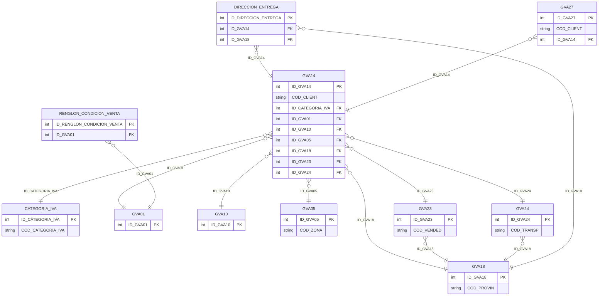

# Diseño de Tablas – Módulo Clientes

Documentación del diseño y tablas del módulo de clientes. Incluye maestros de clientes (GVA14), condiciones de venta (GVA01, RENGLON_CONDICION_VENTA), listas de precios (GVA10), categoría IVA, zonas, vendedores, transportes y provincias.

**Tablas:** CATEGORIA_IVA, GVA01, GVA10, GVA14, GVA18, GVA23, GVA24, RENGLON_CONDICION_VENTA, GVA05, DIRECCION_ENTREGA, GVA27

---

## Dependencias previas

Para ejecutar los scripts CREATE, deben existir:

- Tipos de usuario (UDT): D_ID, D_DESCRIPCION, D_SINO_SI, D_SINO, D_SEXO, ENTERO_TG, DECIMAL_TG, ENTEROXL_TG, y tipos XML (CAMPOS_ADICIONALES_*, CA_1096_*).
- Esquemas XML para CAMPOS_ADICIONALES y tablas auxiliares.

---

## 1. Crear tipos de usuario (si no existen)

```sql
-- Tipos base usados en módulo clientes
CREATE TYPE dbo.D_ID FROM int;
CREATE TYPE dbo.D_DESCRIPCION FROM varchar(60);
CREATE TYPE dbo.D_SINO_SI FROM char(1);
CREATE TYPE dbo.D_SINO FROM char(1);
CREATE TYPE dbo.D_SEXO FROM char(1);
CREATE TYPE dbo.ENTERO_TG FROM int;
CREATE TYPE dbo.DECIMAL_TG FROM decimal(22,7);
CREATE TYPE dbo.ENTEROXL_TG FROM float;
```

---

## 2. Secuencias

```sql
CREATE SEQUENCE dbo.SEQUENCE_CATEGORIA_IVA
    AS int START WITH 1 INCREMENT BY 1
    MINVALUE -9223372036854775808 MAXVALUE 9223372036854775807 NO CYCLE;

CREATE SEQUENCE dbo.SEQUENCE_GVA01
    AS int START WITH 1 INCREMENT BY 1
    MINVALUE -9223372036854775808 MAXVALUE 9223372036854775807 NO CYCLE;

CREATE SEQUENCE dbo.SEQUENCE_GVA10
    AS int START WITH 1 INCREMENT BY 1
    MINVALUE -9223372036854775808 MAXVALUE 9223372036854775807 NO CYCLE;

CREATE SEQUENCE dbo.SEQUENCE_GVA14
    AS int START WITH 1 INCREMENT BY 1
    MINVALUE -9223372036854775808 MAXVALUE 9223372036854775807 NO CYCLE;

CREATE SEQUENCE dbo.SEQUENCE_GVA18
    AS int START WITH 1 INCREMENT BY 1
    MINVALUE -9223372036854775808 MAXVALUE 9223372036854775807 NO CYCLE;

CREATE SEQUENCE dbo.SEQUENCE_GVA23
    AS int START WITH 1 INCREMENT BY 1
    MINVALUE -9223372036854775808 MAXVALUE 9223372036854775807 NO CYCLE;

CREATE SEQUENCE dbo.SEQUENCE_GVA24
    AS int START WITH 1 INCREMENT BY 1
    MINVALUE -9223372036854775808 MAXVALUE 9223372036854775807 NO CYCLE;

CREATE SEQUENCE dbo.SEQUENCE_GVA05
    AS int START WITH 1 INCREMENT BY 1
    MINVALUE -9223372036854775808 MAXVALUE 9223372036854775807 NO CYCLE;

CREATE SEQUENCE dbo.SEQUENCE_RENGLON_CONDICION_VENTA
    AS int START WITH 1 INCREMENT BY 1
    MINVALUE -9223372036854775808 MAXVALUE 9223372036854775807 NO CYCLE;

CREATE SEQUENCE dbo.SEQUENCE_DIRECCION_ENTREGA
    AS int START WITH 1 INCREMENT BY 1
    MINVALUE -9223372036854775808 MAXVALUE 9223372036854775807 NO CYCLE;

CREATE SEQUENCE dbo.SEQUENCE_GVA27
    AS int START WITH 1 INCREMENT BY 1
    MINVALUE -9223372036854775808 MAXVALUE 9223372036854775807 NO CYCLE;
```

---

## 3. Mapeo de tipos UDT a tipos base

| UDT          | Tipo base     | Notas            |
|--------------|---------------|------------------|
| D_ID         | int           | Identificadores  |
| D_DESCRIPCION| varchar(60)   | Descripciones    |
| D_SINO_SI    | char(1)       | Sí/No (SI)       |
| D_SINO       | char(1)       | Sí/No genérico   |
| D_SEXO       | char(1)       | Sexo             |
| ENTERO_TG    | int           | Enteros          |
| DECIMAL_TG   | decimal(22,7) | Importes, %      |
| ENTEROXL_TG  | float         | Números internos |

---

## 4. Diagrama ER (Mermaid)



---

## 5. Resumen de tablas

| Tabla | PK | Descripción |
|-------|-----|-------------|
| CATEGORIA_IVA | ID_CATEGORIA_IVA | Categorías impositivas IVA |
| GVA01 | ID_GVA01 | Condiciones de venta |
| GVA10 | ID_GVA10 | Listas de precios |
| GVA14 | ID_GVA14 | Maestro de clientes |
| GVA18 | ID_GVA18 | Provincias |
| GVA23 | ID_GVA23 | Vendedores |
| GVA24 | ID_GVA24 | Transportes |
| GVA05 | ID_GVA05 | Zonas de venta |
| RENGLON_CONDICION_VENTA | ID_RENGLON_CONDICION_VENTA | Renglones de condiciones de venta |
| DIRECCION_ENTREGA | ID_DIRECCION_ENTREGA | Direcciones de entrega de clientes |
| GVA27 | ID_GVA27 | Contactos / personas de clientes |

---

## 6. Diagrama de relaciones (ASCII)

```
                    GVA14 (Clientes)
                         │
    ┌────────┬───────────┼───────────┬────────┬────────┬────────┬──────────────────┐
    ▼        ▼           ▼           ▼        ▼        ▼        ▼                  ▼
 CATEGORIA  GVA01      GVA10       GVA05   GVA18    GVA23    GVA24   DIRECCION_ENTREGA  GVA27
   IVA       │                      │       ▲        │        │            │          (contactos)
             └── RENGLON_COND ──────┘       │        └──┬─────┘            │
                                            └──────────┘                  └──► GVA18
                                         (provincias)
```

---

## 7. Scripts CREATE (documentados)

Los siguientes scripts se obtuvieron desde SQL Server. **No modificar.**

---

/****** Object:  Table [dbo].[CATEGORIA_IVA]    Script Date: 17/2/2026 18:23:23 ******/
SET ANSI_NULLS ON
GO

SET QUOTED_IDENTIFIER ON
GO

CREATE TABLE [dbo].[CATEGORIA_IVA](
	[ID_CATEGORIA_IVA] [dbo].[D_ID] NOT NULL,
	[COD_CATEGORIA_IVA] [varchar](3) NOT NULL,
	[DESC_CATEGORIA_IVA] [dbo].[D_DESCRIPCION] NOT NULL,
	[ID_AFIP] [int] NOT NULL,
 CONSTRAINT [PK_CATEGORIA_IVA] PRIMARY KEY CLUSTERED 
(
	[ID_CATEGORIA_IVA] ASC
)WITH (PAD_INDEX = OFF, STATISTICS_NORECOMPUTE = OFF, IGNORE_DUP_KEY = OFF, ALLOW_ROW_LOCKS = ON, ALLOW_PAGE_LOCKS = ON, OPTIMIZE_FOR_SEQUENTIAL_KEY = OFF) ON [PRIMARY]
) ON [PRIMARY]
GO

/****** Object:  Table [dbo].[GVA01]    Script Date: 17/2/2026 18:23:24 ******/
SET ANSI_NULLS ON
GO

SET QUOTED_IDENTIFIER ON
GO

CREATE TABLE [dbo].[GVA01](
	[FILLER] [varchar](20) NULL,
	[COND_VTA] [dbo].[ENTERO_TG] NULL,
	[DESC_COND] [varchar](60) NULL,
	[FAC_CREDIT] [bit] NULL,
	[NRO_DE_LIS] [dbo].[ENTERO_TG] NULL,
	[PAGO_CF] [dbo].[ENTERO_TG] NULL,
	[APLICA_MORA] [varchar](1) NULL,
	[ID_INTERES_POR_MORA] [dbo].[D_ID] NULL,
	[OBSERVACIONES] [varchar](max) NULL,
	[GENERA_FECHAS_ALTERNATIVAS] [varchar](1) NULL,
	[FECHA_VIGENCIA_DESDE] [datetime] NULL,
	[FECHA_VIGENCIA_HASTA] [datetime] NULL,
	[CONTADO] [varchar](1) NULL,
	[CALCULA_INTERESES] [varchar](1) NULL,
	[ID_GVA01] [dbo].[D_ID] NOT NULL,
	[ROW_VERSION] [timestamp] NOT NULL,
	[CAMPOS_ADICIONALES] [xml](CONTENT [dbo].[CAMPOS_ADICIONALES_GVA01]) NULL,
	[ID_GVA10] [dbo].[D_ID] NULL,
	[ACEPTA_CONTADO] [bit] NOT NULL,
	[PORC_MIN_CONTADO] [dbo].[DECIMAL_TG] NOT NULL,
	[ACEPTA_CTA] [bit] NOT NULL,
	[TIPO_ASIGNACION] [varchar](1) NULL,
	[OBLIGA_CONTADO] [bit] NOT NULL,
 CONSTRAINT [PK_GVA01] PRIMARY KEY CLUSTERED 
(
	[ID_GVA01] ASC
)WITH (PAD_INDEX = OFF, STATISTICS_NORECOMPUTE = OFF, IGNORE_DUP_KEY = OFF, ALLOW_ROW_LOCKS = ON, ALLOW_PAGE_LOCKS = ON, OPTIMIZE_FOR_SEQUENTIAL_KEY = OFF) ON [PRIMARY]
) ON [PRIMARY] TEXTIMAGE_ON [PRIMARY]
GO

/****** Object:  Table [dbo].[GVA10]    Script Date: 17/2/2026 18:23:24 ******/
SET ANSI_NULLS ON
GO

SET QUOTED_IDENTIFIER ON
GO

CREATE TABLE [dbo].[GVA10](
	[FILLER] [varchar](20) NULL,
	[DECIMALES] [dbo].[ENTERO_TG] NULL,
	[FEC_DESDE] [datetime] NULL,
	[FEC_HASTA] [datetime] NULL,
	[HABILITADA] [bit] NULL,
	[INCLUY_IMP] [bit] NULL,
	[INCLUY_IVA] [bit] NULL,
	[MON_CTE] [bit] NULL,
	[NOMBRE_LIS] [varchar](20) NULL,
	[NRO_DE_LIS] [dbo].[ENTERO_TG] NOT NULL,
	[OBSERVAC] [varchar](max) NULL,
	[PUBLICADA_WEBCLIENTES] [varchar](1) NULL,
	[PUBLICADA_WEB_CLIENTES] [varchar](1) NULL,
	[SINCRONIZA_WEB_PEDIDO] [varchar](1) NULL,
	[ID_GVA10] [dbo].[D_ID] NOT NULL,
	[ROW_VERSION] [timestamp] NOT NULL,
	[CAMPOS_ADICIONALES] [xml](CONTENT [dbo].[CAMPOS_ADICIONALES_GVA10]) NULL,
 CONSTRAINT [PK_GVA10] PRIMARY KEY CLUSTERED 
(
	[ID_GVA10] ASC
)WITH (PAD_INDEX = OFF, STATISTICS_NORECOMPUTE = OFF, IGNORE_DUP_KEY = OFF, ALLOW_ROW_LOCKS = ON, ALLOW_PAGE_LOCKS = ON, OPTIMIZE_FOR_SEQUENTIAL_KEY = OFF) ON [PRIMARY]
) ON [PRIMARY] TEXTIMAGE_ON [PRIMARY]
GO

/****** Object:  Table [dbo].[GVA14]    Script Date: 17/2/2026 18:23:24 ******/
SET ANSI_NULLS ON
GO

SET QUOTED_IDENTIFIER ON
GO

CREATE TABLE [dbo].[GVA14](
	[FILLER] [varchar](20) NULL,
	[ADJUNTO] [varchar](60) NULL,
	[ALI_NO_CAT] [dbo].[ENTERO_TG] NULL,
	[BMP] [varchar](60) NULL,
	[C_POSTAL] [varchar](8) NULL,
	[CALLE] [varchar](30) NULL,
	[CALLE2_ENV] [varchar](30) NULL,
	[CLAUSULA] [bit] NULL,
	[CLAVE_IS] [varchar](6) NULL,
	[COD_CLIENT] [varchar](6) NOT NULL,
	[COD_PROVIN] [varchar](2) NULL,
	[COD_TRANSP] [varchar](10) NULL,
	[COD_VENDED] [varchar](10) NULL,
	[COD_ZONA] [varchar](2) NULL,
	[COND_VTA] [dbo].[ENTERO_TG] NULL,
	[CUIT] [varchar](20) NULL,
	[CUMPLEANIO] [datetime] NULL,
	[CUPO_CREDI] [dbo].[DECIMAL_TG] NULL,
	[DIR_COM] [varchar](55) NULL,
	[DOMICILIO] [varchar](30) NULL,
	[DTO_ENVIO] [varchar](6) NULL,
	[DTO_LEGAL] [varchar](6) NULL,
	[E_MAIL] [varchar](255) NULL,
	[ENV_DOMIC] [varchar](30) NULL,
	[ENV_LOCAL] [varchar](20) NULL,
	[ENV_POSTAL] [varchar](8) NULL,
	[ENV_PROV] [varchar](2) NULL,
	[EXPORTA] [bit] NULL,
	[FECHA_ALTA] [datetime] NULL,
	[FECHA_ANT] [datetime] NULL,
	[FECHA_DESD] [datetime] NULL,
	[FECHA_HAST] [datetime] NULL,
	[FECHA_INHA] [datetime] NULL,
	[FECHA_VTO] [datetime] NULL,
	[GRUPO_EMPR] [varchar](6) NULL,
	[ID_EXTERNO] [varchar](17) NULL,
	[ID_INTERNO] [varchar](17) NULL,
	[II_D] [varchar](1) NULL,
	[II_L] [varchar](1) NULL,
	[IVA_D] [varchar](1) NULL,
	[IVA_L] [varchar](1) NULL,
	[LOCALIDAD] [varchar](20) NULL,
	[N_IMPUESTO] [varchar](160) NULL,
	[N_ING_BRUT] [varchar](20) NULL,
	[NOM_COM] [varchar](60) NULL,
	[NRO_ENVIO] [varchar](9) NULL,
	[NRO_LEGAL] [varchar](9) NULL,
	[NRO_LISTA] [dbo].[ENTERO_TG] NULL,
	[OBSERVACIO] [varchar](60) NULL,
	[PARTIDOENV] [varchar](30) NULL,
	[PERMITE_IS] [bit] NULL,
	[PISO_ENVIO] [varchar](12) NULL,
	[PISO_LEGAL] [varchar](12) NULL,
	[PORC_DESC] [dbo].[DECIMAL_TG] NULL,
	[PORC_EXCL] [dbo].[DECIMAL_TG] NULL,
	[PORC_RECAR] [dbo].[DECIMAL_TG] NULL,
	[PUNTAJE] [dbo].[ENTEROXL_TG] NULL,
	[RAZON_SOCI] [varchar](60) NULL,
	[SALDO_ANT] [dbo].[DECIMAL_TG] NULL,
	[SALDO_CC] [dbo].[DECIMAL_TG] NULL,
	[SALDO_DOC] [dbo].[DECIMAL_TG] NULL,
	[SALDO_D_UN] [dbo].[DECIMAL_TG] NULL,
	[SOBRE_II] [varchar](1) NULL,
	[SOBRE_IVA] [varchar](1) NULL,
	[TELEFONO_1] [varchar](30) NULL,
	[TELEFONO_2] [varchar](30) NULL,
	[TIPO] [varchar](1) NULL,
	[TIPO_DOC] [dbo].[ENTERO_TG] NULL,
	[ZONA_ENVIO] [varchar](2) NULL,
	[FECHA_MODI] [datetime] NULL,
	[EXP_SALDO] [bit] NULL,
	[N_PAGOELEC] [varchar](14) NULL,
	[MON_CTE] [bit] NULL,
	[SAL_AN_UN] [dbo].[DECIMAL_TG] NULL,
	[SALDO_CC_U] [dbo].[DECIMAL_TG] NULL,
	[RG_1361] [bit] NULL,
	[SUCUR_ORI] [dbo].[ENTERO_TG] NULL,
	[LIMCRE_EN] [varchar](1) NULL,
	[CAL_DEB_IN] [bit] NULL,
	[PORCE_INT] [dbo].[DECIMAL_TG] NULL,
	[MON_MI_IN] [dbo].[DECIMAL_TG] NULL,
	[DIAS_MI_IN] [dbo].[ENTERO_TG] NULL,
	[DESTINO_DE] [varchar](1) NULL,
	[CLA_IMP_CL] [varchar](6) NULL,
	[RECIBE_DE] [bit] NULL,
	[AUT_DE] [bit] NULL,
	[MAIL_DE] [varchar](255) NULL,
	[WEB] [varchar](60) NULL,
	[COD_RUBRO] [varchar](4) NULL,
	[CTA_CLI] [dbo].[ENTEROXL_TG] NULL,
	[CTO_CLI] [varchar](10) NULL,
	[COD_GVA14] [varchar](10) NOT NULL,
	[CBU] [varchar](22) NULL,
	[IDENTIF_AFIP] [varchar](50) NULL,
	[IDIOMA_CTE] [varchar](1) NULL,
	[DET_ARTIC] [varchar](1) NULL,
	[INC_COMENT] [varchar](1) NULL,
	[ID_GVA44_FEX] [dbo].[D_ID] NULL,
	[ID_GVA44_NCEX] [dbo].[D_ID] NULL,
	[ID_GVA44_NDEX] [dbo].[D_ID] NULL,
	[CIUDAD] [varchar](100) NULL,
	[CIUDAD_ENVIO] [varchar](100) NULL,
	[APLICA_MORA] [varchar](1) NULL,
	[ID_INTERES_POR_MORA] [dbo].[D_ID] NULL,
	[PUBLICA_WEB_CLIENTES] [varchar](1) NULL,
	[MAIL_NEXO] [varchar](255) NULL,
	[AUTORIZADO_WEB_CLIENTES] [varchar](1) NULL,
	[OBSERVACIONES] [varchar](max) NULL,
	[RG_3572_EMPRESA_VINCULADA_CLIENTE] [bit] NULL,
	[RG_3572_TIPO_OPERACION_HABITUAL_VENTAS] [varchar](2) NULL,
	[COD_GVA18] [varchar](4) NULL,
	[COD_GVA24] [varchar](12) NULL,
	[COD_GVA23] [varchar](12) NULL,
	[COD_GVA05] [varchar](4) NULL,
	[COD_GVA62] [varchar](8) NULL,
	[COD_GVA151] [varchar](5) NULL,
	[COBRA_LUNES] [varchar](1) NULL,
	[COBRA_MARTES] [varchar](1) NULL,
	[COBRA_MIERCOLES] [varchar](1) NULL,
	[COBRA_JUEVES] [varchar](1) NULL,
	[COBRA_VIERNES] [varchar](1) NULL,
	[COBRA_SABADO] [varchar](1) NULL,
	[COBRA_DOMINGO] [varchar](1) NULL,
	[HORARIO_COBRANZA] [varchar](100) NULL,
	[COMENTARIO_TYP_FAC] [varchar](100) NULL,
	[COMENTARIO_TYP_ND] [varchar](100) NULL,
	[COMENTARIO_TYP_NC] [varchar](100) NULL,
	[TELEFONO_MOVIL] [varchar](30) NULL,
	[ID_CATEGORIA_IVA] [dbo].[D_ID] NULL,
	[ID_GVA14] [dbo].[D_ID] NOT NULL,
	[COD_GVA150] [varchar](8) NULL,
	[TYP_FEX] [varchar](1) NULL,
	[TYP_NCEX] [varchar](1) NULL,
	[TYP_NDEX] [varchar](1) NULL,
	[COD_ACT_CNA25] [varchar](12) NULL,
	[COD_GVA05_ENV] [varchar](4) NULL,
	[COD_GVA18_ENV] [varchar](4) NULL,
	[RG_3685_TIPO_OPERACION_VENTAS] [varchar](1) NULL,
	[REQUIERE_INFORMACION_ADICIONAL] [varchar](1) NULL,
	[INHABILITADO_NEXO_PEDIDOS] [varchar](1) NOT NULL,
	[ID_TIPO_DOCUMENTO_EXTERIOR] [dbo].[D_ID] NULL,
	[NUMERO_DOCUMENTO_EXTERIOR] [varchar](20) NULL,
	[WEB_CLIENT_ID] [int] NULL,
	[NRO_INSCR_RG1817] [varchar](15) NULL,
	[CODIGO_AFINIDAD] [varchar](255) NULL,
	[CA_1096_CONTROL_BACKUP] [dbo].[D_SINO] NULL,
	[CA_1096_MAILS_DESTINATARIOS] [dbo].[CA_1096_MAILS_DESTINATARIOS] NULL,
	[CA_1096_CODIGO_CLIENTE_BACKUP] [dbo].[CA_1096_CODIGO_CLIENTE_BACKUP] NULL,
	[INHABILITADO_NEXO_COBRANZAS] [varchar](1) NULL,
	[ID_TRA_ORIGEN_INFORMACION] [dbo].[D_ID] NULL,
	[SEXO] [dbo].[D_SEXO] NULL,
	[ROW_VERSION] [timestamp] NOT NULL,
	[ID_GVA62] [dbo].[D_ID] NULL,
	[ID_GVA18] [dbo].[D_ID] NULL,
	[CAMPOS_ADICIONALES] [xml](CONTENT [dbo].[CAMPOS_ADICIONALES_GVA14]) NULL,
	[ID_GVA05] [dbo].[D_ID] NULL,
	[ID_GVA151] [dbo].[D_ID] NULL,
	[ID_GVA23] [dbo].[D_ID] NULL,
	[ID_GVA24] [dbo].[D_ID] NULL,
	[ID_GVA41_NO_CAT] [dbo].[D_ID] NULL,
	[ID_RG_3572_TIPO_OPERACION_HABITUAL] [dbo].[D_ID] NULL,
	[ID_RG_3685_TIPO_OPERACION_VENTAS] [dbo].[D_ID] NULL,
	[ID_GVA150] [dbo].[D_ID] NULL,
	[ID_TIPO_DOCUMENTO_GV] [dbo].[D_ID] NULL,
	[ID_GVA01] [dbo].[D_ID] NULL,
	[ID_GVA10] [dbo].[D_ID] NULL,
	[ID_SUCURSAL] [dbo].[D_ID] NULL,
	[ID_GVA05_ENV] [dbo].[D_ID] NULL,
	[ID_GVA18_ENV] [dbo].[D_ID] NULL,
	[CM_VIGENCIA_COEFICIENTE] [datetime] NULL,
	[ID_SUCURSAL_DESTINO_FACTURA_REMITO] [dbo].[D_ID] NULL,
	[ID_SUCURSAL_DESTINO_FACTURA] [dbo].[D_ID] NULL,
	[TELEFONO_MOVIL_WA] [varchar](255) NULL,
	[HABILITADO]  AS (CONVERT([bit],case when isnull([GVA14].[FECHA_INHA],(0))<=(0) OR [GVA14].[FECHA_INHA]>getdate() then (1) else (0) end)),
	[ID_FORMULARIO_GRAFICO_FEX] [int] NULL,
	[ID_FORMULARIO_GRAFICO_NCEX] [int] NULL,
	[ID_FORMULARIO_GRAFICO_NDEX] [int] NULL,
 CONSTRAINT [PK_GVA14] PRIMARY KEY CLUSTERED 
(
	[ID_GVA14] ASC
)WITH (PAD_INDEX = OFF, STATISTICS_NORECOMPUTE = OFF, IGNORE_DUP_KEY = OFF, ALLOW_ROW_LOCKS = ON, ALLOW_PAGE_LOCKS = ON, OPTIMIZE_FOR_SEQUENTIAL_KEY = OFF) ON [PRIMARY]
) ON [PRIMARY] TEXTIMAGE_ON [PRIMARY]
GO

/****** Object:  Table [dbo].[GVA18]    Script Date: 17/2/2026 18:23:24 ******/
SET ANSI_NULLS ON
GO

SET QUOTED_IDENTIFIER ON
GO

CREATE TABLE [dbo].[GVA18](
	[FILLER] [varchar](20) NULL,
	[ALICUOTA1] [varchar](2) NULL,
	[ALICUOTA2] [varchar](2) NULL,
	[ALICUOTA3] [varchar](2) NULL,
	[ALICUOTA4] [varchar](2) NULL,
	[ALICUOTA5] [varchar](2) NULL,
	[COD_PARTI1] [varchar](2) NULL,
	[COD_PARTI2] [varchar](2) NULL,
	[COD_PARTI3] [varchar](2) NULL,
	[COD_PARTI4] [varchar](2) NULL,
	[COD_PARTI5] [varchar](2) NULL,
	[COD_PROVIN] [varchar](2) NOT NULL,
	[COD_SICORE] [varchar](2) NULL,
	[NOMBRE_PRO] [varchar](20) NULL,
	[COD_SIFERE] [dbo].[ENTERO_TG] NULL,
	[COD_PAIS] [varchar](2) NULL,
	[COD_GVA18] [varchar](4) NULL,
	[OBSERVACIONES] [varchar](max) NULL,
	[COD_GVA133] [varchar](4) NULL,
	[ID_PROVINCIA_ARBA] [dbo].[D_ID] NULL,
	[ID_GVA18] [dbo].[D_ID] NOT NULL,
	[ROW_VERSION] [timestamp] NOT NULL,
	[CAMPOS_ADICIONALES] [xml](CONTENT [dbo].[CAMPOS_ADICIONALES_GVA18]) NULL,
	[ID_GVA133] [dbo].[D_ID] NULL,
 CONSTRAINT [PK_GVA18] PRIMARY KEY CLUSTERED 
(
	[ID_GVA18] ASC
)WITH (PAD_INDEX = OFF, STATISTICS_NORECOMPUTE = OFF, IGNORE_DUP_KEY = OFF, ALLOW_ROW_LOCKS = ON, ALLOW_PAGE_LOCKS = ON, OPTIMIZE_FOR_SEQUENTIAL_KEY = OFF) ON [PRIMARY]
) ON [PRIMARY] TEXTIMAGE_ON [PRIMARY]
GO

/****** Object:  Table [dbo].[GVA23]    Script Date: 17/2/2026 18:23:24 ******/
SET ANSI_NULLS ON
GO

SET QUOTED_IDENTIFIER ON
GO

CREATE TABLE [dbo].[GVA23](
	[FILLER] [varchar](20) NULL,
	[COD_SHOP] [dbo].[ENTERO_TG] NULL,
	[COD_VENDED] [varchar](10) NOT NULL,
	[NOMBRE_VEN] [varchar](30) NULL,
	[PORC_COMIS] [dbo].[DECIMAL_TG] NULL,
	[INHABILITA] [bit] NULL,
	[TIPO_DOC] [varchar](4) NULL,
	[NRO_DOC] [varchar](11) NULL,
	[DOM_VENDED] [varchar](50) NULL,
	[COD_POSTAL] [varchar](8) NULL,
	[LOCALIDAD] [varchar](50) NULL,
	[COD_PROVIN] [varchar](2) NULL,
	[TELEFONO] [varchar](30) NULL,
	[E_MAIL] [varchar](60) NULL,
	[COD_GVA23] [varchar](12) NOT NULL,
	[OBSERVACIONES] [varchar](max) NULL,
	[COD_GVA18] [varchar](4) NULL,
	[ROW_VERSION] [timestamp] NOT NULL,
	[CAMPOS_ADICIONALES] [xml](CONTENT [dbo].[CAMPOS_ADICIONALES_GVA23]) NULL,
	[ID_GVA23] [dbo].[D_ID] NOT NULL,
	[ID_GVA18] [dbo].[D_ID] NULL,
	[ID_TIPO_DOCUMENTO_GV] [dbo].[D_ID] NULL,
 CONSTRAINT [PK_GVA23] PRIMARY KEY CLUSTERED 
(
	[ID_GVA23] ASC
)WITH (PAD_INDEX = OFF, STATISTICS_NORECOMPUTE = OFF, IGNORE_DUP_KEY = OFF, ALLOW_ROW_LOCKS = ON, ALLOW_PAGE_LOCKS = ON, OPTIMIZE_FOR_SEQUENTIAL_KEY = OFF) ON [PRIMARY]
) ON [PRIMARY] TEXTIMAGE_ON [PRIMARY]
GO

/****** Object:  Table [dbo].[GVA24]    Script Date: 17/2/2026 18:23:24 ******/
SET ANSI_NULLS ON
GO

SET QUOTED_IDENTIFIER ON
GO

CREATE TABLE [dbo].[GVA24](
	[FILLER] [varchar](20) NULL,
	[CATEG_TRAN] [varchar](25) NULL,
	[COD_TRANSP] [varchar](10) NOT NULL,
	[CUIT_TRANS] [varchar](20) NULL,
	[DOM_TRANS] [varchar](30) NULL,
	[NOMBRE_TRA] [varchar](60) NULL,
	[PORC_RECAR] [dbo].[DECIMAL_TG] NULL,
	[COD_POSTAL] [varchar](8) NULL,
	[LOCALIDAD] [varchar](50) NULL,
	[COD_PROVIN] [varchar](2) NULL,
	[TELEFONO] [varchar](30) NULL,
	[E_MAIL] [varchar](60) NULL,
	[WEB] [varchar](60) NULL,
	[COD_GVA24] [varchar](12) NOT NULL,
	[OBSERVACIONES] [varchar](max) NULL,
	[COD_GVA18] [varchar](4) NULL,
	[ID_GVA24] [dbo].[D_ID] NOT NULL,
	[ROW_VERSION] [timestamp] NOT NULL,
	[CAMPOS_ADICIONALES] [xml](CONTENT [dbo].[CAMPOS_ADICIONALES_GVA24]) NULL,
	[ID_GVA18] [dbo].[D_ID] NULL,
 CONSTRAINT [PK_GVA24] PRIMARY KEY CLUSTERED 
(
	[ID_GVA24] ASC
)WITH (PAD_INDEX = OFF, STATISTICS_NORECOMPUTE = OFF, IGNORE_DUP_KEY = OFF, ALLOW_ROW_LOCKS = ON, ALLOW_PAGE_LOCKS = ON, OPTIMIZE_FOR_SEQUENTIAL_KEY = OFF) ON [PRIMARY]
) ON [PRIMARY] TEXTIMAGE_ON [PRIMARY]
GO

/****** Object:  Table [dbo].[RENGLON_CONDICION_VENTA]    Script Date: 17/2/2026 18:23:24 ******/
SET ANSI_NULLS ON
GO

SET QUOTED_IDENTIFIER ON
GO

CREATE TABLE [dbo].[RENGLON_CONDICION_VENTA](
	[ID_RENGLON_CONDICION_VENTA] [dbo].[D_ID] NOT NULL,
	[A_VENCER] [dbo].[ENTERO_TG] NULL,
	[CANT_CUOTA] [dbo].[ENTERO_TG] NULL,
	[CANT_DIAS] [dbo].[ENTERO_TG] NULL,
	[COND_VTA] [dbo].[ENTERO_TG] NULL,
	[DIA_MES] [varchar](1) NULL,
	[FECHA_FIJA] [datetime] NULL,
	[FORMA] [varchar](1) NULL,
	[PORC_INT] [dbo].[DECIMAL_TG] NULL,
	[PORC_MONTO] [dbo].[DECIMAL_TG] NULL,
	[N_RENGLON] [dbo].[ENTERO_TG] NULL,
	[TIPO_VENCIMIENTO] [varchar](1) NULL,
	[ALTERNATIVA_1] [dbo].[ENTERO_TG] NULL,
	[RECARGO_DESCUENTO_1] [dbo].[DECIMAL_TG] NULL,
	[ALTERNATIVA_2] [dbo].[ENTERO_TG] NULL,
	[RECARGO_DESCUENTO_2] [dbo].[DECIMAL_TG] NULL,
	[ROW_VERSION] [timestamp] NOT NULL,
	[ID_GVA01] [dbo].[D_ID] NOT NULL,
 CONSTRAINT [PK_RENGLON_CONDICION_VENTA] PRIMARY KEY CLUSTERED 
(
	[ID_RENGLON_CONDICION_VENTA] ASC
)WITH (PAD_INDEX = OFF, STATISTICS_NORECOMPUTE = OFF, IGNORE_DUP_KEY = OFF, ALLOW_ROW_LOCKS = ON, ALLOW_PAGE_LOCKS = ON, OPTIMIZE_FOR_SEQUENTIAL_KEY = OFF) ON [PRIMARY]
) ON [PRIMARY]
GO
/****** Object:  Table [dbo].[GVA05]    Script Date: 17/2/2026 18:24:45 ******/
SET ANSI_NULLS ON
GO

SET QUOTED_IDENTIFIER ON
GO

CREATE TABLE [dbo].[GVA05](
	[FILLER] [varchar](20) NULL,
	[COD_ZONA] [varchar](2) NOT NULL,
	[COMIS_ZONA] [dbo].[DECIMAL_TG] NULL,
	[NOMBRE_ZON] [varchar](30) NULL,
	[COD_GVA05] [varchar](4) NOT NULL,
	[OBSERVACIONES] [varchar](max) NULL,
	[ID_GVA05] [dbo].[D_ID] NOT NULL,
	[ROW_VERSION] [timestamp] NOT NULL,
	[CAMPOS_ADICIONALES] [xml](CONTENT [dbo].[CAMPOS_ADICIONALES_GVA05]) NULL,
 CONSTRAINT [PK_GVA05] PRIMARY KEY CLUSTERED 
(
	[ID_GVA05] ASC
)WITH (PAD_INDEX = OFF, STATISTICS_NORECOMPUTE = OFF, IGNORE_DUP_KEY = OFF, ALLOW_ROW_LOCKS = ON, ALLOW_PAGE_LOCKS = ON, OPTIMIZE_FOR_SEQUENTIAL_KEY = OFF) ON [PRIMARY]
) ON [PRIMARY] TEXTIMAGE_ON [PRIMARY]
GO
/****** Object:  Table [dbo].[DIRECCION_ENTREGA]    Script Date: 17/2/2026 18:27:08 ******/
SET ANSI_NULLS ON
GO

SET QUOTED_IDENTIFIER ON
GO

CREATE TABLE [dbo].[DIRECCION_ENTREGA](
	[ID_DIRECCION_ENTREGA] [dbo].[D_ID] NOT NULL,
	[COD_DIRECCION_ENTREGA] [varchar](40) NOT NULL,
	[COD_CLIENTE] [varchar](10) NULL,
	[DIRECCION] [varchar](200) NULL,
	[COD_PROVINCIA] [varchar](4) NULL,
	[LOCALIDAD] [varchar](100) NULL,
	[HABITUAL] [varchar](1) NULL,
	[CODIGO_POSTAL] [varchar](10) NULL,
	[TELEFONO1] [varchar](100) NULL,
	[TELEFONO2] [varchar](100) NULL,
	[TOMA_IMPUESTO_HABITUAL] [varchar](1) NULL,
	[FILLER] [varchar](100) NULL,
	[OBSERVACIONES] [varchar](max) NULL,
	[AL_FIJ_IB3] [dbo].[ENTERO_TG] NULL,
	[ALI_ADI_IB] [varchar](2) NULL,
	[ALI_FIJ_IB] [varchar](2) NULL,
	[IB_L] [bit] NULL,
	[IB_L3] [bit] NULL,
	[II_IB3] [bit] NULL,
	[LIB] [varchar](1) NULL,
	[PORC_L] [dbo].[DECIMAL_TG] NULL,
	[HABILITADO] [varchar](1) NULL,
	[HORARIO_ENTREGA] [varchar](100) NULL,
	[ENTREGA_LUNES] [varchar](1) NULL,
	[ENTREGA_MARTES] [varchar](1) NULL,
	[ENTREGA_MIERCOLES] [varchar](1) NULL,
	[ENTREGA_JUEVES] [varchar](1) NULL,
	[ENTREGA_VIERNES] [varchar](1) NULL,
	[ENTREGA_SABADO] [varchar](1) NULL,
	[ENTREGA_DOMINGO] [varchar](1) NULL,
	[CONSIDERA_IVA_BASE_CALCULO_IIBB] [varchar](1) NULL,
	[CONSIDERA_IVA_BASE_CALCULO_IIBB_ADIC] [varchar](1) NULL,
	[WEB_ADDRESS_ID] [bigint] NULL,
	[ROW_VERSION] [timestamp] NOT NULL,
	[ID_GVA14] [dbo].[D_ID] NULL,
	[ID_GVA18] [dbo].[D_ID] NULL,
	[ID_ALI_FIJ_IB] [dbo].[D_ID] NULL,
	[ID_ALI_ADI_IB] [dbo].[D_ID] NULL,
	[ID_AL_FIJ_IB3] [dbo].[D_ID] NULL,
 CONSTRAINT [PK_DIRECCION_ENTREGA] PRIMARY KEY CLUSTERED 
(
	[ID_DIRECCION_ENTREGA] ASC
)WITH (PAD_INDEX = OFF, STATISTICS_NORECOMPUTE = OFF, IGNORE_DUP_KEY = OFF, ALLOW_ROW_LOCKS = ON, ALLOW_PAGE_LOCKS = ON, OPTIMIZE_FOR_SEQUENTIAL_KEY = OFF) ON [PRIMARY]
) ON [PRIMARY] TEXTIMAGE_ON [PRIMARY]
GO

/****** Object:  Table [dbo].[GVA27]    Script Date: 17/2/2026 18:27:08 ******/
SET ANSI_NULLS ON
GO

SET QUOTED_IDENTIFIER ON
GO

CREATE TABLE [dbo].[GVA27](
	[FILLER] [varchar](20) NULL,
	[CARGO] [varchar](20) NULL,
	[COD_CLIENT] [varchar](6) NOT NULL,
	[DEFECTO] [varchar](1) NULL,
	[E_MAIL] [varchar](255) NULL,
	[NOMBRE] [varchar](30) NULL,
	[OBSERVACIO] [varchar](60) NULL,
	[TELEFONO] [varchar](30) NULL,
	[ENVIA_PDF_COTIZACION] [varchar](1) NULL,
	[ENVIA_PDF_RECIBO] [varchar](1) NULL,
	[INVITA_WEB_CLIENTES] [varchar](1) NULL,
	[TELEFONO_MOVIL] [varchar](30) NULL,
	[PAGADOR_HABITUAL] [varchar](1) NULL,
	[TIPO_DOCUMENTO] [dbo].[ENTERO_TG] NULL,
	[NUMERO_DOCUMENTO] [varchar](20) NULL,
	[COMPRADOR_WEB] [varchar](1) NULL,
	[WEB_CUSTOMER_ID] [int] NULL,
	[FECHA_MODIF_COMPRADOR_WEB] [datetime] NULL,
	[USUARIO_MODIF_COMPRADOR_WEB] [varchar](120) NULL,
	[TERMINAL_MODIF_COMPRADOR_WEB] [varchar](255) NULL,
	[USUARIO_TIENDA] [varchar](200) NULL,
	[ID_GVA27] [dbo].[D_ID] NOT NULL,
	[ROW_VERSION] [timestamp] NOT NULL,
	[ID_GVA14] [dbo].[D_ID] NULL,
	[ID_TIPO_DOCUMENTO] [dbo].[D_ID] NULL,
	[ENVIA_PDF_PEDIDO] [bit] NOT NULL,
 CONSTRAINT [PK_GVA27] PRIMARY KEY CLUSTERED 
(
	[ID_GVA27] ASC
)WITH (PAD_INDEX = OFF, STATISTICS_NORECOMPUTE = OFF, IGNORE_DUP_KEY = OFF, ALLOW_ROW_LOCKS = ON, ALLOW_PAGE_LOCKS = ON, OPTIMIZE_FOR_SEQUENTIAL_KEY = OFF) ON [PRIMARY]
) ON [PRIMARY]
GO