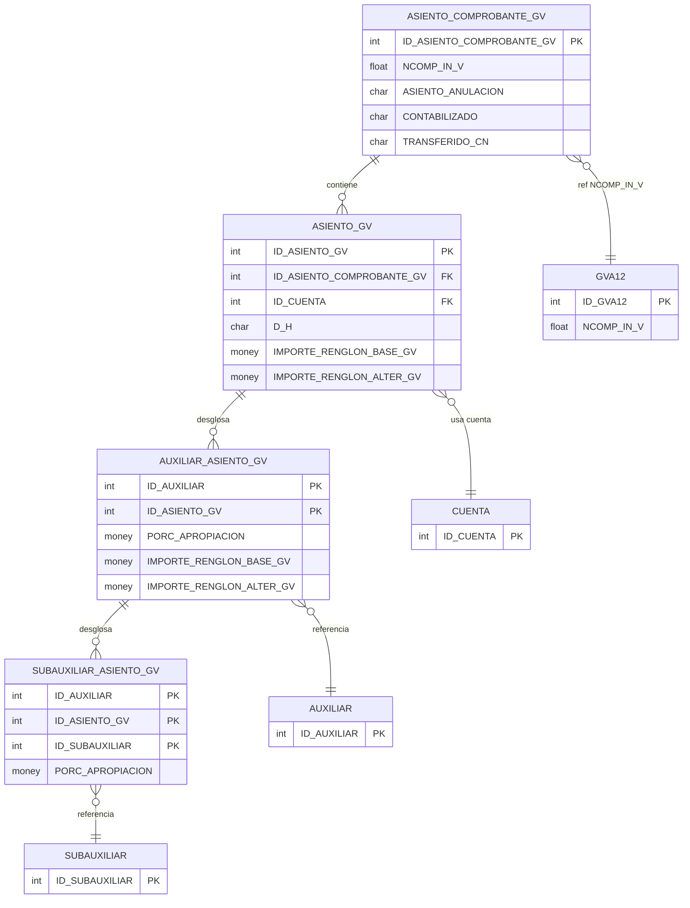

# Diseño de Tablas – Ventas Contable

Documentación de las tablas de asientos contables de ventas obtenidas desde SQL Server mediante MCP.

**Tablas:** `ASIENTO_COMPROBANTE_GV`, `ASIENTO_GV`, `AUXILIAR_ASIENTO_GV`, `SUBAUXILIAR_ASIENTO_GV`


### Diagrama ER (Mermaid)


---

## Dependencias previas

Para ejecutar estos scripts, deben existir:

- Tablas: `CUENTA`, `AUXILIAR`, `SUBAUXILIAR`
- Tipos de usuario (UDT): `D_ID`, `D_SINO_NO`, `D_SINO_SI`, `D_NRO_ORDEN`, `D_IMPORTE_GV`, `D_LEYENDA_ASIENTO`, `D_DEBE_HABER`, `D_PORCENTAJES`, `ENTEROXL_TG`

---

## 1. Crear tipos de usuario (si no existen)

```sql
-- Tipos base usados en ventas-contable
CREATE TYPE dbo.D_ID FROM int;
CREATE TYPE dbo.D_SINO_NO FROM char(1);
CREATE TYPE dbo.D_SINO_SI FROM char(1);
CREATE TYPE dbo.D_NRO_ORDEN FROM int;
CREATE TYPE dbo.D_IMPORTE_GV FROM money;
CREATE TYPE dbo.D_LEYENDA_ASIENTO FROM varchar(100);
CREATE TYPE dbo.D_DEBE_HABER FROM char(1);
CREATE TYPE dbo.D_PORCENTAJES FROM money;
CREATE TYPE dbo.ENTEROXL_TG FROM float;
```

---

## 2. Secuencias

```sql
CREATE SEQUENCE dbo.SEQUENCE_ASIENTO_COMPROBANTE_GV
    AS int
    START WITH 1
    INCREMENT BY 1
    MINVALUE -9223372036854775808
    MAXVALUE 9223372036854775807
    NO CYCLE;

CREATE SEQUENCE dbo.SEQUENCE_ASIENTO_GV
    AS int
    START WITH 1
    INCREMENT BY 1
    MINVALUE -9223372036854775808
    MAXVALUE 9223372036854775807
    NO CYCLE;
```

---

## 3. Tabla ASIENTO_COMPROBANTE_GV

Encabezado de comprobantes contables de ventas.

```sql
CREATE TABLE dbo.ASIENTO_COMPROBANTE_GV (
    ID_ASIENTO_COMPROBANTE_GV  D_ID NOT NULL
        DEFAULT (NEXT VALUE FOR dbo.SEQUENCE_ASIENTO_COMPROBANTE_GV),
    NCOMP_IN_V                 ENTEROXL_TG NOT NULL,
    ASIENTO_ANULACION          D_SINO_NO NOT NULL,
    CONTABILIZADO              D_SINO_NO NOT NULL,
    USUARIO_CONTABILIZACION    varchar(120) NULL,
    FECHA_CONTABILIZACION      datetime NULL,
    TERMINAL_CONTABILIZACION   varchar(255) NULL,
    TRANSFERIDO_CN             D_SINO_NO NOT NULL,

    CONSTRAINT PK_ASIENTO_COMPROBANTE_GV PRIMARY KEY (ID_ASIENTO_COMPROBANTE_GV)
);
```

---

## 4. Tabla ASIENTO_GV

Renglones del asiento contable de ventas.

```sql
CREATE TABLE dbo.ASIENTO_GV (
    ID_ASIENTO_GV              D_ID NOT NULL
        DEFAULT (NEXT VALUE FOR dbo.SEQUENCE_ASIENTO_GV),
    ID_ASIENTO_COMPROBANTE_GV  D_ID NOT NULL,
    NRO_RENGLON_ASIENTO_GV     D_NRO_ORDEN NOT NULL,
    ID_CUENTA                  D_ID NOT NULL,
    D_H                        D_DEBE_HABER NOT NULL,
    IMPORTE_RENGLON_BASE_GV    D_IMPORTE_GV NULL,
    IMPORTE_RENGLON_ALTER_GV   D_IMPORTE_GV NULL,
    DESC_LEYENDA               D_LEYENDA_ASIENTO NULL,
    EDITA_CUENTA               D_SINO_NO NOT NULL,

    CONSTRAINT PK_ASIENTO_GV PRIMARY KEY (ID_ASIENTO_GV),
    CONSTRAINT FK_ASIENTO_COMP_GV FOREIGN KEY (ID_ASIENTO_COMPROBANTE_GV)
        REFERENCES dbo.ASIENTO_COMPROBANTE_GV (ID_ASIENTO_COMPROBANTE_GV),
    CONSTRAINT FK_CUENTA_ASIENTO_GV FOREIGN KEY (ID_CUENTA)
        REFERENCES dbo.CUENTA (ID_CUENTA)
);

-- Índices para FKs
CREATE NONCLUSTERED INDEX ASIENTO_COMP_GV_FK
    ON dbo.ASIENTO_GV (ID_ASIENTO_COMPROBANTE_GV);

CREATE NONCLUSTERED INDEX CUENTA_ASIENTO_GV_FK
    ON dbo.ASIENTO_GV (ID_CUENTA);
```

---

## 5. Tabla AUXILIAR_ASIENTO_GV

Desglose por auxiliar (cuenta contable) en asientos de ventas.

```sql
CREATE TABLE dbo.AUXILIAR_ASIENTO_GV (
    ID_ASIENTO_GV              D_ID NOT NULL,
    ID_AUXILIAR                D_ID NOT NULL,
    PORC_APROPIACION           D_PORCENTAJES NOT NULL,
    IMPORTE_RENGLON_BASE_GV    D_IMPORTE_GV NOT NULL,
    IMPORTE_RENGLON_ALTER_GV   D_IMPORTE_GV NOT NULL,
    EDITA_APROPIACION          D_SINO_SI NOT NULL,

    CONSTRAINT PK_AUXILIAR_ASIENTO_GV PRIMARY KEY (ID_AUXILIAR, ID_ASIENTO_GV),
    CONSTRAINT FK_ASIENTO_GV_AUXILIAR FOREIGN KEY (ID_ASIENTO_GV)
        REFERENCES dbo.ASIENTO_GV (ID_ASIENTO_GV),
    CONSTRAINT FK_AUXILIAR_ASIENTO_GV FOREIGN KEY (ID_AUXILIAR)
        REFERENCES dbo.AUXILIAR (ID_AUXILIAR)
);
```

---

## 6. Tabla SUBAUXILIAR_ASIENTO_GV

Desglose por subauxiliar en asientos de ventas.

```sql
CREATE TABLE dbo.SUBAUXILIAR_ASIENTO_GV (
    ID_ASIENTO_GV              D_ID NOT NULL,
    ID_AUXILIAR                D_ID NOT NULL,
    ID_SUBAUXILIAR             D_ID NOT NULL,
    PORC_APROPIACION           D_PORCENTAJES NOT NULL,
    IMPORTE_RENGLON_BASE_GV    D_IMPORTE_GV NOT NULL,
    IMPORTE_RENGLON_ALTER_GV   D_IMPORTE_GV NOT NULL,
    EDITA_APROPIACION          D_SINO_SI NOT NULL,

    CONSTRAINT PK_SUBAUXILIAR_ASIENTO_GV PRIMARY KEY (ID_AUXILIAR, ID_ASIENTO_GV, ID_SUBAUXILIAR),
    CONSTRAINT FK_AUXILIAR_SUBAUXILIAR_ASIENTO_GV FOREIGN KEY (ID_AUXILIAR, ID_ASIENTO_GV)
        REFERENCES dbo.AUXILIAR_ASIENTO_GV (ID_AUXILIAR, ID_ASIENTO_GV),
    CONSTRAINT FK_SUBAUXILIAR_ASIENTO_GV FOREIGN KEY (ID_SUBAUXILIAR)
        REFERENCES dbo.SUBAUXILIAR (ID_SUBAUXILIAR)
);

-- Índices para FKs
CREATE NONCLUSTERED INDEX AUXILIAR_SUBAUXILIAR_ASIENTO_GV_FK
    ON dbo.SUBAUXILIAR_ASIENTO_GV (ID_AUXILIAR, ID_ASIENTO_GV);

CREATE NONCLUSTERED INDEX SUBAUXILIAR_ASIENTO_GV_FK
    ON dbo.SUBAUXILIAR_ASIENTO_GV (ID_SUBAUXILIAR);
```

---

## Diagrama de relaciones

```
ASIENTO_COMPROBANTE_GV (1) ─────── (*) ASIENTO_GV
         │                              │
         └── GVA12 (NCOMP_IN_V)        └── CUENTA
                                        │
                                        (1) ──── (*) AUXILIAR_ASIENTO_GV ─── AUXILIAR
                                                        │
                                                        (1) ─── (*) SUBAUXILIAR_ASIENTO_GV ─── SUBAUXILIAR
```


---

## Diferencias con tesorería (SB)

| Aspecto | Tesorería (SB) | Ventas (GV) |
|---------|----------------|-------------|
| Columna comprobante | N_INTERNO | NCOMP_IN_V |
| Tipo importes | D_IMPORTE_SB | D_IMPORTE_GV |
| Columnas importe | IMPORTE_RENGLON_BASE_SB, IMPORTE_RENGLON_ALTER_SB | IMPORTE_RENGLON_BASE_GV, IMPORTE_RENGLON_ALTER_GV |
| Importes en ASIENTO | NOT NULL | NULL |
| Moneda en ASIENTO | ID_MONEDA, ID_TIPO_COTIZACION, COTIZACION_MONEDA, IMPORTE_MONEDA_SB | No aplica |
| FKs ASIENTO | CUENTA, MONEDA, TIPO_COTIZACION | CUENTA únicamente |

---

## Mapeo de tipos UDT a tipos base

| UDT               | Tipo base    | Notas           |
|-------------------|-------------|-----------------|
| D_ID              | int         | Identificadores |
| D_SINO_NO         | char(1)     | Sí/No           |
| D_SINO_SI         | char(1)     | Sí/No           |
| D_NRO_ORDEN       | int         | Número de orden |
| D_IMPORTE_GV      | money       | Importes ventas |
| D_LEYENDA_ASIENTO | varchar(100)| Leyenda         |
| D_DEBE_HABER      | char(1)     | D/H             |
| D_PORCENTAJES     | money       | Porcentajes     |
| ENTEROXL_TG       | float       | Número interno  |

---

*Documento generado a partir del esquema de SQL Server vía MCP user-mssql.*
