# Relaciones y dependencias entre Historias de Usuario

Este documento describe las **dependencias** entre todas las historias de usuario definidas en `docs/hu-historias/`. Una historia **B** depende de **A** cuando A debe estar implementada (o ser satisfecha) para que B tenga sentido o sea implementable.

---

## Fuente de datos

Las dependencias se han extraído del campo **Dependencias** de cada archivo en `docs/hu-historias/` (formato `HU-XXX(MH)-nombre.md` o `HU-XXX(SH)-nombre.md`).

---

## Tabla de dependencias

| HU | Depende de | Descripción breve |
|----|------------|-------------------|
| HU-00 | — | Generación base de datos inicial (no depende de otras HU funcionales) |
| HU-001 | — | Login de empleado (base del flujo E2E) |
| HU-002 | HU-001 | Login de cliente |
| HU-003 | HU-001 | Logout |
| HU-004 | HU-001, HU-002 | Recuperación de contraseña |
| HU-005 | HU-001, HU-002 | Cambio de contraseña |
| HU-006 | HU-001, HU-002 | Visualización de perfil |
| HU-007 | HU-006 | Edición de perfil |
| HU-008 | HU-001 | Listado de clientes |
| HU-009 | HU-008, HU-015, HU-020 | Creación de cliente |
| HU-010 | HU-009 | Edición de cliente |
| HU-011 | HU-010 | Eliminación de cliente |
| HU-012 | HU-010, HU-020 | Asignación de tipos de tarea a cliente |
| HU-013 | HU-010, HU-012 | Detalle de cliente |
| HU-014 | HU-001 | Listado de tipos de cliente |
| HU-015 | HU-014 | Creación de tipo de cliente |
| HU-016 | HU-015 | Edición de tipo de cliente |
| HU-017 | HU-016 | Eliminación de tipo de cliente |
| HU-018 | HU-001 | Listado de empleados |
| HU-019 | HU-018 | Creación de empleado |
| HU-020 | HU-019 | Edición de empleado |
| HU-021 | HU-020 | Eliminación de empleado |
| HU-022 | HU-020 | Detalle de empleado |
| HU-023 | HU-001 | Listado de tipos de tarea |
| HU-024 | HU-023 | Creación de tipo de tarea |
| HU-025 | HU-024 | Edición de tipo de tarea |
| HU-026 | HU-025 | Eliminación de tipo de tarea |
| HU-027 | HU-025 | Detalle de tipo de tarea |
| HU-028 | HU-001, HU-009, HU-024, HU-012 | Carga de tarea diaria |
| HU-029 | HU-028 | Edición de tarea propia |
| HU-030 | HU-028 | Eliminación de tarea propia |
| HU-031 | HU-028, HU-019 | Edición de tarea (supervisor) |
| HU-032 | HU-028 | Eliminación de tarea (supervisor) |
| HU-033 | HU-028 | Lista de tareas propias |
| HU-034 | HU-028, HU-031, HU-032 | Lista de todas las tareas (supervisor) |
| HU-035 | HU-028 | Validación duración 15 min |
| HU-036 | HU-028 | Advertencia fecha futura |
| HU-037 | HU-028, HU-012 | Filtrado tipos de tarea por cliente |
| HU-038 | HU-028, HU-019 | Selección empleado propietario (supervisor) |
| HU-039 | HU-001 | Acceso al proceso masivo |
| HU-040 | HU-039 | Filtrado para proceso masivo |
| HU-041 | HU-040 | Selección múltiple de tareas |
| HU-042 | HU-041 | Procesamiento masivo (cerrar/reabrir) |
| HU-043 | HU-042 | Validación de selección para procesamiento |
| HU-044 | HU-001, HU-033, HU-034 | Consulta detallada de tareas |
| HU-045 | HU-044 | Consulta agrupada por empleado |
| HU-046 | HU-044 | Consulta agrupada por cliente |
| HU-047 | HU-044 | Consulta agrupada por tipo de tarea |
| HU-048 | HU-044 | Consulta agrupada por fecha |
| HU-049 | HU-044, HU-045, HU-046, HU-047, HU-048 | Exportación a Excel |
| HU-050 | HU-044 | Manejo de resultados vacíos |
| HU-051 | HU-001, HU-044 | Dashboard principal |
| HU-052 | HU-051 | Resumen dedicación por cliente |
| HU-053 | HU-051 | Resumen dedicación por empleado (supervisor) |
| HU-054 | HU-051, HU-052 | Gráficos y visualizaciones |
| HU-055 | HU-051 | Actualización automática del dashboard |

---

## Gráfico de dependencias (por épicas)

La flecha **A → B** significa: *B depende de A* (A debe estar antes que B).

### Diagrama global (Mermaid)

```mermaid
flowchart TB
    subgraph Infra["Infraestructura"]
        HU00["HU-00 BD inicial"]
    end

    subgraph Auth["Autenticación"]
        HU001["HU-001 Login empleado"]
        HU002["HU-002 Login cliente"]
        HU003["HU-003 Logout"]
        HU004["HU-004 Recup. contraseña"]
        HU005["HU-005 Cambio contraseña"]
        HU006["HU-006 Perfil"]
        HU007["HU-007 Edición perfil"]
        HU001 --> HU002 & HU003 & HU004 & HU005 & HU006
        HU002 --> HU004 & HU005 & HU006
        HU006 --> HU007
    end

    subgraph Clientes["Gestión Clientes"]
        HU008["HU-008 Listado clientes"]
        HU009["HU-009 Crear cliente"]
        HU010["HU-010 Editar cliente"]
        HU011["HU-011 Eliminar cliente"]
        HU012["HU-012 Tipos tarea → cliente"]
        HU013["HU-013 Detalle cliente"]
        HU001 --> HU008
        HU008 --> HU009
        HU009 --> HU010
        HU010 --> HU011 & HU012 & HU013
    end

    subgraph TiposCliente["Tipos de Cliente"]
        HU014["HU-014 Listado tipos cliente"]
        HU015["HU-015 Crear tipo cliente"]
        HU016["HU-016 Editar tipo cliente"]
        HU017["HU-017 Eliminar tipo cliente"]
        HU001 --> HU014
        HU014 --> HU015
        HU015 --> HU016
        HU016 --> HU017
        HU015 --> HU009
    end

    subgraph Empleados["Gestión Empleados"]
        HU018["HU-018 Listado empleados"]
        HU019["HU-019 Crear empleado"]
        HU020["HU-020 Editar empleado"]
        HU021["HU-021 Eliminar empleado"]
        HU022["HU-022 Detalle empleado"]
        HU001 --> HU018
        HU018 --> HU019
        HU019 --> HU020 & HU031 & HU038
        HU020 --> HU021 & HU022 & HU012
        HU019 --> HU009
    end

    subgraph TiposTarea["Tipos de Tarea"]
        HU023["HU-023 Listado tipos tarea"]
        HU024["HU-024 Crear tipo tarea"]
        HU025["HU-025 Editar tipo tarea"]
        HU026["HU-026 Eliminar tipo tarea"]
        HU027["HU-027 Detalle tipo tarea"]
        HU001 --> HU023
        HU023 --> HU024
        HU024 --> HU025 & HU028
        HU025 --> HU026 & HU027
    end

    subgraph RegistroTareas["Registro de Tareas"]
        HU028["HU-028 Carga tarea diaria"]
        HU029["HU-029 Editar tarea propia"]
        HU030["HU-030 Eliminar tarea propia"]
        HU031["HU-031 Editar tarea super."]
        HU032["HU-032 Eliminar tarea super."]
        HU033["HU-033 Lista tareas propias"]
        HU034["HU-034 Lista todas tareas"]
        HU035["HU-035 Validación 15 min"]
        HU036["HU-036 Fecha futura"]
        HU037["HU-037 Filtro tipos por cliente"]
        HU038["HU-038 Empleado propietario"]
        HU028 --> HU029 & HU030 & HU031 & HU032 & HU033 & HU034 & HU035 & HU036 & HU037 & HU038
        HU031 --> HU034
        HU032 --> HU034
        HU001 --> HU028
        HU009 --> HU028
        HU012 --> HU028 & HU037
    end

    subgraph ProcesoMasivo["Proceso Masivo"]
        HU039["HU-039 Acceso proceso masivo"]
        HU040["HU-040 Filtro proceso masivo"]
        HU041["HU-041 Selección múltiple"]
        HU042["HU-042 Procesamiento masivo"]
        HU043["HU-043 Validación selección"]
        HU001 --> HU039
        HU039 --> HU040
        HU040 --> HU041
        HU041 --> HU042
        HU042 --> HU043
    end

    subgraph Informes["Informes"]
        HU044["HU-044 Consulta detallada"]
        HU045["HU-045 Agrupada empleado"]
        HU046["HU-046 Agrupada cliente"]
        HU047["HU-047 Agrupada tipo tarea"]
        HU048["HU-048 Agrupada fecha"]
        HU049["HU-049 Exportar Excel"]
        HU050["HU-050 Resultados vacíos"]
        HU001 --> HU044
        HU033 --> HU044
        HU034 --> HU044
        HU044 --> HU045 & HU046 & HU047 & HU048 & HU049 & HU050
    end

    subgraph Dashboard["Dashboard"]
        HU051["HU-051 Dashboard principal"]
        HU052["HU-052 Resumen por cliente"]
        HU053["HU-053 Resumen por empleado"]
        HU054["HU-054 Gráficos"]
        HU055["HU-055 Actualización auto"]
        HU001 --> HU051
        HU044 --> HU051
        HU051 --> HU052 & HU053 & HU054 & HU055
    end
```

---

## Flujo E2E prioritario (resumen)

Las historias que forman el flujo E2E prioritario del MVP y su orden lógico de dependencias son:

1. **HU-001** – Login de empleado (raíz)
2. **HU-008** – Listado de clientes
3. **HU-009** – Creación de cliente (junto con HU-014/HU-015, HU-018/HU-019/HU-020, HU-023/HU-024, HU-012 según contexto)
4. **HU-028** – Carga de tarea diaria
5. **HU-033** – Visualización de tareas propias
6. **HU-044** – Consulta detallada de tareas
7. **HU-046** – Consulta agrupada por cliente
8. **HU-051** – Dashboard principal

---

## Notas

- **HU-009** declara dependencia de HU-008, HU-015 y HU-020 (en el archivo se indica “tipos de tarea deben existir”; HU-020 es edición de empleado; para tipos de tarea suele usarse HU-023/HU-024; en la tabla se mantiene la dependencia tal como está documentada).
- **HU-00** no depende de otras HU funcionales pero es **bloqueante** para el resto del MVP (infraestructura de BD).
- Los números de HU sin archivo en `hu-historias/` no aparecen en este documento.

---

**Última actualización:** 2026-01-31  
**Origen:** `docs/hu-historias/*.md` (campo **Dependencias**)
