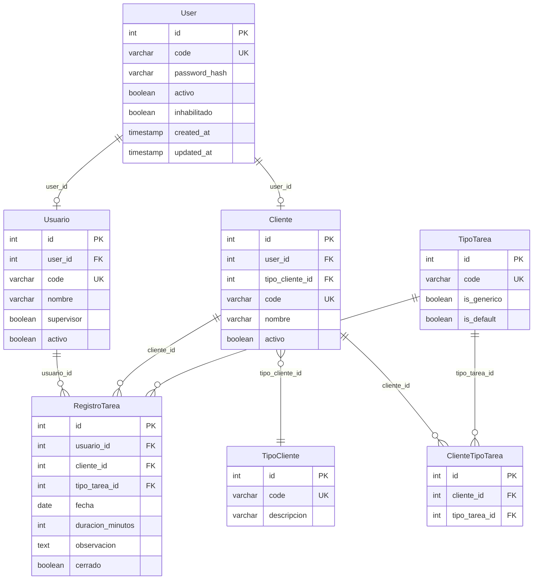

## Índice

0. [Ficha del proyecto](#0-ficha-del-proyecto)
1. [Descripción general del producto](#1-descripción-general-del-producto)
2. [Arquitectura del sistema](#2-arquitectura-del-sistema)
3. [Modelo de datos](#3-modelo-de-datos)
4. [Especificación de la API](#4-especificación-de-la-api)
5. [Historias de usuario](#5-historias-de-usuario)
6. [Tickets de trabajo](#6-tickets-de-trabajo)
7. [Pull requests](#7-pull-requests)

---

## 0. Ficha del proyecto

### **0.1. Tu nombre completo:** Pablo Antonio Quarracino

### **0.2. Nombre del proyecto:** Sistema de gestión de partes de tareas para empresas de servicios y consultorías

### **0.3. Descripción breve del proyecto:** la aplicación permite que los empleados de una empresa de consultoria y/o servicios registren todas las actividades que realizan a cada uno de los clientes, para obtener informes diversos de actividades, principalmente observar la atención realizada a los clientes. Existen empleados supervisor para actualizar la base de datos y obtener informes integrales, y los clientes pueden ingresar para revisar las tareas realizadas por la empresa.

### **0.4. URL del proyecto:**

- **URL pública de la aplicación:** https://lidrproyectofinal.vercel.app/login

### 0.5. URL o archivo comprimido del repositorio

- **Repositorio del proyecto:** https://github.com/paqsystems/Lidr-AI4Devs2025-ProyectoFinal
- Contiene las tres ramas solicitadas: `feature-entrega1-PAQ`, `feature-entrega2-PAQ`, `finalproject-PAQ`


---

## 1. Descripción general del producto

> Describe en detalle los siguientes aspectos del producto:

### **1.1. Objetivo:**

Sistema web para consultorías y empresas de servicios que permite a los empleados registrar las tareas realizadas diariamente, asociándolas a clientes y tipos de tarea. **Valor aportado:** visibilidad sobre la dedicación a cada cliente, bases para análisis operativo, comercial y/o facturación. **Usuarios:** empleados (registran tareas), supervisores (gestionan catálogos y ven todas las tareas), clientes (consultan tareas realizadas para ellos).

### **1.2. Características y funcionalidades principales:**

- **Empleados:** Autenticación por código y contraseña; registro de tareas (fecha, cliente, tipo, duración en tramos de 15 min); edición/eliminación de tareas propias; visualización y resumen por cliente.
- **Supervisores:** ABM de clientes, tipos de cliente, empleados y tipos de tarea; visualización de todas las tareas; proceso masivo (cerrar/reabrir).
- **Clientes:** Login y consulta de tareas realizadas para ellos (solo lectura); resumen de dedicación recibida.
- **Informes:** Consulta detallada; consulta agrupada por cliente, empleado, tipo y fecha; exportación a Excel; dashboard con KPIs.

### **1.3. Diseño y experiencia de usuario:**

La aplicación presenta login centrado, navegación lateral por secciones (Dashboard, Tareas, Informes, Configuración según rol) y formularios con validación en tiempo real. Flujo principal: Login → Registro de tarea → Visualización de resumen. Se recomienda acceder a https://lidrproyectofinal.vercel.app/login para ver la experiencia completa. Usuarios de prueba: ADMIN/admin123 (supervisor), EMP001/empleado123 (empleado), CLI001/cliente123 (cliente).

### **1.4. Instrucciones de instalación:**

**Backend (Laravel):**
```bash
cd backend
composer install
cp .env.example .env
php artisan key:generate
# Configurar .env: DB_CONNECTION, DB_HOST, DB_DATABASE, DB_USERNAME, DB_PASSWORD (MySQL)
php artisan migrate
php artisan db:seed
php artisan serve  # http://localhost:8000
```

**Frontend (React + Vite):**
```bash
cd frontend
npm install
cp .env.example .env
# Configurar VITE_API_URL=http://localhost:8000/api en .env
npm run dev  # http://localhost:3000
```

**Base de datos:** MySQL 5.7+ o MariaDB 10.3+ (recomendado MySQL 8.0+). Ver `docs/deploy-ci-cd.md` y `docs/version-mysql.md` para túnel SSH si la BD es remota.

---

## 2. Arquitectura del Sistema

### **2.1. Diagrama de arquitectura:**

```
Frontend (React SPA)  →  Backend API (Laravel REST)  →  Base de Datos (MySQL)
     |                            |                              |
  Vite + TypeScript          Sanctum + Eloquent            Relacional
```

**Patrón:** Arquitectura web de tres capas. **Justificación:** Simplicidad y claridad para un MVP; priorizar valor completo del flujo E2E sin sobre-ingeniería. **Beneficios:** Mantenibilidad, separación clara de responsabilidades, stack conocido. **Sacrificios:** No hay microservicios, colas ni eventos; escalabilidad futura requeriría evolución.

### **2.2. Descripción de componentes principales:**

- **Frontend:** React 18 + TypeScript + Vite; React Router; componentes por features; comunicación vía fetch hacia API REST.
- **Backend:** Laravel 10, PHP 8.2; Sanctum para autenticación (Bearer token); validaciones y reglas de negocio en servicios; Eloquent ORM.
- **Base de datos:** MySQL; tablas con prefijo `PQ_PARTES_` (excepto `USERS`); migraciones Laravel y seeders.

### **2.3. Descripción de alto nivel del proyecto y estructura de ficheros**

```
├── backend/          # Laravel API
│   ├── app/Models/   # Modelos Eloquent
│   ├── database/     # Migraciones y seeders
│   └── tests/        # PHPUnit (Unit, Feature)
├── frontend/         # React SPA
│   ├── src/features/ # Módulos por dominio
│   └── tests/e2e/    # Playwright
├── docs/             # Documentación
├── specs/            # Especificaciones (endpoints, modelos, reglas)
└── database/         # DBML del modelo
```

Estructura por features en frontend; capas MVC en backend.

### **2.4. Infraestructura y despliegue**

- **Frontend:** Vercel (https://lidrproyectofinal.vercel.app); `frontend/vercel.json` con rewrites para SPA.
- **Backend:** Opciones válidas Render, Fly.io, Railway.
- **BD:** MySQL administrado (ej. AWS RDS, DigitalOcean). Migraciones: `php artisan migrate`; seeders: `php artisan db:seed`.
- **CI/CD:** Pipeline documentado en `.github/workflows/ci.yml` (ejecución manual; no bloquea PR).

### **2.5. Seguridad**

- Autenticación: Sanctum (token Bearer); contraseñas hasheadas (bcrypt).
- Validación de entrada en backend (reglas Laravel).
- Mensajes de error de login no revelan si el usuario existe.
- Middleware de autenticación en endpoints protegidos; filtros automáticos por rol.

### **2.6. Tests**

- **Backend:** PHPUnit en `backend/tests/` (Unit: servicios; Feature: API + BD).
- **Frontend:** Vitest (unitarios); Playwright (E2E en `frontend/tests/e2e/`).
- Tests E2E cubren: login, registro de tarea, visualización, edición, informes, dashboard.

---

## 3. Modelo de Datos

### **3.1. Diagrama del modelo de datos:**



### **3.2. Descripción de entidades principales:**

- **User (USERS):** PK id; code (UK, NN); password_hash (NN); activo, inhabilitado (boolean). Tabla central de autenticación.
- **Usuario (PQ_PARTES_USUARIOS):** PK id; user_id (FK→User, UK); code (UK); nombre, email; supervisor, activo, inhabilitado. Empleados.
- **Cliente (PQ_PARTES_CLIENTES):** PK id; user_id (FK→User, opcional); tipo_cliente_id (FK); code (UK); nombre, email; activo, inhabilitado.
- **RegistroTarea (PQ_PARTES_REGISTRO_TAREA):** PK id; usuario_id (FK→Usuario); cliente_id (FK→Cliente); tipo_tarea_id (FK→TipoTarea); fecha; duracion_minutos (múltiplo 15); observacion (NN); cerrado.
- **ClienteTipoTarea:** Tabla N:M entre Cliente y TipoTarea (tipos no genéricos por cliente).

---

## 4. Especificación de la API

Base URL: `/api/v1`. Autenticación: Bearer token (Sanctum).

### Endpoint 1: POST /api/v1/auth/login

```yaml
openapi: 3.0.0
paths:
  /api/v1/auth/login:
    post:
      summary: Autenticación de usuario
      requestBody:
        content:
          application/json:
            schema:
              type: object
              required: [usuario, password]
              properties:
                usuario: { type: string }
                password: { type: string }
      responses:
        '200':
          description: OK
          content:
            application/json:
              schema:
                type: object
                properties:
                  error: { type: integer, example: 0 }
                  respuesta: { type: string }
                  resultado:
                    type: object
                    properties:
                      token: { type: string }
                      user: { type: object }
```

**Ejemplo request:** `{"usuario":"ADMIN","password":"admin123"}`  
**Ejemplo response:** `{"error":0,"respuesta":"Autenticación exitosa","resultado":{"token":"1|...","user":{"user_code":"ADMIN","es_supervisor":true,...}}}`

### Endpoint 2: POST /api/v1/tareas (crear tarea)

Autenticación requerida. Body: `{ "clienteId", "tipoTareaId", "fecha", "duracionMinutos", "observacion" }`. Duración en tramos de 15 minutos.

### Endpoint 3: GET /api/v1/reports/detail (consulta detallada)

Autenticación requerida. Parámetros: `fechaDesde`, `fechaHasta`, `clienteId` (opc.), etc. Filtrado automático por rol. Documentación completa: `backend/storage/api-docs/` y Swagger UI en `/api/documentation`.

---

## 5. Historias de Usuario

### Historia de Usuario 1: HU-001 – Login de empleado

**Rol:** Empleado / Empleado Supervisor | **Clasificación:** MUST-HAVE  

**Historia:** Como empleado quiero autenticarme en el sistema con mi código de usuario y contraseña para acceder a las funcionalidades del sistema.

**Criterios de aceptación:**
- El usuario ingresa código y contraseña; el sistema valida contra la tabla USERS.
- Valida que el User esté activo y no inhabilitado; verifica contraseña.
- Determina tipo_usuario="usuario" y obtiene usuario_id de PQ_PARTES_USUARIOS.
- Genera token Sanctum; redirige al dashboard.
- Mensaje de error no revela si el usuario existe.

---

### Historia de Usuario 2: HU-028 – Carga de tarea diaria

**Rol:** Empleado | **Clasificación:** MUST-HAVE  

**Historia:** Como empleado quiero registrar una tarea diaria asociada a un cliente y tipo de tarea para llevar control de mi dedicación.

**Criterios de aceptación:**
- Formulario con: fecha, cliente, tipo de tarea, duración (tramos 15 min), observación.
- Tipos de tarea filtrados por cliente (genéricos + asignados al cliente).
- Validación duración > 0 y múltiplo de 15; observación obligatoria.
- Advertencia si fecha es futura.

---

### Historia de Usuario 3: HU-051 – Dashboard principal

**Rol:** Empleado / Supervisor | **Clasificación:** MUST-HAVE  

**Historia:** Como empleado quiero visualizar un dashboard con resumen de mi dedicación para tener visibilidad rápida de mi trabajo.

**Criterios de aceptación:**
- KPIs: total horas, tareas por cliente, por período.
- Supervisores ven datos agregados de todos los empleados.

---

## 6. Tickets de Trabajo

### Ticket 1 (Backend): TK-002 – Endpoints de Autenticación

**HU relacionadas:** HU-001, HU-002, HU-003  

**Objetivo:** Implementar endpoints de login y logout. Login valida contra USERS, determina si es Cliente o Usuario, genera token Sanctum con user_id, user_code, tipo_usuario, usuario_id/cliente_id, es_supervisor.

**Detalle técnico:**
- POST /api/v1/auth/login: body {usuario, password}; response envelope con token y user.
- POST /api/v1/auth/logout: Bearer token; revoca token actual.
- Validaciones: usuario y password no vacíos; User activo y no inhabilitado; contraseña correcta.
- Códigos de error: 1102 (usuario no existe), 1103/1104 (password), etc.

---

### Ticket 2 (Frontend): TK-014 – Componentes UI de Registro de Tareas

**HU relacionadas:** HU-028, HU-029, HU-030, HU-031, HU-032, HU-033, HU-034, HU-035, HU-036, HU-037, HU-038  

**Objetivo:** Pantallas para crear, editar, eliminar y listar tareas. Formulario con fecha, cliente, tipo de tarea (filtrado por cliente), duración (select 15 min), observación.

**Detalle técnico:**
- data-testid en todos los controles (Playwright).
- Llamada a servicio taskService.createTask, getTasks, updateTask, deleteTask.
- Validación cliente-side: duración múltiplo 15; observación obligatoria.
- Supervisores: selector de empleado al crear tarea.

---

### Ticket 3 (Bases de datos): TK-001 – Migraciones y Modelos

**HU relacionadas:** HU-00, HU-001, HU-002, HU-008, HU-009, HU-014, HU-015, HU-018, HU-019, HU-023, HU-024, HU-028, HU-039, HU-044, HU-051  

**Objetivo:** Crear esquema completo de BD con migraciones Laravel. Tablas: USERS, PQ_PARTES_TIPOS_CLIENTE, PQ_PARTES_TIPOS_TAREA, PQ_PARTES_USUARIOS, PQ_PARTES_CLIENTES, PQ_PARTES_REGISTRO_TAREA, PQ_PARTES_CLIENTE_TIPO_TAREA. Índices en FKs; seeders con datos mínimos.

---

## 7. Pull Requests

### Pull Request 1: Entrega 1 – Documentación técnica

**Rama:** feature-entrega1-PAQ → main  

**Descripción:** Documentación completa del proyecto: producto, arquitectura, modelo de datos, historias de usuario (55 HU), tickets técnicos (33 TK), especificaciones de API. Archivos en docs/, specs/. Evidencia de diseño antes del desarrollo.

---

### Pull Request 2: Entrega 2 – Código funcional (primer MVP)

**Rama:** feature-entrega2-PAQ → main  

**Descripción:** Backend Laravel con endpoints de autenticación, tareas, clientes, empleados, tipos; frontend React con flujo Login → Registro tarea → Visualización; BD conectada; tests unitarios e integración. Flujo principal casi completo. Deploy inicial en Vercel.

---

### Pull Request 3: Entrega final – Pipeline CI y ajustes

**Rama:** finalproject-PAQ → main (PR #7)  

**Descripción:** Pipeline CI/CD documentado en `.github/workflows/ci.yml` (workflow_dispatch); corrección vercel.json para SPA (rutas /login); documentación actualizada (_Deploy-i-cd.md, deploy-ci-cd.md). Sin deploy automático (manual).

